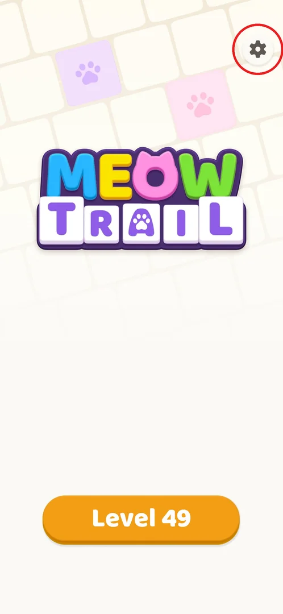
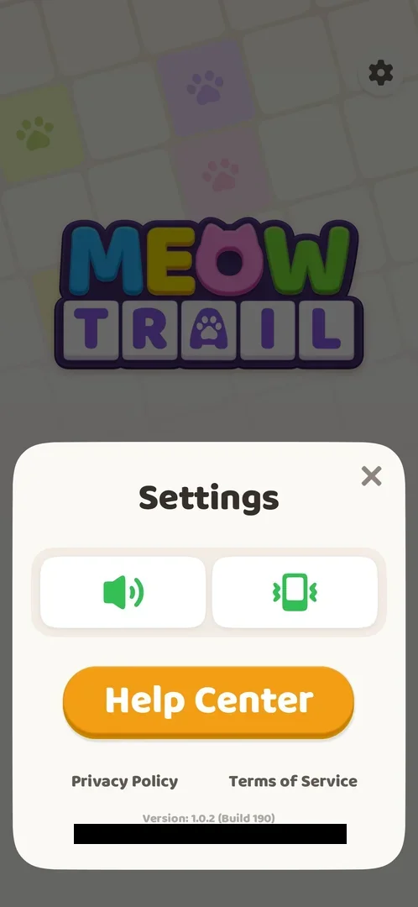
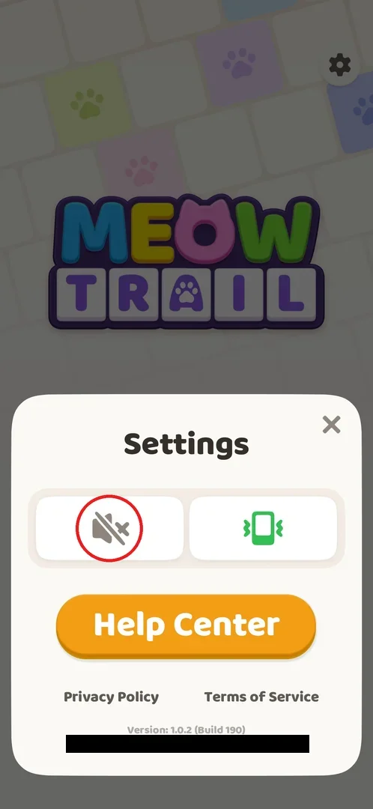
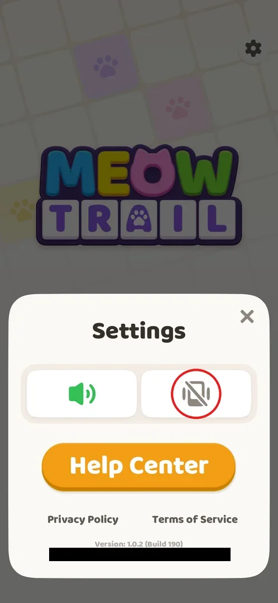
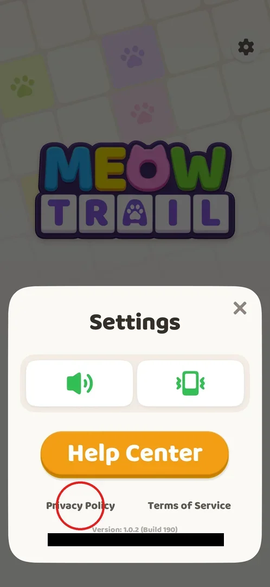
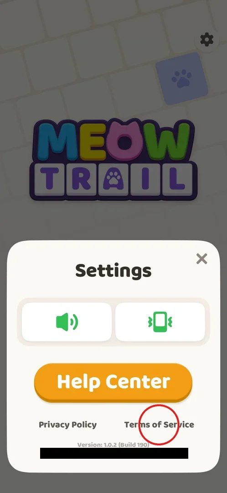
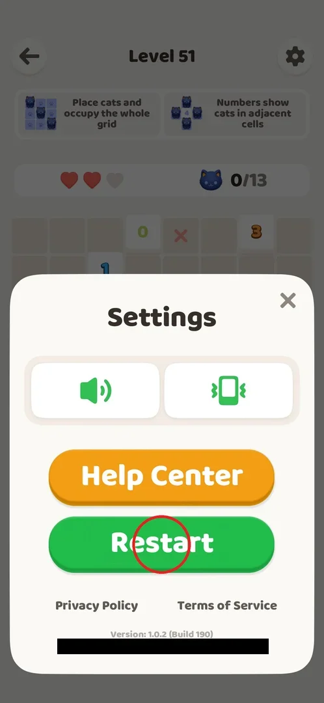
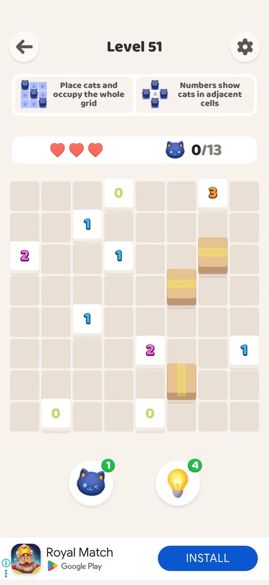

# Settings

Settings is a small popup where the player turns sound and vibration on or off, reaches the in-game
support (Help Center) and the Privacy Policy and Terms of Service, and reads the game version and their
User ID [^s9] [^s2]. Opened inside a level it also has a Restart button that starts the level over with a
clean board and full hearts, after an interstitial ad [^s11] [^s8].

## Where to find it

The gear button at the top right of Home (circled) [^s1] [^s9]. The same gear sits at the top right of
every level screen, right of the level title, and opens the same popup with Restart added [^s11] [^s7].
Home has no other buttons besides the gear and the orange "Level N" play button [^s1].

 [^s1]

## What it looks like

A white popup slides up over the lower half of the screen, with the title "Settings" and a close X at its
top right [^s2]. From top to bottom: two toggle tiles (a speaker for sound on the left, a phone for
vibration on the right; green when on), the orange Help Center button, the Privacy Policy and Terms of
Service text links, and in small grey text "Version: 1.0.2 (Build 190)" and the User ID (blacked out on the frames) [^s2] [^s9].
The X closes the popup and returns to the screen underneath [^s14].

 [^s2]

## What you can do

| Tab or button | What it does |
|---|---|
| [Sound](#sound) | Turns game sound off and on [^s3] [^s10] |
| [Vibration](#vibration) | Turns vibration off and on [^s4] [^s10] |
| [Help Center](#help-center) | Opens the in-app support page "MeowTrail Support" [^s5] |
| [Privacy Policy](#privacy-policy) | Opens the privacy policy in Chrome [^s13] [^s10] |
| [Terms of Service](#terms-of-service) | Opens the terms of service in Chrome [^s6] [^s10] |
| [Restart](#restart) | In a level only: interstitial ad, then the level starts over [^s12] [^s8] |

### Sound

The left tile. Tapping it turns sound off: the green speaker becomes a grey speaker with a cross; tapping
again turns it back on (green) [^s3] [^s10]. The player noted that the state persists [^s10].

 [^s3]

### Vibration

The right tile. Tapping it turns vibration off: the green phone becomes a grey phone with a slash; tapping
again turns it back on [^s4] [^s10].

 [^s4]

### Help Center

The orange button opens an in-app Helpshift web view titled "MeowTrail Support": article search, category
tabs (Popular articles, Beginners Guide, Gameplay, Failure & Revive and more), popular articles such as
"How can I skip or close an ad?" and "Why are there so many ads?", and a "Chat with us" button; the X at
its top left closes it [^s5] [^s10]. Details are on the [Help Center](help-center.md) page.

 [^s5]

### Privacy Policy

The left text link at the bottom of the popup. It leaves the game and opens the privacy policy on
oakevergames.com in Chrome; on returning to the game the Settings popup is still open [^s13] [^s10].

 [^s2]

### Terms of Service

The right text link. It opens the terms of service on oakevergames.com in Chrome ("Last updated: January
1, 2026"); on returning to the game the Settings popup is still open [^s6] [^s10].

 [^s17]

### Restart

Only in the popup opened from a level: a green Restart button under Help Center. It takes the place where
the Home popup has Help Center, and Help Center moves up [^s11] [^s7]. Tapping it shows an
[interstitial ad](ads-interstitial.md) first; then the level reloads with an empty board and 3 hearts,
even if hearts were lost before [^s12] [^s8].

 [^s7]

### Result

 [^s8]

## How it works

Version 1.0.2 (Build 190).

- The popup from Home and from a level is the same, except that the level one adds Restart [^s9] [^s11].
- Sound and vibration are independent toggles; grey with a slash or cross means off, green means on [^s3] [^s4] [^s10].
- Privacy Policy and Terms of Service open outside the game (Chrome); Help Center stays inside the game [^s10].
- Restart resets the board and the [hearts](hearts.md) to 3 and costs an interstitial ad: at level 51 the
  ad ended in the Play Store, and the game was back about 75 s after the tap [^s12] [^s8]. The player
  inferred that this ad also shifts the every-second-level interstitial counter [^s15].
- There is no shop, currency or remove-ads purchase in Settings [^s16].

## Cases

| Case | What was done | Result | Source |
|---|---|---|---|
| Open from Home | Gear on Home | The popup: sound, vibration, Help Center, Privacy Policy, Terms of Service, version 1.0.2 build 190, User ID | ✅ [^s9] |
| Open in a level | Gear on the level screen | The same popup with Restart added | ✅ [^s11] |
| Sound | Toggled off, then on | Icon grey with a cross, then green again | ✅ [^s10] |
| Vibration | Toggled off, then on | Icon grey with a slash, then green again | ✅ [^s10] |
| Help Center | Tapped | In-app Helpshift view "MeowTrail Support"; see [Help Center](help-center.md) | ✅ [^s5] |
| Privacy Policy, Terms of Service | Tapped | Open in Chrome (oakevergames.com); back in the game the popup is still open | ✅ [^s10] |
| In-level Restart | With 2 of 3 hearts and a wrong cat, tapped Restart | Interstitial (ended in the Play Store, about 75 s in all), then a clean board with 3 hearts | ✅ [^s8] |

## Not verified

- The Privacy Policy page itself: the only frame of it is Chrome still loading [^s13].
- Whether sound and vibration stay off after the game is restarted (the player saw them persist only
  within the session) [^s10].
- Whether Restart always shows an interstitial, or only when the ad counter is due (seen once, at level 51) [^s12].

[^s1]: session 20261001-035425-chrono-2FYKPJ, step 0
[^s2]: session 20261001-035425-chrono-2FYKPJ, step 1
[^s3]: session 20261001-035425-chrono-2FYKPJ, step 2
[^s4]: session 20261001-035425-chrono-2FYKPJ, step 3
[^s5]: session 20261001-035425-chrono-2FYKPJ, step 5
[^s6]: session 20261001-035425-chrono-2FYKPJ, step 16
[^s7]: session 20261001-035425-chrono-2FYKPJ, step 41
[^s8]: session 20261001-035425-chrono-2FYKPJ, step 43
[^s9]: session 20261001-003641-chrono-2FYKPJ, step 17 — [video at 7:44](https://youtu.be/mebcb05OPmo?t=464)
[^s10]: session 20261001-035425-chrono-2FYKPJ, step 17
[^s11]: session 20261001-024647-chrono-2FYKPJ, step 58
[^s12]: session 20261001-035425-chrono-2FYKPJ, step 42
[^s13]: session 20261001-035425-chrono-2FYKPJ, step 14
[^s14]: session 20261001-003641-chrono-2FYKPJ, step 18
[^s15]: session 20261001-035425-chrono-2FYKPJ, step 58
[^s16]: session 20261001-035425-chrono-2FYKPJ, step 61
[^s17]: session 20261001-035425-chrono-2FYKPJ, step 15
