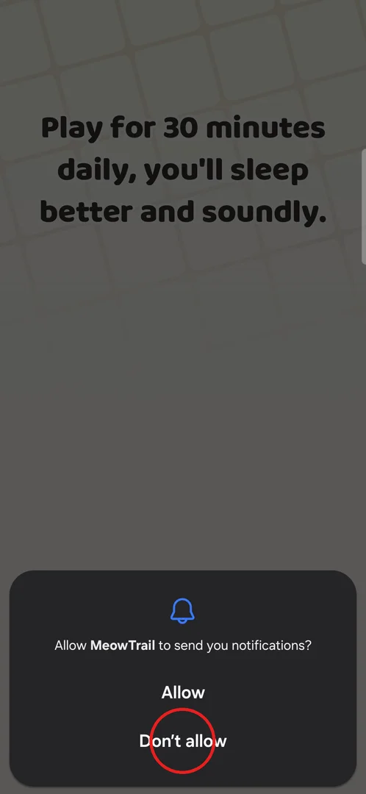
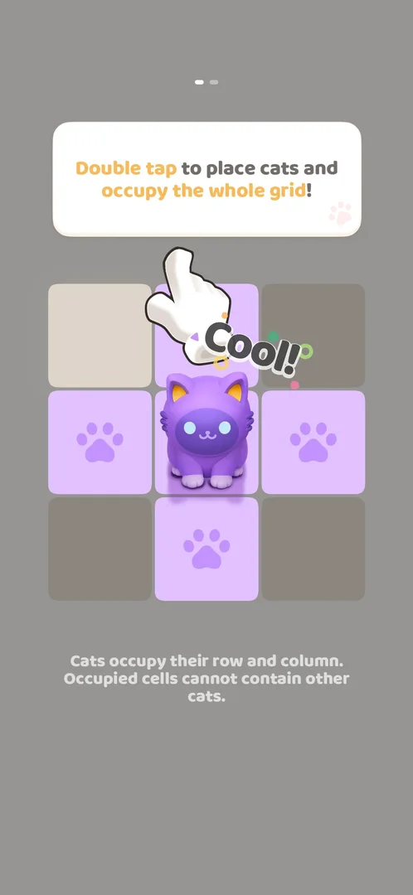
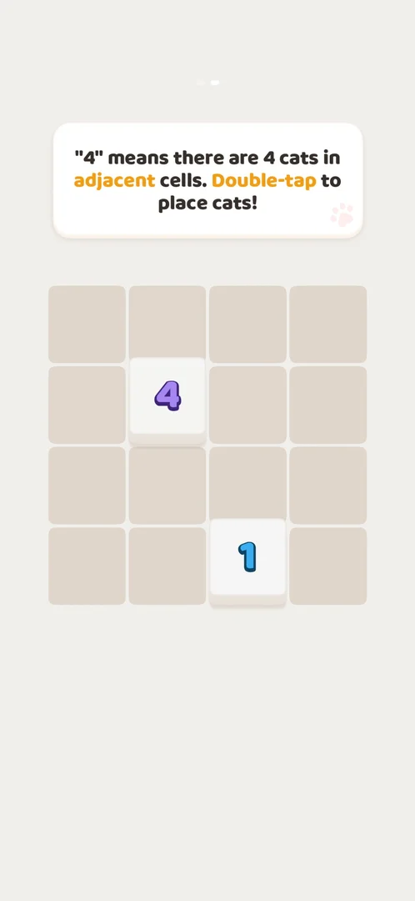
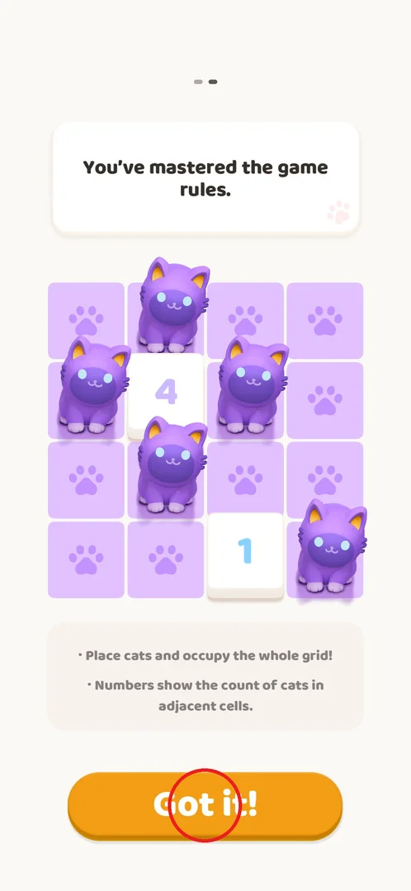
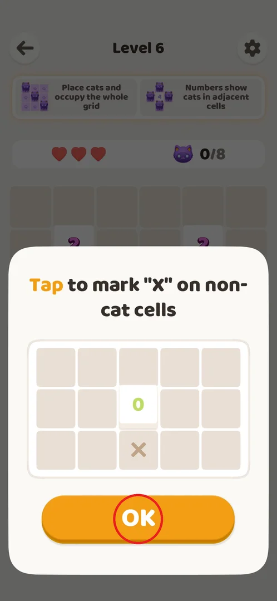
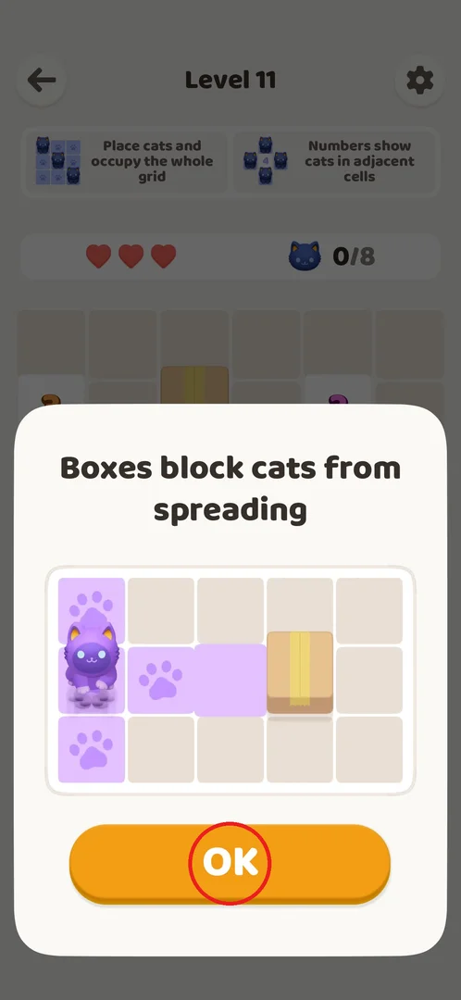

# Tutorial (FTUE)

The tutorial teaches the rules of the puzzle before the first level: two interactive pages on small
grids (double tap places a cat; a cat occupies its row and column; a number counts the cats next to
it), then short tip popups that appear on top of later levels when a new element comes in (X marks at
level 6, boxes at level 11). It was played from a fresh install on 2026-10-01, version 1.0.2[^s8].

## Where to find it

<!-- no-entry: no button opens the tutorial; it starts by itself on the first launch of a fresh install -->

There is no button for it: on a fresh install the game goes consent → Oakever splash → loading tip →
Android notification prompt → tutorial page 1[^s7]. The frame below is the last screen before the
tutorial: the loading tip "Play for 30 minutes daily, you'll sleep better and soundly." with the
system prompt "Allow MeowTrail to send you notifications?"; answering it (here "Don't allow", circled)
opens page 1[^s1]. The two later tips open by themselves when level 6 and level 11 are started[^s5][^s6].

 [^s1]

## What it looks like

A light full-screen page with two page dots at the top (which page of two you are on), a white
instruction card, and a small grid below it. Page 1 starts with an empty 3x3 grid: the centre cell is
highlighted and a hand points at it, and the card says "Double tap to place the cat."[^s2]

 [^s2]

## What you can do

| Tab or button | What it does |
|---|---|
| [Page 1](#page-1) | 3x3 grid: double tap cells to place cats until the whole grid is occupied, then "Got it!" |
| [Page 2](#page-2) | 4x4 grid with numbered walls 4 and 1: place cats so each number has that many cats next to it, then "Got it!" opens level 1 |
| [X mark tip](#x-mark-tip) | Popup over level 6: a single tap marks a cell with X; OK closes it |
| [Boxes tip](#boxes-tip) | Popup over level 11: boxes stop a cat's row and column; OK closes it |

### Page 1

A double tap on a cell places a cat. The cat occupies its row and column: those cells turn purple with
paw marks, and occupied cells cannot hold another cat. After the first cat the card changes to "Double
tap to place cats and occupy the whole grid!" and the rule appears under the grid: "Cats occupy their
row and column. Occupied cells cannot contain other cats."[^s3] Three cats on the diagonal fill the
3x3 grid, and a "Got it!" button (circled) appears; it moves to page 2[^s3][^s4].

 [^s3]

 [^s3]

### Page 2

A 4x4 grid with two numbered walls, "4" and "1". The card says: "\"4\" means there are 4 cats in
adjacent cells. Double-tap to place cats!"[^s4] Walls also block a cat's row and column[^s4]. The
solution has 5 cats: four around the 4 and one next to the 1 in the bottom-right corner. When it is
solved the card says "You've mastered the game rules.", a box under the grid sums up the rules ("Place
cats and occupy the whole grid!", "Numbers show the count of cats in adjacent cells."), and "Got it!"
(circled) opens level 1[^s4][^s7].

 [^s4]

 [^s4]

### X mark tip

Shown over level 6 when it starts: "Tap to mark \"X\" on non-cat cells", with an example of a 0 wall
and an X on the cell next to it; OK (circled) closes it and the level is played as usual[^s5]. Level 6
is also where the "0" wall first appears[^s5].

 [^s5]

### Boxes tip

Shown over level 11 when it starts: "Boxes block cats from spreading", with an example where a box
stops a cat's row. A box is a wall without a number; OK (circled) closes the popup[^s6].

 [^s6]

## How it works

- Order on a fresh install (v1.0.2): consent → Oakever splash → loading tip → Android notification
  prompt → two rules pages → level 1[^s7].
- Page 1 (3x3): "Double tap to place cats and occupy the whole grid"; a cat occupies its row and
  column (paw marks)[^s3].
- Page 2 (4x4 with walls "4" and "1"): a number is the count of cats in the adjacent cells; ends with
  "Got it"[^s4].
- The tutorial pages show no hearts, boosters or cat counter[^s2][^s4].
- Later tips: X marks at level 6, boxes at level 11[^s5][^s6]. Around the same levels the game also
  introduces other things that have their own pages: the Hard label at level 10, the rate-us popup
  after level 9, the first interstitial ad between levels 15 and 16, the banner from level 16[^s7].

## Cases

| Case | What was done | Result | Source |
|---|---|---|---|
| Two-page rules tutorial: double tap, row/column occupation, numbered walls; ends with "You've mastered the game rules" | Page 1 solved with 3 cats on the diagonal, page 2 with 5 cats, "Got it!" on each | ✅ Level 1 opened | [^s4] |
| FTUE order | Fresh install: Accept on consent, "Don't allow" on the notification prompt, the tutorial, then levels 1–18 | ✅ consent → splash → loading tip → notification prompt → 2 rules pages → level 1; tips at levels 6 and 11 | [^s7] |

## Not verified

- Whether the tutorial can be skipped.
- Whether the tutorial can be replayed later (no such button was seen in settings or on the home
  screen).
- What happens on page 1 or 2 with a wrong placement (no wrong cat was tried there).

[^s1]: session 20261001-003641-chrono-2FYKPJ, step 1 — [video at 0:11](https://youtu.be/mebcb05OPmo?t=11)
[^s2]: session 20261001-003641-chrono-2FYKPJ, step 2 — [video at 0:29](https://youtu.be/mebcb05OPmo?t=29)
[^s3]: session 20261001-003641-chrono-2FYKPJ, step 4 — [video at 1:13](https://youtu.be/mebcb05OPmo?t=73)
[^s4]: session 20261001-003641-chrono-2FYKPJ, step 5 — [video at 2:05](https://youtu.be/mebcb05OPmo?t=125)
[^s5]: session 20261001-003641-chrono-2FYKPJ, step 12 — [video at 6:12](https://youtu.be/mebcb05OPmo?t=372)
[^s6]: session 20261001-003641-chrono-2FYKPJ, step 23 — [video at 10:16](https://youtu.be/mebcb05OPmo?t=616)
[^s7]: session 20261001-003641-chrono-2FYKPJ, step 37 — [video at 19:31](https://youtu.be/mebcb05OPmo?t=1171)
[^s8]: session 20261001-003641-chrono-2FYKPJ, step 0 — [video at 0:00](https://youtu.be/mebcb05OPmo?t=0)
