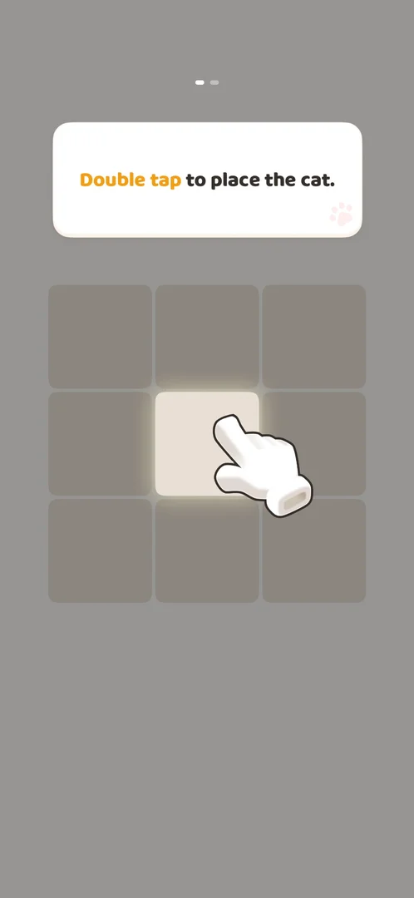
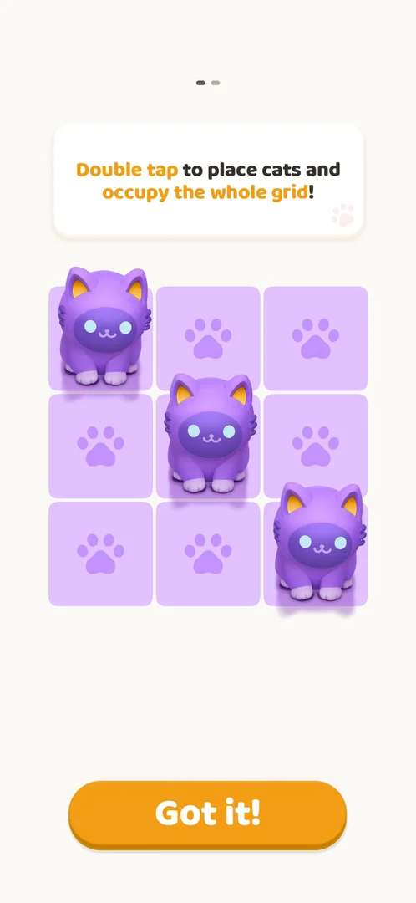
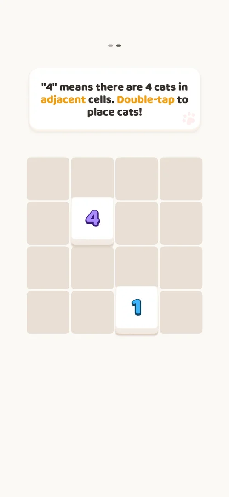
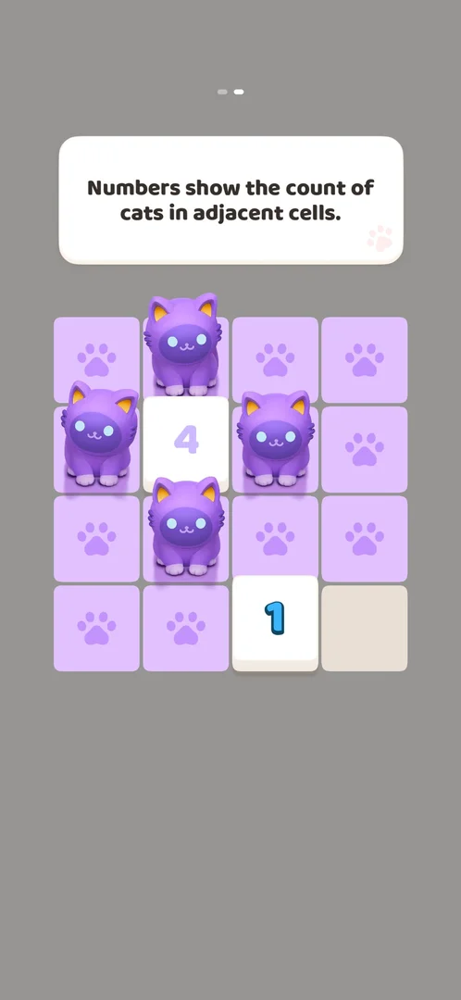
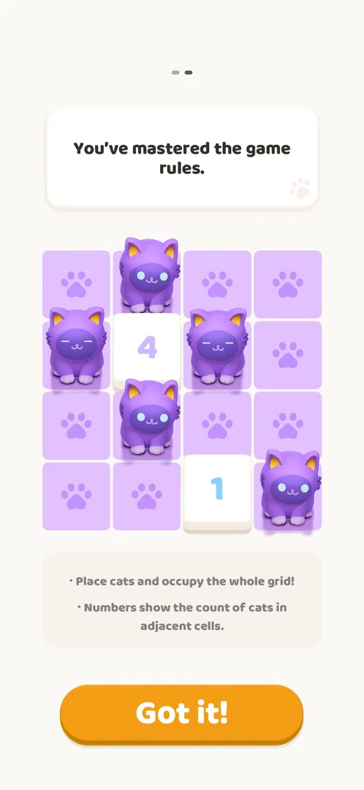

# Tutorial

Two scripted boards that teach the rules of the puzzle before level 1: a double tap places a cat, the cats must cover the whole grid, and a number counts the cats in the cells next to it. A text card above each board says what to do; two dots at the top show which of the two boards is on screen [^s1] [^s5].

## Why it appeared

Right after the Terms consent and the notification prompt on the first launch [^s1].

## Where to find it

It opens by itself on the first launch, after the [Terms consent](consent.md) and the [Notification permission prompt](notifications.md). No control that opens it again was seen: the level screen and Settings have no How to play button [^s7].

<!-- no-entry: shown by itself on the first launch; no control leads to it -->

## What it looks like

A board in the middle of the screen, a white text card above it and two progress dots at the top. On the first step the rest of the screen is dimmed and a white cartoon hand points at the centre cell of a 3x3 grid, with the text "Double tap to place the cat." [^s1]

 [^s1]
*First step: the centre cell is lit and the hand points at it*

The hand is animated; the recording of this session starts later in the tutorial, so there is no clip of it.

## What you can do

| Tab or button | What it teaches |
|---|---|
| [Board 1](#board-1) | A double tap places a cat; cats must cover the whole 3x3 grid |
| [Board 2](#board-2) | Numbered cells: "4" means four cats in the adjacent cells |
| [Board 2 hint](#board-2-hint) | The board dims and points to the last cell to fill |
| [Result](#result) | "You've mastered the game rules." and a summary of the two rules |

### Board 1

A 3x3 grid. The session placed cats on the centre, the top-left and the bottom-right cells, each with a double tap. With three cats on the diagonal every cell turned purple with a paw print, the text changed to "Double tap to place cats and occupy the whole grid!" and a Got it! button appeared [^s2]. That the cats cover their row and column is inferred from this board (three cats on a diagonal cover all nine cells), not stated by the game.

 [^s2]
*Board 1 done: the Got it! button at the bottom leads to board 2*

### Board 2

A 4x4 grid with two white numbered cells: a 4 in the second row and a 1 in the bottom row. The text card explains that "4" means four cats in the adjacent cells and asks for double taps to place cats [^s3].

 [^s3]
*Board 2: the numbered cells 4 and 1*

### Board 2 hint

After four cats were placed around the 4, the board dimmed and only the last uncovered cell (bottom right, next to the 1) stayed lit; the text card read "Numbers show the count of cats in adjacent cells." [^s4]

 [^s4]
*The hint: the empty bottom-right cell next to the 1 is the one left to fill*

### Result

The fifth cat on the bottom-right cell finished the board. The card read "You've mastered the game rules.", a grey box under the board repeated the two rules, and the Got it! button appeared [^s5]. Got it! opened Level 1 directly, without the Home screen [^s6].

 [^s5]
*The end of the tutorial: Got it! opens Level 1*

## How it works

- Two boards, 3x3 and 4x4, in a fixed order (version 1.0.2) [^s1] [^s3].
- The boards are scripted: the cells to fill are shown one at a time with a hand or a dimmed board [^s1] [^s4].
- No Skip button is on any of the tutorial frames [^s1] [^s2] [^s3] [^s5].
- It ends with Got it!, which opens [Level 1](core-level.md) directly [^s6].
- Cat placements on the boards: board 1 three cats, board 2 five cats [^s5].

## Cases

| Case | What was done | Result | Source |
|---|---|---|---|
| Scripted board with a hand hint and 'Double tap to place the cat' <!-- case:chk-screen --> | Fresh install, after the notification prompt | Board 1 with the hand on the centre cell | ✅ [^s1] |
| Two scripted boards: 3x3 teaches double tap to place a cat; 4x4 with clues 4 and 1 teaches that numbers count adjacent cats and that cats must cover the whole grid; ends with 'You've mastered the game rules' <!-- case:chk-steps --> | Played both boards as the hints asked | Both boards done, the final card shown | ✅ [^s5] |
| Ends on 'You've mastered the game rules' + Got it; Got it opens Level 1 directly (no home first) <!-- case:chk-end --> | Tapped Got it! | Level 1 opened | ✅ [^s6] |
| Why it appeared: the trigger that brought it up <!-- case:chk-appeared --> | First launch | Shown after the consent and notification prompt | ✅ [^s1] |
| Where to find it: the screen and the button that open it <!-- case:chk-entry --> | — | not verified: opens by itself |  |
| Whether it can be skipped, and what happens when the app is left in the middle of it <!-- case:chk-skip --> | — | not verified: no Skip button seen; leaving the app mid-tutorial not tried |  |
| Whether it can be seen again (How to play, a help button) <!-- case:chk-replay --> | Looked at the level screen and Settings | not verified: no How to play button seen; Help Center not opened |  |

## Not verified

- Where to find it: whether any control opens it again <!-- case:chk-entry -->
- Skipping: no Skip button on the frames; what happens when the app is left in the middle of the tutorial was not tried <!-- case:chk-skip -->
- Replay: whether the Help Center or anything else shows the rules again <!-- case:chk-replay -->

[^s1]: session 20261003-200925-chrono-2FYKPJ, step 2 — [video at 0:00](https://youtu.be/JOMuD_cF8gM?t=0)
[^s2]: session 20261003-200925-chrono-2FYKPJ, step 5 — [video at 0:00](https://youtu.be/JOMuD_cF8gM?t=0)
[^s3]: session 20261003-200925-chrono-2FYKPJ, step 6 — [video at 0:00](https://youtu.be/JOMuD_cF8gM?t=0)
[^s4]: session 20261003-200925-chrono-2FYKPJ, step 7 — [video at 0:06](https://youtu.be/JOMuD_cF8gM?t=6)
[^s5]: session 20261003-200925-chrono-2FYKPJ, step 8 — [video at 0:22](https://youtu.be/JOMuD_cF8gM?t=22)
[^s6]: session 20261003-200925-chrono-2FYKPJ, step 9 — [video at 0:36](https://youtu.be/JOMuD_cF8gM?t=36)

[^s7]: session 20261003-200925-chrono-2FYKPJ, step 13 — [video at 1:42](https://youtu.be/JOMuD_cF8gM?t=102)
