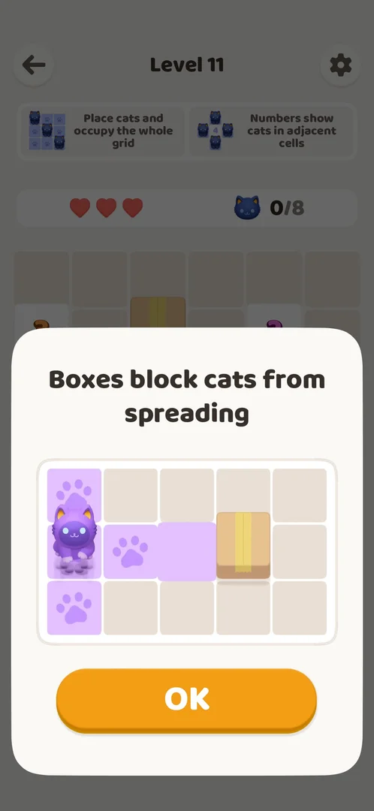

# Tutorial (FTUE)

Played from a fresh install on 2026-10-01 [s:20261001-003641-chrono-2FYKPJ#0].

## How it works
- Order: consent → Oakever splash → loading tip → Android notification prompt → two rules pages →
  level 1 [s:20261001-003641-chrono-2FYKPJ#37].
- Page 1 (3x3): "Double tap to place cats and occupy the whole grid"; a cat occupies its row and
  column (paw marks) [s:20261001-003641-chrono-2FYKPJ#4].
- Page 2 (4x4 with walls "4" and "1"): a number is the count of cats in the adjacent cells; ends with
  "Got it" [s:20261001-003641-chrono-2FYKPJ#5].
- Later tips: X marks at level 6, boxes at level 11 [s:20261001-003641-chrono-2FYKPJ#12] [s:20261001-003641-chrono-2FYKPJ#23].

## Not verified
- Whether the tutorial can be skipped.
