# Levels: MeowTrail

Every level the agents met, as its board looked at the start (the ad strips cropped). The notes tell where a new element or rule appears.

| level 3 | level 4 | level 21 | level 22 | level 23 |
|---|---|---|---|---|
|  |  |  |  |  |

| level 24 | level 25 | level 26 | level 27 | level 28 |
|---|---|---|---|---|
|  |  |  |  |  |

| level 29 | level 30 | level 31 | level 32 | level 33 |
|---|---|---|---|---|
|  |  |  |  |  |

| level 34 | level 35 | level 36 | level 37 | level 38 |
|---|---|---|---|---|
|  |  |  |  |  |

| level 39 | level 40 | level 41 | level 42 | level 43 |
|---|---|---|---|---|
|  |  |  |  |  |

| level 44 | level 45 | level 46 | level 1 | level 10 |
|---|---|---|---|---|
|  |  |  |  | 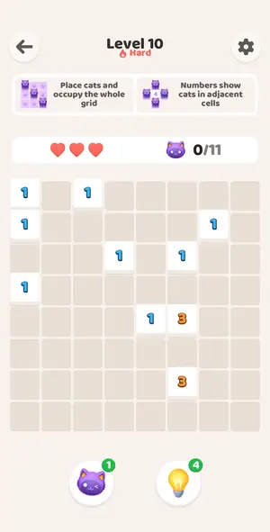 |

| level 11 | level 12 | level 13 | level 14 | level 15 |
|---|---|---|---|---|
| 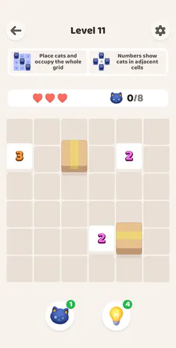 | 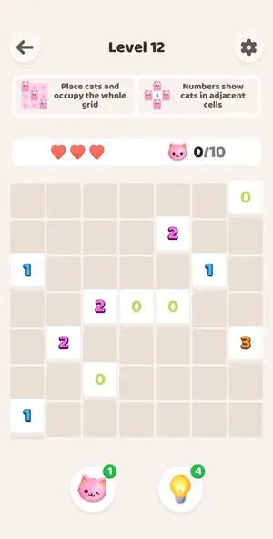 | 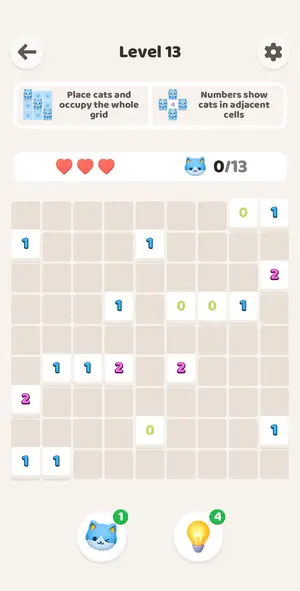 | 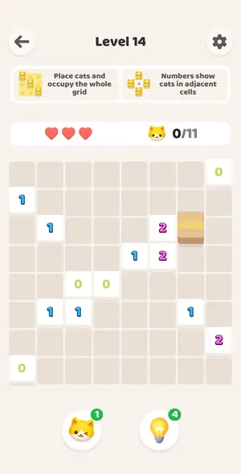 | 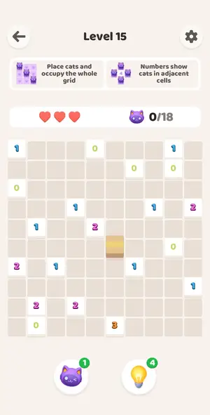 |

| level 16 | level 17 | level 18 | level 2 | level 20 |
|---|---|---|---|---|
| 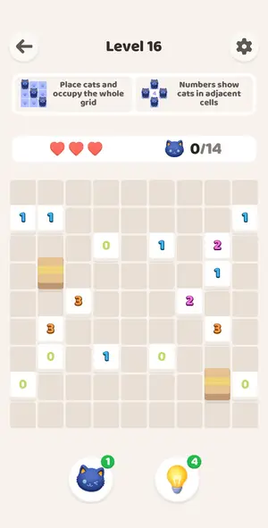 | 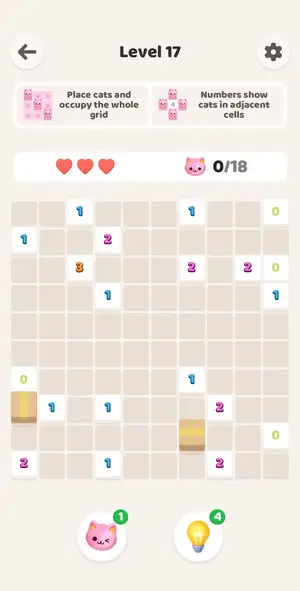 | 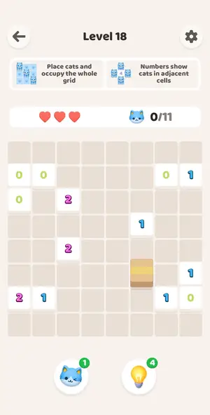 |  | 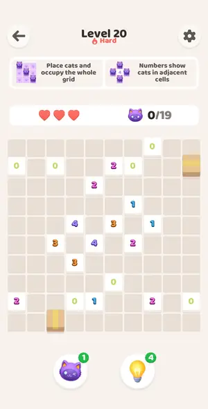 |

| level 4 | level 5 | level 6 | level 7 | level 8 |
|---|---|---|---|---|
| 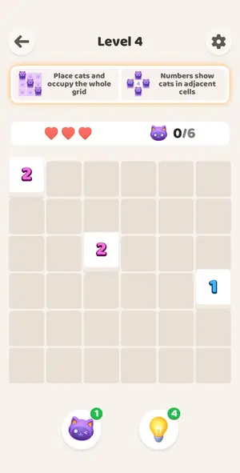 | 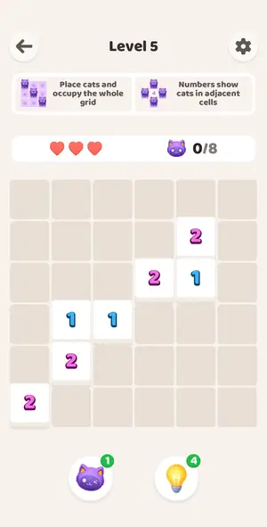 | 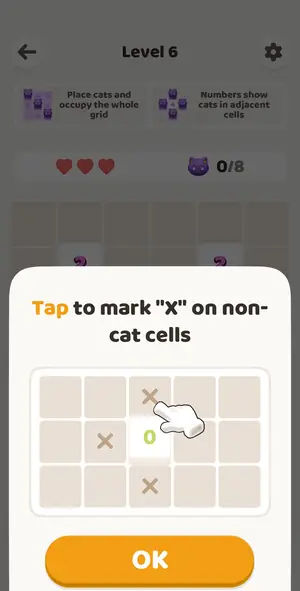 | 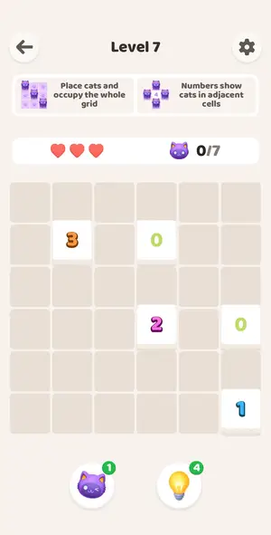 | 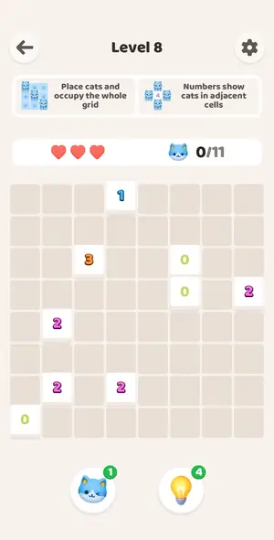 |

| level 9 | tutorial 1 |
|---|---|
| 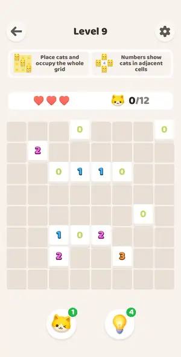 |  |

## Tries

| Level | Mechanic | Result | Time | Note |
|---|---|---|---|---|
| level 3 | akari | 1 won | 133 s | boosters used first, solver finished; AWESOME praise |
| level 4 | akari | 1 lost, 1 quit | — | 3 wrong cats; Restart reopens same board, hearts reset, boosters unchanged |
| level 21 | akari | 1 won | 30 s | solver 1 call; banner absent on win screen |
| level 22 | akari | 1 won | 36 s | solver |
| level 23 | akari | 1 won | 28 s | solver |
| level 24 | akari | 1 won | 31 s | solver |
| level 25 | akari | 1 won | 164 s | bulb experiments inside; solver placed rest |
| level 26 | akari | 1 won | 154 s | dark blue skin; exit experiment done in-level |
| level 27 | akari | 1 won | 28 s | pink skin |
| level 28 | akari | 1 won | 22 s | grey-blue skin |
| level 29 | akari | 1 won | 22 s | yellow skin |
| level 30 | akari | 1 won, 1 quit | 48 s | 30 solved |
| level 31 | akari | 1 won | 22 s | 31 |
| level 32 | akari | 1 won | 17 s | 32 |
| level 33 | akari | 1 won | 24 s | 33 |
| level 34 | akari | 1 won | 22 s | 34 |
| level 35 | akari | 1 won | 27 s | 3 hearts, no booster: title INCREDIBLE |
| level 36 | akari | 1 won | 43 s | lost 1 heart (2 left): title INCREDIBLE, same as 3 hearts |
| level 37 | akari | 1 won, 1 lost | 218 s | cat booster used, 3 hearts: title PERFECT |
| level 38 | akari | 1 won | 32 s | no booster, 3 hearts: title PERFECT |
| level 39 | akari | 1 won | 36 s | L39 no ad at start |
| level 40 | akari | 1 won, 1 quit | 28 s | L40 reopened after exit test |
| level 41 | akari | 1 won | 26 s | L41 |
| level 42 | akari | 1 won | 51 s | solver, no ad on start (parity as predicted) |
| level 43 | akari | 1 won, 1 quit | 38 s | solver; no ad at start after 3.5 min gap |
| level 44 | akari | 1 won, 1 quit | 152 s | cat AD video first |
| level 45 | akari | 1 won | 28 s | second start after reward |
| level 46 | akari | 1 won | 188 s | bulb hint+Apply then bulb AD video, no veil |
| level 1 | akari | 1 won | 30 s | solver |
| level 10 | akari | 1 won, 1 quit | 85 s | Hard 10, solver one round |
| level 11 | akari | 1 won | 93 s | solver |
| level 12 | akari | 1 won | 16 s | solver |
| level 13 | akari | 1 won | 18 s | solver |
| level 14 | akari | 1 won | 17 s | solver |
| level 15 | akari | 1 won | 23 s | solver |
| level 16 | akari | 1 won | 80 s | solver |
| level 17 | akari | 1 won | 24 s | solver |
| level 18 | akari | 1 won | 79 s | solver |
| level 2 | akari | 1 won | 29 s | solver, 6 cats |
| level 20 | akari | 1 won, 1 lost | 94 s | Hard 20 after Restart, solver |
| level 4 | akari | 1 won | 29 s | solver |
| level 5 | akari | 1 won | 14 s | solver |
| level 6 | akari | 2 won | 19 s | solver |
| level 7 | akari | 1 won | 13 s | solver |
| level 8 | akari | 1 won, 1 quit | 17 s | solver |
| level 9 | akari | 1 won | 18 s | solver |
| tutorial 1 | akari | 1 quit | — | tutorial is two scripted boards, not a numbered level |
