# Levels: MeowTrail

Every level the agents met, as its board looked at the start (the ad strips cropped). The notes tell where a new element or rule appears.

| tutorial 2 | level 1 | level 2 | level 3 | level 4 |
|---|---|---|---|---|
| 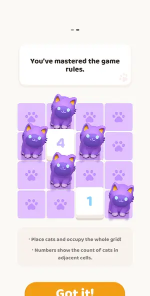 | 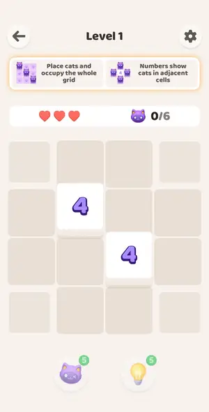 | 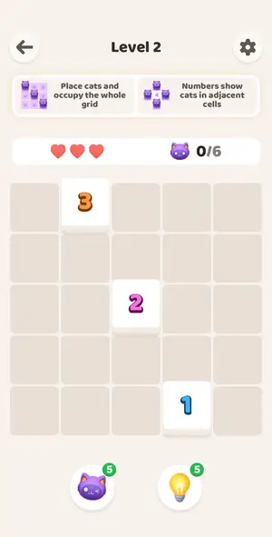 |  |  |

| level 5 | level 6 | level 7 | level 8 | level 9 |
|---|---|---|---|---|
| 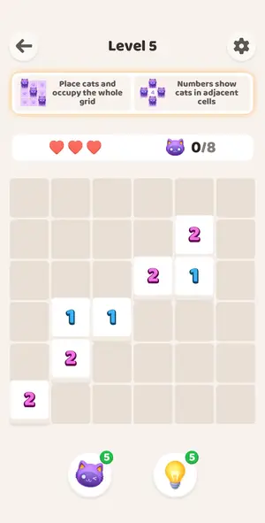 | 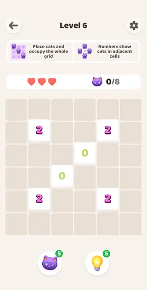 |  | 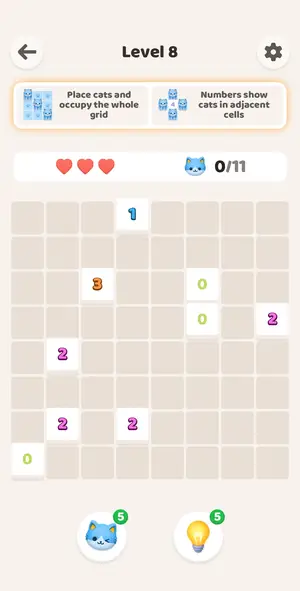 | 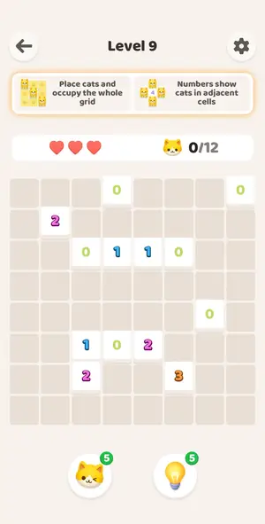 |

| level 10 hard | level 11 | level 12 | level 13 | level 14 |
|---|---|---|---|---|
| 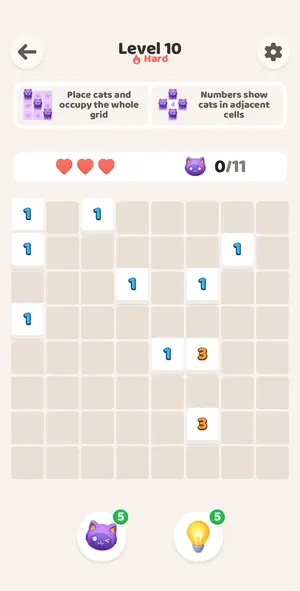 | 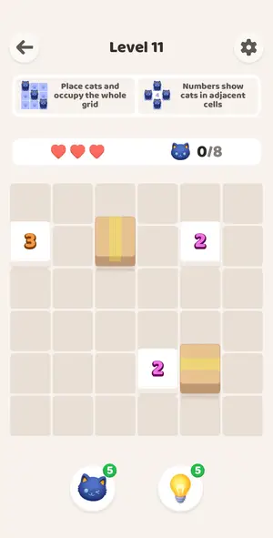 | 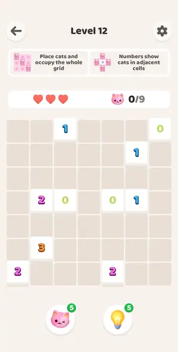 | 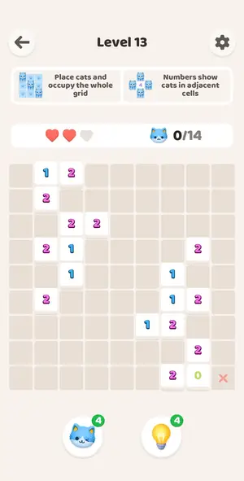 | 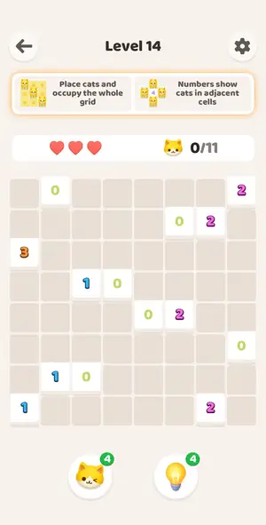 |

| level 15 | level 16 | level 17 | level 18 | level 19 |
|---|---|---|---|---|
| 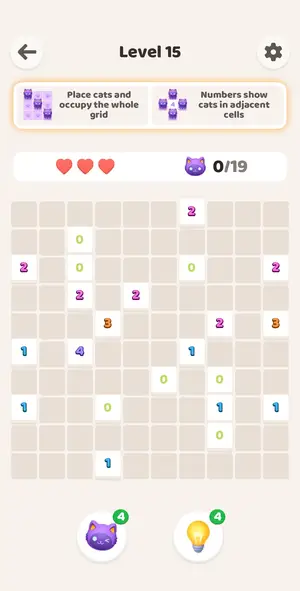 | 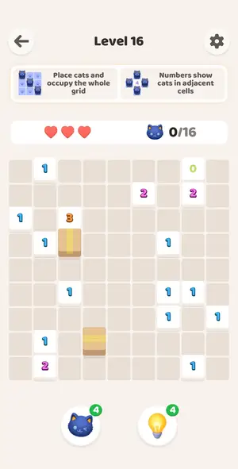 | 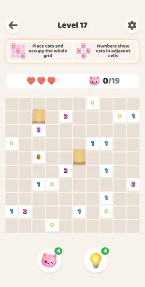 | 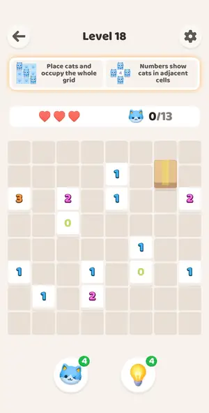 | 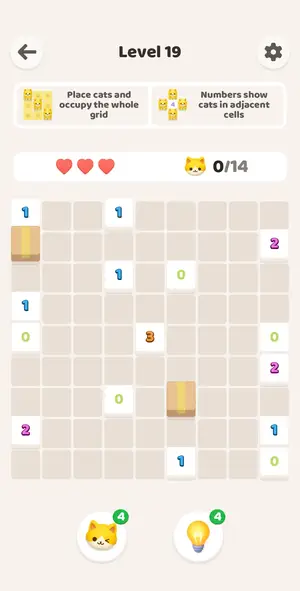 |

| level 20 | level 21 | level 22 | level 23 | level 24 |
|---|---|---|---|---|
| 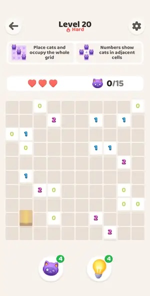 | 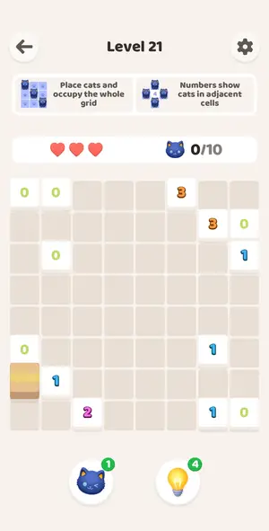 | 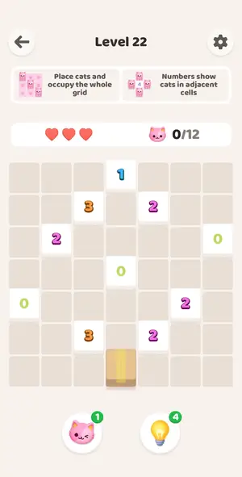 | 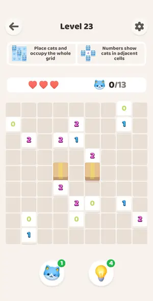 | 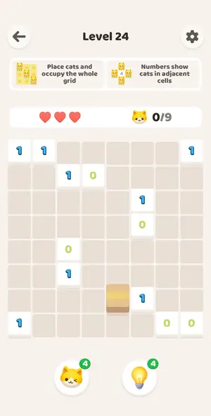 |

| level 25 | level 26 | level 27 | level 28 | level 29 |
|---|---|---|---|---|
| 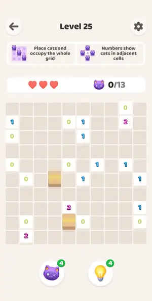 | 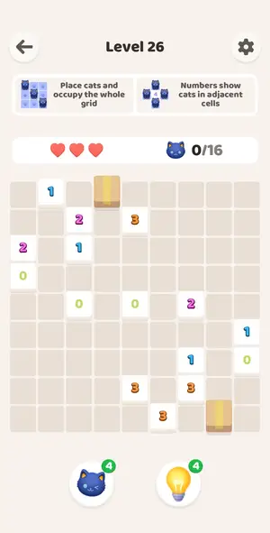 | 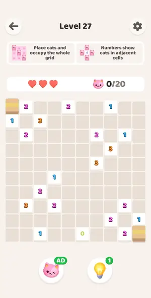 | 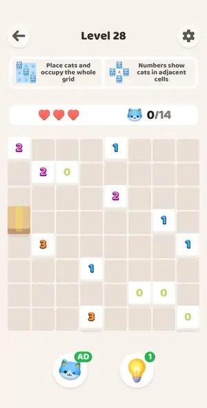 | 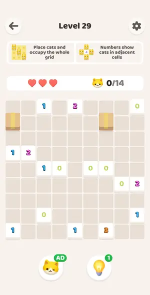 |

| level 30 | level 31 | level 32 | level 33 | level 34 |
|---|---|---|---|---|
| 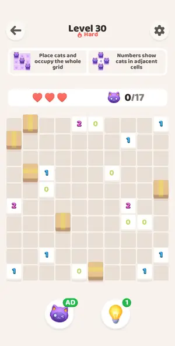 | 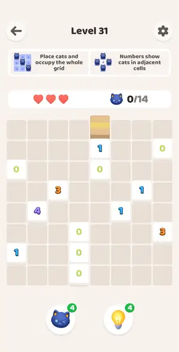 | 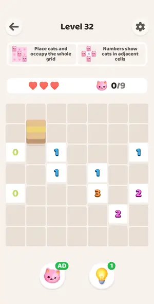 | 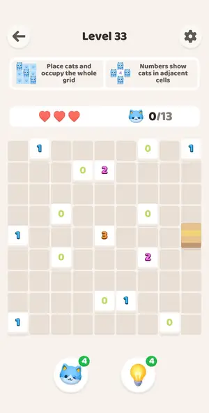 | 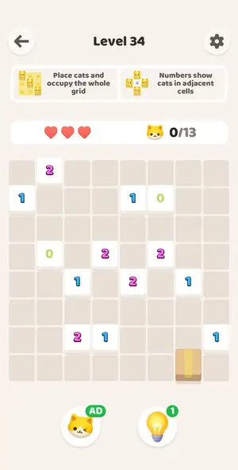 |

| level 35 | level 36 | level 37 | level 38 | level 39 |
|---|---|---|---|---|
| 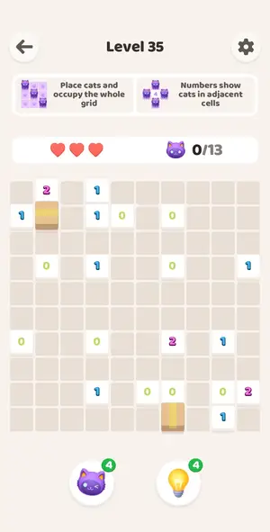 | 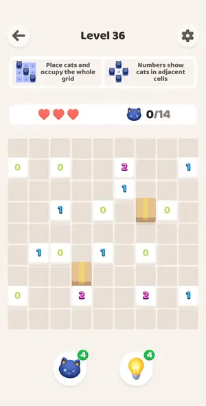 | 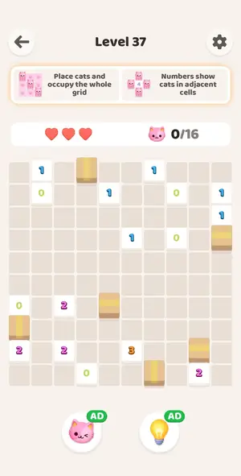 | 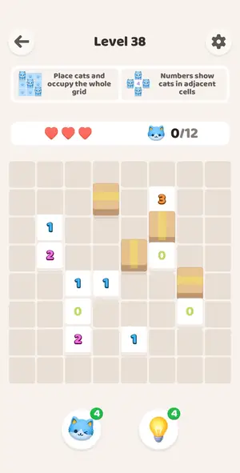 | 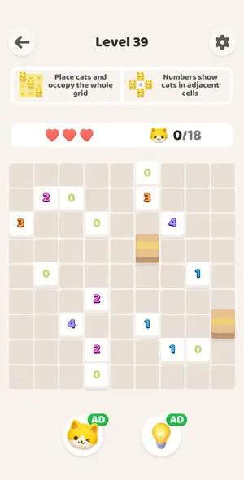 |

| level 40 | level 41 | level 42 | level 43 | level 44 |
|---|---|---|---|---|
| 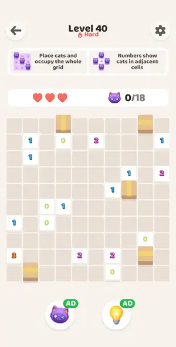 | 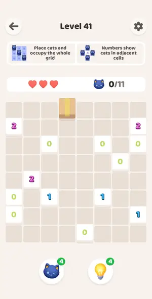 | 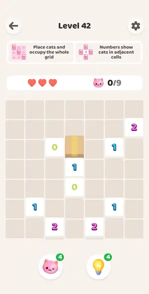 | 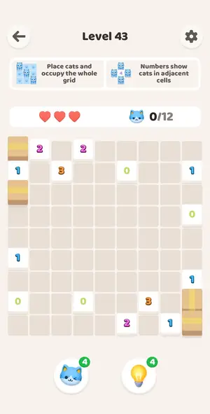 | 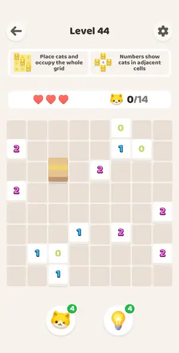 |

| level 45 | level 46 | level 47 | level 48 | level 49 |
|---|---|---|---|---|
| 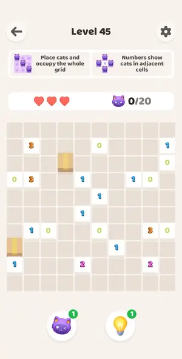 | 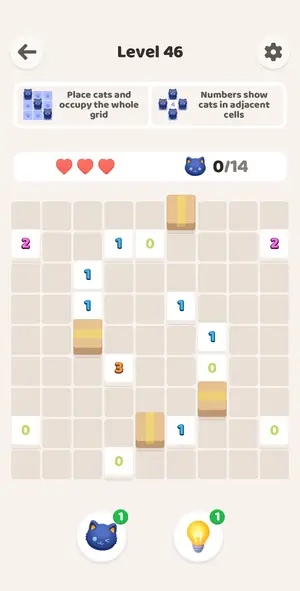 | 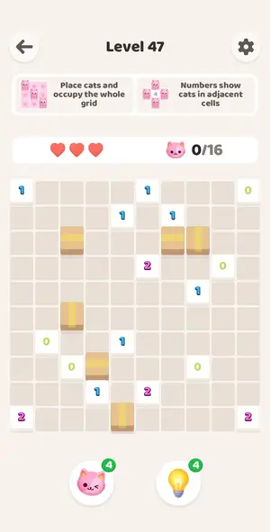 | 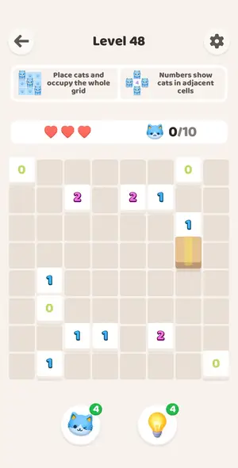 | 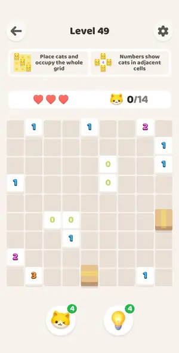 |

| level 50 | level 51 | level 52 | level 53 | level 54 |
|---|---|---|---|---|
| 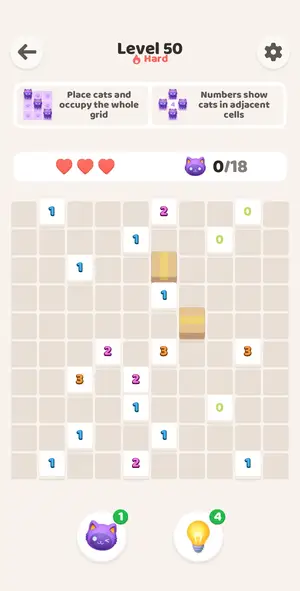 | 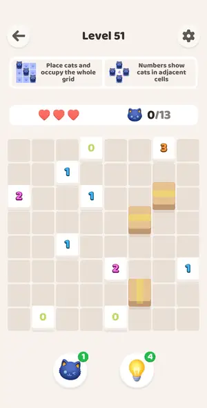 | 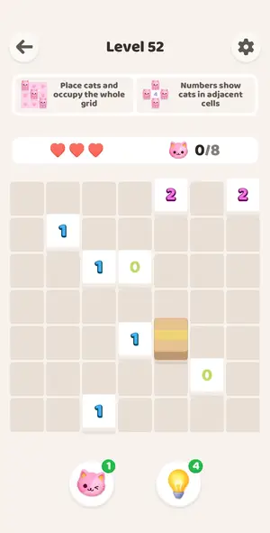 |  |  |

| level 55 | level 56 | level 62 | level 63 | level 64 |
|---|---|---|---|---|
|  |  |  |  |  |

| level 65 | level 66 | level 67 | level 68 | level 69 |
|---|---|---|---|---|
|  |  |  |  |  |

| level 70 | level 71 | level 73 | level 74 | level 75 |
|---|---|---|---|---|
|  |  |  |  |  |

| level 76 | level 77 | level 78 | level 79 | level 80 |
|---|---|---|---|---|
|  |  |  |  |  |

| level 81 | level 82 | level 83 | level 84 | level 85 |
|---|---|---|---|---|
|  |  |  |  |  |

| level 86 | level 87 | level 88 | level 89 | level 90 |
|---|---|---|---|---|
|  |  |  |  |  |

| level 91 | level 92 | level 93 | level 94 | level 95 |
|---|---|---|---|---|
|  |  |  |  |  |

| level 96 | level 97 | level 98 | level 99 | level 100 |
|---|---|---|---|---|
|  |  |  |  |  |

| level 101 | level 102 | level 103 | level 104 | level 105 |
|---|---|---|---|---|
|  |  |  |  |  |

| level 106 | level 107 | level 108 | level 109 | level 110 |
|---|---|---|---|---|
|  |  |  |  |  |

| level 111 | level 112 | level 113 | level 114 | level 115 |
|---|---|---|---|---|
|  |  |  |  |  |

| level 116 | level 117 | level 118 | level 119 | level 120 |
|---|---|---|---|---|
|  |  |  |  |  |

| level 83 | level 84 |
|---|---|
| no frame | no frame |

## Tries

| Level | Mechanic | Result | Time | Note |
|---|---|---|---|---|
| tutorial 2 | akari | 1 won | 17 s | solved by deduction in one batch of 5 adb double taps; walls block line of sight confirmed |
| level 1 | akari | 1 won | 16 s | one batch of 6 deduced double taps, ~0.3 min |
| level 2 | akari | 1 won | 45 s | one batch, deduced |
| level 3 | akari | 1 won | 19 s | solver on hand-read JSON + adb double taps, 0.2 min |
| level 4 | akari | 1 won | 15 s | solver, count constraint |
| level 5 | akari | 1 won | 19 s | solver, 0.2 min |
| level 6 | akari | 1 won | 19 s | solver, 0.2 min |
| level 7 | akari | 1 won | 18 s | solver, 0.2 min |
| level 8 | akari | 1 won | 20 s | solver 8x8, 0.2 min |
| level 9 | akari | 1 won | 22 s | solver, 0.2 min |
| level 10 hard | akari | 1 won | 22 s | hard level, same rules, 8x8, solver 0.2 min; no reward shown |
| level 11 | akari | 1 won | 21 s | boxes = '#', solver 0.2 min |
| level 12 | akari | 1 won | 58 s | used 1 hint + 1 cat booster to document them, then solver; 0.8 min |
| level 13 | akari | 1 won | 41 s | 9x9, 1 deliberate wrong cat (-1 heart), solver 0.6 min |
| level 14 | akari | 1 won | 23 s | solver 0.2 min |
| level 15 | akari | 1 won | 28 s | 10x10, solver 0.3 min |
| level 16 | akari | 1 won | 27 s | 9x9 boxes, solver 0.3 min |
| level 17 | akari | 1 won | 28 s | 10x10 boxes, solver 0.3 min |
| level 18 | akari | 1 won | 30 s | 8x8 box, solver 0.3 min |
| level 19 | akari | 1 won | 24 s | solver, 0.3 min |
| level 20 | akari | 1 won | 29 s | solver hard 10x10 |
| level 21 | akari | 1 won | 19 s | ok |
| level 22 | akari | 1 won | 16 s | ok |
| level 23 | akari | 1 won | 21 s | ok |
| level 24 | akari | 1 won | 16 s | ok |
| level 25 | akari | 1 won | 20 s | ok |
| level 26 | akari | 1 won | 29 s | ok |
| level 27 | akari | 1 won | 21 s | ok |
| level 28 | akari | 1 won | 17 s | ok |
| level 29 | akari | 1 won | 20 s | ok |
| level 30 | akari | 1 won | 22 s | ok |
| level 31 | akari | 1 won | 21 s | ok |
| level 32 | akari | 1 won | 17 s | ok |
| level 33 | akari | 1 won | 20 s | ok |
| level 34 | akari | 1 won | 16 s | ok |
| level 35 | akari | 1 won | 20 s | ok |
| level 36 | akari | 1 won | 21 s | ok |
| level 37 | akari | 1 won | 24 s | ok |
| level 38 | akari | 1 won | 19 s | ok |
| level 39 | akari | 1 won | 21 s | ok |
| level 40 | akari | 1 won | 23 s | ok |
| level 41 | akari | 1 won | 18 s | ok |
| level 42 | akari | 1 won | 17 s | ok |
| level 43 | akari | 1 won | 19 s | ok |
| level 44 | akari | 1 won | 21 s | ok |
| level 45 | akari | 1 won | 20 s | ok |
| level 46 | akari | 1 won | 19 s | ok |
| level 47 | akari | 1 won | 22 s | ok |
| level 48 | akari | 1 won | 17 s | ok |
| level 49 | akari | 1 won | 271 s | deliberate fail first (3 hearts lost, revive via ad, boosters used), solver finished |
| level 50 | akari | 1 won | 29 s | solver ok |
| level 51 | akari | 1 won | 149 s | solver; first board misread (box column) fixed |
| level 52 | akari | 1 won | 22 s | ok |
| level 53 | akari | 1 won | 27 s | ok |
| level 54 | akari | 1 won | 22 s | ok |
| level 55 | akari | 1 won | 32 s | ok |
| level 56 | akari | 1 quit | — | session ended (ok) |
| level 62 | akari | 1 won | 13 s | no ad before 62 |
| level 63 | akari | 1 won | 18 s | ok |
| level 64 | akari | 1 won | 23 s | ok |
| level 65 | akari | 1 won | 29 s | ok |
| level 66 | akari | 1 won | 27 s | ok |
| level 67 | akari | 1 won | 27 s | ok |
| level 68 | akari | 1 won | 14 s | ok |
| level 69 | akari | 1 won | 19 s | ok |
| level 70 | akari | 1 won | 41 s | hard 70 ok |
| level 71 | akari | 1 won | 29 s | solver ok |
| level 73 | akari | 1 won | 197 s | hints used 4x then AD refill, solver finished with placed cats as C |
| level 74 | akari | 1 won | 17 s | ok |
| level 75 | akari | 1 won | 23 s | ok |
| level 76 | akari | 1 won | 19 s | ok |
| level 77 | akari | 1 won | 5 s | ok |
| level 78 | akari | 1 won | 28 s | ok |
| level 79 | akari | 1 won | 26 s | ok |
| level 80 | akari | 1 won | 39 s | hard 10x10 18 cats, solver ok |
| level 81 | akari | 1 quit | — | solver can't read the board, manual solving too slow for benchmark slot |
| level 82 | akari | 1 quit | — | game restarted before formal end |
| level 83 | akari | 1 won, 1 quit | 30 s | solver, 2 rounds |
| level 84 | akari | 1 won | 26 s | solver |
| level 85 | akari | 1 won | 25 s | solver |
| level 86 | akari | 1 won | 22 s | solver |
| level 87 | akari | 1 won | 29 s | solver, 1 call |
| level 88 | akari | 1 won | 25 s | solver; ad before level |
| level 89 | akari | 1 won | 30 s | solver |
| level 90 | akari | 1 won | 30 s | solver, 19 cats Hard level; ads between levels cost most time |
| level 91 | akari | 1 won | 48 s | solver, one run |
| level 92 | akari | 1 won | 112 s | solver; ad before level opened Play Store, relaunched |
| level 93 | akari | 1 won | 29 s | solver |
| level 94 | akari | 1 won | 100 s | solver; ad before level opened Play Store, relaunched |
| level 95 | akari | 1 won | 47 s | solver, 1 run |
| level 96 | akari | 1 won | 149 s | solver; interstitial before it |
| level 97 | akari | 1 won | 25 s | solver |
| level 98 | akari | 1 won | 103 s | solver; interstitial before it |
| level 99 | akari | 1 won | 19 s | solver, 13 cats, 2 rounds |
| level 100 | akari | 1 won | 110 s | solver, 16 cats; ad before board |
| level 101 | akari | 1 won | 34 s | solver, 21 cats, 1 round |
| level 102 | akari | 1 won | 120 s | solver, 25 cats; interstitial ad + Play Store, launch recovered |
| level 103 | akari | 1 won | 59 s | solver, win screen seen |
| level 104 | akari | 1 won, 1 quit | 33 s | solver solved in 2 rounds |
| level 105 | akari | 1 won | 30 s | solver solved |
| level 106 | akari | 1 won | 24 s | solver completed |
| level 107 | akari | 1 won | 25 s | solver completed |
| level 108 | akari | 1 won | 25 s | solver ok |
| level 109 | akari | 1 won | 29 s | ok |
| level 110 | akari | 1 won | 16 s | ok |
| level 111 | akari | 1 won | 21 s | ok |
| level 112 | akari | 1 won | 21 s | ok |
| level 113 | akari | 1 won | 20 s | ok |
| level 114 | akari | 1 won | 40 s | ok |
| level 115 | akari | 1 won | 136 s | after fail+revive |
| level 116 | akari | 1 won | 15 s | ok |
| level 117 | akari | 1 won | 18 s | ok |
| level 118 | akari | 1 won | 19 s | ok |
| level 119 | akari | 1 won | 15 s | ok |
| level 120 | akari | 1 won | 12 s | ok |
| level 83 | akari | 1 quit | — | Unable to enter level board from level select screen after multiple attempts |
| level 84 | akari | 1 quit | — | session ended (blocked) |
