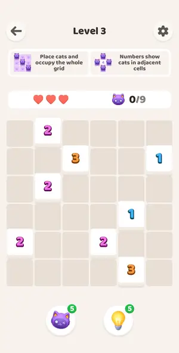
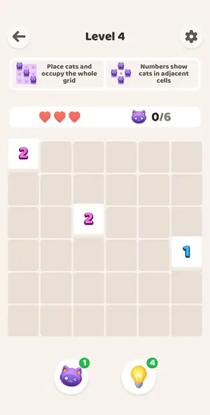
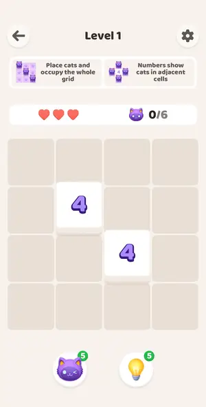
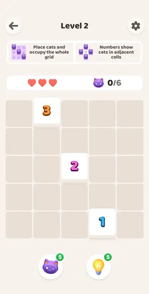

# Levels: MeowTrail

Every level the agents met, as its board looked at the start (the ad strips cropped). The notes tell where a new element or rule appears.

| level 3 | level 4 | level 1 | level 2 | tutorial 1 |
|---|---|---|---|---|
|  |  |  |  |  |

## Tries

| Level | Mechanic | Result | Time | Note |
|---|---|---|---|---|
| level 3 | akari | 1 won | 133 s | boosters used first, solver finished; AWESOME praise |
| level 4 | akari | 1 lost, 1 quit | — | 3 wrong cats; Restart reopens same board, hearts reset, boosters unchanged |
| level 1 | akari | 1 won | 30 s | solver |
| level 2 | akari | 1 won | 29 s | solver, 6 cats |
| tutorial 1 | akari | 1 quit | — | tutorial is two scripted boards, not a numbered level |
