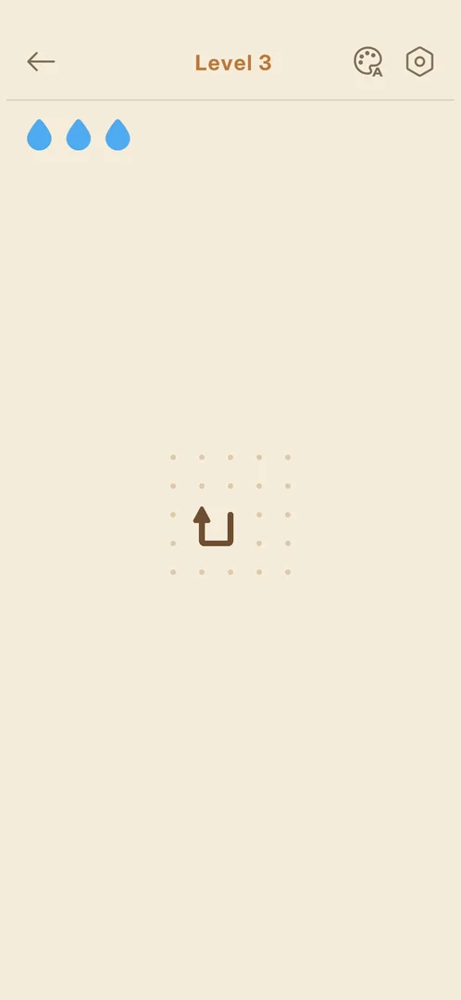

# Lessons for the agent: Amaze GO!

- To test the mistake penalty, tap the centre of a blocked arrow that has no other arrow within one
  cell: the hit-box is generous, and a tap next to a free neighbour moves the neighbour instead (no
  drop lost, 0 mistakes on the result) [s:20261001-204000-chrono-2FYKPJ#21] [s:20261001-204000-chrono-2FYKPJ#22].
  confirmed: 20261001-204000-chrono-2FYKPJ, 1.31.0 (frame of the board after the tap, 3 drops intact)

  

- The theme picker closes only by tapping the palette icon again; a tap on the board does nothing
  [s:20261001-204000-chrono-2FYKPJ#18] [s:20261001-204000-chrono-2FYKPJ#19].
  confirmed: 20261001-204000-chrono-2FYKPJ, 1.31.0 (frame of the picker still open after the board tap)

- The Score row counts up: a frame taken right after the win shows a partial value ("2" on level 3)
  [s:20261001-204000-chrono-2FYKPJ#22].
  confirmed: 20261001-204000-chrono-2FYKPJ, 1.31.0 (frame of the result with the score mid-count)

Single-session observations not yet accepted as lessons (they wait for a second session or a frame):
a tap sent while the previous arrow is still sliding can be ignored [s:20261001-204000-chrono-2FYKPJ#7];
do not judge the method from tutorial-sized boards [s:20261001-204000-chrono-2FYKPJ#8].
