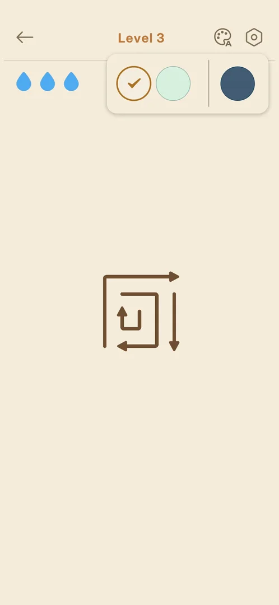

# Routes

Positions in the 730x1583 frame. The game opens straight into the current level; the main menu is
reached only from a level [s:20261001-204000-chrono-2FYKPJ#10].

- FTUE (fresh install): Accept on the consent screen (365,1227) → splash quote → Android notification
  prompt, "Don't allow" (365,1476) → tutorial level 1 "Tap an arrow" with a hand, no HUD → full HUD
  from level 2 [s:20261001-204000-chrono-2FYKPJ#1] [s:20261001-204000-chrono-2FYKPJ#2] [s:20261001-204000-chrono-2FYKPJ#6].
- Next level (skill `next-level`): on the result screen wait about 3 s, then Next Level (365,1210)
  [s:20261001-204000-chrono-2FYKPJ#5] [s:20261001-204000-chrono-2FYKPJ#6] [s:20261001-204000-chrono-2FYKPJ#9].
- Main menu (skill `level-to-main-menu`): back arrow in a level (64,97) [s:20261001-204000-chrono-2FYKPJ#10].
- Play (skill `play-from-main-menu`): Play / Level N on the main menu (365,1265) [s:20261001-204000-chrono-2FYKPJ#16].
- Settings (skill `open-close-settings-main-menu`): gear on the main menu (656,106); Android back
  returns to the main menu [s:20261001-204000-chrono-2FYKPJ#14] [s:20261001-204000-chrono-2FYKPJ#15]. The rows Save Your Progress, Rate Us,
  Feedback, Privacy Policy and Terms of Service were not opened yet.
- Card carousel: one swipe (600,370)→(100,370) shows the third card (Event); a second swipe changes
  nothing — there are only 3 cards [s:20261001-204000-chrono-2FYKPJ#11] [s:20261001-204000-chrono-2FYKPJ#12]. A tap on a locked card shows its
  unlock tooltip, e.g. Event (536,370) [s:20261001-204000-chrono-2FYKPJ#13].
- Theme picker: palette icon in a level (582,97); tap the palette again to close it — a tap on the
  board leaves it open [s:20261001-204000-chrono-2FYKPJ#17] [s:20261001-204000-chrono-2FYKPJ#18] [s:20261001-204000-chrono-2FYKPJ#19].

