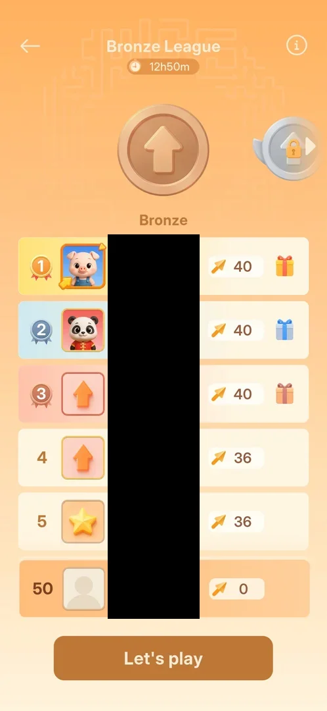
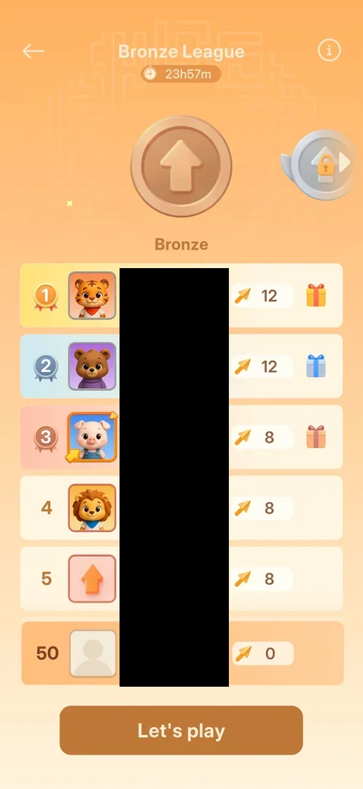
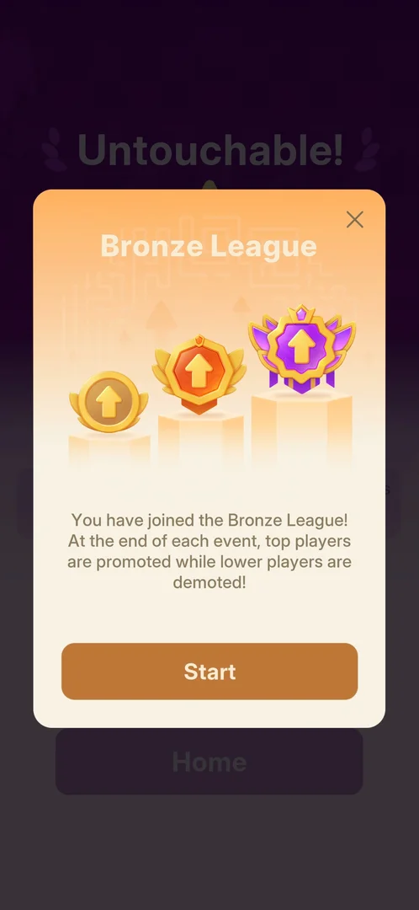
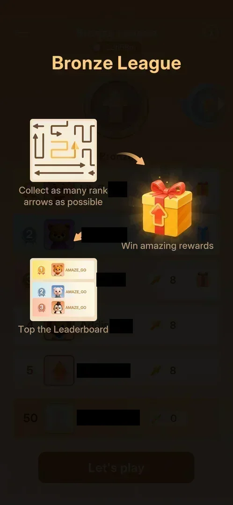
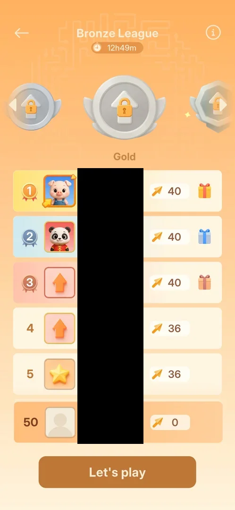
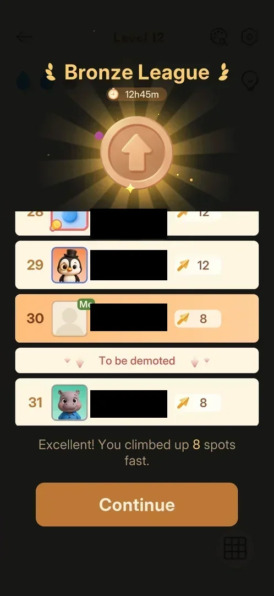
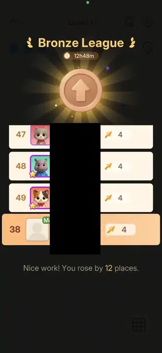

# Bronze League

A timed leaderboard event, the first card of the Home carousel. The player collects "rank arrows" (the
[gold arrows](gold-arrows.md) on level boards, 1 point each, counted on a won level) and is ranked against
other players by their count; after each win a league card shows the new rank. At the end of each event
the top players go up a tier and the lowest go down; Bronze is the first of several tiers, the next is the
[Silver League](silver-league.md) [^s1] [^s2] [^s3] [^s20].
It opens after level 10 is won.

## Why it appeared

The card is on Home from the first launch, locked with "Unlock Lv.11" [^s4].
Winning Hard level 10 (so reaching level 11) brought a "Bronze League" popup over the win card: "You have
joined the Bronze League!" [^s1]. After it, the card on Home was open
[^s5].

## Where to find it

Home > the carousel at the top > the first card from the left, "Bronze League" > its Play button
[^s5]. Before level 11 the same card shows "Unlock Lv.11" instead of Play
[^s6].

 [^s5]
*Home after joining: the Play button on the Bronze League card, first in the carousel, opens the league*

The card shows the time left in the event, the tier's medal and the player's rank
[^s5].

 [^s6]
*Before level 11: the same card, locked with Unlock Lv.11*

## What it looks like

 [^s7]
*The league screen half a day into the event. The players' names are blacked out on this page*

An orange screen [^s7]. From top to bottom:

- a back arrow, the title "Bronze League" with the event timer under it, and an (i) button at the top
  right;
- the medal row: the bronze medal in the centre, labelled "Bronze", and at the right edge the next tier's
  medal with a lock;
- the leaderboard: each row has the rank, an avatar, a name and the count of rank arrows. Ranks 1 to 3
  have medal badges, coloured rows and a gift box at the right;
- the player's own row, pinned under the top 5;
- a "Let's play" button.

At joining (timer 23h57m) the top five had 12, 12, 8, 8 and 8 rank arrows
[^s8]; about eleven hours later (12h50m) they had 40, 40, 40, 36 and 36,
and the player was still 50th with 0 [^s7].

 [^s8]
*The same screen on joining*

## What you can do

| Tab or button | What it does |
|---|---|
| [Joined popup](#joined-popup) | comes once after the level 10 win; Start joins |
| [How to play](#how-to-play) | an overlay on each opening of the league, and on the (i): how points and rewards work |
| [Leaderboard](#leaderboard) | ranks, rank-arrow counts, gifts for the top 3 (the gifts do not open) |
| [Tiers](#tiers) | a swipe on the medal row shows the locked tiers |
| [Let's play](#lets-play) | opens the next level |
| [League card after a win](#league-card-after-a-win) | after each won level: the new rank and the places climbed |
| [Bronze League End](#bronze-league-end) | on the first launch after the period: the final rank and the promotion |

### Joined popup

 [^s1]
*After the level 10 win: the popup that joins the league, with Start and an X*

The popup came over the Hard level 10 win card. It shows three medals on podiums of rising height (bronze,
orange, purple) and says that at the end of each event the top players are promoted and the lower players
demoted. It has a Start button and an X [^s1]. Start opened the
[Profile](profile.md) popup to set a name and avatar [^s9]; its Save led
straight to the level 11 board, not to the league [^s10]. The X was not
tapped.

### How to play

 [^s2]
*The overlay; names behind it are blacked out on this page*

The card's Play opened the league with an overlay of three panels linked by arrows
[^s2]:

- a small board with one gold arrow among brown ones: "Collect as many rank arrows as possible";
- a gift box: "Win amazing rewards";
- a top-3 list: "Top the Leaderboard".

A tap anywhere closes it and leaves the league screen [^s8]. It came again on
the second opening of the league, not only the first [^s11], and the (i) at the
top right opens the same overlay; it holds nothing more [^s12].

### Leaderboard

<!-- no-frame: the leaderboard is on the league screen frame above -->
The rows are ranked by rank arrows. Ranks 1 to 3 have a gift box each: gold, blue and red
[^s8]. A tap on the rank 1 gift did nothing: no popup, the screen stayed the
same [^s13]. The other players' avatars are the same animal portraits the
Profile popup offers [^s8] [^s9]. The player
started at rank 50 with 0, and the league card lists ranks down to 49, so the board has at least 50
players [^s8] [^s3].

### Tiers

 [^s14]
*A swipe on the medal row: the locked tiers, the centre one labelled Gold*

A tap on the locked medal at the right edge did nothing [^s15]. A swipe to the
left on the medal row moved it to the following tiers: all locked, the one in the centre labelled "Gold",
with a winged medal to its left and an octagonal one to its right. The leaderboard below did not change
[^s14]. Gold is a later tier than Bronze and at least one more tier follows it;
how many tiers lie between Bronze and Gold, and their names, were not seen (the swipe moved the row by an
unknown number of places).

### Let's play

<!-- no-frame: the button is on the league screen frame above -->
"Let's play" at the bottom of the league screen opened the next level's board, level 11
[^s16].

### League card after a win

 [^s17]
*After the level 12 win: rank 30 with 8, the "To be demoted" line right under it, and Continue*

After a won level with gold arrows, a "Bronze League" card comes first, before the usual win card: the
timer, the bronze medal in a glow, a slice of the leaderboard around the player's row (marked "Me"), a line
of praise with the number of places climbed, and Continue. Continue leads to the win card
[^s3] [^s18]. The player's row rises from the
bottom of the list to its new rank:

 [^s3]
*Clip 3 s · [original on YouTube from 2:26](https://youtu.be/oc6wFXd4jzs?t=146)*

- Level 11: 0 to 4, rank 50 to 38, "Nice work! You rose by 12 places." [^s3]
- Level 12: 4 to 8, rank 38 to 30, "Excellent! You climbed up 8 spots fast." A "To be demoted" line sat
  right under rank 30: rank 31 and below were in the demotion zone [^s17].

### Bronze League End

 [^s20]
*The first launch after the 24 h period: the final rank and the promotion. No currency or item is shown*

On the first launch after the period ended, a "Bronze League End" card came over Home with confetti: the
bronze medal in a glow, the next medal (silver, locked) beside it, and "Ranked 8, promoted to Silver
level!" (the player had 8 rank arrows). Rank 8 brought no currency or item on this card [^s20] [^s21].
"Tap to Continue" led to the Silver League joined popup [^s22]:

 [^s22]
*After Tap to Continue: the next tier's joined popup*

Its Start opened the current level, as on joining Bronze; the Home card then read "Silver League"
[^s23]. The Silver tier is on its own page: [Silver League](silver-league.md).

## How it works

Version 1.33.0.

- Opens after level 10 is won, as the locked card said (Unlock Lv.11) [^s4]
  [^s1].
- One period lasts 24 hours in real time: the timer read 23h58m on Home a few minutes after joining
  [^s5] and 12h50m eleven hours later [^s7]. Joined at about 01:35 on 2026-10-05,
  the end card came on the launch at 01:37 on 2026-10-06, and the Silver timer then read 23h59m
  [^s21].
- Points: each gold arrow cleared on a won level gives 1 rank arrow. Level 11 had 4 gold arrows (0 to 4),
  level 12 had 4 (4 to 8) [^s3] [^s17]. A win
  itself gave nothing more.
- Promotion and demotion: at the end of an event the top players are promoted and the lower ones demoted
  [^s1]. With 50 players, the demotion line was under rank 30
  [^s17]. Rank 8 was promoted [^s20]; where the promotion line falls was not seen.
- Rewards: gift boxes for ranks 1 to 3; they do not open on a tap, their contents were not seen
  [^s13]. Rank 8 got nothing but the promotion [^s20].
- The other players' counts grow during the event: the top five went from 12, 12, 8, 8, 8 to 40, 40, 40,
  36, 36 in about eleven hours [^s8] [^s7].

## Cases

| Case | What was done | Result | Source |
|---|---|---|---|
| Why it appeared <!-- case:chk-appeared --> | Won Hard level 10 | ✅ "You have joined the Bronze League!" over the win card; the Home card opened | [^s4] [^s1] |
| Where to find it <!-- case:chk-entry --> | Opened Home after joining | ✅ Home, first card of the carousel: timer, medal, rank and a Play button | [^s5] |
| Its screen <!-- case:chk-screen --> | Tapped Play on the card, closed the overlay | ✅ Timer, the medal row with the next tier locked, the leaderboard, Let's play | [^s8] |
| The board <!-- case:chk-board --> | Looked at the leaderboard on joining and half a day later | ✅ Rank, avatar, name and rank-arrow count per row; top five 12, 12, 8, 8, 8, later 40, 40, 40, 36, 36; the player pinned at 50 with 0; gifts for ranks 1-3 | [^s8] [^s7] |
| What earns points <!-- case:chk-points --> | Won levels 11 and 12, with 4 gold arrows each | ✅ 1 point per gold arrow cleared, credited on the win: 0 to 4, then 4 to 8; a league card after each win shows the places climbed | [^s19] [^s3] [^s17] |
| The period and its timer <!-- case:chk-period --> | Looked at the timer at joining, eleven hours later, and launched after it ran out | ✅ 24 h in real time: joined about 01:35 on 2026-10-05, the end card on the 01:37 launch on 2026-10-06, Silver at once with 23h59m | [^s5] [^s7] [^s21] |
| Rewards per rank, promotion and relegation <!-- case:chk-rewards --> | Tapped the rank 1 gift; read the league card; ended the period at rank 8 | partly: the demotion line under rank 30 of 50; rank 8 promoted with no reward; the gifts do not open; the promotion line and the top-3 rewards not seen | [^s13] [^s17] [^s20] |
| The tiers <!-- case:tiers --> | Tapped the locked medal, then swiped the medal row | ✅ The tap did nothing; the swipe showed locked tiers, the centre one labelled Gold; the leaderboard did not change | [^s15] [^s14] |
| The demotion line <!-- case:demotion --> | Won level 12 and read the league card | ✅ A "To be demoted" line under rank 30 of 50: rank 31 and below demote | [^s17] |
| The end of a period <!-- case:chk-end --> | Launched the game after the 24 h period | ✅ "Bronze League End" card: Ranked 8, promoted to Silver level!, Tap to Continue; then the Silver League joined popup, whose Start opens the current level; no reward for rank 8 | [^s20] [^s22] |

## Not verified

- Rewards per rank and where promotion falls; what the gifts hold (task exp-league-top3-reward) <!-- case:chk-rewards -->
- The end card for a demotion or for a top-3 rank
- The full list of tiers and their order between Bronze and Gold; what the X on the joined popup does
- What tapping the locked card did before level 11
- Whether a lost or restarted level keeps the gold arrows already cleared

[^s1]: session 20261005-012010-chrono-2FYKPJ, step 29 — [video at 12:43](https://youtu.be/BaXAJZAR4vk?t=763)
[^s2]: session 20261005-012010-chrono-2FYKPJ, step 34 — [video at 14:45](https://youtu.be/BaXAJZAR4vk?t=885)
[^s3]: session 20261005-124219-chrono-2FYKPJ, step 11 — [video at 2:28](https://youtu.be/oc6wFXd4jzs?t=148)
[^s4]: session 20261003-200141-chrono-2FYKPJ, step 1 — [video at 0:12](https://youtu.be/l44HK-PZ5-o?t=12)
[^s5]: session 20261005-012010-chrono-2FYKPJ, step 33 — [video at 14:31](https://youtu.be/BaXAJZAR4vk?t=871)
[^s6]: session 20261003-200141-chrono-2FYKPJ, step 2 — [video at 0:39](https://youtu.be/l44HK-PZ5-o?t=39)
[^s7]: session 20261005-124219-chrono-2FYKPJ, step 2 — [video at 0:29](https://youtu.be/oc6wFXd4jzs?t=29)
[^s8]: session 20261005-012010-chrono-2FYKPJ, step 35 — [video at 14:59](https://youtu.be/BaXAJZAR4vk?t=899)
[^s9]: session 20261005-012010-chrono-2FYKPJ, step 30 — [video at 13:14](https://youtu.be/BaXAJZAR4vk?t=794)
[^s10]: session 20261005-012010-chrono-2FYKPJ, step 31 — [video at 13:30](https://youtu.be/BaXAJZAR4vk?t=810)
[^s11]: session 20261005-124219-chrono-2FYKPJ, step 1 — [video at 0:18](https://youtu.be/oc6wFXd4jzs?t=18)
[^s12]: session 20261005-124219-chrono-2FYKPJ, step 6 — [video at 1:01](https://youtu.be/oc6wFXd4jzs?t=61)
[^s13]: session 20261005-124219-chrono-2FYKPJ, step 3 — [video at 0:38](https://youtu.be/oc6wFXd4jzs?t=38)
[^s14]: session 20261005-124219-chrono-2FYKPJ, step 5 — [video at 0:51](https://youtu.be/oc6wFXd4jzs?t=51)
[^s15]: session 20261005-124219-chrono-2FYKPJ, step 4 — [video at 0:45](https://youtu.be/oc6wFXd4jzs?t=45)
[^s16]: session 20261005-124219-chrono-2FYKPJ, step 8 — [video at 1:17](https://youtu.be/oc6wFXd4jzs?t=77)
[^s17]: session 20261005-124219-chrono-2FYKPJ, step 20 — [video at 5:09](https://youtu.be/oc6wFXd4jzs?t=309)
[^s18]: session 20261005-124219-chrono-2FYKPJ, step 12 — [video at 2:48](https://youtu.be/oc6wFXd4jzs?t=168)
[^s19]: session 20261005-124219-chrono-2FYKPJ, step 16 — [video at 4:04](https://youtu.be/oc6wFXd4jzs?t=244)
[^s20]: session 20261006-013740-chrono-2FYKPJ, step 0 — [video at 0:00](https://youtu.be/O4n16Ei5uiU?t=0)
[^s21]: session 20261006-013740-chrono-2FYKPJ, step 7 — [video at 1:40](https://youtu.be/O4n16Ei5uiU?t=100)
[^s22]: session 20261006-013740-chrono-2FYKPJ, step 1 — [video at 0:16](https://youtu.be/O4n16Ei5uiU?t=16)
[^s23]: session 20261006-013740-chrono-2FYKPJ, step 3 — [video at 0:49](https://youtu.be/O4n16Ei5uiU?t=49)
