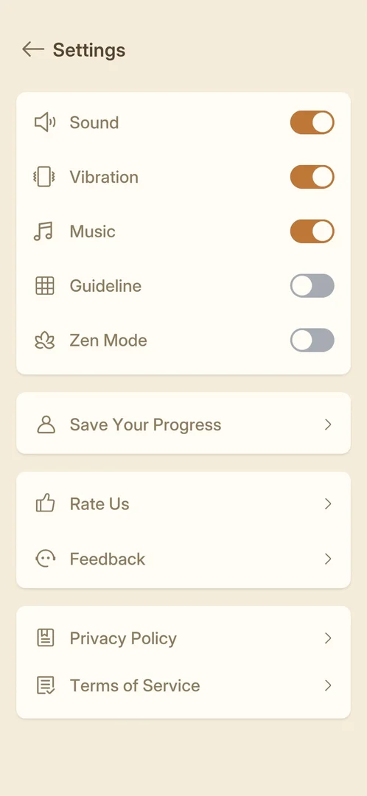
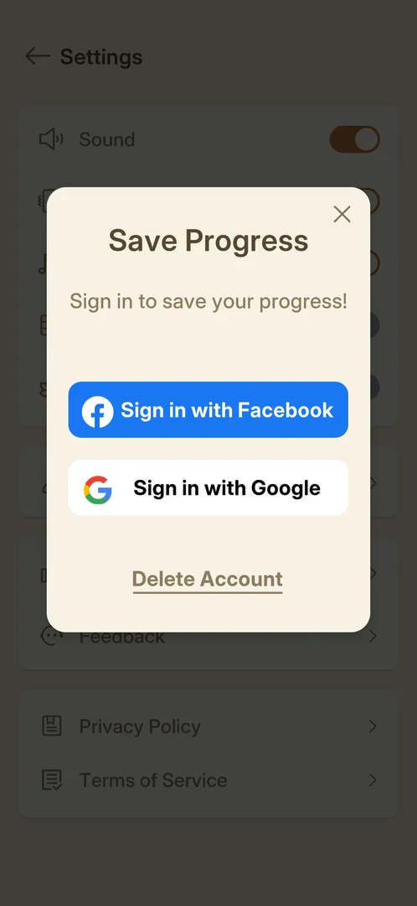

# Save Your Progress (cloud save)

The game keeps the player's progress in the cloud. On the first launch after a fresh install it found a
saved game and restored it to level 3 in a "Progress updated!" popup [^s1]. In Settings, the "Save Your
Progress" row opens a "Save Progress" popup that offers sign-in with Facebook or Google and a Delete
Account link [^s3]. In this session no sign-in was made and Delete Account was not tapped [^s4].

## Why it appeared

On the first launch, right after the consent screen: the "Progress updated!" popup restored the cloud save
to level 3 [^s1]. The restore happened without any sign-in on this install (from the frames of that
session); which account or device ID it used is not known. The Settings row is there from the start, with
no lock [^s2].

 [^s1]
*The "Progress updated!" popup on the first launch: Restore to Level 3, the Update button*

The restore popup is described on the [Consent screen](consent.md) page.

## Where to find it

Home > the gear top right > Settings > "Save Your Progress", the only row of the second block, with a
person icon and an arrow [^s2]. See [Settings](settings.md).

 [^s2]
*Settings: the "Save Your Progress" row, alone in the second block under the five switches*

## What it looks like

A light popup over the dimmed Settings screen, titled "Save Progress", with the line "Sign in to save
your progress!", two buttons and a link [^s3]:

- "Sign in with Facebook", a blue button with the Facebook logo;
- "Sign in with Google", a white button with the Google logo;
- "Delete Account", an underlined text link at the bottom;
- an X in the top right corner.

 [^s3]
*The Save Progress popup: two sign-in buttons, the Delete Account link and the X*

## What you can do

| Tab or button | What it does |
|---|---|
| [X](#x) | closes the popup, back to Settings |
| [Sign in with Facebook](#sign-in-with-facebook) | not tapped |
| [Sign in with Google](#sign-in-with-google) | not tapped |
| [Delete Account](#delete-account) | not tapped |

### X

<!-- no-frame: the X is on the popup frame above; the screen after it is the Settings frame above -->
Closes the popup and returns to Settings, unchanged [^s4].

### Sign in with Facebook

<!-- no-frame: the button is on the popup frame above; it was not tapped -->
The blue button [^s3]. Not tapped: by its name it leads to the Facebook sign-in, outside the game
(inferred). What the popup shows once an account is signed in is not known.

### Sign in with Google

<!-- no-frame: the button is on the popup frame above; it was not tapped -->
The white button [^s3]. Not tapped: by its name it leads to the Google sign-in (inferred).

### Delete Account

<!-- no-frame: the link is on the popup frame above; it was not tapped -->
Not tapped: it may erase the cloud save, so it was left alone. Whether it asks for confirmation is not
known.

## How it works

Version 1.33.0.

- On a fresh install the game restored saved progress (level 3) on the first launch, before any sign-in
  in the game [^s1].
- Sign-in is offered in Settings > Save Your Progress, with Facebook or Google [^s3].
- The popup does not show whether an account is signed in; "Sign in to save your progress!" was shown on
  this device, which had not signed in [^s3].

## Cases

| Case | What was done | Result | Source |
|---|---|---|---|
| Restore popup 'Progress updated!': We found your saved progress, Restore to Level 3, Update <!-- case:chk-screen --> | First launch on a fresh install, Accept on the consent screen | ✅ The popup restored progress to level 3 | [^s1] |
| Popup: Facebook, Google sign-in, Delete Account link, X closes; not signed in, Delete not tapped <!-- case:popup-cases --> | Settings > Save Your Progress, looked at the popup, closed it with X | ✅ Two sign-in buttons and Delete Account; X returns to Settings | [^s3] [^s4] |
| Why it appeared <!-- case:chk-appeared --> | Fresh install, first launch | ✅ The restore popup came right after consent | [^s1] |
| Where to find it: the screen and the button that open it <!-- case:chk-entry --> | Tapped Save Your Progress in Settings | ✅ The Save Progress popup opened | [^s2] [^s3] |
| Every option or button and what it changes <!-- case:chk-options --> | Tapped X | X closes the popup; the sign-in buttons and Delete Account not tapped | [^s4] |
| For a prompt: what each answer does and whether it comes back <!-- case:chk-answers --> | — | not verified: no sign-in, no delete |  |
| Links out: where they lead <!-- case:chk-links --> | — | not verified: Facebook and Google sign-in not opened |  |

## Not verified

- What Sign in with Facebook and Sign in with Google lead to, and how the popup looks once signed in <!-- case:chk-options -->
- What Delete Account does and whether it asks for confirmation <!-- case:chk-answers -->
- Where the sign-in buttons lead (Facebook and Google pages) <!-- case:chk-links -->
- Which account or ID the first-launch restore used without a sign-in

[^s1]: session 20261003-200141-chrono-2FYKPJ, step 1 — [video at 0:12](https://youtu.be/l44HK-PZ5-o?t=12)
[^s2]: session 20261003-232108-chrono-2FYKPJ, step 2 — [video at 0:20](https://youtu.be/KL7evNlX6oU?t=20)
[^s3]: session 20261003-232108-chrono-2FYKPJ, step 3 — [video at 0:29](https://youtu.be/KL7evNlX6oU?t=29)
[^s4]: session 20261003-232108-chrono-2FYKPJ, step 13 — [video at 1:58](https://youtu.be/KL7evNlX6oU?t=118)
