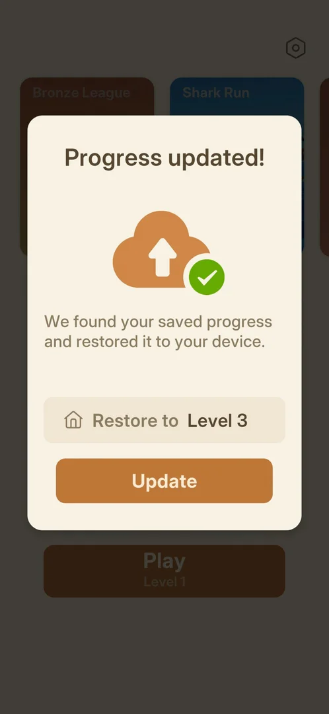

# Consent screen

The first screen of a fresh install: "Welcome to Amaze GO!" with an illustration of the arrow puzzle, a
line asking to accept the Terms of Service and the Privacy Policy (both underlined links), and one button,
Accept [^s2]. After Accept, the game found a cloud save and showed a "Progress updated!" popup before
Home [^s1].

## Why it appeared

First launch of a fresh install [^s2] [^s1].

## Where to find it

<!-- no-entry: it opens by itself on the first launch; there is no control that leads to it -->
It opens by itself on the first launch, before any other screen [^s2].

## What it looks like

 [^s2]
*The consent screen: the Terms of Service and Privacy Policy links, the Accept button at the bottom*

There is no Decline or close control: Accept is the only button [^s2].

## What you can do

| Tab or button | What it does |
|---|---|
| [Accept](#accept) | closes the screen and goes on to the game |
| [Terms of Service and Privacy Policy](#terms-of-service-and-privacy-policy) | links; not opened |

### Accept

<!-- no-frame: the button is on the consent frame above -->
The only button, at the bottom. Tapping it closed the screen; the "Progress updated!" popup followed over
Home [^s1].

### Terms of Service and Privacy Policy

<!-- no-frame: the links are on the consent frame above; neither was opened -->
Two underlined orange links in the line above Accept [^s2]. Not opened.

### Progress updated! popup

Shown right after Accept, over a dimmed Home: "Progress updated!", a cloud with a green tick, a line saying
the saved progress was found and restored, a field "Restore to Level 3" and an Update button [^s1]. Behind
it, Play showed "Level 1"; after Update, Home showed "Play / Level 3"
[^s3].

 [^s1]
*The cloud-restore popup after Accept: Restore to Level 3, the Update button*

## How it works

Version 1.33.0. The restore popup shows when a cloud save exists for the device or account (inferred: the
install was fresh and still restored level 3) [^s1]. It had one button, Update; no way to refuse the
restore was on it [^s1].

## Cases

| Case | What was done | Result | Source |
|---|---|---|---|
| Why it appeared <!-- case:chk-appeared --> | Fresh install, first launch | ✅ The consent screen came first | [^s2] |
| Where to find it <!-- case:chk-entry --> | — | not verified: open in the map (see Not verified) | [^s2] |
| What it looks like: its screen <!-- case:chk-screen --> | Looked at it | not verified: open in the map (see Not verified) | [^s2] |
| Every option or button and what it changes <!-- case:chk-options --> | Tapped Accept | not verified: open in the map (see Not verified) | [^s1] |
| What each answer does and whether it comes back <!-- case:chk-answers --> | Tapped Accept | Accept continues; whether the screen comes back on a later launch is not verified | [^s1] |
| Links out (privacy, terms): where they lead <!-- case:chk-links --> | — | not verified: not opened |  |

## Not verified

- Whether the consent screen comes back on a later launch <!-- case:chk-answers -->
- Where the Terms of Service and Privacy Policy links lead <!-- case:chk-links -->
- Where to find it: the map keeps this item open (no entry frame marked for the feature) <!-- case:chk-entry -->
- Its screen: the map keeps this item open (no screen frame marked for the feature) <!-- case:chk-screen -->
- Every option or button and what it changes: open in the map; the links were never opened <!-- case:chk-options -->

> ⚠️ Previously (1.33.0, 2026-10-03): the page showed these three as done. Where to find it: "Opens by itself
> on the first launch; no control leads to it" [^s2]. Its screen: "Welcome text, two links, Accept" [^s2].
> Options: "Accept is the only button; it led to the restore popup, then Home" [^s1].

[^s1]: session 20261003-200141-chrono-2FYKPJ, step 1 — [video at 0:12](https://youtu.be/l44HK-PZ5-o?t=12)
[^s2]: session 20261003-200141-chrono-2FYKPJ, step 0 — [video at 0:00](https://youtu.be/l44HK-PZ5-o?t=0)

[^s3]: session 20261003-200141-chrono-2FYKPJ, step 2 — [video at 0:39](https://youtu.be/l44HK-PZ5-o?t=39)
