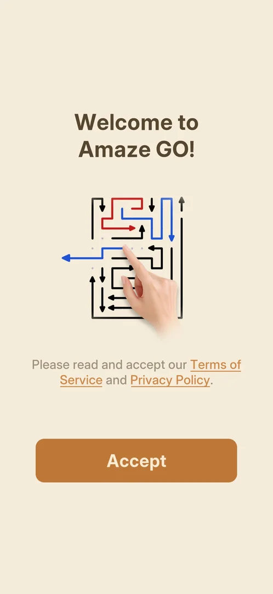

# Consent screen (ToS / Privacy)

The first thing a new player sees: a welcome screen that asks to read and accept the Terms of Service
and the Privacy Policy before playing. It has a single Accept button, so accepting is the only way into
the game [^s1].

## Where to find it

<!-- no-entry: shown by itself on the very first launch, before anything else -->

Nothing opens it: it appears by itself on the first launch of a fresh install [^s1]. The same documents
can be opened later from [Settings](settings.md) (the Privacy Policy and Terms of Service rows) [^s2].

## What it looks like

A beige screen titled "Welcome to Amaze GO!" with an illustration of the game itself: a maze of
coloured and black arrows and a hand tapping one of them. Under it, a line asks to read and accept the
Terms of Service and the Privacy Policy, both shown as underlined links, and one orange Accept button
[^s1].

 [^s1]

## How it works

- One button, Accept; there is no decline (version 1.31.0) [^s1].
- After Accept the game shows a splash screen with its logo and a one-line tip from the developer
  about playing daily, then Android asks for permission to send notifications [^s3]
  [^s4].
- Declining notifications ("Don't allow") does not block the game: the tutorial level 1 ("Tap an
  arrow", with a hand pointing at the arrow to tap) starts right away, without the top bar of later
  levels [^s4]. There is no main menu at first: the game opens straight
  into the levels, and the [main menu](main-menu.md) is reached with the back arrow in a level
  [^s5].

## Cases

| Case | What was done | Result | Source |
|---|---|---|---|
| Accept on a fresh install | Tapped Accept, then "Don't allow" on the notification prompt | ✅ Tutorial level 1 opens | [^s4] |

## Not verified

- What the Terms of Service and Privacy Policy links open (not tapped).
- Whether the consent shows again after a restart.
- Whether the consent differs by country (for example a separate data-consent screen in the EU).

[^s1]: session 20261001-204000-chrono-2FYKPJ, step 0 — [video at 0:00](https://youtu.be/tbyupdD9iso?t=0)
[^s2]: session 20261001-204000-chrono-2FYKPJ, step 14 — [video at 3:09](https://youtu.be/tbyupdD9iso?t=189)
[^s3]: session 20261001-204000-chrono-2FYKPJ, step 1 — [video at 0:13](https://youtu.be/tbyupdD9iso?t=13)
[^s4]: session 20261001-204000-chrono-2FYKPJ, step 2 — [video at 0:35](https://youtu.be/tbyupdD9iso?t=35)
[^s5]: session 20261001-204000-chrono-2FYKPJ, step 10 — [video at 2:29](https://youtu.be/tbyupdD9iso?t=149)
