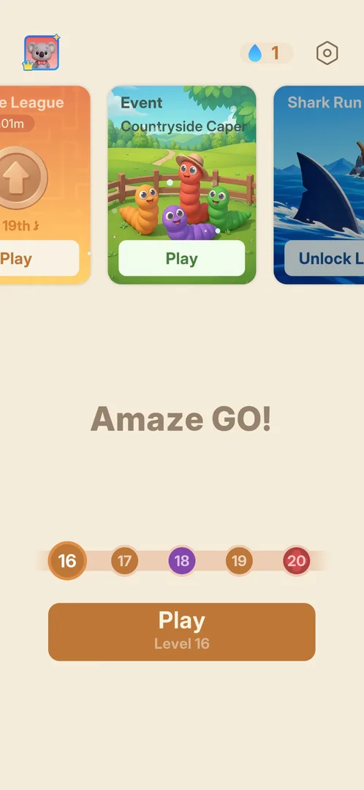
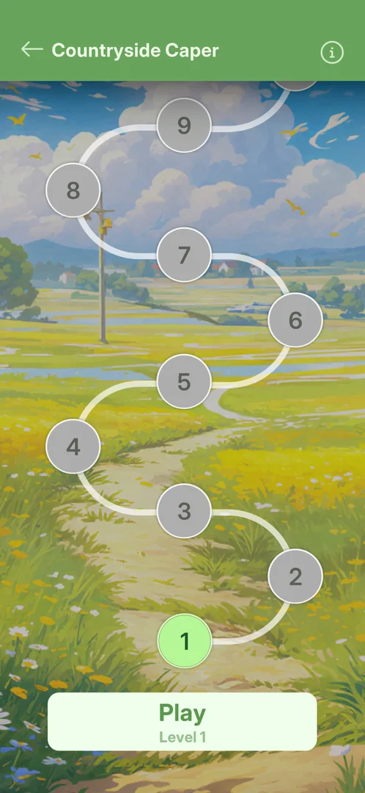
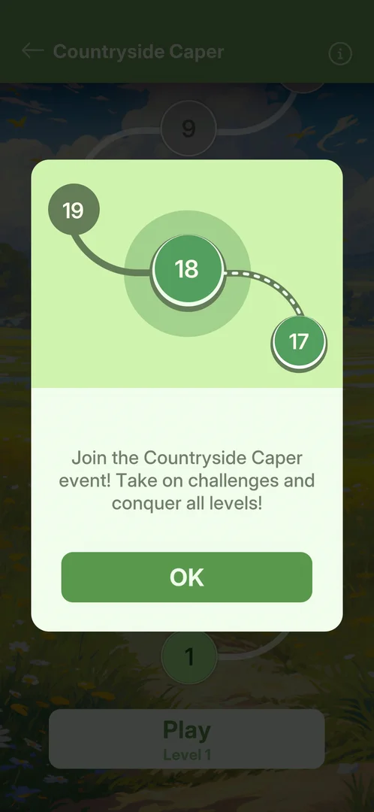
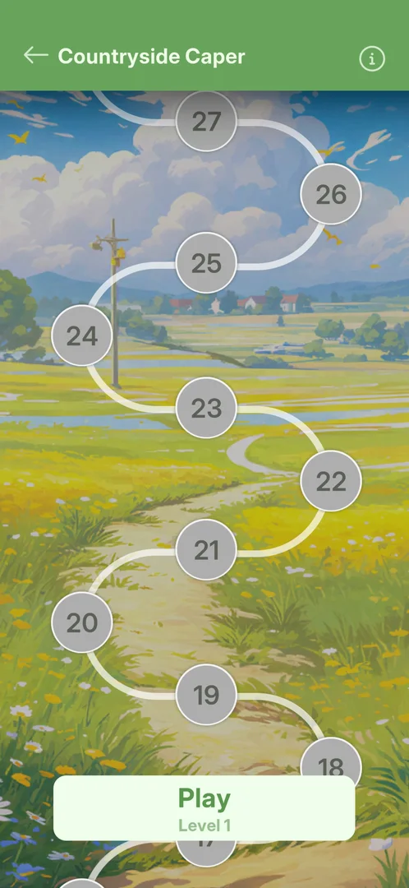
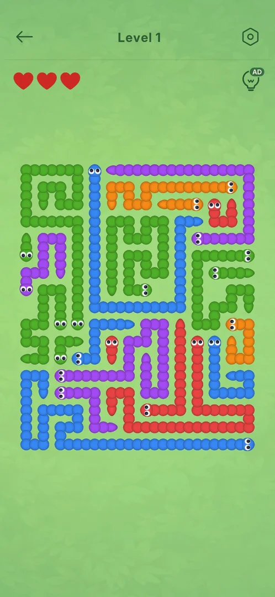
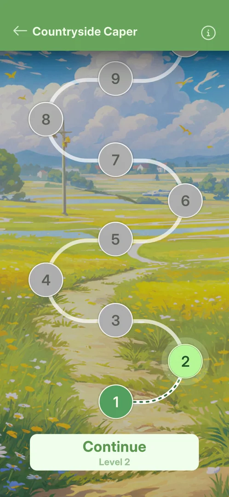
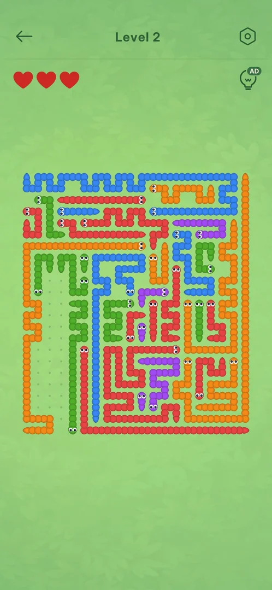
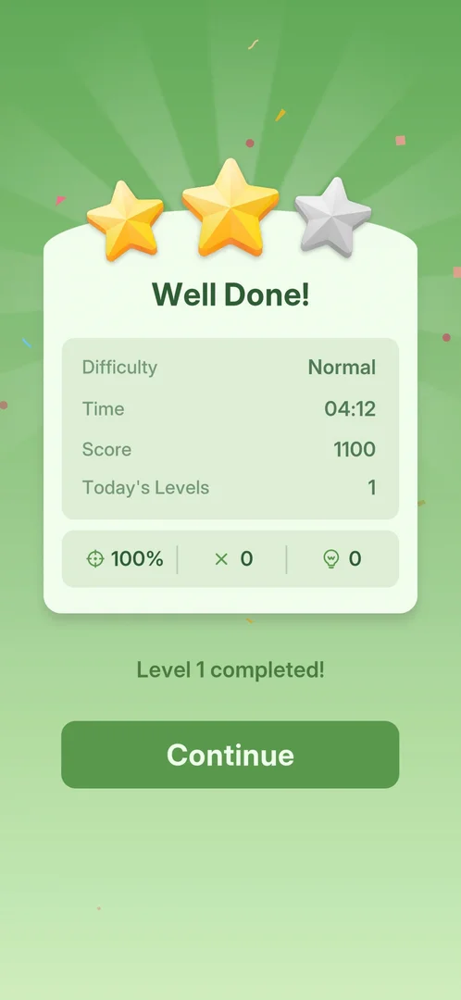

# Event Countryside Capers

An event with its own path of about 28 levels, separate from the main level path, opened from a card on
the Home carousel. The game shows it as "Countryside Caper": "Event Countryside Caper" on the card,
"Countryside Caper" in the event screen's header [^s2] [^s3]. Its levels are the main game's puzzle in a
worm skin: each piece is a worm with an eyed head, and a tap sends a free worm off the board the way its
head points; the player has 3 hearts instead of drops [^s8]. The only goal the game states is to conquer
all the levels; no points, rewards or timer were shown anywhere [^s6] [^s7] [^s9]. It is locked until
level 16 [^s1].

## Why it appeared

On the Home carousel from the first launch, as a locked card with the button "Unlock Lv.16" [^s1]. It
opened when level 16 became the next level (after the level 15 win of the previous session): the next
session's first Home frame shows the card with Play instead of the lock [^s2].

## Where to find it

Home > the carousel at the top > the "Event Countryside Caper" card > Play (or the card's picture) [^s2]
[^s6].

 [^s2]
*Home at level 16: the Play button on the Event Countryside Caper card opens the event*

The card's place in the carousel changed: at level 3 it was the last card, right of the locked Daily
Challenge [^s1]; at level 16 it stands between the league card (Play) and the locked Shark Run card [^s2].
Inferred: open cards are listed before locked ones.

 [^s1]
*Home carousel at level 3: the same card, last, locked with Unlock Lv.16*

## What it looks like

The event screen: a green header with a back arrow and the title "Countryside Caper" on the left and an
(i) button on the right; under it a winding path of numbered nodes over a painted countryside picture;
the current node is light green, won nodes dark green, the rest grey; at the bottom a "Play / Level N"
button [^s3]. No timer is shown on this screen [^s3] [^s6].

 [^s3]
*The event screen: its own level path, level 1 current, Play Level 1 at the bottom*

## What you can do

| Tab or button | What it does |
|---|---|
| [Join popup](#join-popup) | Shown on the first opening; OK closes it |
| [Rules (i)](#rules-i) | The same join popup again: conquer all the levels |
| [Back arrow](#back-arrow) | Returns to Home |
| [Path](#path) | Scrolls up to node 27-28; no rewards on it |
| [Play](#play) | Opens the current event level |
| [Continue](#continue) | After quitting a level: reopens the same, half-cleared board |

### Join popup

On the first opening a popup covers the event screen: a picture of three path nodes (17, 18, 19, with 18
highlighted), a one-line invitation to join the Countryside Caper event and conquer all its levels, and a
green OK button. OK closes it and leaves the event screen [^s4] [^s3].

 [^s4]
*First-open popup over the event screen: three path nodes, the invitation to join the event, OK*

### Rules (i)

<!-- no-frame: the (i) opens the same popup as the join popup frame above -->

The (i) at the right of the header opens the same popup as on the first opening: the invitation to join
and to take on challenges and conquer all levels, with OK. It names no points, items, rewards, timer or
schedule [^s6].

### Back arrow

<!-- no-frame: a button on the event screen, seen in its frame above; it leads to Home -->

The arrow at the left of the green header returned to Home [^s5].

### Path

 [^s7]
*The path scrolled up as far as it goes: node 27 and one more above it*

Scrolling the path up stops at node 27 with the start of one more node above it: about 28 levels. No
chests, rewards or milestones stand on the path [^s7].

### Play

 [^s8]
*Event level 1: worms instead of arrows, 3 hearts instead of drops, the hint bulb with its AD badge*

Play opens the current event level on a green background, titled "Level N" [^s8]:

- the pieces are worms of five colours (blue, green, purple, orange, red), drawn as beads with an eyed head
  and a tapered tail, packed into a square board;
- three red hearts at the top left take the place of the main game's drops;
- the hint bulb with the AD badge ([rewarded hint ad](rewarded-hint-ad.md)) and the gear at the top right;
- no event bar, counter or collectible in the level.

Level 1 was a 14 x 17 board; level 2 is far larger (about 28 x 28), wider than the screen and cut at both
sides when it opens [^s15]. A tapped free worm leaves the board along the way its head points, as an arrow
does in the main game; level 1 was cleared with no mistake [^s13].

### Continue

 [^s10]
*After quitting level 2: Continue Level 2 instead of Play*

 [^s11]
*Continue reopens the same board: the two worms cleared before are still gone*

The back arrow in an event level returns to the path at once, with no confirmation and no heart spent. The
path's button then reads "Continue / Level 2", and Continue reopens the same board as it was left, now
zoomed out so the whole board fits the screen [^s10] [^s11].

## How it works

Version 1.33.0.

- Locked until level 16 [^s1]; open from the moment level 16 is next [^s2].
- Its own level numbering from 1, about 28 levels on the path [^s3] [^s7].
- The stated goal: conquer all the levels [^s6]. No timer on the Home card, the event screen or in a level
  [^s2] [^s3] [^s8]; the word "Event" in the title suggests a time-limited event (inferred).
- A win marks the node dark green and opens the next node, with a dashed line drawn to it; nothing else is
  paid: no points, items or rewards on the win card or the path [^s14] [^s9].
- A won event level counts for the [Daily Streak](daily-streak.md): its screen comes before the event win
  card [^s12].
- An unfinished event level is kept: quitting it and coming back reopens the same board [^s11].
- Level 1 won: in-game time 04:12, 2 stars, score 1100, 0 mistakes, 0 hints [^s9].

## Outcomes

Each way an event level ends, against the base [level](level.md).

| Outcome | As the base or what differs | Frame |
|---|---|---|
| Win <!-- case:under-win --> | Differs: the Daily Streak screen first (event wins count), then a green win card with stars, Well Done!, Difficulty, Time, Score, Today's Levels, accuracy, mistakes and hints, "Level 1 completed!" and a single Continue instead of Next Level and Home; Continue goes to the event path with the next node open. An interstitial started by itself about 3 s after the win card, as after main-level wins [^s12] [^s9] [^s13] [^s14] | [Win card](#win-card) |
| Quit <!-- case:under-quit --> | Differs: the back arrow leaves to the event path at once with no confirmation and no heart spent, and the board is saved: Continue Level 2 reopens it half-cleared [^s10] [^s11] | [Continue](#continue) |
| Restart <!-- case:under-restart --> | not verified | — |
| Exit the app <!-- case:under-exit-app --> | not verified | — |
| Restart from the gear popup <!-- case:under-restart-gear --> | not verified | — |
| Out of lives <!-- case:under-out-of-lives --> | not verified: no heart was lost | — |

### Win card

 [^s9]
*The event win card: one Continue, no event points or reward*

The score counted up from 848 to 1100 on the card [^s9] [^s13].

## Cases

| Case | What was done | Result | Source |
|---|---|---|---|
| Why it appeared <!-- case:chk-appeared --> | Home seen at level 3 and at level 16 | ✅ On Home from the first launch, locked "Unlock Lv.16"; open (Play) once level 16 is next | [^s1] [^s2] |
| Where to find it: the screen and the button that open it <!-- case:chk-entry --> | Tapped Play on the Home carousel card | ✅ The event screen opens, with the join popup the first time | [^s2] [^s4] |
| The Home card <!-- case:home-card --> | Looked at Home at level 16 | ✅ "Event Countryside Caper" with a Play button and no timer (the league card next to it shows one); the event screen shows no timer either | [^s2] [^s3] |
| What it looks like: its screen <!-- case:chk-screen --> | Closed the join popup with OK | ✅ Its own path of levels 1, 2, 3 … over a countryside picture, Play Level 1, (i) top right, no timer | [^s3] |
| Rules: what earns points or items and what the goal is <!-- case:chk-rules --> | Tapped (i); scrolled the path to its top | ✅ (i) shows only the join popup: take on challenges and conquer all levels; no points, items or rewards named, none on the path | [^s6] [^s7] |
| What shows during a level while it runs <!-- case:chk-in-level --> | Played event level 1 | ✅ The board in a worm skin, 3 red hearts instead of drops, the AD hint bulb, the gear; no event bar, counter or collectibles | [^s8] |
| Win <!-- case:under-win --> | Won event level 1 with no mistake | ✅ Daily Streak screen, then the green win card with a single Continue; an interstitial after it | [^s12] [^s9] [^s13] |
| Quit <!-- case:under-quit --> | Quit event level 2 after two hints, then Continue | ✅ Back to the path at once, no heart spent; Continue Level 2 reopens the same board | [^s10] [^s11] |
| Its timer and schedule <!-- case:chk-timer --> | Looked at the card, the event screen and a level | not verified: no timer anywhere | [^s2] [^s3] [^s8] |
| Progress per level <!-- case:chk-progress --> | Won level 1 | not verified: a win opens the next node and pays nothing; progress after a loss not seen | [^s14] |
| The rewards per rank or milestone <!-- case:chk-rewards --> | Scrolled the path; read the win card | not verified: none shown on the path or the win card | [^s7] [^s9] |
| The end <!-- case:chk-end --> | — | not verified |  |
| Out of lives <!-- case:under-out-of-lives --> | — | not verified |  |
| Restart <!-- case:under-restart --> | — | not verified |  |
| Exit the app <!-- case:under-exit-app --> | — | not verified |  |
| Restart from the gear popup <!-- case:under-restart-gear --> | — | not verified |  |

## Not verified

- Its timer and schedule: how long it runs and when it comes back; none is shown <!-- case:chk-timer -->
- Progress per level after a loss (out of hearts) <!-- case:chk-progress -->
- The rewards: whether clearing the whole path (about 28 levels) pays anything (task exp-caper-end-reward) <!-- case:chk-rewards -->
- The end: the results screen and the reward paid <!-- case:chk-end -->
- Out of lives during an event level: what losing all 3 hearts does <!-- case:under-out-of-lives -->
- Restart, Exit the app (force-stop mid-level) during an event level: as the base or what differs <!-- case:under-restart --> <!-- case:under-exit-app -->
- Restart from the in-level gear popup during an event level: as the base or what differs <!-- case:under-restart-gear -->

[^s1]: session 20261003-200141-chrono-2FYKPJ, step 4 — [video at 1:21](https://youtu.be/l44HK-PZ5-o?t=81)
[^s2]: session 20261005-233140-chrono-2FYKPJ, step 0 — [video at 0:00](https://youtu.be/DgjM3dslI6E?t=0)
[^s3]: session 20261005-233140-chrono-2FYKPJ, step 2 — [video at 0:37](https://youtu.be/DgjM3dslI6E?t=37)
[^s4]: session 20261005-233140-chrono-2FYKPJ, step 1 — [video at 0:22](https://youtu.be/DgjM3dslI6E?t=22)
[^s5]: session 20261005-233140-chrono-2FYKPJ, step 3 — [video at 1:01](https://youtu.be/DgjM3dslI6E?t=61)
[^s6]: session 20261006-013740-chrono-2FYKPJ, step 11 — [video at 2:40](https://youtu.be/O4n16Ei5uiU?t=160)
[^s7]: session 20261006-013740-chrono-2FYKPJ, step 14 — [video at 3:10](https://youtu.be/O4n16Ei5uiU?t=190)
[^s8]: session 20261006-013740-chrono-2FYKPJ, step 16 — [video at 3:32](https://youtu.be/O4n16Ei5uiU?t=212)
[^s9]: session 20261006-013740-chrono-2FYKPJ, step 31 — [video at 9:19](https://youtu.be/O4n16Ei5uiU?t=559)
[^s10]: session 20261006-013740-chrono-2FYKPJ, step 40 — [video at 13:59](https://youtu.be/O4n16Ei5uiU?t=839)
[^s11]: session 20261006-013740-chrono-2FYKPJ, step 41 — [video at 14:17](https://youtu.be/O4n16Ei5uiU?t=857)
[^s12]: session 20261006-013740-chrono-2FYKPJ, step 29 — [video at 7:38](https://youtu.be/O4n16Ei5uiU?t=458)
[^s13]: session 20261006-013740-chrono-2FYKPJ, step 30 — [video at 8:07](https://youtu.be/O4n16Ei5uiU?t=487)
[^s14]: session 20261006-013740-chrono-2FYKPJ, step 32 — [video at 9:38](https://youtu.be/O4n16Ei5uiU?t=578)
[^s15]: session 20261006-013740-chrono-2FYKPJ, step 33 — [video at 10:03](https://youtu.be/O4n16Ei5uiU?t=603)
