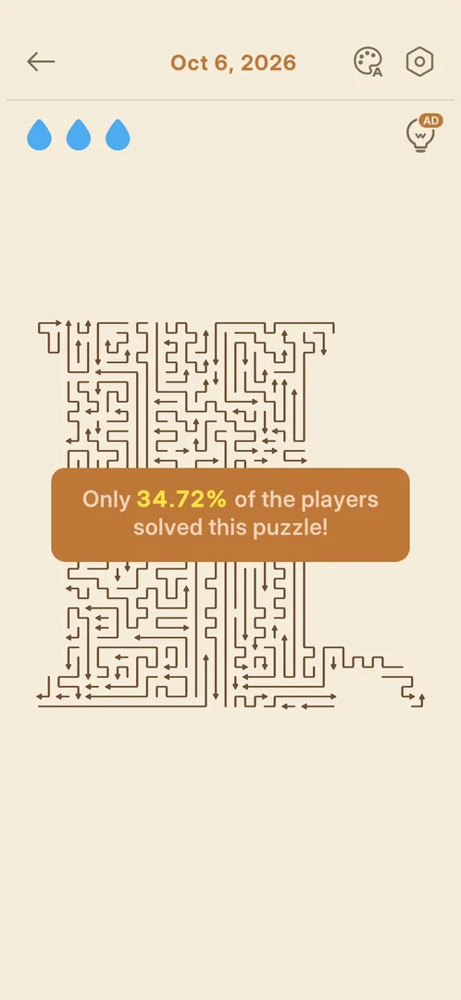
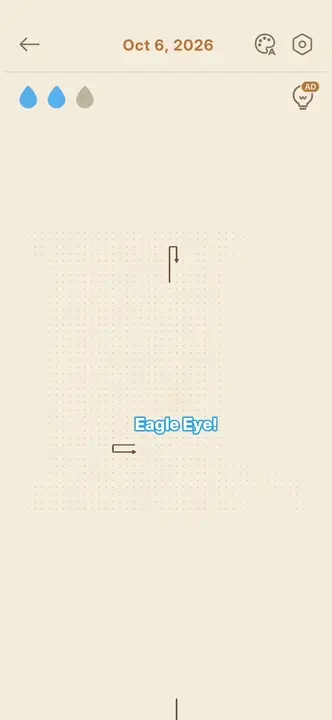
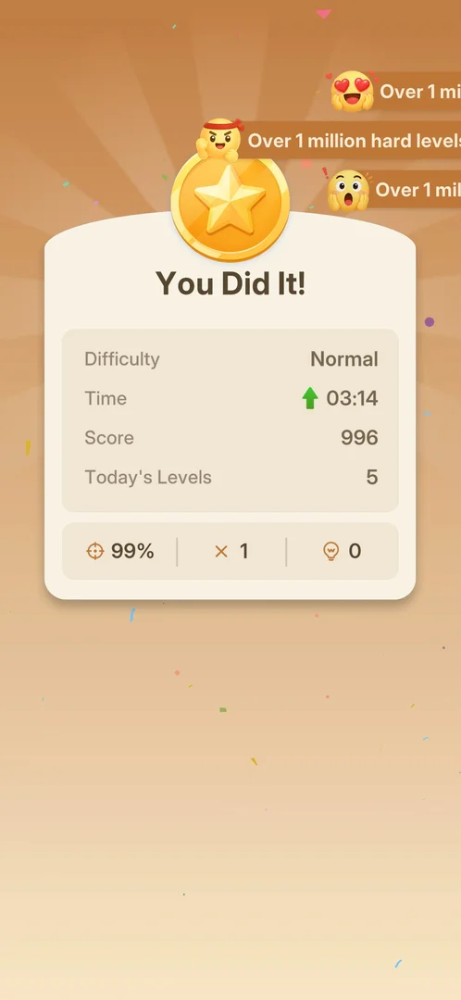
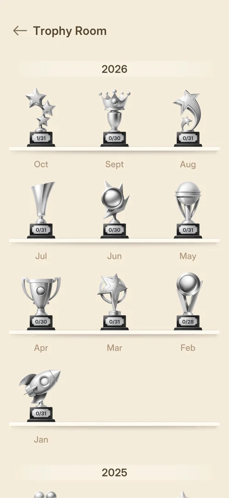
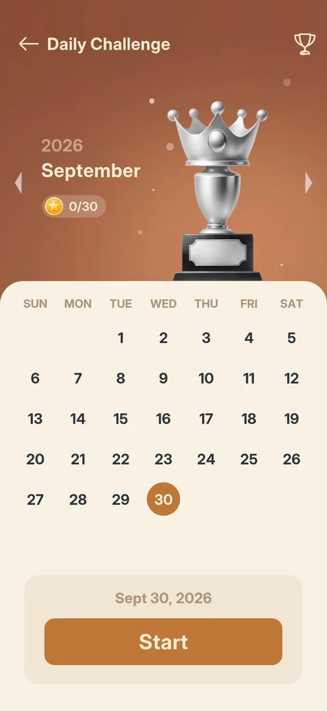
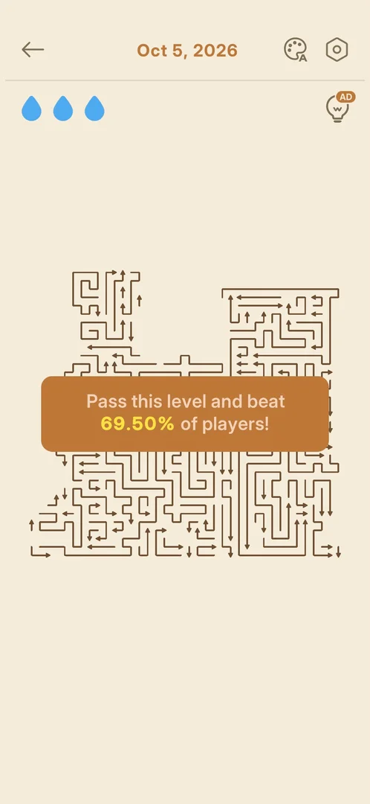
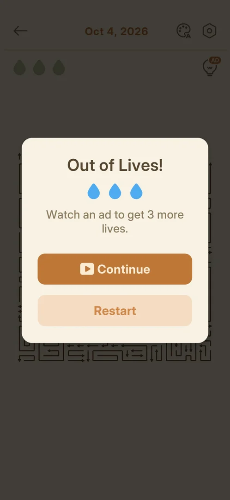
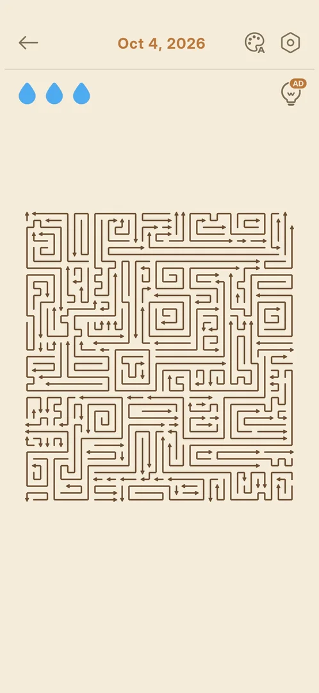
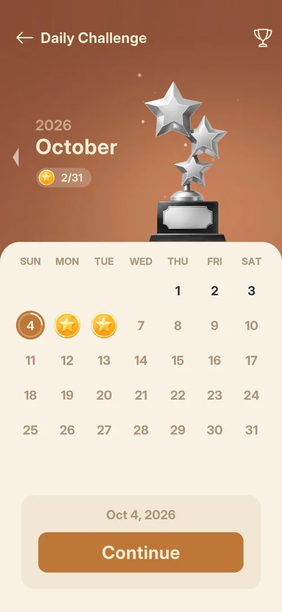
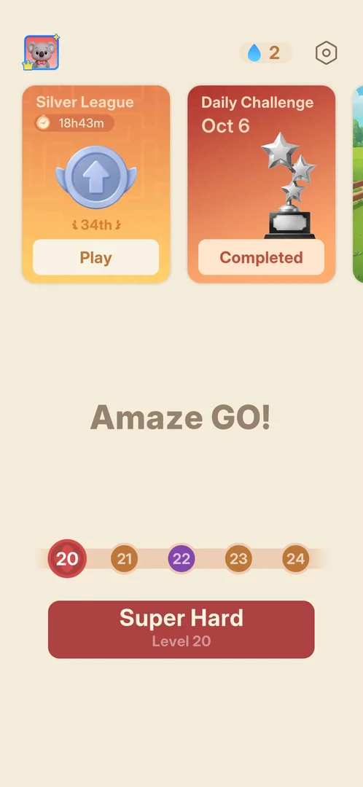

# Daily Challenge

A month calendar of arrows boards, one board per day, opened from a Home carousel card that carries the
current date. A won day gets a Gold Medal on the calendar and adds one to the month's medal counter; all
of a month's medals earn that month's trophy, kept in a Trophy Room. Past days, also of earlier months,
stay playable for free. The card is locked ("Unlock Lv.20") until level 20 is the next level [^s1] [^s14]
[^s16] [^s6] [^s8].

## Why it appeared

The card is on Home from the first launch, locked, with the button "Unlock Lv.20" [^s1]. It opened when
level 20 was reached: on Home after the level 19 win the card had a Start button instead [^s14].

## Where to find it

Home > the carousel at the top > the Daily Challenge card, between the league card and the Event card
> its Start button [^s14] [^s2].

 [^s2]
*Home with level 20 next: Start on the Daily Challenge card, the middle card of the carousel*

Before level 20 the same card shows "Unlock Lv.20" and was the third card when the carousel was swiped
left [^s1] [^s20].

 [^s20]
*Before level 20: the locked card with the date Oct 3 and Unlock Lv.20*

 [^s14]
*The first Home with the card open, after the level 19 win*

## What it looks like

 [^s3]
*The calendar screen before any day was won, 6 October 2026*

The calendar screen [^s15] [^s3]:

- a back arrow with the title "Daily Challenge", and a trophy button at the top right;
- the year and month ("2026", "October") with an arrow to the left of them (and one to the right in an
  earlier month), and a gold medal counter "0/31": the medals won out of the month's days;
- the month's trophy (October: a silver trophy of three stars);
- the month grid (SUN to SAT): the selected day in an orange circle (today on opening), the past days in
  dark figures, the days after today in grey; a won day shows a gold medal in place of its number;
- at the bottom the selected date, "Oct 6, 2026", and a Start button.

## What you can do

| Tab or button | What it does |
|---|---|
| [Welcome intro](#welcome-intro) | two pages on opening the calendar: Gold Medals daily, the Monthly Trophy |
| [Start: today's board](#start-todays-board) | plays the selected day's board; a win gives that day's Gold Medal |
| [Win card](#win-card) | "You Did It!" with the day's difficulty, time and score; Continue goes back to the calendar |
| [Gold Medal on the calendar](#gold-medal-on-the-calendar) | the won day shows a medal, the counter goes up, the selection moves to an unplayed past day |
| [Trophy Room](#trophy-room) | the trophy button: one trophy per month, with its medal counter |
| [A past month](#a-past-month) | a month's trophy in the Trophy Room, or the month arrows: that month's calendar |
| [A past day](#a-past-day) | a dark day of the calendar, then Start: its board, free |
| [Out of Lives](#out-of-lives) | after three blocked taps on a daily board: Continue for an ad, or Restart |
| [An unfinished day](#an-unfinished-day) | a lost, unfinished day keeps no medal; the calendar shows a progress ring and Continue |
| [Completed on Home](#completed-on-home) | after today's board is won the Home card reads "Completed" |
| [Locked card tooltip](#locked-card-tooltip) | before level 20: a tap on the card shows when it unlocks |
| [Card tooltip](#card-tooltip) | with level 20 reached: a tooltip under the card about the number of players |

### Welcome intro

 [^s4]
*Page 1 of 2 of the intro, with Next*

 [^s11]
*Page 2 of 2, with Start*

Start on the card opens a "Welcome to Daily Challenge" popup over the calendar, two pages with a page dot
each: "Complete challenges every day to win Gold Medals!" with Next, then "Collect all Gold Medals this
month to earn the Monthly Trophy." with Start, which closes it to the calendar [^s4] [^s11] [^s15]. It
came on the first opening and again on the second, the next session [^s17].

### Start: today's board

 [^s5]
*Today's board on opening*

Start on the calendar opens the selected day's board at once [^s5]. It is an arrows board as in the main
levels: the header shows the date ("Oct 6, 2026") in place of a level number, with the same palette and
gear buttons, three drops and the hint bulb with its AD badge. The board is a shaped outline, not a
rectangle; the Oct 6 board had 112 arrows on the first reading. A toast at the start reads "Only 34.72% of
the players solved this puzzle!" [^s5] [^s21].

 [^s19]
*Clip 8.2 s · [original on YouTube from 5:26](https://youtu.be/W-r83CA_IdA?t=326)*

### Win card

 [^s12]
*The win card of a past day (Oct 5); the time has a green up arrow*

A won board shows "You Did It!" under a gold star medal, with Difficulty, Time, Score and Today's Levels,
then accuracy, mistakes and hints used [^s16] [^s12]:

- Oct 6: Normal, 04:44, Score 997 (counted up from 966), Today's Levels 4, 99%, 1 mistake, 0 hints
  [^s18] [^s22];
- Oct 5: Normal, 03:14 with a green up arrow, Score 996, Today's Levels 5 [^s12].

Banners slide in at the top ("Players from 40 countries…", "Over 1 million hard levels…") [^s18] [^s12].
No coins, items or other reward are on the card [^s16]. An interstitial ad started by itself about 3 s
after the card, both times; it opened the Play Store by itself after about 35 s, and returning to the
game showed the win card again with its Continue [^s18] [^s23]. Continue
leads back to the calendar [^s16].

### Gold Medal on the calendar

 [^s6]
*After the Oct 6 and Oct 5 wins: two medals, 2/31, Oct 4 selected*

A won day shows a gold medal in place of its number and the counter goes up by one: 0/31 to 1/31 after Oct
6, 2/31 after Oct 5 [^s16] [^s6]. After a win the selection moves to the latest past day not won yet: Oct
5 after the Oct 6 win, Oct 4 after the Oct 5 win, each with Start [^s16] [^s6].

### Trophy Room

 [^s7]
*The Trophy Room after the first win (Oct 1/31)*

The trophy button at the top right of the calendar opens the Trophy Room: under the year (2026, then 2025
below) one trophy per month, each a different shape, on a stand with the month's medals out of its days
(Oct 1/31, Sept 0/30, Feb 0/28). All were silver, none earned [^s7].

### A past month

 [^s8]
*September, opened from its trophy in the Trophy Room*

Tapping a month's trophy opens that month's calendar: September 2026, 0/30, its own trophy (a crown),
every day dark, the last day selected with Start [^s8]. Arrows left and right of the month switch months;
the right arrow led back to October [^s8] [^s24].

### A past day

 [^s9]
*A past day's board on opening*

Start on a past day (Oct 5, played on Oct 6) opened its board at once, with no ad and no cost: a different
shaped board of about 100 arrows, the header "Oct 5, 2026", three drops; its toast read "Pass this level
and beat 69.50% of players!" [^s9] [^s12]. Its win gave the same card and
a full Gold Medal (2/31) [^s12] [^s6].

### Out of Lives

 [^s27]
*The Oct 4 board after the third blocked tap: Continue (an ad) and Restart*

A daily board is lost as a main level is: each tap on a blocked arrow costs one of the three drops; a
second tap on an arrow already shown red cost no drop [^s27]. After the third drop the same
[Out of Lives! popup](level.md#out-of-lives-popup) comes up: three blue drops, "Watch an ad to get 3 more
lives.", Continue with a video icon, and Restart [^s27]. Seen on Oct 4, a past day, played on Oct 6.

 [^s28]
*After Restart and its interstitial: the same Oct 4 board with three drops*

Restart did not reload at once: the screen went black, an interstitial ad played, and it opened the Play
Store by itself; back in the game the same Oct 4 board was there from its start, with three drops
[^s28]. On main levels Restart reloaded the board at once with no ad ([Level](level.md#restart)).
Continue on the daily popup was not tapped.

### An unfinished day

 [^s29]
*Back on the calendar after the loss and Restart: Oct 4 with a progress ring and Continue*

The back arrow on the restarted board led to the calendar. Oct 4 had no medal; a partial ring was drawn
around its number, and the button under the date read "Continue" in place of Start. The counter stayed
2/31 [^s29]. The day stays playable [^s29].

### Completed on Home

 [^s10]
*The Home card after today's board was won*

After today's board is won the Home card's button reads "Completed" in place of Start. The two daily wins
brought no Daily Streak screen, and the drop badge stayed at 2 [^s10].

### Locked card tooltip

 [^s25]
*A tap on the locked card: the tooltip "Unlock Daily Challenge at Level 20" under it*

A tap on the locked card does not open it; a brown tooltip under the card reads "Unlock Daily Challenge
at Level 20" [^s25] [^s13].

### Card tooltip

<!-- no-frame: the tooltip is on the Home frame under Where to find it -->

A brown tooltip under the open card asks "Can you beat N players today?": 73,180 on one return to Home,
63,954 on Home at the start of the next session, both on 6 October (frame under
[Where to find it](#where-to-find-it)) [^s26] [^s2]. What brings it up was
not recorded.

## How it works

Version 1.33.0.

- Locked until level 20; open from the Home that follows the level 19 win [^s25] [^s14].
- The card and the calendar follow the device's date: Oct 3 and Oct 6 on those days [^s1] [^s14].
- One board per day of the month. Today and every past day, back to earlier months and the year before,
  can be played; days after today are grey [^s3] [^s8] [^s7].
- A past day starts free, with no ad, and its win counts as a full Gold Medal [^s9] [^s6].
- Play is that of the main levels: three drops, the AD hint; both boards won were "Normal" difficulty
  [^s5] [^s9] [^s12]. The Oct 4 board was square, the Oct 5 and Oct 6 boards shaped outlines [^s28] [^s9] [^s5].
- A loss: three blocked taps bring the main levels' Out of Lives! popup (Continue for an ad, Restart).
  Restart plays an interstitial, then reloads the same board with three drops. The lost day gets no medal
  and shows a progress ring and Continue on the calendar [^s27] [^s28] [^s29].
- Reward: the day's Gold Medal only; the counter shows medals out of the month's days. All of a month's
  medals give the Monthly Trophy (the intro's text) [^s16] [^s11].
- Daily boards count in "Today's Levels" on the win cards: 4 after the Oct 6 board, 5 after Oct 5, then 6
  after main level 20 [^s16] [^s12].
- An interstitial ad starts by itself about 3 s after each daily win card [^s18].
- The Home league card read 34th before and after the two daily wins [^s2] [^s10]. Inferred: daily wins
  give no league points; not verified.

## Cases

| Case | What was done | Result | Source |
|---|---|---|---|
| Why it appeared <!-- case:chk-appeared --> | Looked at Home from the first launch, then after the level 19 win | ✅ On Home from the first launch, locked "Unlock Lv.20"; open with Start once level 20 was next | [^s1] [^s14] |
| The locked card: date and tooltip <!-- case:card-date --> | Tapped the locked card | ✅ The card shows today's date (Oct 3) and "Unlock Lv.20"; a tap gives the tooltip "Unlock Daily Challenge at Level 20" | [^s13] |
| Where to find it <!-- case:chk-entry --> | Looked at Home after the level 19 win | ✅ The card, between the league card and the Event card, with the date (Oct 6) and Start | [^s14] |
| Its screen <!-- case:chk-screen --> | Tapped Start, went through the intro | ✅ The calendar: 2026 October, gold medals 0/31, the month's trophy, the month grid with today circled, past days dark, future days grey, the date and Start at the bottom, a trophy button top right, a month arrow at the left | [^s15] |
| The intro <!-- case:intro --> | Tapped Start on the card for the first time | ✅ Two pages, Gold Medals every day (Next) and the Monthly Trophy (Start); Start closes to the calendar | [^s11] |
| The intro again <!-- case:intro-repeat --> | Opened the calendar in the next session | ✅ The same two-page intro came again | [^s17] |
| Today's board and what it gives <!-- case:chk-today --> | Started Oct 6 from the calendar and won it | ✅ A shaped board of 112 arrows, the date in the header, 3 drops, AD hint; the win gives the "You Did It!" card and a gold medal on the day (0/31 to 1/31); no coins or other reward | [^s16] |
| The calendar: every day and its reward <!-- case:chk-calendar --> | Won two days, looked at the calendar and the Trophy Room | ✅ One board per day; a won day shows a medal and adds 1 to the counter; the medal is the only reward, and a month's medals earn its trophy | [^s6] |
| A missed day <!-- case:chk-missed --> | Started Oct 5 on Oct 6; opened September | ✅ Not lost: past days of this and earlier months can be played, free; Oct 5 gave a full medal (2/31); after a win the selection moves to the latest unplayed past day | [^s6] |
| A past day <!-- case:past-day --> | Played Oct 5 on Oct 6 | ✅ Free start, a different shaped board, the same win card (Time with a green up arrow), the medal counted | [^s6] |
| Trophy Room <!-- case:trophy-room --> | Tapped the trophy button, then the September trophy | ✅ One trophy per month for 2026 and 2025 with medal counters, silver until earned; a trophy opens its month's calendar | [^s8] |
| The ad after a win <!-- case:win-ad --> | Waited on the win card, both wins | ✅ An interstitial by itself about 3 s after the card; it opened the Play Store after about 35 s; back in the game the win card with Continue | [^s18] |
| Home after today's win <!-- case:home-completed --> | Went back to Home | ✅ The card reads "Completed"; no Daily Streak screen, the drop badge stayed 2 | [^s10] |
| Out of Lives on a past day <!-- case:under-out-of-lives --> | Tapped three blocked arrows on the Oct 4 board on Oct 6, then Restart, then back | ✅ The main levels' Out of Lives! popup (Continue = an ad for 3 lives, Restart); Restart played an interstitial, then the same board with 3 drops; on the calendar Oct 4 had no medal, a progress ring and Continue; 2/31 | [^s27] [^s28] [^s29] |
| The next day: what renews and when <!-- case:chk-next-day --> | — | not verified: the game was not opened on Oct 7 |  |
| Playing a challenge: its win and its loss <!-- case:chk-play --> | Won Oct 6 and the past day Oct 5; lost the past day Oct 4 by three blocked taps, then Restart | ✅ A win gives the gold medal and the You Did It! card, with an interstitial after it. A loss brings the main levels' Out of Lives! popup (Continue = an ad for 3 lives, Restart). Restart plays an interstitial and reloads the same board with 3 drops. The day keeps no medal and shows a progress ring and Continue on the calendar | [^s16] [^s27] [^s28] [^s29] |

## Not verified

- The next day: whether a new board and the Home card's date come at midnight, and whether the medals stay <!-- case:chk-next-day -->
- Continue for an ad on a daily Out of Lives! popup (not tapped), and whether an unfinished day's progress survives Continue on the calendar
- Tapping a day that already has a medal: can it be replayed
- Whether daily wins give league points (the league card stayed 34th)
- What the Monthly Trophy gives

[^s1]: session 20261003-200141-chrono-2FYKPJ, step 3 — [video at 1:11](https://youtu.be/l44HK-PZ5-o?t=71)
[^s2]: session 20261006-064018-chrono-2FYKPJ, step 0 — [video at 0:00](https://youtu.be/W-r83CA_IdA?t=0)
[^s3]: session 20261006-064018-chrono-2FYKPJ, step 3 — [video at 0:30](https://youtu.be/W-r83CA_IdA?t=30)
[^s4]: session 20261006-041006-chrono-2FYKPJ, step 130 — [video at 20:51](https://youtu.be/cXWwykdpuIE?t=1251)
[^s5]: session 20261006-064018-chrono-2FYKPJ, step 4 — [video at 0:41](https://youtu.be/W-r83CA_IdA?t=41)
[^s6]: session 20261006-064018-chrono-2FYKPJ, step 82 — [video at 13:01](https://youtu.be/W-r83CA_IdA?t=781)
[^s7]: session 20261006-064018-chrono-2FYKPJ, step 42 — [video at 7:33](https://youtu.be/W-r83CA_IdA?t=453)
[^s8]: session 20261006-064018-chrono-2FYKPJ, step 43 — [video at 7:46](https://youtu.be/W-r83CA_IdA?t=466)
[^s9]: session 20261006-064018-chrono-2FYKPJ, step 45 — [video at 8:10](https://youtu.be/W-r83CA_IdA?t=490)
[^s10]: session 20261006-064018-chrono-2FYKPJ, step 83 — [video at 13:36](https://youtu.be/W-r83CA_IdA?t=816)
[^s11]: session 20261006-041006-chrono-2FYKPJ, step 131 — [video at 21:07](https://youtu.be/cXWwykdpuIE?t=1267)
[^s12]: session 20261006-064018-chrono-2FYKPJ, step 79 — [video at 11:32](https://youtu.be/W-r83CA_IdA?t=692)
[^s13]: session 20261003-232357-chrono-2FYKPJ, step 4 — [video at 0:42](https://youtu.be/x9mSZuHgO_4?t=42)
[^s14]: session 20261006-041006-chrono-2FYKPJ, step 127 — [video at 19:24](https://youtu.be/cXWwykdpuIE?t=1164)
[^s15]: session 20261006-041006-chrono-2FYKPJ, step 132 — [video at 21:18](https://youtu.be/cXWwykdpuIE?t=1278)
[^s16]: session 20261006-064018-chrono-2FYKPJ, step 41 — [video at 7:18](https://youtu.be/W-r83CA_IdA?t=438)
[^s17]: session 20261006-064018-chrono-2FYKPJ, step 1 — [video at 0:12](https://youtu.be/W-r83CA_IdA?t=12)
[^s18]: session 20261006-064018-chrono-2FYKPJ, step 39 — [video at 5:34](https://youtu.be/W-r83CA_IdA?t=334)
[^s19]: session 20261006-064018-chrono-2FYKPJ, step 38 — [video at 5:29](https://youtu.be/W-r83CA_IdA?t=329)

[^s20]: session 20261003-200141-chrono-2FYKPJ, step 4 — [video at 1:21](https://youtu.be/l44HK-PZ5-o?t=81)
[^s21]: session 20261006-064018-chrono-2FYKPJ, step 5 — [video at 1:26](https://youtu.be/W-r83CA_IdA?t=86)
[^s22]: session 20261006-064018-chrono-2FYKPJ, step 40 — [video at 7:07](https://youtu.be/W-r83CA_IdA?t=427)
[^s23]: session 20261006-064018-chrono-2FYKPJ, step 80 — [video at 12:11](https://youtu.be/W-r83CA_IdA?t=731)
[^s24]: session 20261006-064018-chrono-2FYKPJ, step 44 — [video at 8:00](https://youtu.be/W-r83CA_IdA?t=480)
[^s25]: session 20261003-232357-chrono-2FYKPJ, step 3 — [video at 0:39](https://youtu.be/x9mSZuHgO_4?t=39)
[^s26]: session 20261006-041006-chrono-2FYKPJ, step 129 — [video at 20:38](https://youtu.be/cXWwykdpuIE?t=1238)
[^s27]: session 20261006-114946-chrono-2FYKPJ, step 38 — [video at 9:18](https://youtu.be/eUlwkqa6B6w?t=558)
[^s28]: session 20261006-114946-chrono-2FYKPJ, step 40 — [video at 11:04](https://youtu.be/eUlwkqa6B6w?t=664)
[^s29]: session 20261006-114946-chrono-2FYKPJ, step 41 — [video at 11:21](https://youtu.be/eUlwkqa6B6w?t=681)
