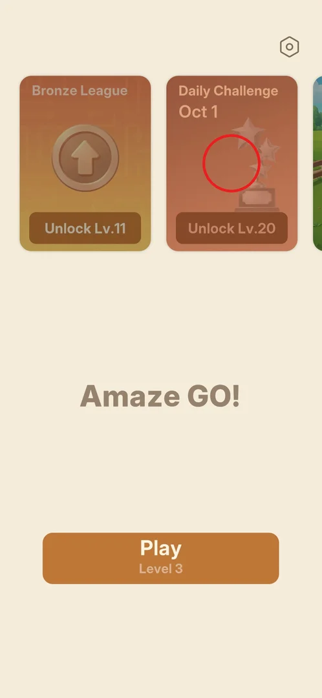

# Daily Challenge

A puzzle of the day, shown on the main menu as a card with today's date ("Oct 1") and a trophy. It opens
at level 20; in this session the player was at level 3, so only the locked card was seen [^s1].

## Where to find it

From the [main menu](main-menu.md): the second card of the card row, "Daily Challenge" [^s1].

 [^s1]

## What it looks like

<!-- no-screen: the mode is locked until level 20; the session ended at level 3 -->

Only the card was seen: a dimmed terracotta card titled "Daily Challenge" with the date "Oct 1", a
trophy with three stars, and the label "Unlock Lv.20" [^s1].

## How it works

- Unlocks at level 20 (version 1.31.0) [^s1].
- The card shows the current date, so the challenge is likely one per day (inferred) [^s1].

## Cases

| Case | What was done | Result | Source |
|---|---|---|---|
| Open the daily challenge | <!-- --> | not verified |  |

## Not verified

- What the challenge screen shows: a calendar, the puzzle, rewards for a streak.
- What tapping the locked card shows (not tapped).

[^s1]: session 20261001-204000-chrono-2FYKPJ, step 10 — [video at 2:29](https://youtu.be/tbyupdD9iso?t=149)
