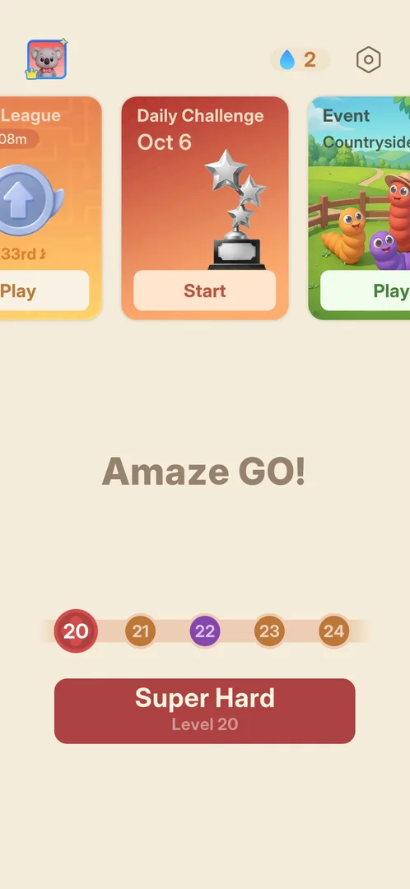
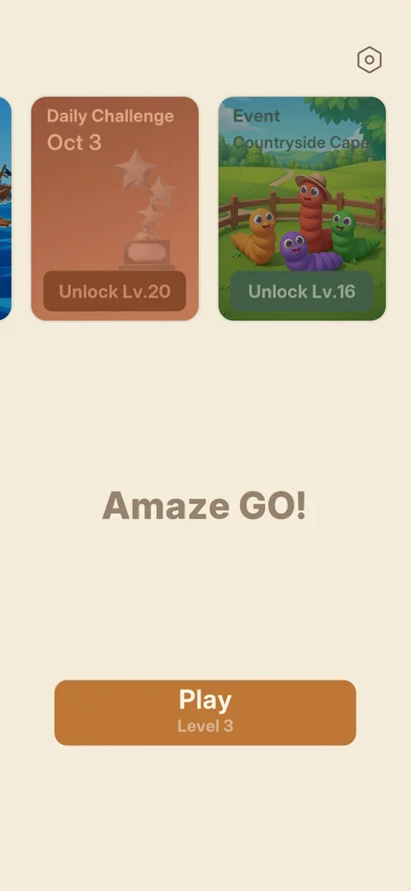
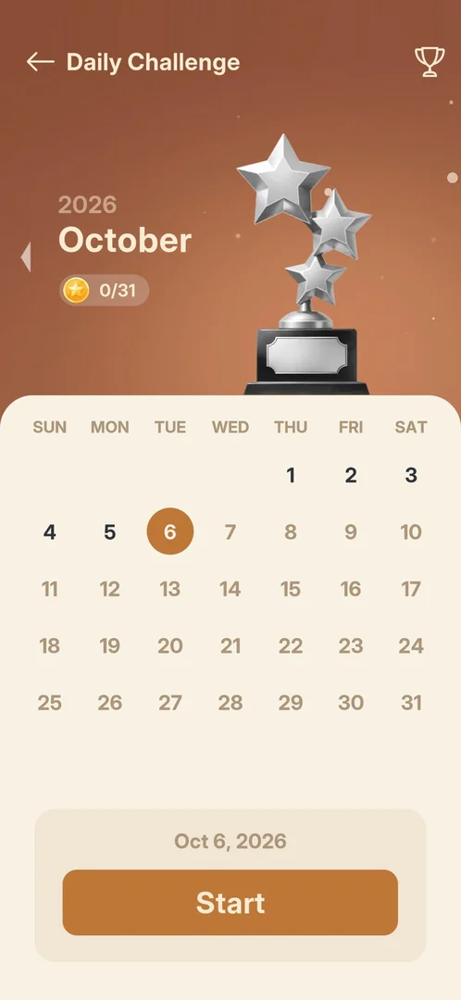
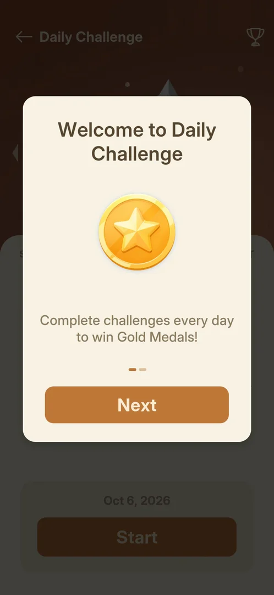
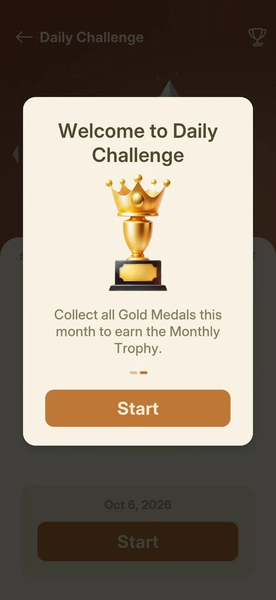
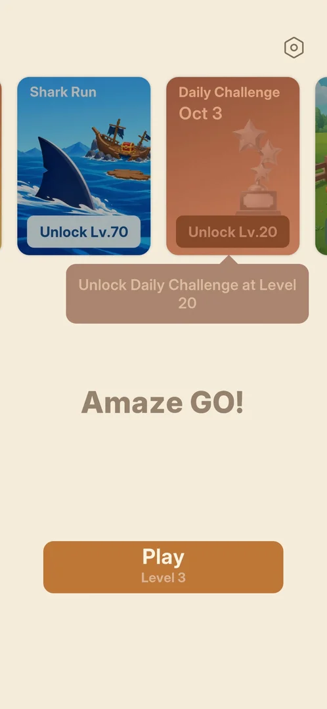

# Daily Challenge

A daily feature on a Home carousel card that carries the current date. It opens a month calendar: one
challenge a day, each won for a Gold Medal, and a Monthly Trophy for collecting all of the month's Gold
Medals. The card is locked ("Unlock Lv.20") until level 20 is the next level [^s1] [^s4] [^s6] [^s7]
[^s5]. A day's challenge was not played yet.

## Why it appeared

The card is on Home from the first launch, locked, with the button "Unlock Lv.20" [^s1]. It opened when
level 20 was reached: on Home after the level 19 win the card had a Start button instead [^s4].

## Where to find it

Home > the carousel at the top > the Daily Challenge card, between the league card and the Event card
> its Start button [^s4].

 [^s4]
*Home with level 20 next: Start on the Daily Challenge card, the middle card of the carousel*

Before level 20 the same card shows "Unlock Lv.20" and was the third card when the carousel was swiped
left [^s2] [^s1].

 [^s1]
*Before level 20: the locked card with the date Oct 3 and Unlock Lv.20*

## What it looks like

 [^s5]
*The calendar screen on the first visit, 6 October 2026*

The calendar screen [^s5]:

- a back arrow with the title "Daily Challenge", and a trophy button at the top right;
- the year and month ("2026", "October") with an arrow to the left of them, and a gold medal counter
  "0/31": the medals won out of the month's days;
- a silver trophy of three stars;
- the month grid (SUN to SAT): today (6) in an orange circle, the past days 1 to 5 in dark figures, the
  days 7 to 31 in grey;
- at the bottom the selected date, "Oct 6, 2026", and a Start button.

Inferred from the colours: the dark past days can still be played and the grey future days cannot; not
verified. The trophy button, the month arrow and Start were not tapped.

## What you can do

| Tab or button | What it does |
|---|---|
| [Welcome intro](#welcome-intro) | two pages on the first opening: Gold Medals daily, the Monthly Trophy; Start closes it to the calendar |
| [Locked card tooltip](#locked-card-tooltip) | before level 20: a tap on the card shows when it unlocks |
| [Card tooltip](#card-tooltip) | with level 20 reached: a tooltip under the card about the number of players |

The calendar's Start (the selected day's challenge), its trophy button and its month arrow were not tapped.

### Welcome intro

 [^s6]
*Page 1 of 2 of the intro, with Next*

 [^s7]
*Page 2 of 2, with Start*

The first Start on the card opened a "Welcome to Daily Challenge" popup over the calendar, two pages with
a page dot each: "Complete challenges every day to win Gold Medals!" with Next, then "Collect all Gold
Medals this month to earn the Monthly Trophy." with Start. Start closed the popup to the calendar
[^s6] [^s7] [^s5].

### Locked card tooltip

 [^s3]
*A tap on the locked card: the tooltip "Unlock Daily Challenge at Level 20" under it*

A tap on the locked card does not open it; a brown tooltip under the card reads "Unlock Daily Challenge
at Level 20" [^s3].

### Card tooltip

 [^s8]
*The tooltip under the open card on the return to Home*

Back on Home after the calendar was left and level 20 quit, a brown tooltip under the open card read "Can
you beat 73,180 players today?" [^s8]. What brings it up was not recorded.

## How it works

Version 1.33.0.

- Locked until level 20; open from the Home that follows the level 19 win [^s3] [^s4].
- The card shows the device's date: Oct 3 and Oct 6 on those days [^s1] [^s4].
- One Gold Medal per day's challenge; all of a month's Gold Medals give the Monthly Trophy (the intro's
  text) [^s6] [^s7]. The counter reads medals out of the month's days, 0/31 for October [^s5].
- What a challenge is (a board, its size, its rules) and what a Gold Medal or the trophy gives were not seen.

## Cases

| Case | What was done | Result | Source |
|---|---|---|---|
| Why it appeared <!-- case:chk-appeared --> | Looked at Home from the first launch, then after the level 19 win | ✅ On Home from the first launch, locked "Unlock Lv.20"; open with Start once level 20 was next | [^s1] [^s4] |
| The locked card: date and tooltip <!-- case:card-date --> | Tapped the locked card | ✅ The card shows today's date (Oct 3) and "Unlock Lv.20"; a tap gives the tooltip "Unlock Daily Challenge at Level 20" | [^s3] |
| Where to find it <!-- case:chk-entry --> | Looked at Home after the level 19 win | ✅ The card, between the league card and the Event card, with the date (Oct 6) and Start | [^s4] |
| Its screen <!-- case:chk-screen --> | Tapped Start, went through the intro | ✅ The calendar: 2026 October, gold medals 0/31, trophy art, month grid with today circled, past days dark, future days grey, the date and Start at the bottom, a trophy button top right, a month arrow at the left | [^s5] |
| The intro <!-- case:intro --> | Tapped Start on the card for the first time | ✅ Two pages, Gold Medals every day (Next) and the Monthly Trophy (Start); Start closes to the calendar | [^s6] [^s7] |
| Today's challenge: what it gives <!-- case:chk-today --> | — | not verified: Start on the calendar not tapped |  |
| The calendar: every day and its reward <!-- case:chk-calendar --> | — | not verified: no day tapped |  |
| The next day: what renews and when <!-- case:chk-next-day --> | — | not verified |  |
| A missed day: what is lost or reset <!-- case:chk-missed --> | — | not verified: whether the dark past days 1 to 5 can be played |  |
| Playing a challenge: its win and its loss <!-- case:chk-play --> | — | not verified |  |

## Not verified

- Today's challenge and what it gives: a Gold Medal, anything else <!-- case:chk-today -->
- The calendar: tapping a past day, the trophy button, the month arrow <!-- case:chk-calendar -->
- The next day: what renews and when <!-- case:chk-next-day -->
- A missed day: whether past days can still be played, and at what cost <!-- case:chk-missed -->
- Playing a challenge: the board, its win and its loss <!-- case:chk-play -->
- What the Monthly Trophy gives

[^s1]: session 20261003-200141-chrono-2FYKPJ, step 4 — [video at 1:21](https://youtu.be/l44HK-PZ5-o?t=81)
[^s2]: session 20261003-200141-chrono-2FYKPJ, step 3 — [video at 1:11](https://youtu.be/l44HK-PZ5-o?t=71)
[^s3]: session 20261003-232357-chrono-2FYKPJ, step 3 — [video at 0:39](https://youtu.be/x9mSZuHgO_4?t=39)
[^s4]: session 20261006-041006-chrono-2FYKPJ, step 127 — [video at 18:46](https://youtu.be/cXWwykdpuIE?t=1126)
[^s5]: session 20261006-041006-chrono-2FYKPJ, step 132 — [video at 20:40](https://youtu.be/cXWwykdpuIE?t=1240)
[^s6]: session 20261006-041006-chrono-2FYKPJ, step 130 — [video at 20:13](https://youtu.be/cXWwykdpuIE?t=1213)
[^s7]: session 20261006-041006-chrono-2FYKPJ, step 131 — [video at 20:29](https://youtu.be/cXWwykdpuIE?t=1229)
[^s8]: session 20261006-041006-chrono-2FYKPJ, step 129 — [video at 20:00](https://youtu.be/cXWwykdpuIE?t=1200)
