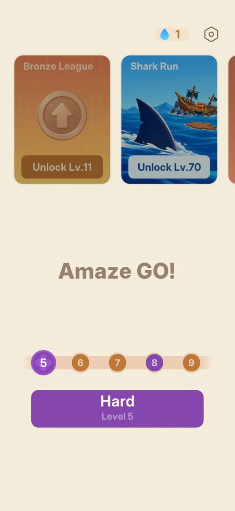
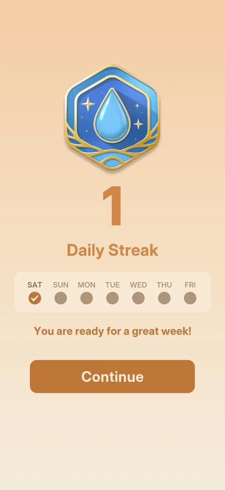
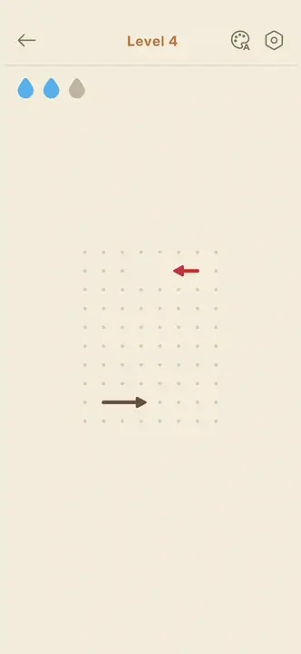
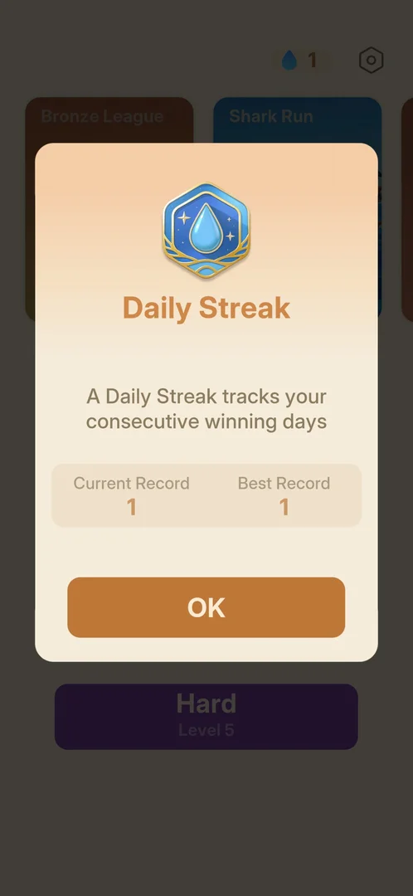
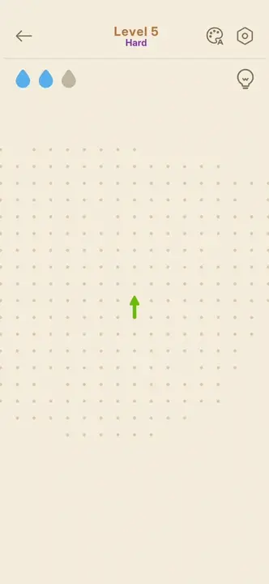
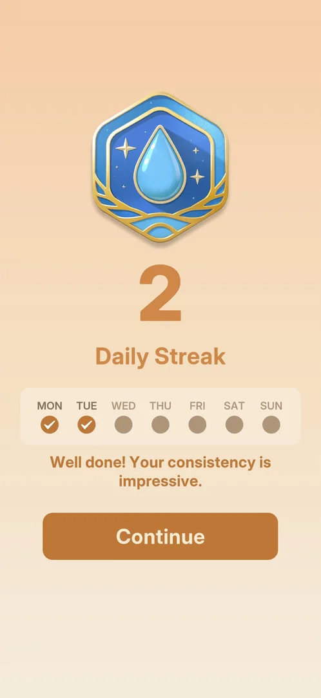

# Daily Streak

A count of days on which the player won a level. A full screen shows it after a level is won: a blue
drop medal, the number of days, the word "Daily Streak", a row with the seven days of the week, and a
Continue button. After that, Home shows the count as a drop badge next to the gear, and a tap on the
badge opens a Daily Streak popup with the current and the best streak [^s1] [^s2] [^s6]. Days 1 to 3
were seen: on day 2 the count went to 2 after the day's first win [^s9]. On day 3 (Monday) Home showed 0
before the first win, and the screen after it showed 1 with a new week row starting at MON
[^s14] [^s15].

## Why it appeared

It came up on its own after the last arrow of level 4 left the board, before level 4's win card [^s1].
It did not come up after level 3, the session's first win, which showed "Today's Levels 1" and went
straight to level 4 [^s3]. Level 4's win card showed "Today's Levels 2" [^s4]. So on day 1 the screen
came after the second win of the day, not the first.

On day 2 (Sunday, a session started just after midnight) it came after the first win of the day: Hard
level 5, whose win card showed "Today's Levels 1" [^s9] [^s10].
On day 3 (Monday 2026-10-05) it came after the first win of the day again: Hard level 5, replayed,
whose win card showed "Today's Levels 1" [^s15] [^s16].
Hypothesis: the screen comes on the first win of each day from level 4 on (on day 1 level 3 was too
early). Not verified.

## Where to find it

The full Daily Streak screen opens by itself, between the end of a won level and that level's win card
[^s1]. After it has appeared, Home shows the count in a drop badge left of the gear (see
[Home screen](home.md)) [^s2]. A tap on that badge opens the Daily Streak popup [^s6].

 [^s5]
*Home: the drop badge with the streak count "1", left of the gear*

## What it looks like

 [^s1]
*The Daily Streak screen on day 1: SAT checked, Continue at the bottom*

From top to bottom, on a peach background [^s1]:

- a hexagonal blue-and-gold medal with a water drop;
- the count, a large "1";
- the title "Daily Streak";
- a row of the seven days, starting from the current day: SAT, SUN, MON, TUE, WED, THU, FRI. Today's
  dot is orange with a check mark and the other six are grey;
- the line "You are ready for a great week!";
- a brown Continue button, which leads to the level's win card [^s4].

The screen builds up in motion. The medal comes in large and shrinks to the top, then the number, the
title and the week row appear, the SAT dot fills and gets its check, and Continue appears last:

 [^s1]
*Clip 5.4 s · [original on YouTube from 2:50](https://youtu.be/x9mSZuHgO_4?t=170)*

### Daily Streak popup

 [^s6]
*The popup the Home drop badge opens: Current Record 1, Best Record 1, OK*

A popup over the dimmed Home, from top to bottom [^s6]:

- the same blue-and-gold drop medal and the title "Daily Streak";
- one line saying that the streak tracks consecutive winning days;
- a box with two numbers: Current Record 1 and Best Record 1;
- a brown OK button, which closes the popup back to Home [^s7].

It shows no week row, no calendar and no reward [^s6].

### Day 2

 [^s9]
*Day 2, after the day's first win (Hard level 5): SAT and SUN checked*

The same screen as on day 1, with three differences [^s9]:

- the count is "2";
- SUN is checked as well as SAT, and the other five days are still grey;
- the line under the week row reads "Well done! Your consistency is impressive." instead of the day 1 line.

No reward was shown on it, and Continue led to the level's win card [^s10]. The clip shows the
last arrow of level 5 leaving the board (two drops left after one mistake), then the screen building
up: the medal shrinks to the top, the week row comes in and the SUN dot fills and gets its check:

 [^s11]
*Clip 9.3 s · [original on YouTube from 13:43](https://youtu.be/Utiq9YFZiRU?t=823)*

### Day 3: a new streak

 [^s15]
*Day 3 (Monday), after the day's first win: the count back at 1, a new row from MON to SUN*

The same screen as on day 1, with the count "1" and the line "You are ready for a great week!". The week
row now runs MON, TUE, WED, THU, FRI, SAT, SUN, with only MON checked [^s15]. Before the win, the
Home badge read "0" (see [Home badge at 0](#home-badge-at-0)).

### Home badge at 0

 [^s14]
*Home on Monday before the day's win: the drop badge left of the gear, grey with "0"*

On day 3, at the start of the session and before any win, the Home badge was a grey drop with "0" (on
day 2 at the same point it was a grey drop with "1"). Home offered Hard level 5 again, the level won on
day 2 [^s14] [^s12]. The badge was not tapped on day 3.

### Day 4: after an event win

 [^s17]
*Day 4 (Tuesday), after a won event level: the count 2, MON and TUE checked*

On Tuesday 2026-10-06 the day's first win was a level of the [Countryside Capers](countryside-capers.md)
event, not a main level. The Daily Streak screen came after it, before the event's own win card: "2",
MON and TUE checked, "Well done! Your consistency is impressive." [^s17]. A won event level counts for the
streak.

## What you can do

| Tab or button | What it does |
|---|---|
| [Daily Streak popup](#daily-streak-popup) | Opened by the drop badge on Home; shows the current and best streak; OK closes it [^s6] [^s7] |
| [Home badge at 0](#home-badge-at-0) | The drop badge on Home, grey with "0" before the day-3 win [^s14] |
| [Day 4: after an event win](#day-4-after-an-event-win) | The screen after a won event level: event wins count [^s17] |

The full screen after a win has only Continue, which goes on to the level's win card [^s4].

## How it works

Version 1.33.0, days 1 to 4 (2026-10-03 to 2026-10-06).

- The week row starts at the day the streak began (Saturday on the session day, 2026-10-03), not on
  Monday [^s1].
- After Continue, the level's win card shows as usual: "Perfect!", Today's Levels 2 [^s4].
- Home then shows a drop badge with "1" left of the gear [^s2]. The badge was still "1" in the next
  session the same day [^s5].
- On day 2, before the day's first win, the Home badge still showed "1", but the drop and the number
  were grey instead of blue and orange [^s12]. Inferred: grey means today's win is still missing.
- The day's first win on day 2 raised the count to 2 and checked SUN in the week row [^s9].
- The popup keeps two numbers: the current streak and the best one (both 1 on day 1) [^s6].
- No reward was shown for day 1, neither on the full screen nor in the popup, nor for day 2 on the full
  screen [^s1] [^s6] [^s9].
- The popup says the streak counts consecutive winning days [^s6].
- On day 3 the Home badge read "0" before the day's win, and the win started a new count at 1 with the
  week row from MON [^s14] [^s15]. Day 2's win (Hard level 5) was not kept by the game: on day 3
  Home offered Hard level 5 again [^s14]. Inferred: the streak broke because the game did not record
  day 2's win, or the week row restarts on Monday; which of the two is not verified.

- On day 4 (Tuesday) the streak went from 1 to 2 with a won event level, and the row from MON kept MON
  checked [^s17]: the Monday streak went on, and event wins count.

## Cases

| Case | What was done | Result | Source |
|---|---|---|---|
| Why it appeared <!-- case:chk-appeared --> | Won level 3, then level 4 | ✅ Came up after level 4's last move, before its win card. Not after level 3, the first win of the day | [^s1] [^s3] |
| Its screen <!-- case:chk-screen --> | Looked at it, then Continue | ✅ Drop medal, streak number, "Daily Streak", week row SAT..FRI with today checked, "You are ready for a great week!", Continue. It comes before the win card | [^s1] |
| The counter <!-- case:chk-counter --> | Back on Home after level 5 | ✅ A drop badge with "1" left of the gear | [^s2] |
| Quit under Daily Streak <!-- case:under-quit --> | Quit level 5 with the back arrow after the streak reached 1 | ✅ As the base: no confirmation or warning, Home badge stays 1 | [^s2] |
| Where to find it <!-- case:chk-entry --> | Tapped the drop badge left of the gear on Home | ✅ The full screen opens by itself after a win; the Home badge opens the Daily Streak popup (Current Record 1, Best Record 1, OK) | [^s5] [^s6] |
| The streak on day 2 <!-- case:day-2 --> | Won Hard level 5, the first win on the next day | ✅ The screen came before the win card with "2", SAT and SUN checked, "Well done! Your consistency is impressive." | [^s9] |
| The reward for each step <!-- case:chk-rewards --> | — | not verified: no reward shown on day 1 or day 2 | [^s6] [^s9] |
| What shows during a level <!-- case:chk-in-level --> | Looked at the level's top bar with the streak running | ✅ Nothing: the top bar shows back, title, palette, gear, drops and (on Hard) the hint bulb, no streak count | [^s8] [^s13] |
| What breaks it <!-- case:chk-break --> | Opened Home on day 3, then won Hard level 5 | partly: the badge showed 0 and the win started a new count of 1 from MON; the game had not kept day 2's win, so the cause (a lost win or a Monday reset) is not known | [^s14] [^s15] |
| The streak on day 3 <!-- case:day-3 --> | Won Hard level 5 (replayed), the first win on Monday | ✅ The screen came before the win card with "1", a week row MON to SUN with MON checked, "You are ready for a great week!" | [^s15] |
| An event level win <!-- case:event-win-counts --> | Won Countryside Caper level 1, the first win on Tuesday | ✅ The screen came before the event win card: "2", MON and TUE checked | [^s17] |
| Offers to keep it after a break <!-- case:chk-save --> | — | not verified | |
| Win under Daily Streak <!-- case:under-win --> | Won level 5 on day 2 with the streak at 1 | ✅ Differs from the base: the Daily Streak screen (count 2) comes between the last move and the win card; the win card itself is as usual for the level | [^s9] [^s10] |
| Restart under Daily Streak <!-- case:under-restart --> | — | not verified | |
| Exit the app under Daily Streak <!-- case:under-exit-app --> | — | not verified | |
| Restart from the gear popup under Daily Streak <!-- case:under-restart-gear --> | — | not verified | |

## Not verified

- The reward for each day of the streak: none on days 1 and 2; later days and day 7 not seen (exp-streak-next-day) <!-- case:chk-rewards -->
- What breaks it (a loss, a quit, a missed day) and what the break costs; whether the reset to 1 on Monday
  2026-10-05 was a break (day 2's win was not kept) or a weekly reset <!-- case:chk-break -->
- Offers to keep it after a break and their price <!-- case:chk-save -->
- Restart under Daily Streak: as the base, or what differs <!-- case:under-restart -->
- Exit the app under Daily Streak: as the base, or what differs <!-- case:under-exit-app -->
- Restart from the in-level gear popup under Daily Streak (on Hard level 15 it brought a full-screen ad first): as the base, or what differs <!-- case:under-restart-gear -->
- Out of lives under Daily Streak (all three drops spent): as the base, or what differs <!-- case:under-out-of-lives -->
- What starts it: the first win of a day from level 4 on (hypothesis above)

[^s1]: session 20261003-232357-chrono-2FYKPJ, step 16 — [video at 2:55](https://youtu.be/x9mSZuHgO_4?t=175)
[^s2]: session 20261003-232357-chrono-2FYKPJ, step 21 — [video at 3:56](https://youtu.be/x9mSZuHgO_4?t=236)
[^s3]: session 20261003-232357-chrono-2FYKPJ, step 11 — [video at 1:41](https://youtu.be/x9mSZuHgO_4?t=101)
[^s4]: session 20261003-232357-chrono-2FYKPJ, step 17 — [video at 3:08](https://youtu.be/x9mSZuHgO_4?t=188)
[^s5]: session 20261003-233532-chrono-2FYKPJ, step 8 — [video at 1:16](https://youtu.be/RNRDUiKRry4?t=76)
[^s6]: session 20261003-233532-chrono-2FYKPJ, step 9 — [video at 1:23](https://youtu.be/RNRDUiKRry4?t=83)
[^s7]: session 20261003-233532-chrono-2FYKPJ, step 10 — [video at 1:31](https://youtu.be/RNRDUiKRry4?t=91)
[^s8]: session 20261003-233532-chrono-2FYKPJ, step 1 — [video at 0:17](https://youtu.be/RNRDUiKRry4?t=17)

[^s9]: session 20261004-001551-chrono-2FYKPJ, step 109 — [video at 13:52](https://youtu.be/Utiq9YFZiRU?t=832)
[^s10]: session 20261004-001551-chrono-2FYKPJ, step 110 — [video at 14:08](https://youtu.be/Utiq9YFZiRU?t=848)
[^s11]: session 20261004-001551-chrono-2FYKPJ, step 108 — [video at 13:47](https://youtu.be/Utiq9YFZiRU?t=827)
[^s12]: session 20261004-001551-chrono-2FYKPJ, step 0 — [video at 0:00](https://youtu.be/Utiq9YFZiRU?t=0)
[^s13]: session 20261004-001551-chrono-2FYKPJ, step 1 — [video at 0:13](https://youtu.be/Utiq9YFZiRU?t=13)

[^s14]: session 20261005-010045-chrono-2FYKPJ, step 0 — [video at 0:00](https://youtu.be/x_UvTQLpmEQ?t=0)
[^s15]: session 20261005-010045-chrono-2FYKPJ, step 91 — [video at 13:55](https://youtu.be/x_UvTQLpmEQ?t=835)
[^s16]: session 20261005-010045-chrono-2FYKPJ, step 92 — [video at 14:14](https://youtu.be/x_UvTQLpmEQ?t=854)

[^s17]: session 20261006-013740-chrono-2FYKPJ, step 29 — [video at 7:38](https://youtu.be/O4n16Ei5uiU?t=458)
