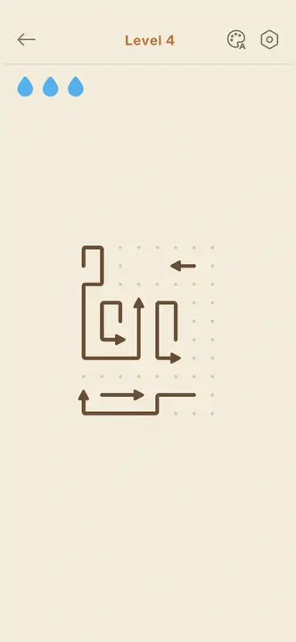
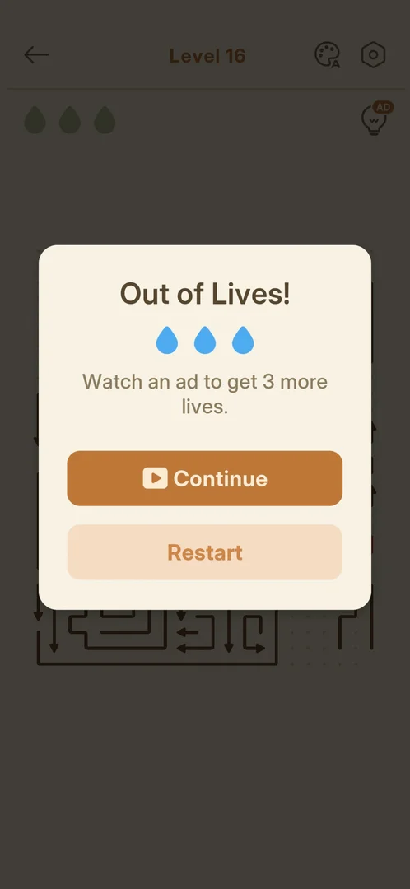

# Drops (mistake allowance in the level HUD)

Three blue water drops at the top left of every level, below the back arrow. A tap on an arrow that
cannot leave the board costs one drop. The drop greys out, and the win card counts the tap as a mistake
[^s2] [^s5] [^s4]. When the third drop is gone, an "Out of Lives!" popup offers three more drops
(Continue) or a Restart. The first Continue of the session was free; the next one asked for an ad
[^s11] [^s12].

## Why it appeared

There are three blue drops at the top left of the level HUD on level 3, the first level opened on this
install [^s1]. They were on levels 4 and 5 (Hard) too [^s5] [^s6].

## Where to find it

In any level: the three drops at the top left, under the back arrow [^s2]. They are not a button: two
taps on them on level 5 opened nothing [^s8].

 [^s2]
*Level 3: three blue drops at the top left, all full*

## What it looks like

 [^s3]
*Level 4 after one blocked tap: two blue drops and a grey one; the arrow that was blocked is red*

Full drops are blue. A spent drop turns grey-beige and stays in its place, the rightmost first [^s3]. The
arrow that was tapped while blocked flashes red, stays on the board, and stays red afterwards [^s3] [^s5].

The drops take the colour of the level theme chosen in the [Theme picker](theme-picker.md): light blue
in the default cream theme, teal in Eye Comfort Mode, bright blue in Dark Mode [^s9] [^s10].

 [^s5]
*Clip 6.2 s · [original on YouTube from 2:25](https://youtu.be/x9mSZuHgO_4?t=145)*

### Out of Lives popup

 [^s12]
*Level 16, the second Out of Lives of the session: Continue now shows a video icon instead of the green Free badge*

The popup comes up over the dimmed board when the third drop is spent. It shows three blue drops, a line
of text, an orange Continue button and a pale Restart button, and no X. On Normal level 14, the first
Out of Lives of the session, the line read "Continue for free with 3 more lives." and Continue carried a
green "Free" badge. On Normal level 16, about 13 minutes later, it read "Watch an ad to get 3 more
lives." and Continue carried a video icon [^s13] [^s12]. More on the popup on the
[Level](level.md#out-of-lives-popup) page.

## How it works

Version 1.33.0.

- Each level starts with three drops, Hard level 5 too [^s2] [^s6].
- A tap on the drops does nothing: no popup or explanation [^s8].
- One blocked tap costs one drop [^s5].
- The spent drop stayed grey to the end of level 4 [^s3], and the mistake shows on the win card [^s4]:

| Mistakes | Title | Accuracy | Source |
|---|---|---|---|
| 0 (level 3) | Flawless! | 100% | [^s7] |
| 1 (level 4) | Perfect! | 87% | [^s4] |
| 4 (level 14, three spent, a free Continue, one more) | Comeback Win! (2 of 3 stars) | 92% | [^s14] |

- Quitting with the back arrow with full drops cost nothing seen [^s1].
- Losing all three drops brings the Out of Lives! popup, on a Normal level as on a Hard one
  [^s13] [^s12].
- Continue gives three full drops and keeps the board; the arrows tapped while blocked stay red. The
  spent drops still count as mistakes on the win card: level 14 was won with 4 mistakes after one
  Continue [^s11] [^s14].
- The first Continue of the session (level 14) was Free; the second (level 16, about 13 minutes later)
  asked for an ad. Earlier, on Hard level 5, Continue stayed Free three times in a row [^s13]
  [^s12]. Hypothesis: one free Continue per session or per day, not verified (exp-continue-free-once).
- Restart on the ad version of the popup sent level 16 back to its first layout with three drops, with no
  ad seen [^s15].

## Outcomes

<!-- the map has no under-<outcome> cases for this feature yet -->
Running out of drops is the base [level](level.md)'s Out of Lives outcome: the popup with Continue
(Free the first time, then for an ad) or Restart. It ends nothing for good [^s11] [^s12].

## Cases

| Case | What was done | Result | Source |
|---|---|---|---|
| Why it appeared <!-- case:chk-appeared --> | Opened level 3 | ✅ Three blue drops at the top left | [^s1] |
| Where to find it <!-- case:chk-entry --> | — | ✅ Not a button: shown at the top left of every level HUD | [^s1] |
| Its screen <!-- case:chk-screen --> | Made one blocked tap on level 4; tapped the drops twice on level 5 | ✅ Two blue drops and a grey one; the blocked arrow red. A tap on the drops opens nothing | [^s3] [^s8] |
| A blocked tap <!-- case:blocked-tap --> | Tapped an arrow with another in its way on level 4 | ✅ Costs one drop, the arrow flashes red; counted as a mistake on the win card (x1, accuracy 87%), the title drops from Flawless! to Perfect! | [^s5] [^s4] |
| The first level it shows on <!-- case:chk-first-level --> | — | not verified: present on level 3, the first level of this install; levels 1-2 not seen in these sessions | |
| What it does <!-- case:chk-rules --> | Blocked taps until no drop was left, on levels 14 and 16 | ✅ A blocked tap costs one; at zero the Out of Lives! popup comes up | [^s5] [^s13] [^s12] |
| How it interacts with other pieces <!-- case:chk-interactions --> | Switched the level theme; took a Continue on level 14 and won | partly: the drops follow the theme colour; after a Continue the spent drops still count as mistakes (Comeback Win!, 4 mistakes). Hints and Zen Mode not tried | [^s9] [^s10] [^s14] |
| A way to lose <!-- case:chk-loss --> | Spent all three drops on Normal levels 14 and 16 | ✅ Out of Lives!: Continue (Free the first time, an ad the second) or Restart; the level is not lost for good | [^s11] [^s12] |

## Not verified

- The first level the drops show on, and whether the game introduces them <!-- case:chk-first-level -->
- How drops interact with the hint bulb and with Zen Mode (only the theme colour and Continue were seen) <!-- case:chk-interactions -->
- When Continue is free and when it asks for an ad (exp-continue-free-once)

[^s1]: session 20261003-232108-chrono-2FYKPJ, step 8 — [video at 1:09](https://youtu.be/KL7evNlX6oU?t=69)
[^s2]: session 20261003-232357-chrono-2FYKPJ, step 8 — [video at 1:15](https://youtu.be/x9mSZuHgO_4?t=75)
[^s3]: session 20261003-232357-chrono-2FYKPJ, step 15 — [video at 2:39](https://youtu.be/x9mSZuHgO_4?t=159)
[^s4]: session 20261003-232357-chrono-2FYKPJ, step 17 — [video at 3:08](https://youtu.be/x9mSZuHgO_4?t=188)
[^s5]: session 20261003-232357-chrono-2FYKPJ, step 14 — [video at 2:31](https://youtu.be/x9mSZuHgO_4?t=151)
[^s6]: session 20261003-232357-chrono-2FYKPJ, step 18 — [video at 3:20](https://youtu.be/x9mSZuHgO_4?t=200)
[^s7]: session 20261003-232357-chrono-2FYKPJ, step 11 — [video at 1:41](https://youtu.be/x9mSZuHgO_4?t=101)
[^s8]: session 20261003-233532-chrono-2FYKPJ, step 7 — [video at 1:03](https://youtu.be/RNRDUiKRry4?t=63)
[^s9]: session 20261003-233532-chrono-2FYKPJ, step 3 — [video at 0:34](https://youtu.be/RNRDUiKRry4?t=34)
[^s10]: session 20261003-233532-chrono-2FYKPJ, step 4 — [video at 0:41](https://youtu.be/RNRDUiKRry4?t=41)

[^s11]: session 20261005-224323-chrono-2FYKPJ, step 29 — [video at 8:11](https://youtu.be/qnyS1lQt1kE?t=491)
[^s12]: session 20261005-224323-chrono-2FYKPJ, step 53 — [video at 20:10](https://youtu.be/qnyS1lQt1kE?t=1210)
[^s13]: session 20261005-224323-chrono-2FYKPJ, step 28 — [video at 8:03](https://youtu.be/qnyS1lQt1kE?t=483)
[^s14]: session 20261005-224323-chrono-2FYKPJ, step 34 — [video at 9:27](https://youtu.be/qnyS1lQt1kE?t=567)
[^s15]: session 20261005-224323-chrono-2FYKPJ, step 54 — [video at 20:30](https://youtu.be/qnyS1lQt1kE?t=1230)
