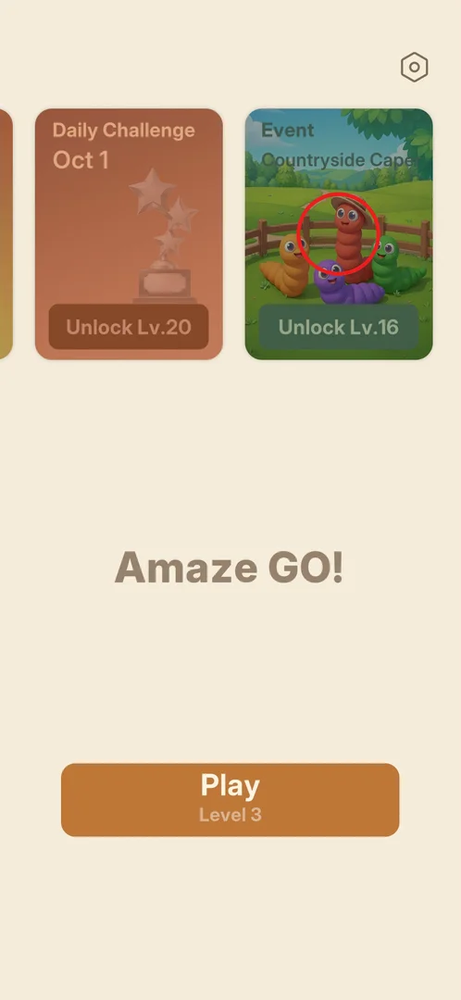
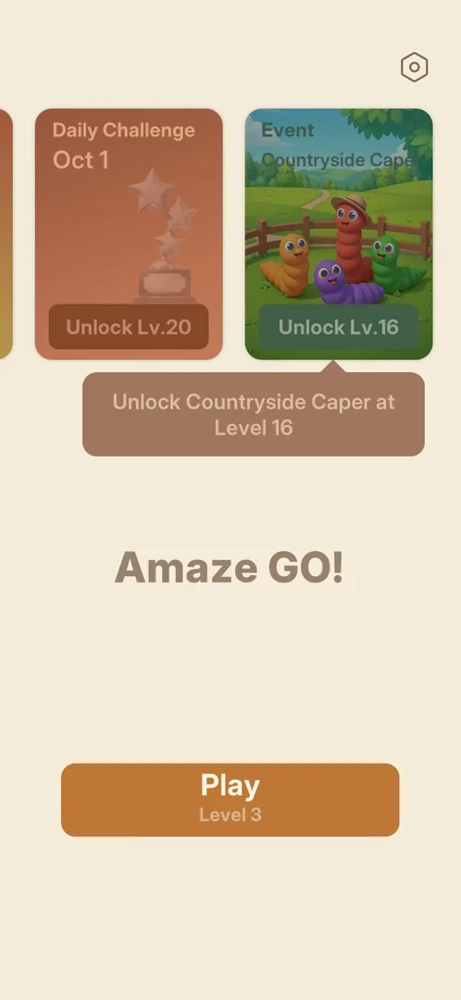

# Event (Countryside Caper)

A themed event, "Countryside Caper", shown on the main menu as a picture card with cartoon worms on a
farm. It opens at level 16; in this session the player was at level 3, so only the locked card and its
bubble were seen [^s1] [^s2].

## Where to find it

From the [main menu](main-menu.md): the third card of the card row, seen after swiping the row to the
left [^s1].

 [^s1]

## What it looks like

<!-- no-screen: the event is locked until level 16; the session ended at level 3 -->

Only the card was seen: a green card titled "Event" and "Countryside Caper", with a picture of four
cartoon worms (one in a straw hat) by a wooden fence in a meadow, dimmed, and the label "Unlock Lv.16"
[^s1].

### Popup

Tapping the locked card shows a bubble under it: "Unlock Countryside Caper at Level 16" [^s2].

 [^s2]

## How it works

- Unlocks at level 16 (version 1.31.0) [^s1] [^s2].
- The worm characters suggest the event uses a different look, maybe worms in place of arrows
  (inferred, not seen).

## Cases

| Case | What was done | Result | Source |
|---|---|---|---|
| Tap the locked event card | Tapped the card | ✅ A bubble: unlock at level 16 | [^s2] |

## Not verified

- What the event screen shows: its levels, goal, rewards and end date.
- Whether the event changes over time (another event after Countryside Caper).

[^s1]: session 20261001-204000-chrono-2FYKPJ, step 11 — [video at 2:42](https://youtu.be/tbyupdD9iso?t=162)
[^s2]: session 20261001-204000-chrono-2FYKPJ, step 13 — [video at 3:02](https://youtu.be/tbyupdD9iso?t=182)
