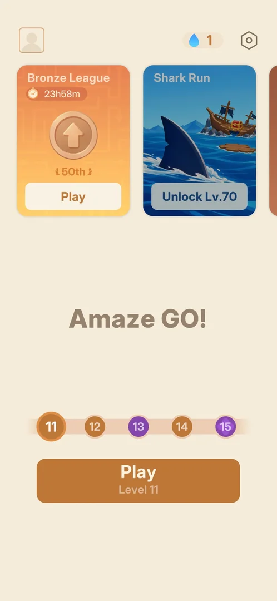
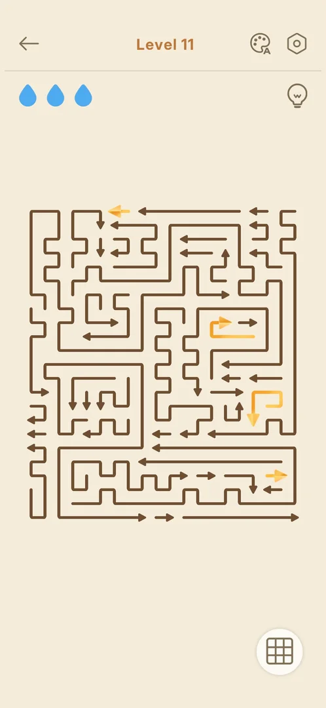
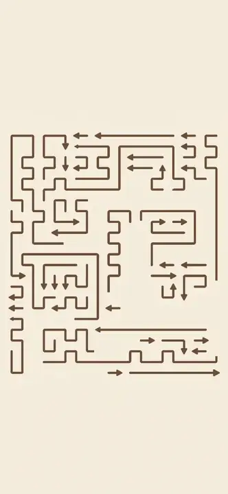
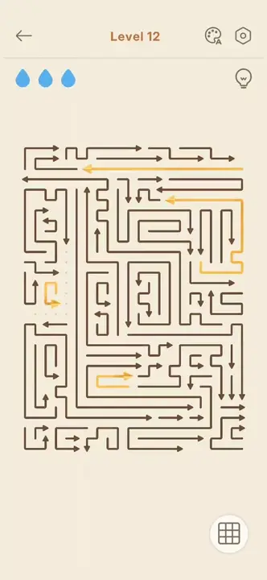

# Gold arrows (league tokens on the board)

Arrows drawn in gold instead of brown on a normal [level](level.md) board. The
[Bronze League](bronze-league.md) calls them "rank arrows": each one cleared on a won level adds one point
to the player's league score [^s1] [^s2]. In play
they are ordinary arrows: they leave the board under the same rule as the brown ones, and a blocked tap on
one costs a drop like any other [^s3] [^s4]. They
first showed on level 11, the first level after joining the league [^s5].

## Why it appeared

Level 11, the first level opened after the Bronze League was joined (on the level 10 win): four arrows of
the board turned gold about 3 s after the board opened [^s5]
[^s6]. The league's how-to overlay shows a board with one gold arrow and says
to collect as many rank arrows as possible [^s1]. Levels 11 and 12 both had
gold arrows [^s7] [^s8].

## Where to find it

No entry of its own: the gold arrows are on the level boards while the league runs. Home > the Play
button, "Play / Level 11" [^s9]; the league screen's "Let's play" button
also opens the next level's board [^s7].

 [^s9]
*Home: the Play / Level 11 button at the bottom opens the first board with gold arrows*

## What it looks like

 [^s7]
*Level 11: four gold arrows among the brown ones*

The gold arrows have the same shapes as the others: straight or bent arrows on the same grid, with a
lighter yellow-orange body and head [^s7]. The rest of the level screen is
as usual: three drops, the hint bulb, the grid button [^s7]. Before the gold
shows, a toast "Only 42.55% cleared this level!" came up on level 11 [^s7].

The board opens all brown; then the gold arrows light up with a sparkle:

 [^s6]
*Clip 3 s · [original on YouTube from 13:03](https://youtu.be/BaXAJZAR4vk?t=783)*

## How it works

Version 1.33.0.

- Level 11 had four gold arrows among 45 [^s7] [^s10];
  level 12 had four among 61 on its frame [^s8] [^s11].
  The player's note counted five on level 12; the frame shows four.
- They move and block like the brown arrows: an arrow leaves when the way ahead of its head is clear, and
  the solver cleared the gold ones in the same order as the rest [^s3].
- A tap on a blocked gold arrow shows a dotted trail ahead of it, the arrow stays, and one drop goes grey
  (3 to 2), as for a brown arrow [^s4]. The first such tap, right after the
  gold faded in, was ignored; the second one counted [^s12]
  [^s4].
- Each gold arrow cleared gives 1 point in the Bronze League, counted when the level is won: level 11
  (4 gold arrows) took the score from 0 to 4, level 12 (4 gold arrows) from 4 to 8
  [^s2] [^s13].
- On the first visit to level 11, a first tap on the back arrow did not leave the level; the board view
  was then moved left, part of it off the screen. A second tap went to Home
  [^s5] [^s9]. Inferred: the first tap came
  while the board was still animating; not verified.

 [^s4]
*Clip 3.9 s · [original on YouTube from 3:35](https://youtu.be/oc6wFXd4jzs?t=215)*

## Outcomes

| Outcome | As the base or what differs | Frame |
|---|---|---|
| win | As the base, then first a Bronze League card with the new score and the places climbed, then the usual win card (see [Bronze League](bronze-league.md#league-card-after-a-win)) [^s2] [^s3] | [Bronze League](bronze-league.md#league-card-after-a-win) |
| quit | As the base: the back arrow led to Home, where Play still showed Level 11 [^s9] | — |
| out of lives | not seen: a blocked gold tap costs a drop as on the base, so presumably the same (inferred) | — |
| restart | not seen | — |
| exit app | not seen | — |

## Cases

| Case | What was done | Result | Source |
|---|---|---|---|
| Why it appeared <!-- case:chk-appeared --> | Joined the league on the level 10 win, then opened level 11 | ✅ Four arrows turned gold about 3 s after the board opened | [^s5] |
| Where to find it <!-- case:chk-entry --> | Looked at Home and level 11 | ✅ No entry of its own: on level boards while the league runs (Home > Play / Level N) | [^s5] |
| Its screen <!-- case:chk-screen --> | Looked at level 11 | ✅ Four gold arrows among the brown ones | [^s5] |
| The first level and how it is introduced <!-- case:chk-first-level --> | Opened level 11, then the league | ✅ Level 11, the first after joining; no tutorial on the board; the league's how-to overlay explains them as rank arrows | [^s5] |
| Rules <!-- case:chk-rules --> | Read the league's how-to overlay | ✅ They are the league's rank arrows: "Collect as many rank arrows as possible" | [^s1] |
| How it interacts with the other pieces <!-- case:chk-interactions --> | Won levels 11 and 12 with the solver | ✅ Ordinary arrows in colour: same exit rule, cleared with the rest; 1 league point each (L11: 4 arrows, 0 to 4) | [^s3] |
| Gold arrows per level <!-- case:chk-count --> | Counted them on the boards of levels 11 and 12 | ✅ 4 on level 11 (of 45), 4 on level 12 (of 61); one point each on the win | [^s7] [^s8] [^s11] |
| Whether it adds a way to lose <!-- case:chk-loss --> | Tapped a blocked gold arrow on level 12 | ✅ No extra way to lose: one drop lost (3 to 2), the arrow stays, as for any arrow | [^s4] |

## Not verified

- Out of lives, restart and exit app on a board with gold arrows: whether gold arrows already cleared
  count when the level is lost or restarted
- Whether gold arrows stay on the boards after the league event ends

[^s1]: session 20261005-012010-chrono-2FYKPJ, step 34 — [video at 14:45](https://youtu.be/BaXAJZAR4vk?t=885)
[^s2]: session 20261005-124219-chrono-2FYKPJ, step 11 — [video at 2:28](https://youtu.be/oc6wFXd4jzs?t=148)
[^s3]: session 20261005-124219-chrono-2FYKPJ, step 12 — [video at 2:48](https://youtu.be/oc6wFXd4jzs?t=168)
[^s4]: session 20261005-124219-chrono-2FYKPJ, step 15 — [video at 3:38](https://youtu.be/oc6wFXd4jzs?t=218)
[^s5]: session 20261005-012010-chrono-2FYKPJ, step 32 — [video at 13:42](https://youtu.be/BaXAJZAR4vk?t=822)
[^s6]: session 20261005-012010-chrono-2FYKPJ, step 31 — [video at 13:30](https://youtu.be/BaXAJZAR4vk?t=810)
[^s7]: session 20261005-124219-chrono-2FYKPJ, step 8 — [video at 1:17](https://youtu.be/oc6wFXd4jzs?t=77)
[^s8]: session 20261005-124219-chrono-2FYKPJ, step 13 — [video at 3:05](https://youtu.be/oc6wFXd4jzs?t=185)
[^s9]: session 20261005-012010-chrono-2FYKPJ, step 33 — [video at 14:31](https://youtu.be/BaXAJZAR4vk?t=871)
[^s10]: session 20261005-124219-chrono-2FYKPJ, step 9 — [video at 1:54](https://youtu.be/oc6wFXd4jzs?t=114)
[^s11]: session 20261005-124219-chrono-2FYKPJ, step 16 — [video at 4:04](https://youtu.be/oc6wFXd4jzs?t=244)
[^s12]: session 20261005-124219-chrono-2FYKPJ, step 14 — [video at 3:22](https://youtu.be/oc6wFXd4jzs?t=202)
[^s13]: session 20261005-124219-chrono-2FYKPJ, step 20 — [video at 5:09](https://youtu.be/oc6wFXd4jzs?t=309)
