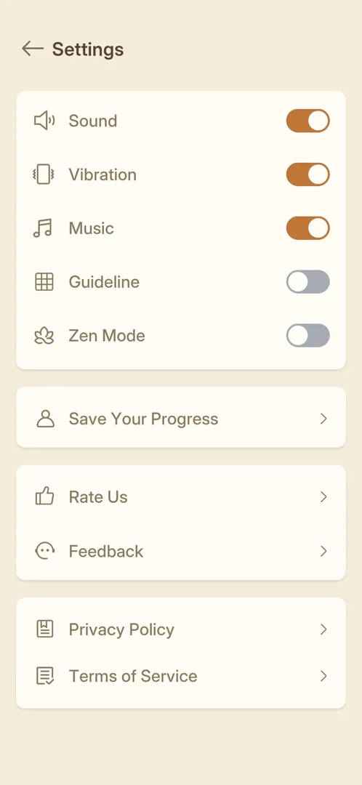
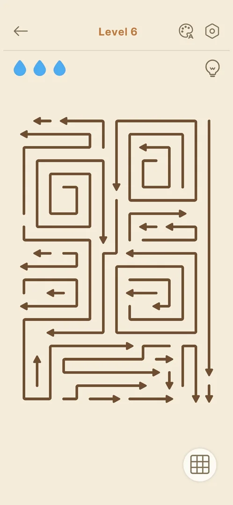
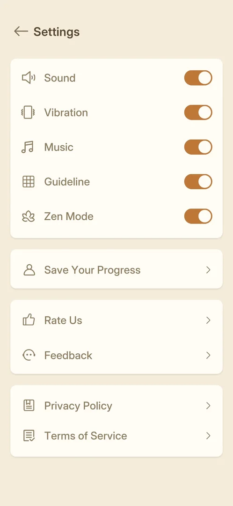
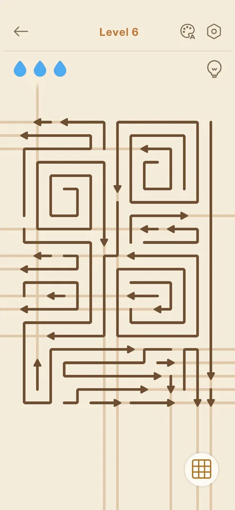
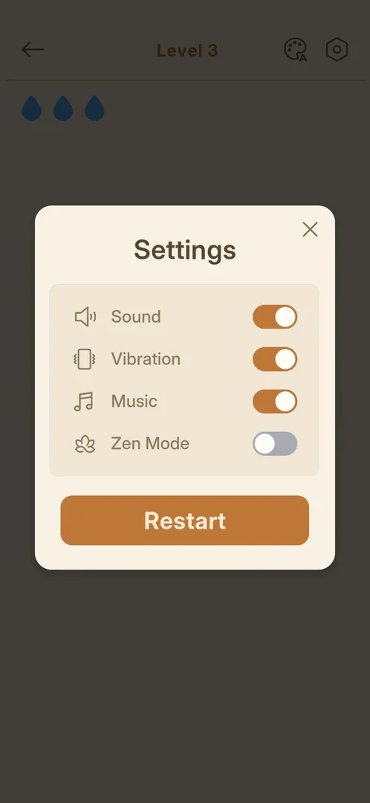
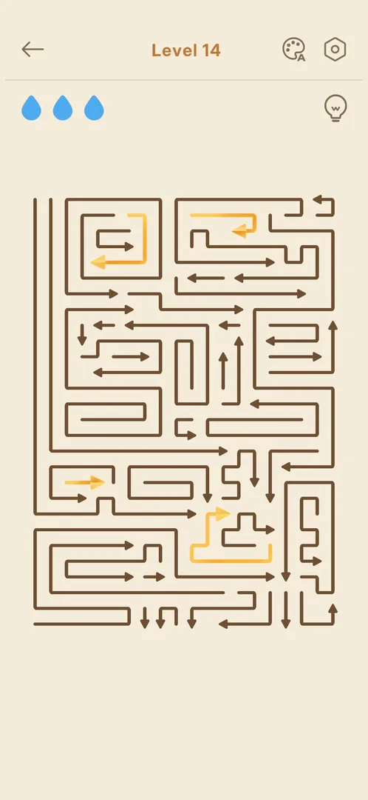

# Guideline toggle

A switch in the home screen's Settings named "Guideline", with a grid icon, off by default [^s1]. It
can be switched on and stays on after Settings is closed and reopened [^s6]. It is not in the Settings
popup inside a level [^s4]. From level 6 a round grid button at the bottom right of the board also
switches it. With it on, a light tan line runs from every arrow's head along its way out to the edge of
the screen [^s7]. On level 3 with the Settings switch on, no such lines were seen [^s5]. The two are not one
setting: the lines go when the level is left and opened again, while the Settings switch stays on. With
the Settings switch off, level 14 had no grid button [^s10] [^s11].

## Why it appeared

In Settings from the first visit after a fresh install, with no lock (progress had been restored from the
cloud to level 3) [^s1]. The in-level grid button first showed on level 6: levels 3 to 5 had no such
button, and level 6, the first Normal level after Hard level 5, had it [^s8] [^s7].
Hypothesis: the in-level button comes with level 6 (a level count), not verified.

## Where to find it

Home > the gear top right > Settings > "Guideline", the fourth row of the first block, between Music and
Zen Mode [^s1] [^s2]. Only the home screen's Settings has it: the gear inside a level opens a shorter
popup without it [^s4].

Inside a level, from level 6: the round white button with a grid icon at the bottom right of the screen,
below the board [^s8].

 [^s2]
*Settings: the Guideline switch (grid icon) in the fourth row, between Music and Zen Mode, off*

 [^s8]
*Level 6: the round grid button at the bottom right, below the board, with a dark icon (guideline off)*

## What it looks like

The feature has no screen of its own: it is the switch. Off, the switch is grey with the knob on the
left; on, it turns orange with the knob on the right, like Sound, Vibration and Music [^s3].

 [^s3]
*Settings with Guideline on: the fourth switch orange, Zen Mode still off*

 [^s12]
*Settings after the app was force-stopped and opened again: Guideline and Zen Mode both on, though Zen Mode had been switched off*

With the in-level button on (level 6), every arrow gets a light tan line from its head straight on to
the edge of the screen, in the direction the arrow points. Lines cross the other arrows and run past the
board. The button's grid icon turns orange [^s7]. A second tap removes the lines and the icon turns
dark again [^s9].

 [^s7]
*Level 6 with the guideline on: a tan line along each arrow's way out; the grid button bottom right is orange*

With Guideline on in Settings, level 3 at rest: the arrows on a plain background, three blue drops top left; no grid
and no guide lines [^s5].

 [^s5]
*Level 3 at rest with Guideline on: no grid or guide lines on the board*

The Settings popup inside a level (the gear top right of the level) lists Sound, Vibration, Music and Zen
Mode and a Restart button; there is no Guideline row [^s4].

 [^s4]
*The in-level Settings popup: four switches and Restart, no Guideline*

With the Settings switch off, level 14 opened with no grid button at the bottom right; the rest of the
level was as before [^s11].

 [^s11]
*Level 14 with the Settings switch off: the bottom right, where the grid button was, is empty*

## How it works

Version 1.33.0.

- Off by default [^s1].
- One tap on the switch turns it on; one more tap turns it off. It was switched on, left through Home and
  a level, and found still on when Settings was reopened; then it was set back to off [^s6].
- Only in the home screen's Settings; the in-level Settings popup has no Guideline row, so it cannot be
  changed during a level [^s4].
- Effect on the board: a line along each arrow's way out, from its head to the screen edge, shown at once
  for all arrows, with no arrow tapped [^s7]. Inferred: an arrow whose line crosses no other arrow
  can leave; the lines do not mark which arrows are free.
- The in-level grid button is on the board from level 6; one tap on, one tap off [^s7] [^s9].
- On level 3 with the Settings switch on, no lines were seen [^s5].
- The lines last for one visit to a level. On level 14 the button drew them; Settings, opened from Home
  right after, showed Guideline on. Level 14 opened again had no lines and a dark grid icon, though
  Settings still showed Guideline on; one more tap on the button drew them again [^s13] [^s14]
  [^s10] [^s15].
- The Settings switch decides whether the button is there: with it on, level 14 had the button; after
  it was switched off, levels 14 and 15 opened with no grid button [^s10] [^s11] [^s16].
  Inferred: the switch shows or hides the in-level button, and the button turns the lines on for the
  visit. On level 6, in an earlier session, the button was there while the Settings switch was taken
  to be off; that state was not looked at, so this is not verified.
- Settings did not keep a change through a forced close. Zen Mode was switched off (Guideline stayed on);
  after the app was force-stopped and opened again, Settings showed both Guideline and Zen Mode on
  [^s17] [^s12]. Inferred: the game saves settings late, as it saves wins late (see
  [Level](level.md)); not verified.

## Cases

| Case | What was done | Result | Source |
|---|---|---|---|
| Toggle on in home settings persists after reopening; in-level settings popup has no Guideline row <!-- case:toggle-persist --> | Switched Guideline on, went Home, opened level 3 and its Settings popup, came back and reopened Settings | ✅ Still on after reopening; the in-level popup has no Guideline row | [^s6] [^s4] |
| Visible effect on level 3 at idle with Guideline on: none seen <!-- case:visual-effect --> | Opened level 3 with Guideline on and looked at the board without tapping an arrow | ✅ No grid or guide lines seen | [^s5] |
| Why it appeared <!-- case:chk-appeared --> | Opened Settings after a fresh install | ✅ In Settings from the start, no lock; what it does is a hypothesis | [^s1] |
| Where to find it: the screen and the button that open it <!-- case:chk-entry --> | Opened Settings from the gear on Home | ✅ Fourth row, "Guideline", off; not in the in-level popup | [^s2] [^s4] |
| What it looks like: its screen <!-- case:chk-screen --> | Switched it on and opened level 3; on level 6 tapped the grid button | ✅ The Settings switch turns orange; no change on level 3. On level 6 the button draws a tan line along every arrow's way out | [^s3] [^s5] [^s7] |
| Every option or button and what it changes <!-- case:chk-options --> | Switched on in Settings, then back off; on level 6 the grid button on and off; on level 14 the button, Settings, the level opened again, the switch off and level 14 again | ✅ The in-level button draws the exit lines for one visit to the level; the Settings switch does not draw them, and with it off level 14 had no button. Not one setting | [^s6] [^s7] [^s10] [^s11] |
| The lines are not kept when the level is opened again <!-- case:lines-per-visit --> | Turned the lines on in level 14, went Home, opened level 14 again | ✅ No lines and a dark grid icon; Settings still showed Guideline on; one tap drew them again | [^s10] [^s15] |
| For a prompt: what each answer does <!-- case:chk-answers --> | Switched on and off | No prompt appeared on either tap | [^s6] |
| Links out <!-- case:chk-links --> | — | none: a switch with no link |  |
| The in-level grid button toggles the guideline <!-- case:in-level-toggle --> | Opened level 6, tapped the round grid button at the bottom right, then tapped it again | ✅ On: a tan line along every arrow's way out, the icon orange. Off: the lines go | [^s7] [^s9] |

## Not verified

- Whether the Settings switch alone shows or hides the grid button (level 6 had it with the switch taken
  to be off), and why the switch showed no lines on level 3
- Why a forced close brought back Zen Mode on after it was switched off
- Whether the in-level button comes with level 6 or with board size (hypothesis above) <!-- case:chk-appeared -->

[^s1]: session 20261003-200141-chrono-2FYKPJ, step 5 — [video at 1:32](https://youtu.be/l44HK-PZ5-o?t=92)
[^s2]: session 20261003-232108-chrono-2FYKPJ, step 5 — [video at 0:43](https://youtu.be/KL7evNlX6oU?t=43)
[^s3]: session 20261003-232108-chrono-2FYKPJ, step 6 — [video at 0:54](https://youtu.be/KL7evNlX6oU?t=54)
[^s4]: session 20261003-232108-chrono-2FYKPJ, step 9 — [video at 1:26](https://youtu.be/KL7evNlX6oU?t=86)
[^s5]: session 20261003-232108-chrono-2FYKPJ, step 8 — [video at 1:09](https://youtu.be/KL7evNlX6oU?t=69)
[^s6]: session 20261003-232108-chrono-2FYKPJ, step 13 — [video at 1:58](https://youtu.be/KL7evNlX6oU?t=118)

[^s7]: session 20261005-010045-chrono-2FYKPJ, step 94 — [video at 15:24](https://youtu.be/x_UvTQLpmEQ?t=924)
[^s8]: session 20261005-010045-chrono-2FYKPJ, step 93 — [video at 14:50](https://youtu.be/x_UvTQLpmEQ?t=890)
[^s9]: session 20261005-010045-chrono-2FYKPJ, step 95 — [video at 15:38](https://youtu.be/x_UvTQLpmEQ?t=938)

[^s10]: session 20261005-224323-chrono-2FYKPJ, step 17 — [video at 4:23](https://youtu.be/qnyS1lQt1kE?t=263)
[^s11]: session 20261005-224323-chrono-2FYKPJ, step 25 — [video at 7:29](https://youtu.be/qnyS1lQt1kE?t=449)
[^s12]: session 20261005-224323-chrono-2FYKPJ, step 22 — [video at 6:02](https://youtu.be/qnyS1lQt1kE?t=362)
[^s13]: session 20261005-224323-chrono-2FYKPJ, step 12 — [video at 3:34](https://youtu.be/qnyS1lQt1kE?t=214)
[^s14]: session 20261005-224323-chrono-2FYKPJ, step 14 — [video at 3:51](https://youtu.be/qnyS1lQt1kE?t=231)
[^s15]: session 20261005-224323-chrono-2FYKPJ, step 20 — [video at 5:04](https://youtu.be/qnyS1lQt1kE?t=304)
[^s16]: session 20261005-224323-chrono-2FYKPJ, step 36 — [video at 10:17](https://youtu.be/qnyS1lQt1kE?t=617)
[^s17]: session 20261005-224323-chrono-2FYKPJ, step 15 — [video at 4:02](https://youtu.be/qnyS1lQt1kE?t=242)
