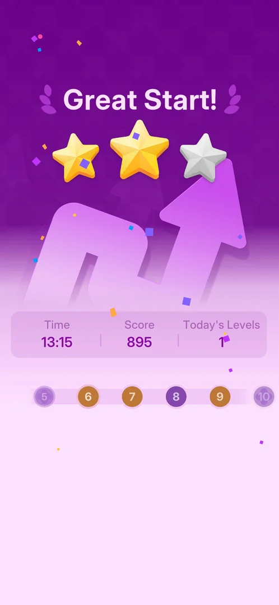

# Hard level (purple, larger zoomable board)

Some levels are marked Hard. They are purple on the level path and on the Play button, and a purple
"Hard" is under the level title. The first one, level 5, has a board several screens wide and tall. It
opens with a "Pinch to zoom" tip, and it has a [hint](hint.md) bulb in the top bar [^s1] [^s2] [^s3]
[^s5]. Level 5 was first played for about 6 minutes and not won; the drops ran out four times [^s5].
In the next session it was won in 13:15 with one mistake, by taking one hint after another, and it ended
on a purple win card of its own: "Great Start!" with two of three stars [^s12].

## Why it appeared

The level path came up on the win card after level 4 was won. On it, nodes 5 and 8 are purple, and
level 5 opened labelled Hard [^s1] [^s3]. No popup announced it [^s2].

## Where to find it

Home > the Play button. It is purple and reads "Hard / Level 5" when the next level is Hard. Above it,
the level path shows 5 and 8 in purple [^s2] [^s6]. The same path is on
the win card of the level before [^s1].

 [^s2]
*Home before level 5: the purple Hard / Level 5 button, and purple 5 and 8 on the path above it*

## What it looks like

 [^s3]
*Level 5: "Hard" under the title, the board running past the screen edges, the "Pinch to zoom" tip*

These parts differ from a normal [level](level.md) [^s3] [^s5]:

- "Level 5" with a purple "Hard" under it;
- a board of many long, bent arrows, several screens wide and tall. The view shows one part of it at a time;
- a "Pinch to zoom" tip over the board on the first opening. Two animated hands under it show the
  pinch;
- a [hint](hint.md) bulb at the top right, under the gear.

The clip shows the opening: the hands pinch while the first hint moves the view to a green arrow
[^s7].

*Video (not embedded: clip limit of this dream): Pinch to zoom tip with two hands that pinch together; the view moves to a green hinted arrow · [original on YouTube from 0:32](https://youtu.be/GAWMSCppoKY?t=32)* [^s7]

The level ends on its own purple win card. The clip shows it building up: the score counts up to 1194,
the level path slides in with 6 next and 8 and 10 purple, and Next Level and Home appear:

 [^s12]
*Clip 3 s · [original on YouTube from 14:06](https://youtu.be/Utiq9YFZiRU?t=846)*

These are the same as on a normal level: three blue drops, the back arrow, the palette and the gear [^s3].
The gear opens the same Settings popup with Restart [^s4].

## How it works

Version 1.33.0.

- Level 5, level 8 and level 10 are Hard. 5 and 8 are the purple nodes on the path 5-9; after level 5
  was won, the path 6-10 showed 8 and 10 purple [^s1] [^s2] [^s12].
- A swipe on the board pans the view to another part of it [^s8].
  Pinch zoom was not tried: the test tool cannot pinch.
- The "Pinch to zoom" tip did not show again after a Restart [^s9], nor when level 5 was opened again in
  a later session [^s13].
- Where arrows have left the board, a grid of small dots shows in their place [^s14].
- The first attempt at level 5 was not won. It took 356 s, 24 decisions and 64 taps, four Out of Lives
  popups (Continue three times, then Restart) and 11 hints [^s5].
- The second attempt won: about 55 hints, one blocked tap (one drop lost), win card
  time 13:15 and score 1194 [^s12].
- Quitting with the back arrow costs nothing seen. Home shows "Hard / Level 5" again [^s2].
- How often Hard levels come after level 8 is not known.

## Outcomes

| Outcome | As the base or what differs | Frame |
|---|---|---|
| quit <!-- case:under-quit --> | As the base: the back arrow quits at once, no confirmation, no drop lost; Home shows Hard Level 5 again [^s2] |  |
| out of lives <!-- case:under-out-of-lives --> | The third blocked tap brings the Out of Lives! popup: Continue (Free, 3 more drops, the board kept) or Restart. Out of Lives was only seen on this Hard level, so there is no Normal level to compare it with [^s10] |  |
| restart <!-- case:under-restart --> | Restart on the Out of Lives popup: the whole board returns to its first layout with three drops, at once and with no confirmation. The Restart in the gear popup was not tapped [^s9] |  |
| exit app <!-- case:under-exit-app --> | The app was closed mid-level and opened again. It opens on Home with "Hard / Level 5", and the board's progress is not kept. Not compared with a Normal level [^s5] |  |
| win <!-- case:under-win --> | Differs. The win card is purple, not orange: "Great Start!" with two of three stars after one mistake (a Normal level with one mistake gave "Perfect!" and three stars), a large purple arrow drawing, and one row of Time 13:15, Score 1194 and Today's Levels 1. It has no Difficulty line and no accuracy, mistakes and hints row. Then the level path 6-10, Next Level and Home. The Daily Streak screen came before it (the day's first win), as it came before the Normal level 4 card [^s12] [^s15] |  |

## Cases

| Case | What was done | Result | Source |
|---|---|---|---|
| Why it appeared <!-- case:chk-appeared --> | Won level 4 | ✅ The level path on the win card shows 5 and 8 purple; level 5 opens as Hard | [^s1] |
| Where to find it <!-- case:chk-entry --> | Looked at Home before level 5 | ✅ The Play button turns purple and reads "Hard / Level N" when the next level is Hard | [^s2] |
| Its screen <!-- case:chk-screen --> | Opened level 5 | ✅ Purple "Hard" subtitle; a board larger than the screen, "Pinch to zoom" on first open, hint bulb at the top right under the gear; three drops as usual | [^s3] |
| How it is announced <!-- case:chk-announce --> | Looked at the win card and Home | ✅ Purple nodes 5 and 8 on the level path; the purple "Hard" Play button; no popup before it | [^s1] [^s2] |
| Each loss <!-- case:chk-loss --> | Tapped blocked arrows until the drops ran out, four times | ✅ The only loss seen: Out of Lives (drops at zero). It cost nothing seen, as Continue is free. Arrows tapped while blocked stay red | [^s10] |
| Retry and continue offers <!-- case:chk-retry --> | Tapped Continue three times, then Restart | ✅ Continue is Free (a green badge, no ad seen): three new drops and the board kept. Restart sends the board back to the start | [^s11] [^s9] |
| What differs in play <!-- case:chk-differs --> | Played level 5 for 356 s, then won it in 13:15, with hints and swipes | ✅ A board about three screens wide that opens zoomed in and pans with a swipe; a dot grid only where arrows have left; the hint bulb; the same three drops, blocked-tap cost and Out of Lives; its own win card (see Outcomes). Pinch zoom not tried | [^s8] [^s12] |
| Its win <!-- case:chk-win --> | Won level 5 with hints and one mistake | ✅ A purple "Great Start!" card with 2 of 3 stars, Time, Score 1194, Today's Levels 1, the level path, Next Level and Home. No Difficulty line and no accuracy/mistakes/hints row. No reward shown | [^s12] |
| Where and how often <!-- case:chk-frequency --> | Looked at the level path on two win cards | partly: 5, 8 and 10 are Hard; the rule not known | [^s1] [^s12] |

## Not verified

- Pinch zoom on the Hard board (the test tool cannot pinch)
- Which levels are Hard after 10, and the rule <!-- case:chk-frequency -->
- What the stars on the Hard win card count: two stars with one mistake, where a Normal level gave three
- Whether a Normal level shows the same Out of Lives popup, Restart and exit-app behaviour

[^s1]: session 20261003-232357-chrono-2FYKPJ, step 17 — [video at 3:08](https://youtu.be/x9mSZuHgO_4?t=188)
[^s2]: session 20261003-232357-chrono-2FYKPJ, step 21 — [video at 3:56](https://youtu.be/x9mSZuHgO_4?t=236)
[^s3]: session 20261003-232357-chrono-2FYKPJ, step 18 — [video at 3:20](https://youtu.be/x9mSZuHgO_4?t=200)
[^s4]: session 20261003-232357-chrono-2FYKPJ, step 19 — [video at 3:43](https://youtu.be/x9mSZuHgO_4?t=223)
[^s5]: session 20261003-233756-chrono-2FYKPJ, step 24 — [video at 5:43](https://youtu.be/GAWMSCppoKY?t=343)
[^s6]: session 20261003-233756-chrono-2FYKPJ, step 0 — [video at 0:00](https://youtu.be/GAWMSCppoKY?t=0)
[^s7]: session 20261003-233756-chrono-2FYKPJ, step 2 — [video at 0:36](https://youtu.be/GAWMSCppoKY?t=36)
[^s8]: session 20261003-233756-chrono-2FYKPJ, step 21 — [video at 4:54](https://youtu.be/GAWMSCppoKY?t=294)
[^s9]: session 20261003-233756-chrono-2FYKPJ, step 23 — [video at 5:21](https://youtu.be/GAWMSCppoKY?t=321)
[^s10]: session 20261003-233756-chrono-2FYKPJ, step 4 — [video at 1:11](https://youtu.be/GAWMSCppoKY?t=71)
[^s11]: session 20261003-233756-chrono-2FYKPJ, step 5 — [video at 1:20](https://youtu.be/GAWMSCppoKY?t=80)
[^s12]: session 20261004-001551-chrono-2FYKPJ, step 110 — [video at 14:08](https://youtu.be/Utiq9YFZiRU?t=848)
[^s13]: session 20261004-001551-chrono-2FYKPJ, step 1 — [video at 0:13](https://youtu.be/Utiq9YFZiRU?t=13)
[^s14]: session 20261004-001551-chrono-2FYKPJ, step 108 — [video at 13:47](https://youtu.be/Utiq9YFZiRU?t=827)
[^s15]: session 20261004-001551-chrono-2FYKPJ, step 109 — [video at 13:52](https://youtu.be/Utiq9YFZiRU?t=832)
