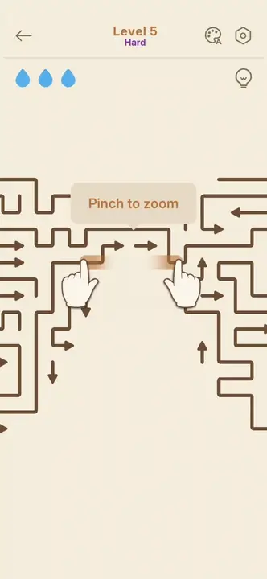
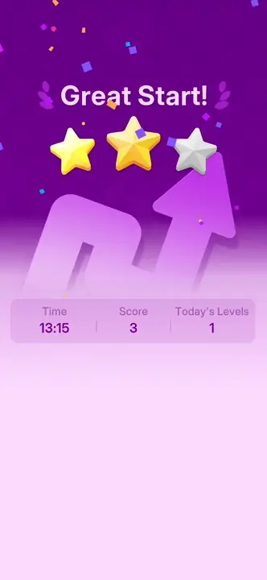
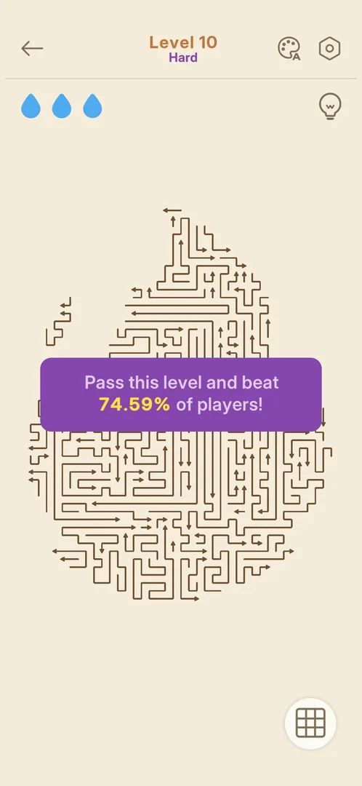
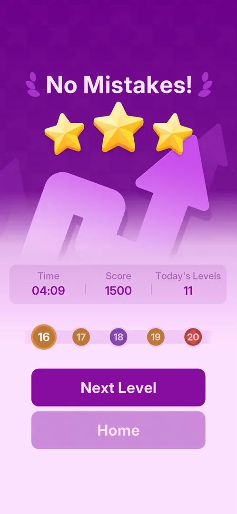
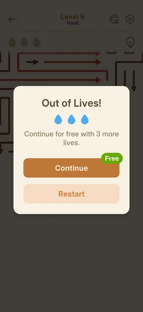
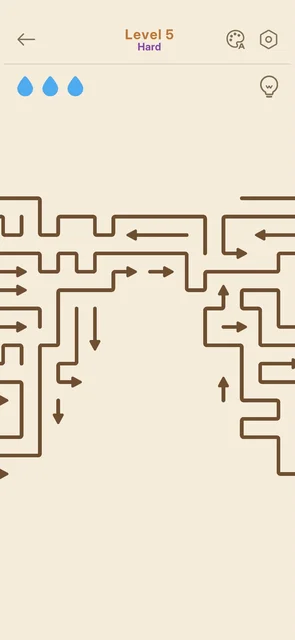
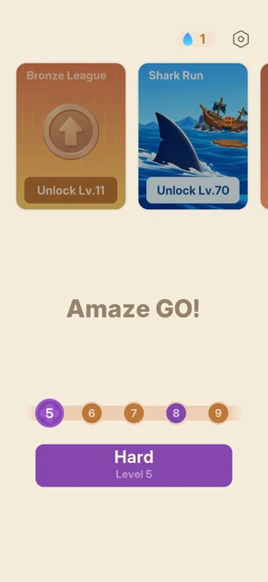
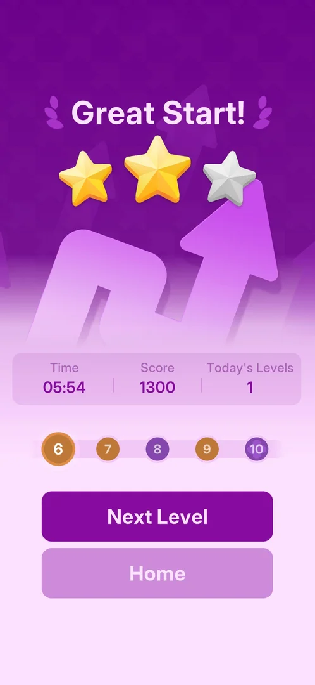

# Hard level (purple, larger zoomable board)

Some levels are marked Hard. They are purple on the level path and on the Play button, and a purple
"Hard" is under the level title. The first one, level 5, has a board several screens wide and tall. It
opens with a "Pinch to zoom" tip, and it has a [hint](hint.md) bulb in the top bar [^s1] [^s2] [^s3]
[^s5]. Level 5 was first played for about 6 minutes and not won; the drops ran out four times [^s5].
In the next session it was won in 13:15 with one mistake, by taking one hint after another, and it ended
on a purple win card of its own: "Great Start!" with two of three stars [^s12]. That win was not kept by
the game: the next day Home offered Hard level 5 again. It was won a second time with no hint and no
mistake, and the card again gave "Great Start!" with two of three stars [^s16] [^s17]. Hard levels 8 and
10 came next. Their boards fit the screen whole, and both were won with no hint and no mistake; level 8
gave three stars, "Arrow Pro!" [^s21] [^s23] [^s22] [^s24]. Hard levels 13 and 15 were also won with no
hint and no mistake, both with three stars: "Lightning Fast!" and "No Mistakes!" [^s26] [^s27].

## Why it appeared

The level path came up on the win card after level 4 was won. On it, nodes 5 and 8 are purple, and
level 5 opened labelled Hard [^s1] [^s3]. No popup announced it [^s2].

## Where to find it

Home > the Play button. It is purple and reads "Hard / Level 5" when the next level is Hard. Above it,
the level path shows 5 and 8 in purple [^s2] [^s6]. The same path is on
the win card of the level before [^s1].

 [^s2]
*Home before level 5: the purple Hard / Level 5 button, and purple 5 and 8 on the path above it*

## What it looks like

 [^s3]
*Level 5: "Hard" under the title, the board running past the screen edges, the "Pinch to zoom" tip*

These parts differ from a normal [level](level.md) [^s3] [^s5]:

- "Level 5" with a purple "Hard" under it;
- a board of many long, bent arrows, several screens wide and tall. The view shows one part of it at a time;
- a "Pinch to zoom" tip over the board on the first opening. Two animated hands under it show the
  pinch;
- a [hint](hint.md) bulb at the top right, under the gear.

The clip shows the opening: the hands pinch while the first hint moves the view to a green arrow
[^s7].

 [^s7]
*Clip 4.2 s · [original on YouTube from 0:32](https://youtu.be/GAWMSCppoKY?t=32)*

The level ends on its own purple win card. The clip shows it building up: the score counts up to 1194,
the level path slides in with 6 next and 8 and 10 purple, and Next Level and Home appear:

 [^s12]
*Clip 3 s · [original on YouTube from 14:06](https://youtu.be/Utiq9YFZiRU?t=846)*

Later Hard boards are not all larger than the screen. Level 8 (78 arrows) and level 10 (99 arrows, in the
shape of a drop) opened zoomed out with the whole board in view. Level 8 showed no "Pinch to zoom" tip
in its first frame [^s23] [^s22].

These are the same as on a normal level: three blue drops, the back arrow, the palette and the gear [^s3].
The gear opens the same Settings popup with Restart [^s4].

### Start banner

Level 10 opened with a purple banner over the board: "Pass this level and beat 74.59% of players!". It
was gone 3 s later [^s22]. Level 8 showed no banner in its first frame [^s23].

 [^s22]
*Hard level 10: the start banner over the drop-shaped board*

### Three-star win card

Hard levels 8, 13 and 15 each ended on a three-star purple card; the titles differ ("Arrow Pro!",
"Lightning Fast!", "No Mistakes!") [^s21] [^s26] [^s27].

 [^s21]
*Hard level 8 won with no hint and no mistake: "Arrow Pro!" and three stars*

 [^s27]
*Hard level 15 won with no hint and no mistake: "No Mistakes!", three stars; on the path 18 is purple and 20 is [red](super-hard-level.md)*

## How it works

Version 1.33.0.

- Levels 5, 8, 10, 13, 15 and 18 are Hard. 5 and 8 are the purple nodes on the path 5-9; after level 5
  was won, the path 6-10 showed 8 and 10 purple [^s1] [^s2] [^s12]. The level 8 win card's path 9-13
  showed 10 and 13 purple, and Home at level 11 showed the path 11-15 with 13 and 15 purple [^s21]
  [^s25]. The level 13 card's path 14-18 showed 15 and 18 purple; 14, 16, 17 and 19 are Normal
  [^s26] [^s28]. The gaps are 3, 2, 3, 2, 3 levels. By that rule 20 would be next, but the
  level 15 card shows node 20 red, not purple: see [Red level node](super-hard-level.md) [^s27].
- Hard level 8: 78 arrows, won in 01:30 (win card time) with no hint and no mistake: three stars,
  "Arrow Pro!", score 1700 [^s21].
- Hard level 10: 99 arrows, won with no hint and no mistake; its win card ("Untouchable!") was covered
  by the Bronze League popup, so its stars and score were not seen [^s24].
- Hard level 13: 80 arrows, won with no hint and no mistake: three stars, "Lightning Fast!", Time 01:44,
  Score 1700, Today's Levels 9 [^s26].
- Hard level 15: 81 arrows on a round board that fit the screen whole on opening, with no "Pinch to
  zoom" tip in its first frame. Won with no hint and no mistake: three stars, "No Mistakes!", Time 04:09,
  Score 1500, Today's Levels 11 [^s29] [^s27].
- On level 15 the hint bulb carried an orange "AD" badge; on level 14 just before it had none
  [^s29] [^s30]. Inferred: the free hints had run out and a hint now costs an ad; not verified.
- Restart in the gear popup, tapped on level 15 with part of the board cleared: a full-screen ad came
  first, with a "Next" skip label at the top left; it ended in a Play Store sheet over the game. Back in
  the game, the whole board was back at its first layout with three drops [^s31] [^s32].
- After the level 15 win, Continue on the league card also brought a full-screen ad before the win card
  [^s33] [^s34].
- Winning level 10 brought the [Bronze League](bronze-league.md) joined popup over the win card [^s24].
- A swipe on the board pans the view to another part of it [^s8].
  Pinch zoom was not tried: the test tool cannot pinch.
- The "Pinch to zoom" tip did not show again after a Restart [^s9], nor when level 5 was opened again in
  later sessions [^s13] [^s18].
- Where arrows have left the board, a grid of small dots shows in their place [^s14].
- The first attempt at level 5 was not won. It took 356 s, 24 decisions and 64 taps, four Out of Lives
  popups (Continue three times, then Restart) and 11 hints [^s5].
- The second attempt won: about 55 hints, one blocked tap (one drop lost), win card
  time 13:15 and score 1194 [^s12].
- That win was not kept: in the next session Home showed "Hard / Level 5" again [^s16]. Inferred:
  the app was closed right after the win card, before the game saved; not verified.
- The third attempt won with no hint and all three drops kept: win card time 05:54, score 1300, two of
  three stars and "Great Start!" again [^s19] [^s17]. So the Hard card gave two stars both with one
  mistake and with none.
- The board of level 5, as mapped by the test tool's solver: about 50 by 18 grid points and 54
  arrows [^s20].
- A quick swipe moves the view about twice the swipe's length, and a view pushed far past the end of the
  board springs back toward the start view [^s20].
- Quitting with the back arrow costs nothing seen. Home shows "Hard / Level 5" again [^s2].
- Which levels are Hard after 18, and what the red node 20 is, is not known.

## Outcomes

| Outcome | As the base or what differs | Frame |
|---|---|---|
| quit <!-- case:under-quit --> | As the base: the back arrow quits at once, no confirmation, no drop lost; Home shows Hard Level 5 again [^s2] |  |
| out of lives <!-- case:under-out-of-lives --> | The third blocked tap brings the Out of Lives! popup: Continue (Free, 3 more drops, the board kept) or Restart. Out of Lives was only seen on this Hard level, so there is no Normal level to compare it with [^s10] |  |
| restart <!-- case:under-restart --> | Restart on the Out of Lives popup: the whole board returns to its first layout with three drops, at once and with no confirmation. The Restart in the gear popup was not tapped [^s9] |  |
| exit app <!-- case:under-exit-app --> | The app was closed mid-level and opened again. It opens on Home with "Hard / Level 5", and the board's progress is not kept. Not compared with a Normal level [^s5] |  |
| restart from the gear popup <!-- case:under-restart-gear --> | Tapped on Hard level 15: a full-screen ad first ("Next" at the top left, then a Play Store sheet), then the whole board from its first layout with three drops. The ad was first seen here; as the base otherwise [^s31] [^s32] | — |
| win <!-- case:under-win --> | Differs. The win card is purple, not orange: "Great Start!" with two of three stars after one mistake (a Normal level with one mistake gave "Perfect!" and three stars), a large purple arrow drawing, and one row of Time 13:15, Score 1194 and Today's Levels 1. It has no Difficulty line and no accuracy, mistakes and hints row. Then the level path 6-10, Next Level and Home. The Daily Streak screen came before it (the day's first win), as it came before the Normal level 4 card [^s12] [^s15]. Won again with no mistake and no hint: the same card with two of three stars, Time 05:54, Score 1300 [^s17] |  |

## Cases

| Case | What was done | Result | Source |
|---|---|---|---|
| Why it appeared <!-- case:chk-appeared --> | Won level 4 | ✅ The level path on the win card shows 5 and 8 purple; level 5 opens as Hard | [^s1] |
| Where to find it <!-- case:chk-entry --> | Looked at Home before level 5 | ✅ The Play button turns purple and reads "Hard / Level N" when the next level is Hard | [^s2] |
| Its screen <!-- case:chk-screen --> | Opened level 5 | ✅ Purple "Hard" subtitle; a board larger than the screen, "Pinch to zoom" on first open, hint bulb at the top right under the gear; three drops as usual | [^s3] |
| How it is announced <!-- case:chk-announce --> | Looked at the win card and Home | ✅ Purple nodes 5 and 8 on the level path; the purple "Hard" Play button; no popup before it | [^s1] [^s2] |
| Each loss <!-- case:chk-loss --> | Tapped blocked arrows until the drops ran out, four times | ✅ The only loss seen: Out of Lives (drops at zero). It cost nothing seen, as Continue is free. Arrows tapped while blocked stay red | [^s10] |
| Retry and continue offers <!-- case:chk-retry --> | Tapped Continue three times, then Restart | ✅ Continue is Free (a green badge, no ad seen): three new drops and the board kept. Restart sends the board back to the start | [^s11] [^s9] |
| What differs in play <!-- case:chk-differs --> | Played level 5 for 356 s, then won it in 13:15, with hints and swipes | ✅ A board about three screens wide that opens zoomed in and pans with a swipe; a dot grid only where arrows have left; the hint bulb; the same three drops, blocked-tap cost and Out of Lives; its own win card (see Outcomes). Pinch zoom not tried | [^s8] [^s12] |
| Its win <!-- case:chk-win --> | Won level 5 with hints and one mistake; won it again with no hint and no mistake | ✅ A purple "Great Start!" card with 2 of 3 stars, Time, Score (1194, then 1300), Today's Levels 1, the level path, Next Level and Home. No Difficulty line and no accuracy/mistakes/hints row. No reward shown | [^s12] [^s17] |
| Where and how often <!-- case:chk-frequency --> | Looked at the level path on five win cards and on Home at levels 11 and 13 | ✅ 5, 8, 10, 13, 15 and 18 are Hard (gaps 3, 2, 3, 2, 3); 14, 16, 17 and 19 Normal; node 20 is red, not purple | [^s1] [^s12] [^s21] [^s25] [^s26] [^s27] |
| Level 22 is Hard <!-- case:hard-at-22 --> | Looked at the level path on the level 17 win card | ✅ 18 and 22 purple (Hard), 19 and 21 Normal, 20 red: Hard so far at 5, 8, 10, 13, 15, 18 and 22 (gaps 3, 2, 3, 2, 3, 4) | [^s35] |
| Restart from the gear popup <!-- case:under-restart-gear --> | Tapped Restart in the gear popup on Hard level 15 | ✅ A full-screen ad first, then the board from its first layout with three drops | [^s31] [^s32] |
| Start banner <!-- case:chk-banner --> | Opened Hard levels 8 and 10 | ✅ Level 10 opened with a purple banner "Pass this level and beat 74.59% of players!" over the board, gone after about 3 s; level 8 showed none in its first frame | [^s22] [^s23] |
| Win with no mistake <!-- case:win-no-mistake --> | Won level 5 with the solver, no hint and no drop lost; then levels 8, 10, 13 and 15 the same way | ✅ Level 5: still 2 of 3 stars, "Great Start!", Time 05:54, Score 1300. Level 8: 3 stars, "Arrow Pro!", Time 01:30, Score 1700. Level 13: 3 stars, "Lightning Fast!", 01:44, 1700. Level 15: 3 stars, "No Mistakes!", 04:09, 1500 | [^s17] [^s21] [^s26] [^s27] |

## Not verified

- Pinch zoom on the Hard board (the test tool cannot pinch)
- Which levels are Hard after 18 (the purple rule breaks at the red node 20)
- What the stars on the Hard win card count: two stars with one mistake and with none (time 13:15 and
  05:54), and three stars on levels 8, 13 and 15 with no mistake in 01:30, 01:44 and 04:09. Inferred: the stars may count time, not
  mistakes; not verified (exp-hard-stars)
- Why the first win of level 5 was not kept, and when the game saves a win
- Whether a Normal level shows the same Out of Lives popup, Restart and exit-app behaviour

[^s1]: session 20261003-232357-chrono-2FYKPJ, step 17 — [video at 3:08](https://youtu.be/x9mSZuHgO_4?t=188)
[^s2]: session 20261003-232357-chrono-2FYKPJ, step 21 — [video at 3:56](https://youtu.be/x9mSZuHgO_4?t=236)
[^s3]: session 20261003-232357-chrono-2FYKPJ, step 18 — [video at 3:20](https://youtu.be/x9mSZuHgO_4?t=200)
[^s4]: session 20261003-232357-chrono-2FYKPJ, step 19 — [video at 3:43](https://youtu.be/x9mSZuHgO_4?t=223)
[^s5]: session 20261003-233756-chrono-2FYKPJ, step 24 — [video at 5:43](https://youtu.be/GAWMSCppoKY?t=343)
[^s6]: session 20261003-233756-chrono-2FYKPJ, step 0 — [video at 0:00](https://youtu.be/GAWMSCppoKY?t=0)
[^s7]: session 20261003-233756-chrono-2FYKPJ, step 2 — [video at 0:36](https://youtu.be/GAWMSCppoKY?t=36)
[^s8]: session 20261003-233756-chrono-2FYKPJ, step 21 — [video at 4:54](https://youtu.be/GAWMSCppoKY?t=294)
[^s9]: session 20261003-233756-chrono-2FYKPJ, step 23 — [video at 5:21](https://youtu.be/GAWMSCppoKY?t=321)
[^s10]: session 20261003-233756-chrono-2FYKPJ, step 4 — [video at 1:11](https://youtu.be/GAWMSCppoKY?t=71)
[^s11]: session 20261003-233756-chrono-2FYKPJ, step 5 — [video at 1:20](https://youtu.be/GAWMSCppoKY?t=80)
[^s12]: session 20261004-001551-chrono-2FYKPJ, step 110 — [video at 14:08](https://youtu.be/Utiq9YFZiRU?t=848)
[^s13]: session 20261004-001551-chrono-2FYKPJ, step 1 — [video at 0:13](https://youtu.be/Utiq9YFZiRU?t=13)
[^s14]: session 20261004-001551-chrono-2FYKPJ, step 108 — [video at 13:47](https://youtu.be/Utiq9YFZiRU?t=827)
[^s15]: session 20261004-001551-chrono-2FYKPJ, step 109 — [video at 13:52](https://youtu.be/Utiq9YFZiRU?t=832)

[^s16]: session 20261005-010045-chrono-2FYKPJ, step 0 — [video at 0:00](https://youtu.be/x_UvTQLpmEQ?t=0)
[^s17]: session 20261005-010045-chrono-2FYKPJ, step 92 — [video at 14:14](https://youtu.be/x_UvTQLpmEQ?t=854)
[^s18]: session 20261005-010045-chrono-2FYKPJ, step 1 — [video at 0:46](https://youtu.be/x_UvTQLpmEQ?t=46)
[^s19]: session 20261005-010045-chrono-2FYKPJ, step 91 — [video at 13:55](https://youtu.be/x_UvTQLpmEQ?t=835)
[^s20]: session 20261005-010045-chrono-2FYKPJ, step 95 — [video at 15:38](https://youtu.be/x_UvTQLpmEQ?t=938)

[^s21]: session 20261005-012010-chrono-2FYKPJ, step 16 — [video at 6:24](https://youtu.be/BaXAJZAR4vk?t=384)
[^s22]: session 20261005-012010-chrono-2FYKPJ, step 21 — [video at 8:30](https://youtu.be/BaXAJZAR4vk?t=510)
[^s23]: session 20261005-012010-chrono-2FYKPJ, step 10 — [video at 4:09](https://youtu.be/BaXAJZAR4vk?t=249)
[^s24]: session 20261005-012010-chrono-2FYKPJ, step 29 — [video at 12:18](https://youtu.be/BaXAJZAR4vk?t=738)
[^s25]: session 20261005-012010-chrono-2FYKPJ, step 33 — [video at 14:06](https://youtu.be/BaXAJZAR4vk?t=846)

[^s26]: session 20261005-224323-chrono-2FYKPJ, step 10 — [video at 3:00](https://youtu.be/qnyS1lQt1kE?t=180)
[^s27]: session 20261005-224323-chrono-2FYKPJ, step 50 — [video at 19:05](https://youtu.be/qnyS1lQt1kE?t=1145)
[^s28]: session 20261005-224323-chrono-2FYKPJ, step 34 — [video at 9:27](https://youtu.be/qnyS1lQt1kE?t=567)
[^s29]: session 20261005-224323-chrono-2FYKPJ, step 36 — [video at 10:17](https://youtu.be/qnyS1lQt1kE?t=617)
[^s30]: session 20261005-224323-chrono-2FYKPJ, step 29 — [video at 8:11](https://youtu.be/qnyS1lQt1kE?t=491)
[^s31]: session 20261005-224323-chrono-2FYKPJ, step 40 — [video at 11:59](https://youtu.be/qnyS1lQt1kE?t=719)
[^s32]: session 20261005-224323-chrono-2FYKPJ, step 42 — [video at 13:46](https://youtu.be/qnyS1lQt1kE?t=826)
[^s33]: session 20261005-224323-chrono-2FYKPJ, step 48 — [video at 17:45](https://youtu.be/qnyS1lQt1kE?t=1065)
[^s34]: session 20261005-224323-chrono-2FYKPJ, step 49 — [video at 17:59](https://youtu.be/qnyS1lQt1kE?t=1079)

[^s35]: session 20261005-233140-chrono-2FYKPJ, step 49 — [video at 14:36](https://youtu.be/DgjM3dslI6E?t=876)
