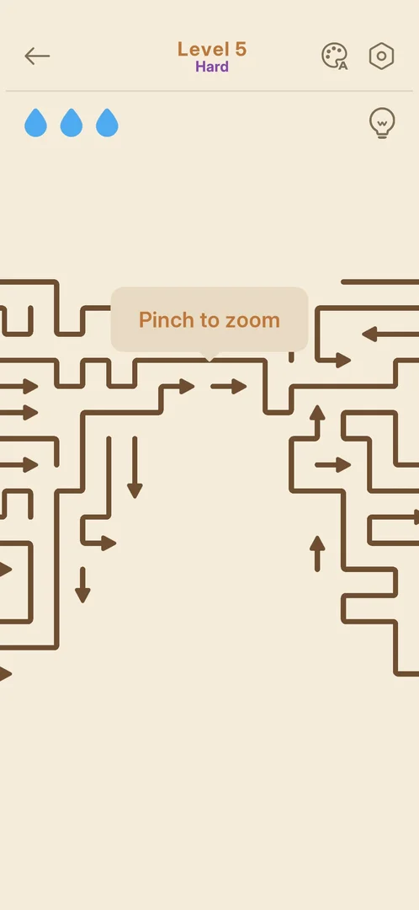
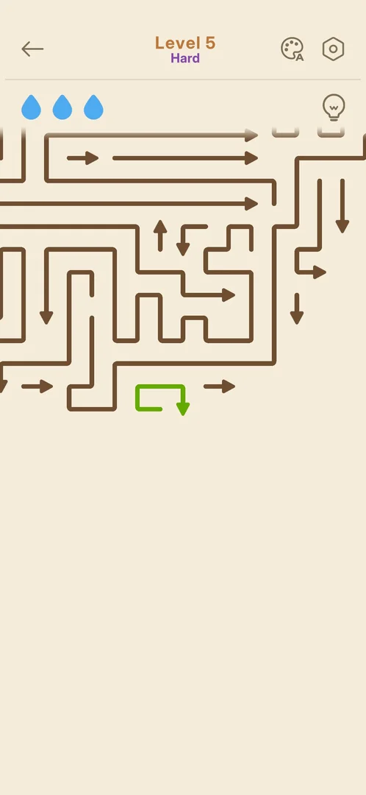
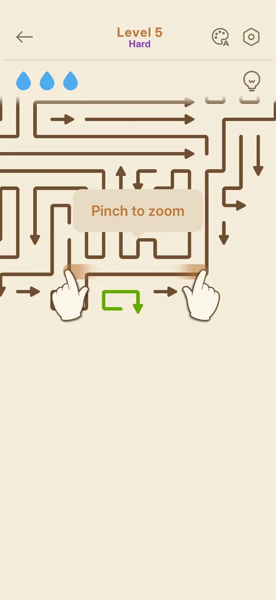
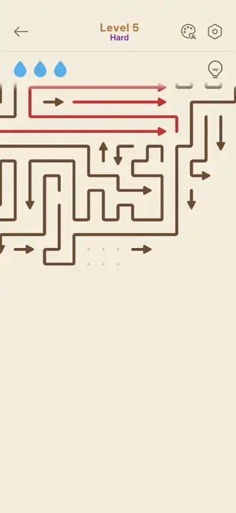

# Hint (bulb button in the level HUD)

A bulb button in the level's top bar. A tap moves the view to one arrow that can leave the board and
draws that arrow in green. A tap on the green arrow sends it off with no drop lost. The bulb has no
counter and no price. On Hard level 5 it was tapped 11 times in one session and about 55 times in the next, and
it stayed free every time; the second time level 5 was won by taking one hint after another [^s3] [^s5]
[^s6] [^s7] [^s9]. From Hard level 15 on, the bulb carries an orange "AD" badge; it was not tapped there
(see [Rewarded ad on the hint bulb](rewarded-hint-ad.md)) [^s13] [^s14].

## Why it appeared

The bulb is at the top right of the level's top bar on level 5, the first [Hard level](hard-level.md).
It was not on levels 3 and 4, but the win card counted "hints used" from level 3 on [^s1] [^s4].
The Normal level 6, the first level after Hard level 5, shows the bulb in the same place [^s12]; it was not tapped there.

## Where to find it

A level > the bulb button at the top right, under the gear and level with the three drops on the left
[^s2].

 [^s2]
*Level 5 Hard on opening: the bulb button at the top right, under the gear, on the same row as the three drops*

## What it looks like

 [^s10]
*After a bulb tap on level 5: one free arrow drawn in green, the rest of the board brown, three drops full*

The hint has no screen or popup of its own. After a tap the board pans (and zooms, where needed) to one
free arrow, and that arrow turns green. The rest of the board stays as it was [^s3] [^s5].

 [^s3]
*The first hint on level 5: the green arrow at the bottom of the visible board. The "Pinch to zoom" tip from the level's opening is still showing*

The clip shows a later hint. The bulb is tapped, the view slides to another part of the board, and a
green arrow is drawn in. The arrows that were tapped earlier while blocked stay red:

 [^s5]
*Clip 4.5 s · [original on YouTube from 1:25](https://youtu.be/GAWMSCppoKY?t=85)*

## How it works

Version 1.33.0, Hard level 5.

- One tap shows one free arrow. The view moves to it, sometimes to a far part of the board [^s3] [^s5].
- A tap on the green arrow sends it off like any free arrow. The three drops stay full [^s6] [^s8].
- The bulb was tapped 11 times on level 5 in one session and about 55 times in the next. It showed no counter,
  price, ad, popup or limit, and the bulb looked the same each time [^s3] [^s7] [^s9].
- The view does not always reach the green arrow: a few times it stayed off-screen and was found by
  panning the board with a swipe [^s11].
- A hint taken right after a blocked tap (the arrow left red) still showed a free arrow [^s9].
- Level 5 was won by repeating bulb, then green arrow, about two taps per arrow, in 13:15 with one
  mistake [^s9].
- The player's note: the view takes about 2 s to move to the green arrow [^s4].
- In a later session the bulb had no badge on level 14, and an orange "AD" badge on levels 15
  and 16. Inferred: the free hints have run out and a hint now costs an ad; not verified, as the bulb
  was not tapped [^s15] [^s13] [^s16].
- The Normal win card has a hints count. The Hard level 5 win card, the only win with hints, has no such
  row (Time, Score and Today's Levels only), so a count of hints used was not seen [^s9].

## Cases

| Case | What was done | Result | Source |
|---|---|---|---|
| Why it appeared <!-- case:chk-appeared --> | Opened Hard level 5 | ✅ The bulb is at the top right of the top bar on level 5. It was not on levels 3 and 4. The Normal level 6 has it too | [^s4] [^s1] [^s12] |
| Where to find it <!-- case:chk-entry --> | Looked at the level 5 top bar | ✅ The bulb is under the gear, on the row of the three drops | [^s2] |
| Its screen <!-- case:chk-screen --> | Tapped the bulb | ✅ No screen of its own: the view pans to a free arrow and draws it in green | [^s3] [^s5] |
| Its effect <!-- case:chk-effect --> | Tapped the bulb, then the green arrow, several times | ✅ One use shows one free arrow. Tapping it removes the arrow and costs no drop | [^s6] [^s8] |
| Balance <!-- case:chk-balance --> | Looked at the bulb before and after each use, in two sessions | ✅ No counter or price badge on the bulb. 11 taps, then about 55 taps on level 5, all free | [^s7] [^s9] |
| Sources <!-- case:chk-sources --> | — | not verified: no way to get hints was seen, and none was needed | |
| Sinks <!-- case:chk-sinks --> | Used the bulb about 55 times in one level | ✅ None seen: no price, ad, counter or popup on any use | [^s9] |
| When the view does not reach the arrow <!-- case:off-screen --> | Tapped the bulb when the free arrow was far away | ✅ A few times the green arrow stayed off-screen; a swipe on the board brought it into view | [^s11] |
| At zero <!-- case:chk-empty --> | — | not verified: no limit was reached in about 65 uses over two sessions | [^s9] |
| Refill timer <!-- case:chk-refill --> | — | not verified: no counter to refill | |
| The AD badge <!-- case:ad-badge --> | Looked at the bulb on levels 14, 15 and 16 | ✅ No badge on level 14; an orange "AD" badge on 15 and 16. Not tapped | [^s15] [^s13] [^s14] |

## Not verified

- Sources: any way to get hints, if they are counted at all (exp-hint-limit) <!-- case:chk-sources -->
- At zero: whether the AD badge means the free hints ran out, and what a tap on the badged bulb offers (exp-hint-limit) <!-- case:chk-empty -->
- Refill timer, if hints are limited <!-- case:chk-refill -->
- What the bulb does on a Normal level (seen on level 6, not tapped), and the Normal win card's "hints" count after hints are used

[^s1]: session 20261003-232357-chrono-2FYKPJ, step 18 — [video at 3:20](https://youtu.be/x9mSZuHgO_4?t=200)
[^s2]: session 20261003-233756-chrono-2FYKPJ, step 1 — [video at 0:16](https://youtu.be/GAWMSCppoKY?t=16)
[^s3]: session 20261003-233756-chrono-2FYKPJ, step 2 — [video at 0:36](https://youtu.be/GAWMSCppoKY?t=36)
[^s4]: session 20261003-233756-chrono-2FYKPJ, step 24 — [video at 5:43](https://youtu.be/GAWMSCppoKY?t=343)
[^s5]: session 20261003-233756-chrono-2FYKPJ, step 6 — [video at 1:29](https://youtu.be/GAWMSCppoKY?t=89)
[^s6]: session 20261003-233756-chrono-2FYKPJ, step 10 — [video at 2:12](https://youtu.be/GAWMSCppoKY?t=132)
[^s7]: session 20261003-233756-chrono-2FYKPJ, step 15 — [video at 3:28](https://youtu.be/GAWMSCppoKY?t=208)
[^s8]: session 20261003-233756-chrono-2FYKPJ, step 3 — [video at 0:55](https://youtu.be/GAWMSCppoKY?t=55)
[^s9]: session 20261004-001551-chrono-2FYKPJ, step 110 — [video at 14:08](https://youtu.be/Utiq9YFZiRU?t=848)
[^s10]: session 20261004-001551-chrono-2FYKPJ, step 2 — [video at 0:42](https://youtu.be/Utiq9YFZiRU?t=42)
[^s11]: session 20261004-001551-chrono-2FYKPJ, step 86 — [video at 11:23](https://youtu.be/Utiq9YFZiRU?t=683)

[^s12]: session 20261005-010045-chrono-2FYKPJ, step 93 — [video at 14:50](https://youtu.be/x_UvTQLpmEQ?t=890)

[^s13]: session 20261005-224323-chrono-2FYKPJ, step 36 — [video at 10:17](https://youtu.be/qnyS1lQt1kE?t=617)
[^s14]: session 20261005-224323-chrono-2FYKPJ, step 42 — [video at 13:46](https://youtu.be/qnyS1lQt1kE?t=826)
[^s15]: session 20261005-224323-chrono-2FYKPJ, step 29 — [video at 8:11](https://youtu.be/qnyS1lQt1kE?t=491)
[^s16]: session 20261005-224323-chrono-2FYKPJ, step 53 — [video at 20:10](https://youtu.be/qnyS1lQt1kE?t=1210)
