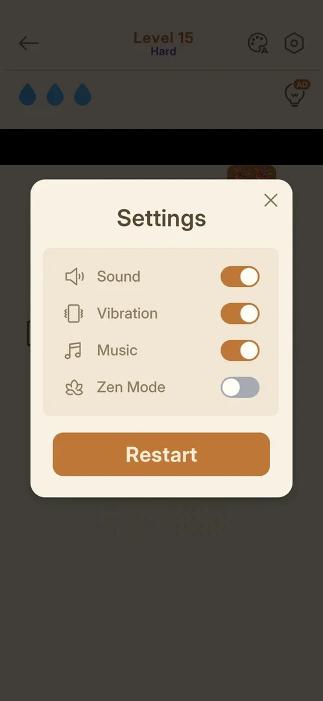
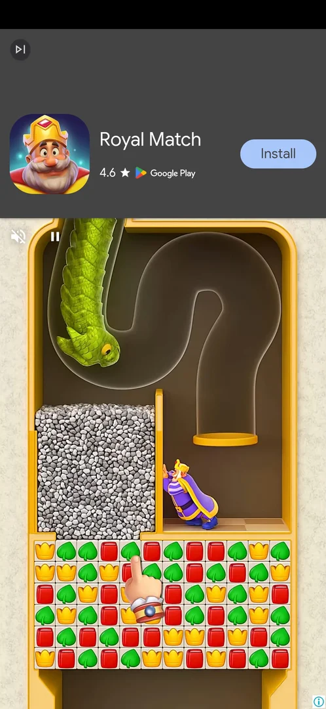
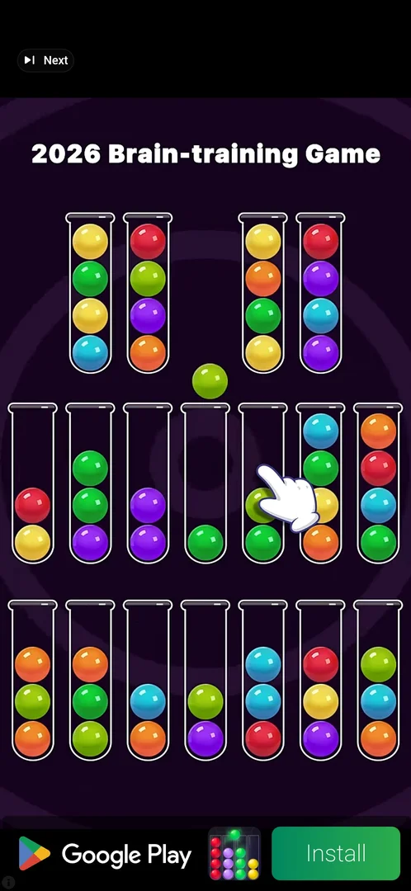
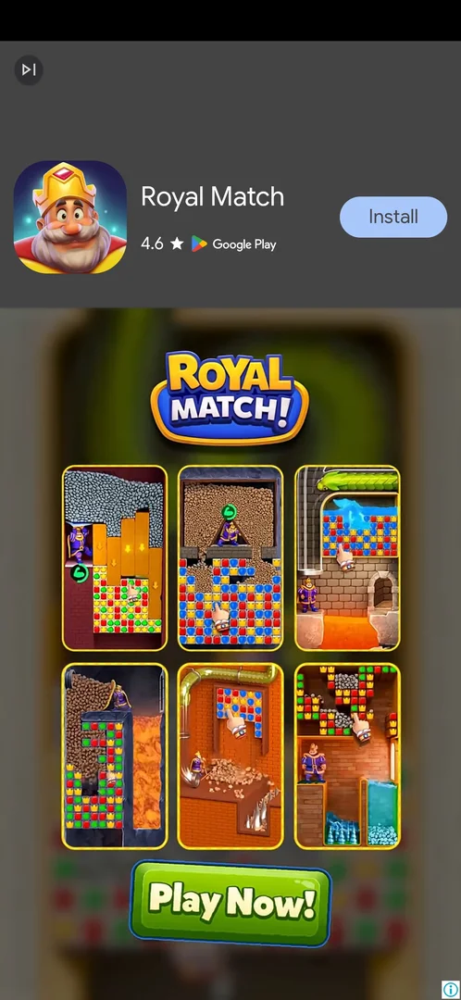
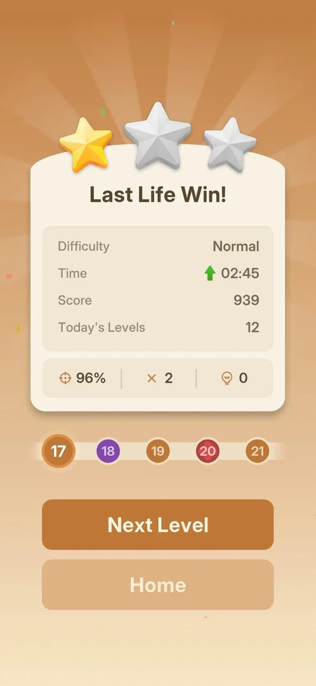

# Interstitial ad (after a gear-popup restart or a win)

A full-screen video ad for another game that comes unasked between a level action and the next screen.
It was seen three times over two sessions: after Restart in the gear popup of Hard level 15, after the
level 15 win and after the level 16 win [^s1] [^s3] [^s9]. It has no close button while it plays and none
on its end card; the first two ended in a Google Play sheet over the game, the third was closed with the
phone's Back key, and play went on where it was headed (a fresh board, the win card) [^s4] [^s8] [^s10].

## Why it appeared

The first ad seen in the game. It came on Restart in the in-level gear popup on Hard level 15. The wins
of levels 13 and 14 earlier in the same session brought none [^s1] [^s5] [^s6]. Hypothesis: the game
starts showing interstitials at a level count (here between 14 and 15) or after a set time in the session,
not verified.

## Where to find it

It has no button of its own. It comes after:

- Restart, the orange button at the bottom of the Settings popup that the gear opens inside a level
  [^s2] [^s1];
- a win: after Continue on the [Bronze League](bronze-league.md) card that follows a win (level 15), or
  by itself about 3 s after the win card appears, with no tap (level 16) [^s3] [^s9].

 [^s2]
*The gear popup on Hard level 15: the orange Restart button at the bottom brought the ad (a banner with a player's name is blacked out)*

## What it looks like

A full-screen video for another puzzle game, with an animated hand playing it [^s1] [^s9]. The layout
seen after the level 16 win: a skip icon at the top left; under it an app card with the game's icon,
name, Google Play rating and an Install button; mute and pause icons over the top corner of the video;
an (i) at the bottom right; no close X [^s9]. The ad after the gear-popup Restart had a small "Next"
label with the skip icon at the top left and a Google Play bar with Install at the bottom instead [^s1].
The ad is not part of the game; what it advertises and its layout change (a ball-sort game twice, a
match-3 game once) [^s1] [^s3] [^s9].

 [^s9]
*The ad after the level 16 win: the skip icon top left, the app card with Install, mute and pause over the video, (i) bottom right; no close X*

 [^s1]
*The ad after the gear-popup Restart: a "Next" label at the top left, a Google Play bar with Install at the bottom*

## What you can do

| Tab or button | What it does |
|---|---|
| [End card](#end-card) | The still card the video ends on; no X; the phone's Back closes it [^s9] [^s10] |
| [After the ad](#after-the-ad) | The screen the action was headed to: a fresh board or the win card [^s8] [^s10] |

### End card

About 25 s in, the video stopped on a still end card: the advertised game's logo, six small level
pictures and a "Play Now!" button, with the skip icon (a tap on it, "Next" on the earlier ad, did not
end the ad [^s4]) and the app card still at the top and no close X
[^s9]. After about 45 s more there was still no X [^s9].

 [^s9]
*The end card about 25 s in: logo, six level pictures, Play Now!, the app card at the top; no close X*

### After the ad

The phone's Back key on the end card closed the ad with no store opened, and the level 16 win card was
underneath: Last Life Win!, 1 star, Normal, 02:45, score 939, 96%, 2 mistakes, 0 hints, Next Level to 17
and Home; the win was kept [^s10]. The two earlier ads ran for about 35 to 55 s and ended in a Google Play
sheet; back in the game the gear-popup Restart had put the board back at its first layout, and the win led
on to the win card [^s1] [^s8] [^s4].

 [^s10]
*The level 16 win card after Back closed the ad: Last Life Win!, 1 star, score 939; the win kept*

## How it works

Version 1.33.0.

- Seen after: Restart in the gear popup on Hard level 15; the level 15 win, after the league card's
  Continue; the level 16 win, by itself about 3 s after the win card appeared [^s1] [^s3] [^s9].
- Not seen after: the wins of levels 13 and 14; Restart in the Out of Lives popup on level 16; the level
  17 win, watched for 10 s on the win card [^s5] [^s6] [^s7] [^s11].
- The level 17 win came about 3 min after a [rewarded ad for Continue](rewarded-continue-ad.md) on the
  same level [^s12] [^s11]. Hypothesis: the rewarded ad starts a cooldown that the interstitial shares,
  not verified (experiment exp-interstitial-cooldown).
- No close X during the video or on the end card; a tap on the skip icon ("Next") did not end it [^s4]
  [^s9]. Left alone, it opened a Google Play sheet after about 35 to 55 s [^s8] [^s4]; the phone's Back
  key on the end card closed it at once [^s10].
- No reward: it is not offered, it comes unasked [^s1].

## Cases

| Case | What was done | Result | Source |
|---|---|---|---|
| Why it appeared <!-- case:chk-appeared --> | Tapped Restart in the gear popup on Hard level 15 | ✅ The first ad of the game; the level 13 and 14 wins before it had none | [^s1] [^s5] [^s6] |
| Where to find it <!-- case:chk-entry --> | Restart in the gear popup; Continue on the league card after a win | ✅ No button: it plays after those actions | [^s1] [^s3] |
| The kind <!-- case:chk-kind --> | Watched it | ✅ Interstitial: full screen, between a level action and the next screen | [^s1] |
| How it closes <!-- case:chk-close --> | Tapped Next, then waited | ✅ Next did not end it; after about 35 to 55 s a Google Play sheet opened; back in the game, a fresh board or the win card | [^s4] [^s8] |
| A reward <!-- case:chk-reward --> | — | ✅ Does not apply: an interstitial, no reward | [^s1] |
| Its screen <!-- case:chk-screen --> | Watched the ad after the level 16 win | ✅ Skip icon top left, app card with rating and Install, mute and pause over the video, (i) bottom right, no close X in the first seconds; the layout differs between ads | [^s9] [^s1] |
| Back closes it <!-- case:back-closes --> | Waited 45 s on the end card for an X, then pressed the phone's Back | ✅ The ad closed with no store opened; the win card underneath, the win kept | [^s10] |
| Starts by itself after a win <!-- case:after-win-auto --> | Left the level 16 win card untouched | ✅ The ad started about 3 s after the win card appeared, with no tap | [^s9] |
| How often <!-- case:chk-frequency --> | Watched the screen after each win and restart over two sessions | ✅ After the gear-popup Restart (L15) and the L15 and L16 wins; not after the L13, L14 and L17 wins or the Out of Lives Restart (L16); the L17 win followed a rewarded ad by about 3 min | [^s1] [^s3] [^s9] [^s5] [^s6] [^s7] [^s11] |

## Not verified

- Whether interstitials start at a level count (between 14 and 15) or after a time in the session
- Whether a rewarded ad starts a cooldown for interstitials (experiment exp-interstitial-cooldown)
- Whether the skip icon ever skips the video

[^s1]: session 20261005-224323-chrono-2FYKPJ, step 40 — [video at 12:21](https://youtu.be/qnyS1lQt1kE?t=741)
[^s2]: session 20261005-224323-chrono-2FYKPJ, step 39 — [video at 12:16](https://youtu.be/qnyS1lQt1kE?t=736)
[^s3]: session 20261005-224323-chrono-2FYKPJ, step 48 — [video at 18:17](https://youtu.be/qnyS1lQt1kE?t=1097)
[^s4]: session 20261005-224323-chrono-2FYKPJ, step 49 — [video at 18:37](https://youtu.be/qnyS1lQt1kE?t=1117)
[^s5]: session 20261005-224323-chrono-2FYKPJ, step 10 — [video at 3:06](https://youtu.be/qnyS1lQt1kE?t=186)
[^s6]: session 20261005-224323-chrono-2FYKPJ, step 34 — [video at 9:47](https://youtu.be/qnyS1lQt1kE?t=587)
[^s7]: session 20261005-224323-chrono-2FYKPJ, step 54 — [video at 21:09](https://youtu.be/qnyS1lQt1kE?t=1269)
[^s8]: session 20261005-224323-chrono-2FYKPJ, step 41 — [video at 13:39](https://youtu.be/qnyS1lQt1kE?t=819)
[^s9]: session 20261005-233140-chrono-2FYKPJ, step 22 — [video at 5:15](https://youtu.be/DgjM3dslI6E?t=315)
[^s10]: session 20261005-233140-chrono-2FYKPJ, step 23 — [video at 7:51](https://youtu.be/DgjM3dslI6E?t=471)
[^s11]: session 20261005-233140-chrono-2FYKPJ, step 49 — [video at 14:36](https://youtu.be/DgjM3dslI6E?t=876)
[^s12]: session 20261005-233140-chrono-2FYKPJ, step 29 — [video at 11:30](https://youtu.be/DgjM3dslI6E?t=690)
