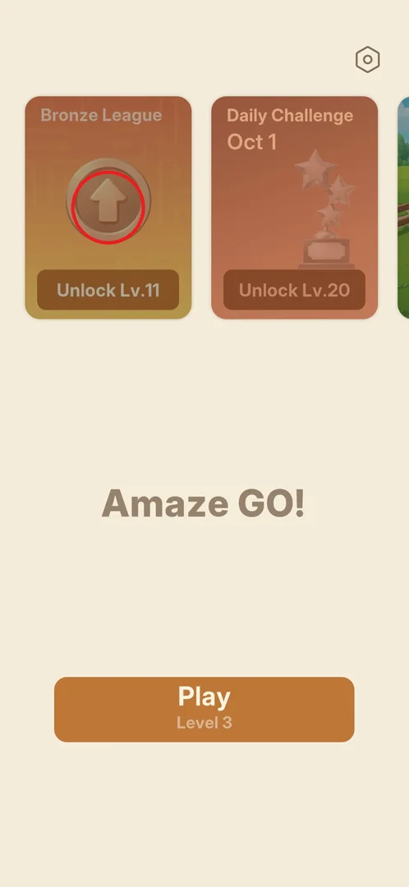

# Leagues (Bronze League)

A league mode, shown on the main menu as the "Bronze League" card. It opens at level 11; in this session
the player was at level 3, so only the locked card was seen [^s1]. From the name and the bronze coin it is
likely a ranked competition with tiers above Bronze (inferred).

## Where to find it

From the [main menu](main-menu.md): the first card of the card row, "Bronze League" [^s1].

 [^s1]

## What it looks like

<!-- no-screen: the mode is locked until level 11; the session ended at level 3 -->

Only the card was seen: a dimmed orange card titled "Bronze League" with a bronze coin carrying an up
arrow over a faint maze of arrows, and the label "Unlock Lv.11" [^s1].

## How it works

- Unlocks at level 11 (version 1.31.0) [^s1].

## Cases

| Case | What was done | Result | Source |
|---|---|---|---|
| Open the league | <!-- --> | not verified |  |

## Not verified

- What the league screen shows: opponents, ranking, rewards, season length.
- What tapping the locked card shows (not tapped; the Event card shows a bubble with the unlock level).

[^s1]: session 20261001-204000-chrono-2FYKPJ, step 10 — [video at 2:29](https://youtu.be/tbyupdD9iso?t=149)
