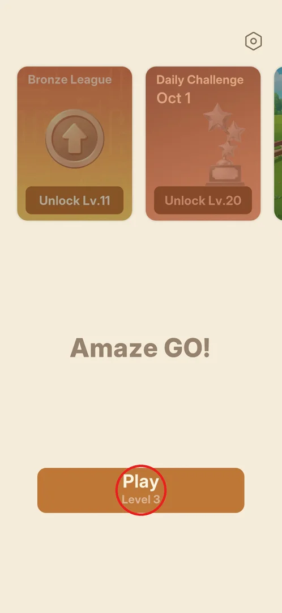
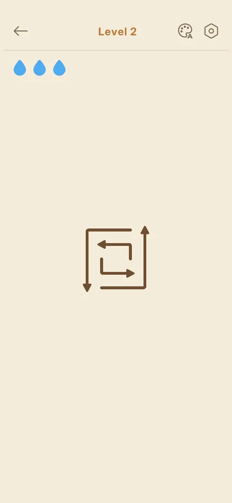

# Level screen HUD (lives, theme, settings)

The level screen is where the game is played: a board of arrows in the middle, and around it a thin top
bar and a row of lives. The player taps arrows to send them off the board; the bar gives the way back to
the main menu, the colour theme and the settings [^s2].

## Where to find it

From the [main menu](main-menu.md): the Play button, which also shows the number of the next level
("Level 3") [^s1] [^s3]. After a level, the Next Level button of the
[result screen](level-result.md) opens the next one [^s2]. On a fresh
install the game opens straight into level 1 [^s4].

 [^s1]

## What it looks like

A plain beige screen. The top bar has a back arrow on the left, the level number in the middle
("Level 2"), and on the right a palette icon with a small "A" and a hexagon gear. Under the bar on the
left are three blue drops. The board, a small cluster of straight and bent arrows, sits in the middle of
the screen [^s2].

 [^s2]

The tutorial level 1 has none of this: only the arrows and a bubble "Tap an arrow" with a hand pointing
at the arrow to tap first [^s4]. The full bar appears from level 2
[^s2].

## What you can do

| Tab or button | What it does |
|---|---|
| [Back arrow](main-menu.md) | Leaves the level for the main menu |
| [Palette](themes.md) | Opens the colour theme picker |
| [Gear](settings.md) | Settings (inferred from the icon; not opened from a level in this session) |
| [Blue drops](lives.md) | Lives for the level |

## How it works

- An arrow slides off the board in the direction of its head when tapped, if nothing blocks its path.
  Freeing the outer arrows first unblocks the inner ones; the level ends when the board is empty
  [^s5] [^s6].
- As arrows leave, a grid of faint dots shows the cells they used to cover [^s6]
  [^s7].
- The boards of levels 1 to 3 have 4 or 5 arrows and took 11 to 25 seconds each (version 1.31.0)
  [^s8] [^s6] [^s9].
- A tap made while another arrow was still sliding was ignored [^s6].
- The tap area of an arrow is generous: a tap meant for a blocked arrow next to a free one moved the
  free one instead, with no mistake counted [^s10].
- Leaving a level with the back arrow does not skip it: Play in the main menu offers the same level
  again [^s11] [^s3].

## Cases

| Case | What was done | Result | Source |
|---|---|---|---|
| Clear levels 1 to 3 | Tapped the free arrows first, then the ones they freed | ✅ Each level cleared without a mistake | [^s9] |
| Leave a level | Back arrow on level 3 | ✅ The main menu opens, Play shows "Level 3" | [^s11] |
| Tap a blocked arrow | Tapped the inner arrow of level 3 while it was blocked | ❓ The neighbouring free arrow moved instead; no drop lost | [^s10] |

## Not verified

- What the gear opens from inside a level.
- What tapping a truly blocked arrow does (see [Lives](lives.md)).
- Whether a hint button appears on later levels (see [Hints](hints.md)).
- Whether the board grows with the level number.
- Whether a level left half-way keeps its progress (level 3 was left before any move).

[^s1]: session 20261001-204000-chrono-2FYKPJ, step 15 — [video at 3:24](https://youtu.be/tbyupdD9iso?t=204)
[^s2]: session 20261001-204000-chrono-2FYKPJ, step 6 — [video at 1:31](https://youtu.be/tbyupdD9iso?t=91)
[^s3]: session 20261001-204000-chrono-2FYKPJ, step 16 — [video at 3:34](https://youtu.be/tbyupdD9iso?t=214)
[^s4]: session 20261001-204000-chrono-2FYKPJ, step 2 — [video at 0:35](https://youtu.be/tbyupdD9iso?t=35)
[^s5]: session 20261001-204000-chrono-2FYKPJ, step 7 — [video at 1:48](https://youtu.be/tbyupdD9iso?t=108)
[^s6]: session 20261001-204000-chrono-2FYKPJ, step 8 — [video at 1:58](https://youtu.be/tbyupdD9iso?t=118)
[^s7]: session 20261001-204000-chrono-2FYKPJ, step 20 — [video at 4:18](https://youtu.be/tbyupdD9iso?t=258)
[^s8]: session 20261001-204000-chrono-2FYKPJ, step 4 — [video at 1:03](https://youtu.be/tbyupdD9iso?t=63)
[^s9]: session 20261001-204000-chrono-2FYKPJ, step 22 — [video at 4:43](https://youtu.be/tbyupdD9iso?t=283)
[^s10]: session 20261001-204000-chrono-2FYKPJ, step 21 — [video at 4:30](https://youtu.be/tbyupdD9iso?t=270)
[^s11]: session 20261001-204000-chrono-2FYKPJ, step 10 — [video at 2:29](https://youtu.be/tbyupdD9iso?t=149)
