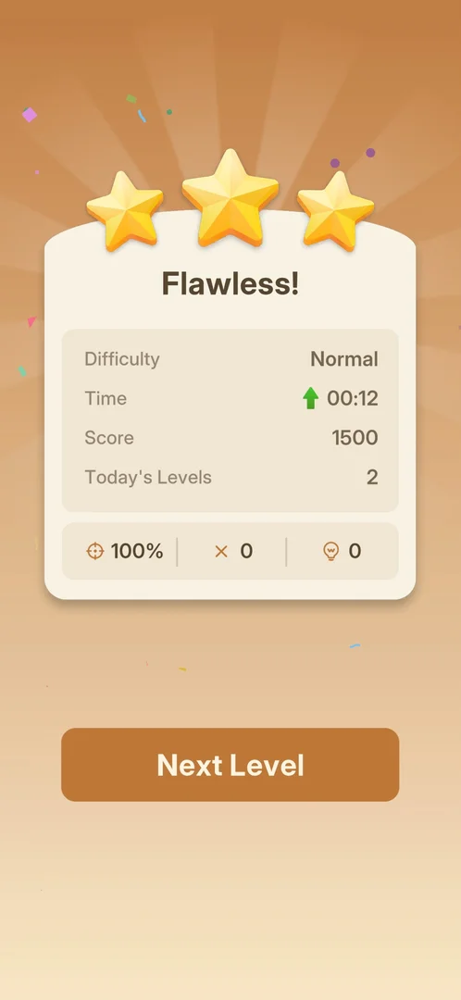

# Level result screen

The screen shown after a level is cleared: it grades the run with up to three stars and a title, sums
up the level (difficulty, time, score, levels played today, accuracy, mistakes, hints used) and leads on
to the next level [^s1] [^s2].

## Where to find it

<!-- no-entry: shown by itself when the last arrow leaves the board -->

Nothing opens it: it appears by itself when the last arrow of a level has left the board
[^s2].

## What it looks like

An orange background with rays and confetti, three gold stars over a cream card. The card has a title
("Flawless!" in every level of this session), then four rows: Difficulty, Time, Score and Today's
Levels, and a bottom strip with three counters: accuracy (a target icon, in %), mistakes (a cross) and
hints used (a lightbulb). The Next Level button appears under the card a moment later [^s1]
[^s2] [^s3].

 [^s1]

## What you can do

| Tab or button | What it does |
|---|---|
| [Next Level](#next-level) | Starts the next level |

### Next Level

The only button on the screen, under the result card. It is not there at first: right after the level
the screen shows only the card, and the button shows up a few seconds later
[^s2] [^s3]. It opens the next level
straight away, with no ad in this session (levels 1 to 3) [^s4]
[^s5].

 [^s1]

## How it works

Version 1.31.0, levels 1 to 3:

| Level | Title | Difficulty | Time | Score | Today's Levels | Accuracy | Mistakes | Hints |
|---|---|---|---|---|---|---|---|---|
| 1 | Flawless! | Normal | 00:11 | 1500 | 1 | 100% | 0 | 0 |
| 2 | Flawless! | Normal | 00:12 | 1500 | 2 | 100% | 0 | 0 |
| 3 | Flawless! | Normal | 00:25 | (counting up) | 3 | 100% | 0 | 0 |

- The score counts up on screen: level 1 first showed 1493 and then 1500, level 3 was caught at 2
  [^s2] [^s3] [^s6].
- A level without mistakes gets three stars and the title "Flawless!" [^s2].
- On level 2 the time had a green up arrow next to it (00:12 against 00:11 on level 1) [^s1]. What
  the arrow compares (the previous level or a personal record) is not known; it may mark a change
  against the previous level (inferred).
- Today's Levels counts the levels finished today: 1, 2, 3 over the session [^s1]
  [^s6].

## Cases

| Case | What was done | Result | Source |
|---|---|---|---|
| Clear a level with no mistakes | Levels 1, 2 and 3 | ✅ Three stars, "Flawless!", accuracy 100%, mistakes 0 | [^s2] |
| Go on to the next level | Tapped Next Level | ✅ The next level opens, no ad | [^s4] |

## Not verified

- The result after a level with mistakes: fewer stars, a different title, a lower score or accuracy.
- What a hint does to the result (no hint was used).
- What the Difficulty row shows on harder levels (only Normal was seen).
- What happens when all lives are lost (a fail screen was not seen).
- Whether ads appear between levels later on.

[^s1]: session 20261001-204000-chrono-2FYKPJ, step 8 — [video at 1:58](https://youtu.be/tbyupdD9iso?t=118)
[^s2]: session 20261001-204000-chrono-2FYKPJ, step 4 — [video at 1:03](https://youtu.be/tbyupdD9iso?t=63)
[^s3]: session 20261001-204000-chrono-2FYKPJ, step 5 — [video at 1:23](https://youtu.be/tbyupdD9iso?t=83)
[^s4]: session 20261001-204000-chrono-2FYKPJ, step 6 — [video at 1:31](https://youtu.be/tbyupdD9iso?t=91)
[^s5]: session 20261001-204000-chrono-2FYKPJ, step 9 — [video at 2:19](https://youtu.be/tbyupdD9iso?t=139)
[^s6]: session 20261001-204000-chrono-2FYKPJ, step 22 — [video at 4:43](https://youtu.be/tbyupdD9iso?t=283)
