# Level (arrows-escape board)

The game's core level. A board of bent arrows lies on a dot grid. Tapping an arrow makes it slide off the
board in the direction of its head, its body following its own path. The level is won when every arrow
has left. Three blue drops at the top left are the mistake allowance: a tap on an arrow that is blocked
costs one. When all three are gone, an Out of Lives! popup offers a Continue (free the first time in a
session, later for an ad) or a Restart [^s3] [^s11] [^s12] [^s15] [^s35].

## Why it appeared

The Play button on Home is there from the first launch. It read "Level 1" before the cloud restore and
"Level 3" after it [^s1].

## Where to find it

Home > the wide Play button at the bottom, which shows the next level under the word Play ("Level 3"
here) [^s2]. When the next level is a [Hard level](hard-level.md), the button turns purple and reads
"Hard / Level N" [^s13].

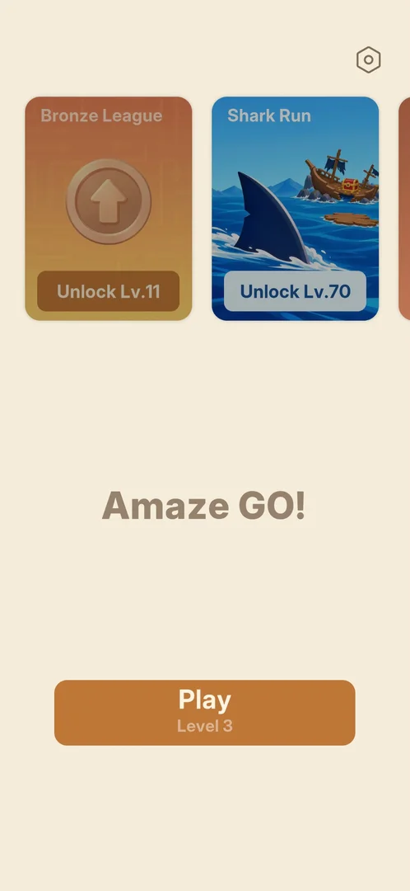 [^s2]
*Home: the Play button at the bottom, "Play / Level 3", opens the level*

## What it looks like

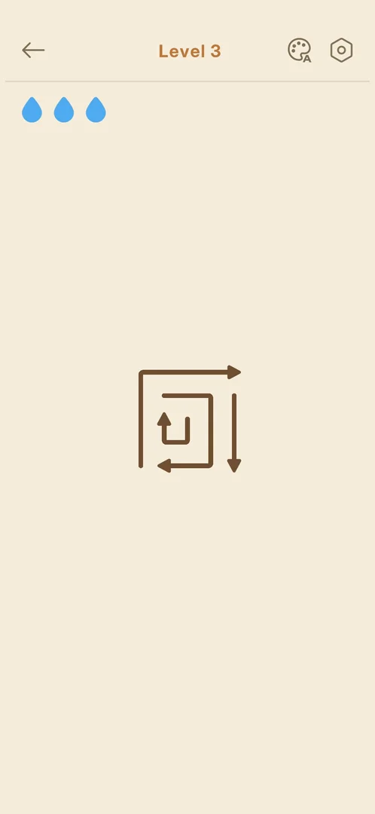 [^s3]
*Level 3: four bent arrows in the middle of a beige field*

A beige field with the board in the middle. Level 3 has four bent arrows [^s3]. The top bar has these
controls [^s3] [^s9]:

- a back arrow on the left, which leaves the level;
- the title "Level N" in the middle, with a purple "Hard" under it on Hard levels [^s5];
- a palette icon with a letter A (theme picker, not opened);
- a gear, which opens a short Settings popup.

Below the bar, three blue drops are at the left. From level 5 a [hint](hint.md) bulb is at the right: on
Hard level 5 and on the Normal level 6 [^s5] [^s21]. As arrows leave, the cells they freed show as dots
of the grid [^s11].

From level 6 a round white button with a grid icon sits at the bottom right, below the board: the
[guideline](guideline.md) switch [^s21].

 [^s21]
*Level 6, the first Normal level after Hard level 5: a full board, the hint bulb top right, the grid button bottom right*

Level 6 fills the screen's width with about 25 arrows, many of them square spirals, on a grid finer than
level 5's [^s21] [^s22].

## What you can do

| Tab or button | What it does |
|---|---|
| [Arrows](#arrows) | tap: the arrow slides off, or flashes red if blocked |
| [Drops](#drops) | three per level; a blocked tap greys one out |
| [Back arrow](#back-arrow) | leaves for Home at once |
| [Gear: Settings popup](#gear-settings-popup) | Sound, Vibration, Music, Zen Mode, Restart (a full-screen ad first) |
| [Win card](#win-card) | stars, title, stats, Next Level |
| [Hard level](#hard-level) | a purple level with a larger board, zoom and a hint bulb |
| [Guideline button](#guideline-button) | from level 6: draws a line along every arrow's way out |
| [Out of Lives popup](#out-of-lives-popup) | comes up when the third drop is lost |
| [Continue](#continue) | three new drops, the board kept: free, or for an ad |
| [Restart](#restart) | the board back to its start, three drops |

### Arrows

<!-- no-frame: the arrows are on the level frame above; the motion is in the clip -->
A tap on an arrow whose way out is free sends it off the board. It turns green as it slides along its
path, then it is gone [^s11]. The clip shows the last arrow of level 3 leaving and the win card coming in:

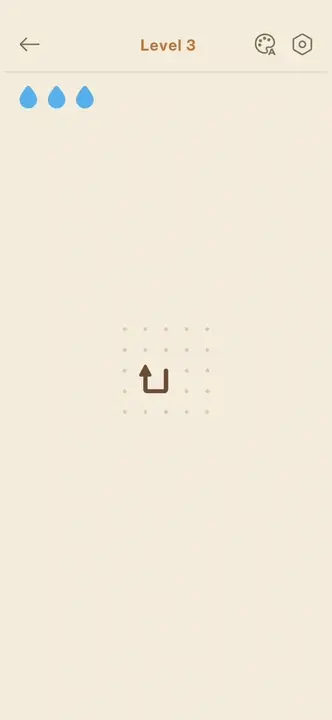 [^s12]
*Clip 5.1 s · [original on YouTube from 1:36](https://youtu.be/x9mSZuHgO_4?t=96)*

### Drops

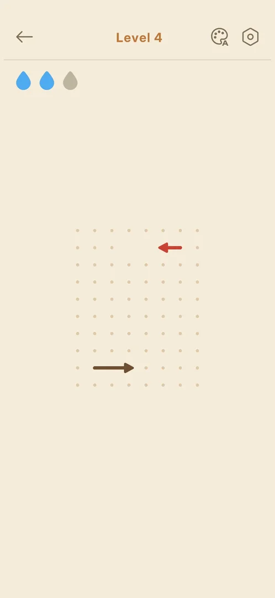 [^s4]
*Level 4 after a blocked tap: the third drop is grey and the blocked arrow stays red*

A tap on an arrow with another arrow in its way costs one drop. The third drop turns grey, the arrow
flashes red and stays where it was, and the win card counts it as a mistake [^s11] [^s7]. More on the
[Drops](drops.md) page.

 [^s11]
*Clip 6.2 s · [original on YouTube from 2:25](https://youtu.be/x9mSZuHgO_4?t=145)*

### Back arrow

<!-- no-frame: the control is on the level frame above; its result is Home -->
The back arrow leaves the level for Home at once, with no confirmation [^s10] [^s13]. With full drops no
cost was seen, and Play shows the same level again [^s10].

### Gear: Settings popup

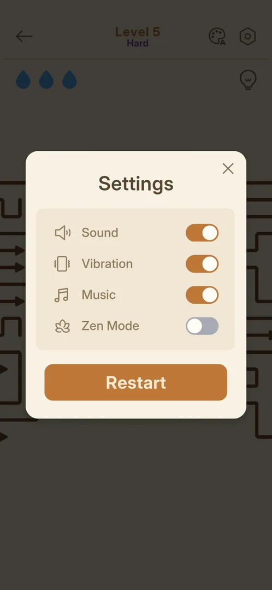 [^s6]
*The gear inside a level: four switches and an orange Restart button*

A popup over the dimmed board. It has Sound, Vibration and Music switches (on), a Zen Mode switch (off),
an orange Restart button, and an X to close [^s6]. Restart, tapped on Hard level 15 with part of the
board cleared, brought a full-screen ad first, with a "Next" skip label at the top left, ending in a
Play Store sheet over the game. Back in the game, the board was at its first layout with three drops
[^s36] [^s37]. See also
[Settings](settings.md#in-level-settings-popup).

### Win card

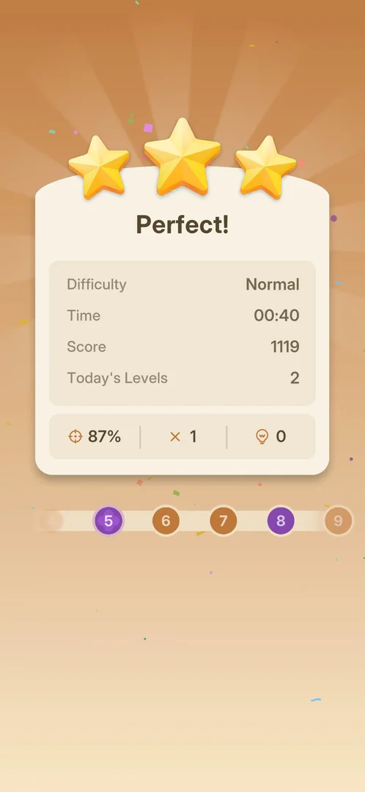 [^s7]
*Level 4 won with one mistake: Perfect!, and the level path with purple Hard nodes 5 and 8*

After the last arrow leaves, a card comes in over an orange sunburst with confetti [^s12] [^s7]. It shows:

- three stars and a title. "Perfect!" came with 1 mistake; with 0 mistakes the titles were "Flawless!",
  "Untouchable!", "Arrow Pro!" and "Unstoppable Today!", so the title does not follow from the mistakes
  alone [^s12] [^s7] [^s26] [^s27] [^s29];
- Difficulty, Time, Score and Today's Levels. On level 6 a green up arrow stood next to the time; from
  level 7 a gold "S" coin stood next to the score [^s26] [^s27];
- a row with accuracy, mistakes and hints used.

The Next Level button is orange, and purple when the next level is Hard [^s27] [^s29].

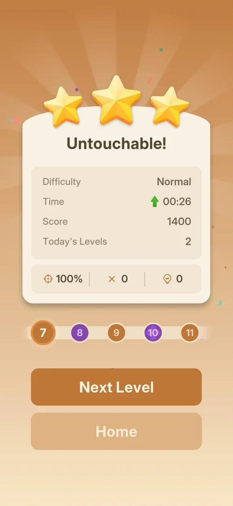 [^s26]
*Level 6 won with no mistake: "Untouchable!", and a green up arrow next to the time*

After the level 6 win, a [Rate Us](rate-us.md) popup came up over this card [^s30].

A win after a Continue gets its own title. Level 14 was won after three blocked taps, a free Continue
and one more mistake: "Comeback Win!", two of three stars, accuracy 92%, 4 mistakes [^s38].

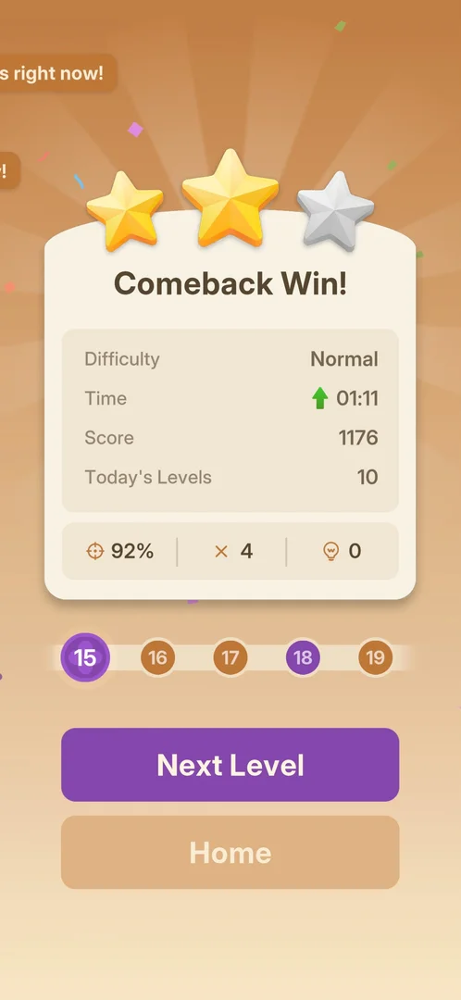 [^s38]
*Level 14 won after a Continue: "Comeback Win!" and two of three stars, the first Normal card seen with fewer than three*

Level 3 (0 mistakes) had a Next Level button under the card [^s12]. On the level 4 card a level path with
the next levels showed under it, with Hard levels in purple. A tap at the bottom of the screen opened
level 5 [^s7] [^s5]. After level 4's last move the [Daily Streak](daily-streak.md) screen came first, and
the card followed it [^s14].

### Hard level

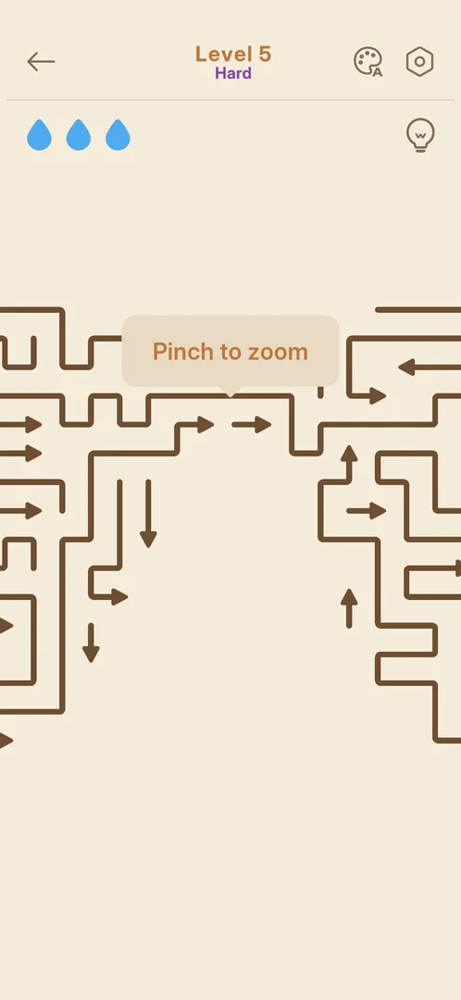 [^s5]
*Level 5, the first Hard level: the board runs past the screen edges*

See [Hard level](hard-level.md).

### Guideline button

 [^s23]
*Level 6 after a tap on the grid button: a tan line along each arrow's way out*

A tap on the round grid button at the bottom right draws a light tan line from every arrow's head to the
edge of the screen and turns the icon orange; a second tap removes them [^s23] [^s22]. See
[Guideline toggle](guideline.md).

### Out of Lives popup

 [^s15]
*Hard level 5 after the third blocked tap: the Out of Lives! popup*

The third blocked tap greys out the last drop, and the popup comes up over the dimmed board. It has the
title "Out of Lives!", three blue drops, a line offering to continue for free with 3 more lives, an
orange Continue button with a green "Free" badge, and a pale Restart button. It has no X [^s15]. Normal
levels show the same popup: on level 14 it was the same, Free badge included; on level 16 later in the
same session the line read "Watch an ad to get 3 more lives." and Continue had a video icon instead of
the badge (frame on the [Drops](drops.md#out-of-lives-popup) page) [^s39] [^s35].
The clip shows three blocked taps: each tapped arrow turns red, a drop greys out, and the popup comes in:

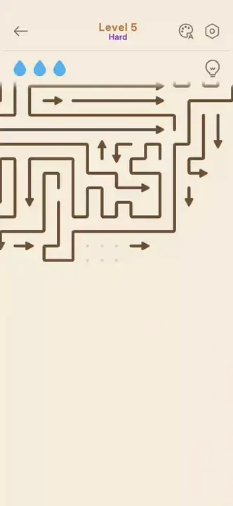 [^s15]
*Clip 9.4 s · [original on YouTube from 1:02](https://youtu.be/GAWMSCppoKY?t=62)*

### Continue

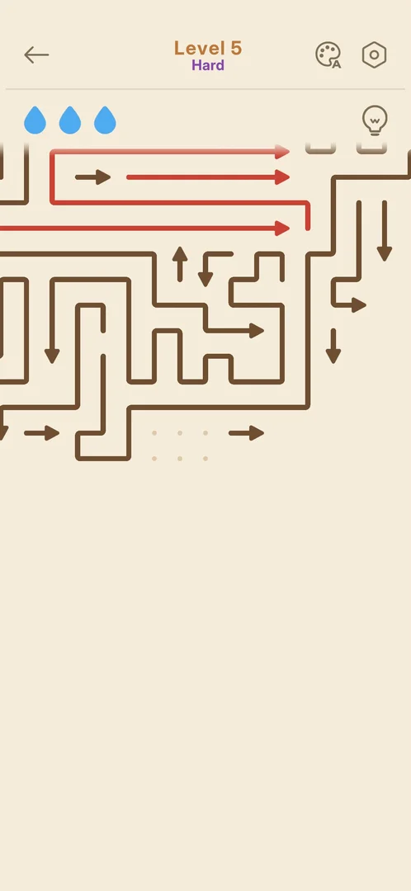 [^s16]
*After Continue: three full drops; the three arrows tapped while blocked are still red*

Continue closes the popup with no ad seen. The three drops are full again and the board stays as it
was. The arrows that were tapped while blocked stay red [^s16]. Continue was taken three times in a
row on level 5. It stayed Free and showed no limit [^s17] [^s18]. In a later session the free Continue
on level 14 worked the same, and the spent drops still counted as mistakes on the win card
[^s40] [^s38]. The next Out of Lives, on level 16 about 13 minutes later, asked for an ad; that
Continue was not taken [^s35].

### Restart

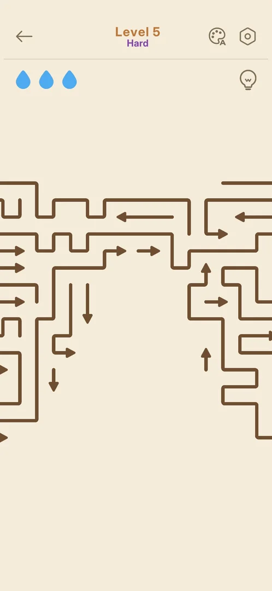 [^s19]
*After Restart on the Out of Lives popup: the board as it was when the level opened*

Restart on the popup sends the board back to its first layout with three drops, at once and with no
confirmation. No cost was seen [^s19]. On level 16, Restart on the ad version of the popup did the same,
with no ad seen [^s41]. Restart in the gear popup comes after a full-screen ad (see
[Gear: Settings popup](#gear-settings-popup)) [^s36].

## How it works

Version 1.33.0.

| Level | Mistakes | Title | Time | Score | Accuracy | Today's Levels | Source |
|---|---|---|---|---|---|---|---|
| 3 | 0 | Flawless! | 00:12 | 1500 | 100% | 1 | [^s12] |
| 4 | 1 | Perfect! | 00:40 | 1119 | 87% | 2 | [^s7] |
| 6 | 0 | Untouchable! | 00:26 | 1400 | 100% | 2 | [^s26] |
| 7 | 0 | Arrow Pro! | 00:55 | 1400 | 100% | 3 | [^s27] |
| 9 | 0 | Unstoppable Today! | 00:37 | 1500 | 100% | 5 | [^s29] |
| 14 | 4 (one Continue) | Comeback Win! | 01:11 | 1176 | 92% | 10 | [^s38] |

- All were Difficulty "Normal" and 0 hints. Levels 3 to 9 gave three stars; level 14, won after a
  Continue, two [^s12] [^s7] [^s26] [^s27] [^s29] [^s38].
- Boards grow: level 6 had 28 arrows, level 7 54 and level 9 36, all fitting the screen; Hard levels 8
  and 10 had 78 and 99 [^s28] [^s27] [^s29] [^s31]. The arrow counts are from the test tool's map of
  each board.
- Levels 1 to 10 have plain arrows only: no obstacles and no special pieces. Level 11, the first level
  after joining the [Bronze League](bronze-league.md), showed four [gold arrows](gold-arrows.md) [^s31]
  [^s32].
- The rule below was checked on levels 6 to 10: every one of 295 taps chosen by it sent an arrow off,
  with no mistake [^s28] [^s31].
- The score counts up on the card: 901, then 1486, then 1500 on level 3 [^s12].
- Levels 5 and 8 are Hard (purple) on the level path [^s7]; 10 as well [^s24].
- A win was not kept twice: Hard level 5, won in one session, was offered again in the next
  [^s25]; Normal level 12, won at the end of session 20261005-124219 (stopped on the win card), was on
  Play again in the next, and the Bronze League card was back at 38th, its level 12 points gone
  [^s33]. After the second level 12 win, left through Continue and Home,
  Home showed Hard Level 13 and 30th [^s34]. Inferred: a win is kept
  only once the player leaves the win card; not verified.
- Drops are lives: three per try. Three blocked taps bring the Out of Lives! popup [^s15]. Continue was
  free on Hard level 5 (three times) and on level 14, the first Out of Lives of a later session; on
  level 16, about 13 minutes after that, it asked for an ad [^s16] [^s40] [^s35]. Hypothesis:
  one free Continue per session or per day, not verified (exp-continue-free-once).
- Full-screen ads: none came after the wins of levels 13 and 14. One came on Restart in the gear popup
  (Hard level 15), and one on Continue of the league card after the level 15 win [^s42] [^s38]
  [^s36] [^s43]. Both ended in a Play Store sheet that had to be left.
- Normal boards keep growing: level 14 had 46 arrows and level 16 55, by the test tool's map
  [^s44] [^s45].
- Closing the app mid-level: the app opens on Home with the same level on Play. The board's progress is
  not kept [^s20].
- An arrow can leave only when no arrow lies on the straight line from its head to the edge of the
  board; otherwise it flashes red and costs a drop [^s11] [^s28].
- There is no timer and no move limit: the in-game Time only counts up. The only loss seen (Out of
  Lives) never ends the level for good: Continue (free or for an ad) or Restart always remains [^s28]
  [^s35].

## Outcomes

| Outcome | What happens | Frame |
|---|---|---|
| Win <!-- case:chk-win --> | Win card: stars, Flawless!/Perfect!, stats. Then Next Level, or the level path; the Daily Streak screen may come first |  |
| Quit (back arrow) <!-- case:chk-quit --> | Home at once, no confirmation; the same level stays on Play | — |
| Out of lives <!-- case:out-of-lives --> | The Out of Lives! popup: Continue (three new drops, the board kept; Free, or for an ad) or Restart. Seen on Hard level 5 and Normal levels 14 and 16 [^s15] [^s39] [^s35] | 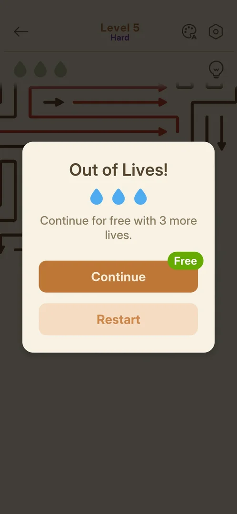 |
| Restart <!-- case:chk-restart --> | From the Out of Lives popup: the board back to its start with three drops, no confirmation, no cost seen [^s19] |  |
| Exit the app <!-- case:chk-exit-app --> | Home on relaunch, the same level on Play; the board's progress lost [^s20] | — |
| Restart from the gear popup <!-- case:restart-gear --> | A full-screen ad first ("Next" at the top left, then a Play Store sheet), then the board from its first layout with three drops. Seen on Hard level 15 [^s36] [^s37] | — |

## Cases

| Case | What was done | Result | Source |
|---|---|---|---|
| Why it appeared <!-- case:chk-appeared --> | First launch, Home | ✅ Play is on Home from the start | [^s1] |
| Where to find it <!-- case:chk-entry --> | Tapped Play / Level 3 on Home | ✅ Level 3 opened | [^s8] [^s2] |
| Its screen <!-- case:chk-screen --> | Opened level 3 | ✅ The board in the middle of a beige field; four bent arrows on level 3 | [^s8] [^s3] |
| The HUD <!-- case:chk-hud --> | Looked at the top bar, opened the gear | ✅ Back arrow, Level N, palette icon, gear (Sound, Vibration, Music, Zen Mode, Restart); three blue drops | [^s9] |
| Quit with the back arrow <!-- case:chk-quit --> | Tapped the back arrow in a level | ✅ Home at once, no confirmation; drops were full, no cost seen; Play shows the same level | [^s10] |
| Win <!-- case:chk-win --> | Won level 3 (0 mistakes) and level 4 (1 mistake) | ✅ Three stars, Flawless! with 0 and Perfect! with 1 mistake (87%). Difficulty, Time, Score, Today's Levels, accuracy/mistakes/hints, Next Level. The level path showed on the level 4 card. Daily Streak came before the level 4 card | [^s12] [^s7] [^s14] |
| Rules <!-- case:chk-rules --> | Played levels 3 to 10; on 6 to 8, 160 taps chosen by the free-line rule | ✅ Clear every arrow; an arrow leaves only if nothing lies on the line from its head to the edge, else it flashes red and costs one of 3 drops; 0 drops brings Out of Lives. 0 mistakes in those taps. No tutorial seen | [^s11] [^s15] [^s28] |
| Out of lives <!-- case:out-of-lives --> | Tapped three blocked arrows on Hard level 5 | ✅ The drops empty and the Out of Lives! popup offers a free Continue (+3 lives) or Restart | [^s15] |
| Each loss <!-- case:chk-loss --> | Lost all drops four times on Hard level 5; played levels 6 to 8 | ✅ The only loss through level 8 is Out of Lives (3 blocked taps). No timer or move limit (Time only counts up), and Continue is free, so the level cannot be lost for good | [^s15] [^s28] |
| After a loss <!-- case:chk-retry --> | Tapped Continue three times, then Restart | ✅ Continue is Free (no ad seen): three more drops, progress kept, the red arrows stay red; never limited in three uses. Restart resets the board and the drops, no cost seen | [^s16] [^s19] |
| Restart <!-- case:chk-restart --> | Tapped Restart on the Out of Lives popup | ✅ The board resets at once, no confirmation, no cost. The gear popup's Restart not tapped | [^s19] |
| Exit the app <!-- case:chk-exit-app --> | Closed the app mid-level on Hard level 5 and opened it again | ✅ Home, Play shows the same Hard Level 5; the board starts over | [^s20] |
| A win followed at once by closing the app is not kept <!-- case:win-not-kept --> | Won Hard level 5 in one session; the app was closed right after the win card | ✅ The next session's Home offered Hard level 5 again; it had to be won a second time | [^s25] |
| A win left on the win card is not kept, second time <!-- case:win-not-kept-2 --> | Opened the session after the level 12 win of 20261005-124219, which ended on the win card; won level 12 again and left by Continue and Home | ✅ Home offered Play Level 12 again and the league card showed 38th; after the new win Home showed Hard Level 13 and 30th | [^s33] [^s34] |
| Restart from the gear popup <!-- case:restart-gear --> | Tapped Restart in the gear popup on Hard level 15 | ✅ A full-screen ad, then the board from its first layout with three drops | [^s36] [^s37] |
| Continue is not always free <!-- case:continue-ad --> | Ran out of drops on level 14, then on level 16 about 13 minutes later | ✅ Level 14: Continue Free. Level 16: "Watch an ad to get 3 more lives.", Continue with a video icon | [^s40] [^s35] |
| Level elements <!-- case:chk-elements --> | Played levels 6 to 10 | ✅ Levels 1 to 10: plain arrows on a dot grid, no obstacles or special pieces. Level 6 adds the grid button (a control, the [guideline](guideline.md)); Hard levels are a level type. Gold arrows came on level 11, with the league | [^s21] [^s28] [^s31] [^s32] |

## Not verified

- The game's own tutorial or How to play: none seen
- Whether Restart in the gear popup always brings an ad, and whether it asks for confirmation on a
  Normal level
- What the green up arrow next to the time and the gold "S" next to the score mean
- When Continue is free and when it asks for an ad (exp-continue-free-once); what the ad Continue gives
- Whether a win after a Continue always gets "Comeback Win!" and two stars, or the stars follow the
  mistakes (4 on level 14)

[^s1]: session 20261003-200141-chrono-2FYKPJ, step 2 — [video at 0:39](https://youtu.be/l44HK-PZ5-o?t=39)
[^s2]: session 20261003-232357-chrono-2FYKPJ, step 7 — [video at 1:09](https://youtu.be/x9mSZuHgO_4?t=69)
[^s3]: session 20261003-232357-chrono-2FYKPJ, step 8 — [video at 1:15](https://youtu.be/x9mSZuHgO_4?t=75)
[^s4]: session 20261003-232357-chrono-2FYKPJ, step 15 — [video at 2:39](https://youtu.be/x9mSZuHgO_4?t=159)
[^s5]: session 20261003-232357-chrono-2FYKPJ, step 18 — [video at 3:20](https://youtu.be/x9mSZuHgO_4?t=200)
[^s6]: session 20261003-232357-chrono-2FYKPJ, step 19 — [video at 3:43](https://youtu.be/x9mSZuHgO_4?t=223)
[^s7]: session 20261003-232357-chrono-2FYKPJ, step 17 — [video at 3:08](https://youtu.be/x9mSZuHgO_4?t=188)
[^s8]: session 20261003-232108-chrono-2FYKPJ, step 8 — [video at 1:09](https://youtu.be/KL7evNlX6oU?t=69)
[^s9]: session 20261003-232108-chrono-2FYKPJ, step 9 — [video at 1:26](https://youtu.be/KL7evNlX6oU?t=86)
[^s10]: session 20261003-232108-chrono-2FYKPJ, step 11 — [video at 1:39](https://youtu.be/KL7evNlX6oU?t=99)
[^s11]: session 20261003-232357-chrono-2FYKPJ, step 14 — [video at 2:31](https://youtu.be/x9mSZuHgO_4?t=151)
[^s12]: session 20261003-232357-chrono-2FYKPJ, step 11 — [video at 1:41](https://youtu.be/x9mSZuHgO_4?t=101)
[^s13]: session 20261003-232357-chrono-2FYKPJ, step 21 — [video at 3:56](https://youtu.be/x9mSZuHgO_4?t=236)
[^s14]: session 20261003-232357-chrono-2FYKPJ, step 16 — [video at 2:55](https://youtu.be/x9mSZuHgO_4?t=175)
[^s15]: session 20261003-233756-chrono-2FYKPJ, step 4 — [video at 1:11](https://youtu.be/GAWMSCppoKY?t=71)
[^s16]: session 20261003-233756-chrono-2FYKPJ, step 5 — [video at 1:20](https://youtu.be/GAWMSCppoKY?t=80)
[^s17]: session 20261003-233756-chrono-2FYKPJ, step 17 — [video at 4:02](https://youtu.be/GAWMSCppoKY?t=242)
[^s18]: session 20261003-233756-chrono-2FYKPJ, step 19 — [video at 4:22](https://youtu.be/GAWMSCppoKY?t=262)
[^s19]: session 20261003-233756-chrono-2FYKPJ, step 23 — [video at 5:21](https://youtu.be/GAWMSCppoKY?t=321)
[^s20]: session 20261003-233756-chrono-2FYKPJ, step 24 — [video at 5:43](https://youtu.be/GAWMSCppoKY?t=343)

[^s21]: session 20261005-010045-chrono-2FYKPJ, step 93 — [video at 14:50](https://youtu.be/x_UvTQLpmEQ?t=890)
[^s22]: session 20261005-010045-chrono-2FYKPJ, step 95 — [video at 15:38](https://youtu.be/x_UvTQLpmEQ?t=938)
[^s23]: session 20261005-010045-chrono-2FYKPJ, step 94 — [video at 15:24](https://youtu.be/x_UvTQLpmEQ?t=924)
[^s24]: session 20261005-010045-chrono-2FYKPJ, step 92 — [video at 14:14](https://youtu.be/x_UvTQLpmEQ?t=854)
[^s25]: session 20261005-010045-chrono-2FYKPJ, step 0 — [video at 0:00](https://youtu.be/x_UvTQLpmEQ?t=0)

[^s26]: session 20261005-012010-chrono-2FYKPJ, step 4 — [video at 2:05](https://youtu.be/BaXAJZAR4vk?t=125)
[^s27]: session 20261005-012010-chrono-2FYKPJ, step 9 — [video at 3:24](https://youtu.be/BaXAJZAR4vk?t=204)
[^s28]: session 20261005-012010-chrono-2FYKPJ, step 16 — [video at 6:24](https://youtu.be/BaXAJZAR4vk?t=384)
[^s29]: session 20261005-012010-chrono-2FYKPJ, step 20 — [video at 8:09](https://youtu.be/BaXAJZAR4vk?t=489)
[^s30]: session 20261005-012010-chrono-2FYKPJ, step 3 — [video at 1:43](https://youtu.be/BaXAJZAR4vk?t=103)
[^s31]: session 20261005-012010-chrono-2FYKPJ, step 29 — [video at 12:18](https://youtu.be/BaXAJZAR4vk?t=738)
[^s32]: session 20261005-012010-chrono-2FYKPJ, step 32 — [video at 13:17](https://youtu.be/BaXAJZAR4vk?t=797)

[^s33]: session 20261005-144428-chrono-2FYKPJ, step 0 — [video at 0:00](https://youtu.be/nK0PubVvnuA?t=0)
[^s34]: session 20261005-144428-chrono-2FYKPJ, step 37 — [video at 7:58](https://youtu.be/nK0PubVvnuA?t=478)

[^s35]: session 20261005-224323-chrono-2FYKPJ, step 53 — [video at 20:10](https://youtu.be/qnyS1lQt1kE?t=1210)
[^s36]: session 20261005-224323-chrono-2FYKPJ, step 40 — [video at 11:59](https://youtu.be/qnyS1lQt1kE?t=719)
[^s37]: session 20261005-224323-chrono-2FYKPJ, step 42 — [video at 13:46](https://youtu.be/qnyS1lQt1kE?t=826)
[^s38]: session 20261005-224323-chrono-2FYKPJ, step 34 — [video at 9:27](https://youtu.be/qnyS1lQt1kE?t=567)
[^s39]: session 20261005-224323-chrono-2FYKPJ, step 28 — [video at 8:03](https://youtu.be/qnyS1lQt1kE?t=483)
[^s40]: session 20261005-224323-chrono-2FYKPJ, step 29 — [video at 8:11](https://youtu.be/qnyS1lQt1kE?t=491)
[^s41]: session 20261005-224323-chrono-2FYKPJ, step 54 — [video at 20:30](https://youtu.be/qnyS1lQt1kE?t=1230)
[^s42]: session 20261005-224323-chrono-2FYKPJ, step 10 — [video at 3:00](https://youtu.be/qnyS1lQt1kE?t=180)
[^s43]: session 20261005-224323-chrono-2FYKPJ, step 49 — [video at 17:59](https://youtu.be/qnyS1lQt1kE?t=1079)
[^s44]: session 20261005-224323-chrono-2FYKPJ, step 30 — [video at 8:34](https://youtu.be/qnyS1lQt1kE?t=514)
[^s45]: session 20261005-224323-chrono-2FYKPJ, step 52 — [video at 19:51](https://youtu.be/qnyS1lQt1kE?t=1191)
