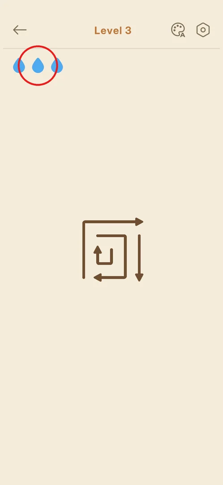

# Lives (blue drops) and mistakes

Each level gives the player three blue drops. They most likely work as lives: a wrong tap (an arrow whose
way out is blocked) costs a drop, and the result screen counts mistakes (inferred; no mistake was made in
this session) [^s1] [^s2].

## Where to find it

<!-- no-entry: the drops are always shown on the level screen, nothing opens them -->

On the [level screen](level-hud.md), from level 2 on: the row of drops just under the top bar, on the
left [^s1]. The tutorial level 1 has no drops [^s3].

## What it looks like

Three light-blue drops in a row at the top left of the board [^s1].

 [^s1]

## How it works

- Three drops at the start of a level, version 1.31.0 [^s1].
- The [result screen](level-result.md) shows a mistakes counter (a cross); it was 0 on levels 1 to 3,
  with accuracy 100% [^s2] [^s4].
- An attempt to tap a blocked arrow on level 3 hit the free arrow next to it instead (the tap area is
  generous), so no drop was lost [^s5].

## Cases

| Case | What was done | Result | Source |
|---|---|---|---|
| Tap a blocked arrow | Tapped the blocked inner arrow of level 3 | ❓ The neighbouring free arrow moved; drops stayed at 3 | [^s5] |
| Lose all three drops | <!-- --> | not verified |  |

## Not verified

- Whether a blocked tap costs a drop, and what a blocked arrow does (bounce back, shake).
- What happens at zero drops: a fail screen, a retry, a refill for an ad or coins.
- Whether drops refill between levels or over time.

[^s1]: session 20261001-204000-chrono-2FYKPJ, step 9 — [video at 2:19](https://youtu.be/tbyupdD9iso?t=139)
[^s2]: session 20261001-204000-chrono-2FYKPJ, step 4 — [video at 1:03](https://youtu.be/tbyupdD9iso?t=63)
[^s3]: session 20261001-204000-chrono-2FYKPJ, step 2 — [video at 0:35](https://youtu.be/tbyupdD9iso?t=35)
[^s4]: session 20261001-204000-chrono-2FYKPJ, step 22 — [video at 4:43](https://youtu.be/tbyupdD9iso?t=283)
[^s5]: session 20261001-204000-chrono-2FYKPJ, step 21 — [video at 4:30](https://youtu.be/tbyupdD9iso?t=270)
