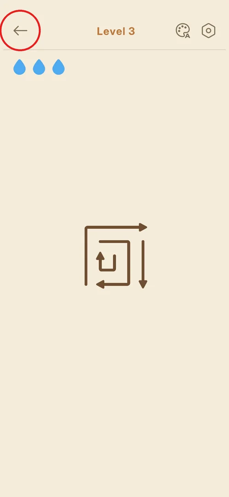

# Main menu

The home screen of Amaze GO!: the Play button for the next level, a row of cards for the game's modes
(a league, a daily challenge, an event) and the settings gear [^s2]. A new player does not see it at
first, because the game opens straight into the levels [^s3].

## Where to find it

From any level: the back arrow at the top left of the level screen [^s1] [^s2].

 [^s1]

## What it looks like

A beige screen with the hexagon settings gear at the top right. Under it is a row of large cards that
scrolls sideways: "Bronze League" (a bronze coin with an up arrow), "Daily Challenge" with today's date
("Oct 1") and a trophy, and a third card cut off at the screen edge. In the middle is the title
"Amaze GO!", and at the bottom a wide orange Play button with the next level under it ("Level 3")
[^s2]. Every card was dimmed and carried an "Unlock Lv.N" label at level 3 [^s2].

 [^s2]

Swiped to the left, the row shows the third card: "Event - Countryside Caper", a farm picture with
cartoon worms. There are no more cards after it [^s4]
[^s5].

 [^s4]

## What you can do

| Tab or button | What it does |
|---|---|
| [Play](level-hud.md) | Opens the next level on the level screen |
| [Bronze League](leagues.md) | League card; locked until level 11 |
| [Daily Challenge](daily-challenge.md) | Daily puzzle card with the date; locked until level 20 |
| [Event - Countryside Caper](event.md) | Event card; locked until level 16 |
| [Settings gear](settings.md) | Opens Settings |

## How it works

Version 1.31.0, seen at level 3:

| Card | Unlocks at | Source |
|---|---|---|
| Bronze League | level 11 | [^s2] |
| Event - Countryside Caper | level 16 | [^s4] |
| Daily Challenge | level 20 | [^s2] |

- Tapping a locked card shows a bubble with the unlock level, for example "Unlock Countryside Caper at
  Level 16" [^s6].
- The Android back key in Settings returns to the main menu [^s7].

## Cases

| Case | What was done | Result | Source |
|---|---|---|---|
| Reach the main menu | Back arrow in level 3 | ✅ The main menu opens with Play "Level 3" | [^s2] |
| See all the cards | Swiped the card row to the left twice | ✅ Three cards in all; the second swipe changed nothing | [^s5] |
| Tap a locked card | Tapped the Event card | ✅ A bubble with the unlock level | [^s6] |
| Play from the menu | Tapped Play | ✅ Level 3 opens | [^s8] |

## Not verified

- The bubbles of the locked Bronze League and Daily Challenge cards (not tapped).
- How the cards look and what they open once unlocked.
- Whether the card row changes with the date or the event.

[^s1]: session 20261001-204000-chrono-2FYKPJ, step 9 — [video at 2:19](https://youtu.be/tbyupdD9iso?t=139)
[^s2]: session 20261001-204000-chrono-2FYKPJ, step 10 — [video at 2:29](https://youtu.be/tbyupdD9iso?t=149)
[^s3]: session 20261001-204000-chrono-2FYKPJ, step 2 — [video at 0:35](https://youtu.be/tbyupdD9iso?t=35)
[^s4]: session 20261001-204000-chrono-2FYKPJ, step 11 — [video at 2:42](https://youtu.be/tbyupdD9iso?t=162)
[^s5]: session 20261001-204000-chrono-2FYKPJ, step 12 — [video at 2:54](https://youtu.be/tbyupdD9iso?t=174)
[^s6]: session 20261001-204000-chrono-2FYKPJ, step 13 — [video at 3:02](https://youtu.be/tbyupdD9iso?t=182)
[^s7]: session 20261001-204000-chrono-2FYKPJ, step 15 — [video at 3:24](https://youtu.be/tbyupdD9iso?t=204)
[^s8]: session 20261001-204000-chrono-2FYKPJ, step 16 — [video at 3:34](https://youtu.be/tbyupdD9iso?t=214)
