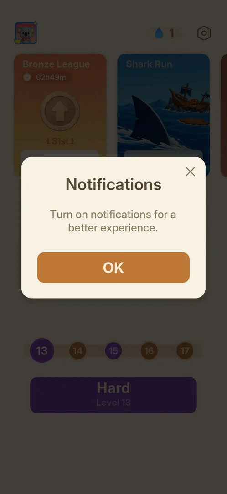

# Notification permission prompt

The Android system dialog that asks whether Amaze GO! may send notifications. It is not a screen of the
game: it came over [Home](home.md) on the second launch of the install, with two answers, Allow and Don't
allow; Don't allow was chosen [^s1] [^s2]. Later, on a progressed install, the game asked again with a
popup of its own, "Notifications", whose OK opens the phone's notification settings for the app
[^s4] [^s5].

## Why it appeared

On the second launch of the install, not the first: the Android dialog "Allow Amaze GO! to send you
notifications?" was up over Home when the session started [^s1].

## Where to find it

<!-- no-entry: no control opens it; the game asks on its own at launch, and the only frame of it is the Android permission dialog, another app's screen -->
No button or menu opens it: the game asks on its own, at the start of the second launch, before anything is
tapped [^s1]. After Don't allow, it did not come back on later launches
[^s3].

## What it looks like

<!-- no-screen: the dialog is Android's permission controller, not the game, so its frame is not shown here -->
A standard Android permission dialog over the dimmed Home screen: the game's icon, the question "Allow
Amaze GO! to send you notifications?" and two buttons, Allow and Don't allow
[^s1].

### In-game Notifications popup

 [^s4]
*The game's own Notifications popup over Home at the start of a session: OK, and an X at the top right*

At the start of a later session, Home opened with a popup drawn by the game: the title "Notifications",
the line "Turn on notifications for a better experience.", an orange OK button and an X at the top right
[^s4]. OK left the game for the phone's notification settings for Amaze
GO!, where notifications were off; going back to the game returned to Home
[^s5] [^s6]. The X was not tried. The
settings screen belongs to the phone, so it is not shown.

## How it works

Version 1.33.0, Android.

- The Android dialog: shown once per install so far, on the second launch [^s1].
- Don't allow closed it and left Home [^s2]; on a later launch Home was
  checked for the prompt and none showed [^s3].
- No options and no links: the two buttons are all it has [^s2].
- After Don't allow, the game asks again with its own Notifications popup (seen once, on Home at the
  start of a session two days after the install); its OK opens the phone's settings, not the Android
  dialog [^s4] [^s5].

## Cases

| Case | What was done | Result | Source |
|---|---|---|---|
| Why it appeared <!-- case:chk-appeared --> | Launched the game a second time | ✅ The dialog over Home on the second launch, not the first | [^s1] |
| When it shows <!-- case:second-launch --> | Launched the game a second time | ✅ Over Home on the second launch of the install, not on the first; answered Don't allow | [^s2] |
| Where to find it <!-- case:chk-entry --> | Looked for a control | ✅ No button: Android dialog over Home on the second launch | [^s1] |
| Its screen <!-- case:chk-screen --> | Read the dialog | ✅ "Allow Amaze GO! to send you notifications?" with Allow and Don't allow, over Home | [^s1] |
| The answers <!-- case:chk-answers --> | Answered Don't allow, launched again later | ✅ It did not come back on later launches | [^s3] |
| Options <!-- case:chk-options --> | — | ✅ Does not apply: two answers, no options | [^s2] |
| Links out <!-- case:chk-links --> | — | ✅ Does not apply: a system dialog, no links | [^s2] |
| The game's own prompt <!-- case:in-game-prompt --> | Opened the game on a progressed install; tapped OK on the Notifications popup | ✅ A "Notifications" popup over Home (OK and an X); OK opened the phone's notification settings for the app (off); back in the game, Home | [^s4] [^s5] |

## Not verified

- What Allow changes: which notifications the game then sends, and when
- When the in-game Notifications popup comes back (every launch, daily, after a number of launches) and
  what its X does (exp-notif-popup-recur)

[^s1]: session 20261003-232108-chrono-2FYKPJ, step 0 — [video at 0:00](https://youtu.be/KL7evNlX6oU?t=0)
[^s2]: session 20261003-232108-chrono-2FYKPJ, step 1 — [video at 0:15](https://youtu.be/KL7evNlX6oU?t=15)
[^s3]: session 20261005-010045-chrono-2FYKPJ, step 3 — [video at 1:55](https://youtu.be/x_UvTQLpmEQ?t=115)

[^s4]: session 20261005-224323-chrono-2FYKPJ, step 0 — [video at 0:00](https://youtu.be/qnyS1lQt1kE?t=0)
[^s5]: session 20261005-224323-chrono-2FYKPJ, step 1 — [video at 0:18](https://youtu.be/qnyS1lQt1kE?t=18)
[^s6]: session 20261005-224323-chrono-2FYKPJ, step 2 — [video at 0:30](https://youtu.be/qnyS1lQt1kE?t=30)
