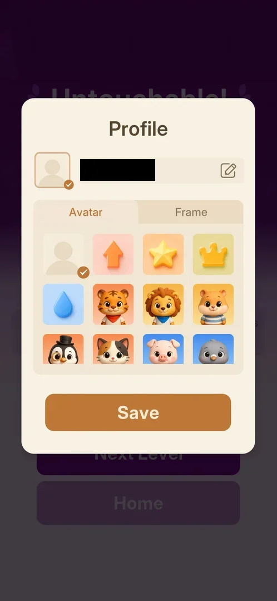
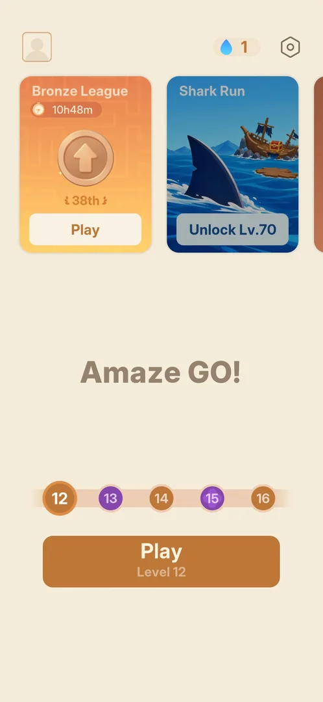
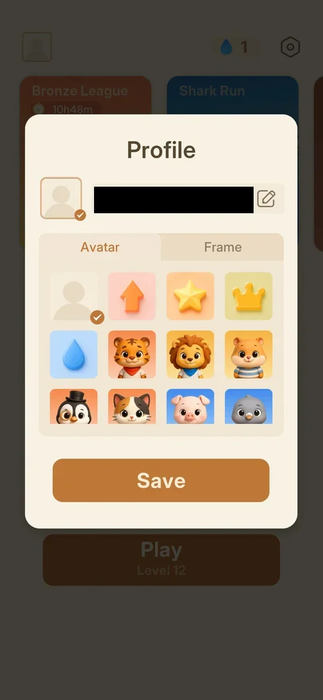
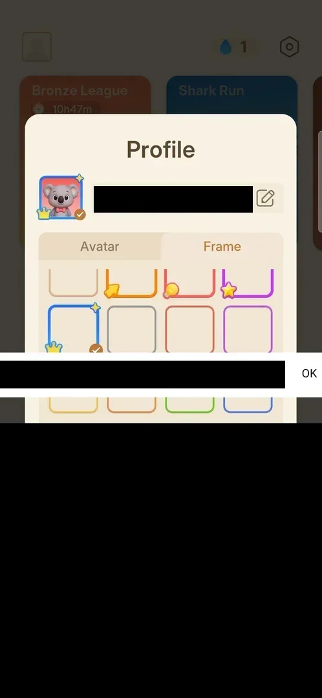
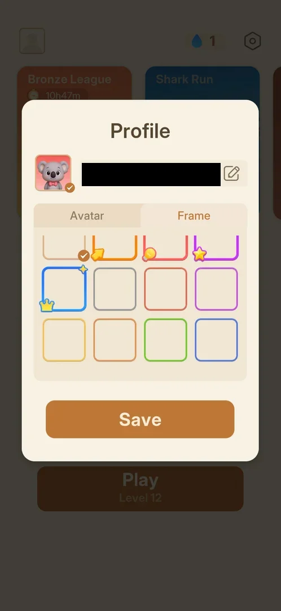

# Profile (name, avatar, frame)

A popup where the player sets the name, the avatar and the avatar frame. They show on the Home avatar
button and on the player's own row of the [Bronze League](bronze-league.md) board [^s1] [^s2].
It first came up on its own right after joining the league; after that it opens from the avatar button
at the top left of Home [^s3] [^s4]. In version 1.33.0 all 20 avatars and 12 frames were free to pick,
with no lock or price [^s5].

## Why it appeared

Start on the "You have joined the Bronze League!" popup, after the level 10 win, opened it at once
[^s3]. The avatar button at the top left of Home has been there with the grey default avatar
since then [^s6] [^s7].

 [^s3]
*The first Profile popup, right after Start on the league's joined popup. The name is blacked out on this page*

## Where to find it

Home > the square avatar button at the top left, left of the drop counter [^s7] [^s4]. Before
anything is chosen it shows a grey silhouette; after Save it shows the chosen avatar in the chosen frame
[^s1].

 [^s7]
*Home: the avatar button at the top left opens Profile*

## What it looks like

 [^s4]
*The Profile popup opened from Home, Avatar tab. The name is blacked out on this page*

A cream popup over the dimmed Home screen [^s4]. From top to bottom:

- the title "Profile";
- a preview of the current avatar in its frame, with a check, and the name field with an edit pencil;
- two tabs, Avatar and Frame;
- a scrolling grid, four items a row;
- a Save button.

The popup has no close button: Save is the only way out seen [^s4] [^s1].

## What you can do

| Tab or button | What it does |
|---|---|
| [Name](#name) | the pencil opens a text field with OK; the name can be changed |
| [Avatar](#avatar) | 20 avatars, none locked; a tap selects one |
| [Frame](#frame) | 12 frames, none locked; a tap selects one |
| [Save](#save) | applies the choice and closes the popup |

### Name

 [^s8]
*The pencil opens a one-line text field with OK above the phone's keyboard. The name and the keyboard are blacked out on this page*

The pencil at the right of the name field opens a one-line text field with OK, over the popup, with the
phone's keyboard [^s8]. A character typed and OK put the new name in the field; after Save the new
name stayed [^s9] [^s1]. The popup opened again from Home, a character deleted and Save restored the
old name [^s5] [^s10]. The starting name is one the game generated, "Amaze-" and a short code
[^s3]. Length limits and filtered words were not tried.

### Avatar

<!-- no-frame: the first 12 avatars are on the popup frame above; the scrolled grid shows the account's name -->
The open tab: 20 avatars in five rows of four [^s4] [^s11]. The first row: the grey default, an orange
arrow, a star, a crown; then a blue drop and animal portraits (tiger, lion, hamster, penguin, cat, pig,
a grey bird, cow, polar bear, hippo, panda, grey cat, sheep, koala, bear). The grid scrolls to show the
last eight. A tap on an avatar moves the check to it and shows it in the preview at once [^s12]. Opened again after Save, the grid still showed 20
avatars, but the grey default had moved from the first place to the last [^s5]. No
avatar shows a lock, a level or a price [^s11]. The same animal portraits are the other players'
avatars on the league board [^s13].

### Frame

 [^s14]
*The Frame tab: 12 frames, none locked. The name is blacked out on this page*

12 frames in three rows of four [^s14]. The first row: the plain default (checked), an orange frame
with an arrow, a red one with a bulb, a purple one with a star; the second: a blue one with a crown and a
sparkle, then plain grey, red and purple; the third: plain yellow, orange, green and blue. None shows a
lock or a price. A tap on the blue crown frame put it around the avatar in the preview [^s15] [^s8].

### Save

<!-- no-frame: the result is Home, on the entry frame above with the default avatar; the Home frame after Save shows the same screen with the koala -->
Save closes the popup and returns to the screen under it [^s1]. From Home, the avatar button then
showed the koala in the blue crown frame [^s1]. The first time, Save over the league's win card opened
the level 11 board at once, not Home and not the league [^s16].

## How it works

Version 1.33.0. All 20 avatars and 12 frames could be picked on an account at level 12, with no
currency spent [^s1]. The choice is the player's row on the league board: after the level 12 win the
league card showed the "Me" row (rank 30) with the koala in the blue crown frame [^s2]. Inferred: the
four frames with icons (arrow, bulb, star, crown) may be meant as rewards, as they look different from the
plain ones; on this account none was locked.

## Cases

| Case | What was done | Result | Source |
|---|---|---|---|
| Why it appeared <!-- case:chk-appeared --> | Tapped Start on the Bronze League joined popup | ✅ The Profile popup opened at once | [^s3] |
| Its screen <!-- case:chk-screen --> | Looked at the popup | ✅ Avatar preview with a check, the name with an edit pencil, tabs Avatar and Frame, Save | [^s4] |
| Where to find it <!-- case:chk-entry --> | Tapped the avatar button at the top left of Home | ✅ The Profile popup opened; after Save the button shows the chosen avatar and frame | [^s4] |
| Every option <!-- case:chk-options --> | Scrolled the avatars, picked the koala, opened Frame, picked the blue crown frame, renamed with the pencil, Save | ✅ 20 avatars and 12 frames, none locked; the rename and both picks applied | [^s1] |
| What each answer does <!-- case:chk-answers --> | Save | ✅ Not a prompt: Save closes the popup and applies the changes; no close button | [^s1] |
| Links out <!-- case:chk-links --> | Looked at the popup | ✅ None | [^s4] |

## Not verified

- Name rules: length limit, allowed characters, filtered words
- Whether the four frames with icons ever show a lock on another account

[^s1]: session 20261005-144428-chrono-2FYKPJ, step 9 — [video at 1:34](https://youtu.be/nK0PubVvnuA?t=94)
[^s2]: session 20261005-144428-chrono-2FYKPJ, step 35 — [video at 7:06](https://youtu.be/nK0PubVvnuA?t=426)
[^s3]: session 20261005-012010-chrono-2FYKPJ, step 30 — [video at 13:14](https://youtu.be/BaXAJZAR4vk?t=794)
[^s4]: session 20261005-144428-chrono-2FYKPJ, step 1 — [video at 0:19](https://youtu.be/nK0PubVvnuA?t=19)
[^s5]: session 20261005-144428-chrono-2FYKPJ, step 10 — [video at 1:48](https://youtu.be/nK0PubVvnuA?t=108)
[^s6]: session 20261005-012010-chrono-2FYKPJ, step 33 — [video at 14:31](https://youtu.be/BaXAJZAR4vk?t=871)
[^s7]: session 20261005-144428-chrono-2FYKPJ, step 0 — [video at 0:00](https://youtu.be/nK0PubVvnuA?t=0)
[^s8]: session 20261005-144428-chrono-2FYKPJ, step 6 — [video at 1:11](https://youtu.be/nK0PubVvnuA?t=71)
[^s9]: session 20261005-144428-chrono-2FYKPJ, step 8 — [video at 1:26](https://youtu.be/nK0PubVvnuA?t=86)
[^s10]: session 20261005-144428-chrono-2FYKPJ, step 14 — [video at 2:16](https://youtu.be/nK0PubVvnuA?t=136)
[^s11]: session 20261005-144428-chrono-2FYKPJ, step 2 — [video at 0:30](https://youtu.be/nK0PubVvnuA?t=30)
[^s12]: session 20261005-144428-chrono-2FYKPJ, step 3 — [video at 0:41](https://youtu.be/nK0PubVvnuA?t=41)
[^s13]: session 20261005-012010-chrono-2FYKPJ, step 35 — [video at 14:59](https://youtu.be/BaXAJZAR4vk?t=899)
[^s14]: session 20261005-144428-chrono-2FYKPJ, step 4 — [video at 0:52](https://youtu.be/nK0PubVvnuA?t=52)
[^s15]: session 20261005-144428-chrono-2FYKPJ, step 5 — [video at 1:04](https://youtu.be/nK0PubVvnuA?t=64)
[^s16]: session 20261005-012010-chrono-2FYKPJ, step 31 — [video at 13:30](https://youtu.be/BaXAJZAR4vk?t=810)
