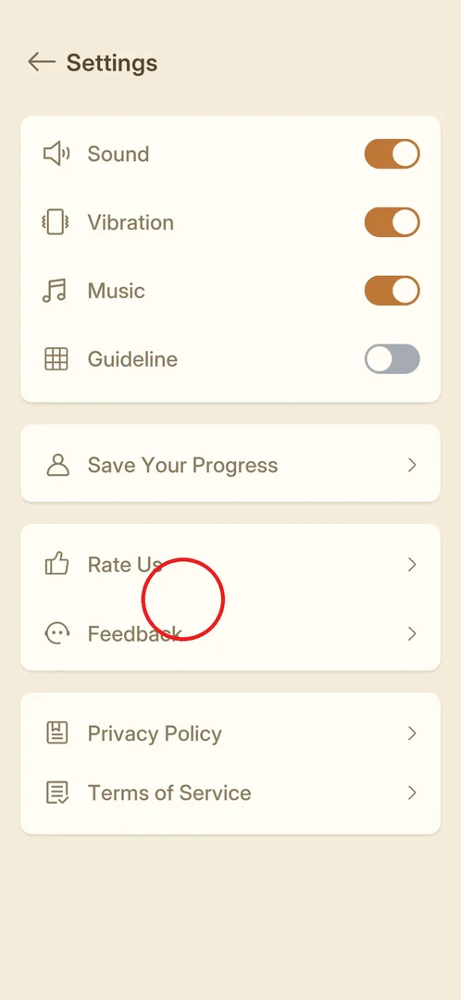

# Rate Us / Feedback

Two rows in Settings through which the player can rate the game ("Rate Us", a thumbs-up icon) and send
feedback to the developer ("Feedback", a speech-bubble face) [^s1]. Neither was opened in this session.

## Where to find it

From [Settings](settings.md) (the gear on the main menu): the third block, "Rate Us" and "Feedback"
[^s1].

 [^s1]

## What it looks like

<!-- no-screen: neither row was opened in this session -->

Not seen yet: only the two rows in Settings, each with an icon and an arrow [^s1].

## How it works

Nothing is known yet beyond the rows themselves.

## Cases

| Case | What was done | Result | Source |
|---|---|---|---|
| Open Rate Us | <!-- --> | not verified |  |
| Open Feedback | <!-- --> | not verified |  |

## Not verified

- Whether Rate Us shows an in-game star rating first or goes straight to the store.
- Whether Feedback opens an in-game form or an e-mail app.
- Whether the game also asks for a rating by itself after some levels.

[^s1]: session 20261001-204000-chrono-2FYKPJ, step 14 — [video at 3:09](https://youtu.be/tbyupdD9iso?t=189)
