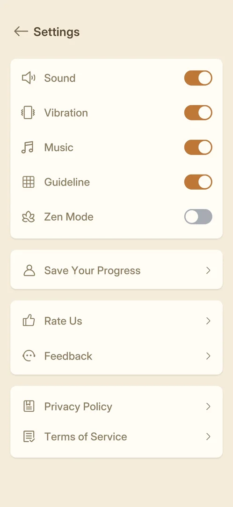
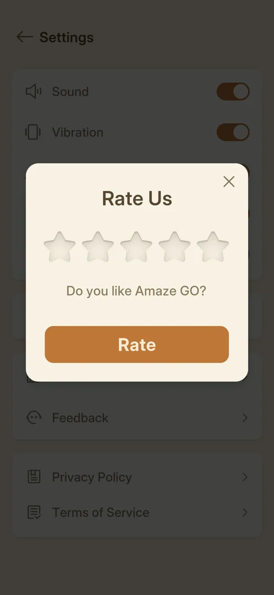

# Rate Us

A popup that asks the player to rate the game from one to five stars. It is opened from a row in
Settings [^s2] [^s3]. Only closing it was tried. No rating was given, because the project's rule is never to
submit a rating.

## Why it appeared

The Rate Us row is in Settings from the first visit, with no lock [^s1]. The popup did not come up by
itself after the two levels won in this session [^s4].

## Where to find it

Home > the gear top right > Settings > the Rate Us row (thumbs-up icon) in the third block, above
Feedback [^s2].

 [^s2]
*Settings: the Rate Us row, third block, above Feedback*

## What it looks like

 [^s3]
*The Rate Us popup over the dimmed Settings screen*

A cream popup over the dimmed Settings screen [^s3]. From top to bottom it has:

- the title "Rate Us" and an X at the top right;
- five empty stars;
- the question "Do you like Amaze GO?";
- an orange Rate button.

## What you can do

| Tab or button | What it does |
|---|---|
| [X](#x) | closes the popup back to Settings |
| [Stars and Rate](#stars-and-rate) | not tapped (no rating is submitted) |

### X

<!-- no-frame: the result is the Settings screen, on the Settings page -->
Closes the popup. Settings shows again with nothing changed [^s4].

### Stars and Rate

<!-- no-frame: the controls are on the popup frame above; not tapped -->
Five stars and the Rate button [^s3]. Not tapped, so whether a low rating stays in the game and a high one
goes to the store is not known. Inferred: Rate leads out to the store.

## How it works

Version 1.33.0. The popup opens only from Settings in this session; no unprompted Rate Us was seen
after two wins [^s3] [^s4].

## Cases

| Case | What was done | Result | Source |
|---|---|---|---|
| Why it appeared <!-- case:chk-appeared --> | Opened Settings on the first launch | ✅ The row is there from the start | [^s1] |
| Where to find it <!-- case:chk-entry --> | Home gear > Settings > Rate Us row | ✅ The popup opened | [^s2] |
| Its screen <!-- case:chk-screen --> | Looked at the popup | ✅ "Rate Us", five empty stars, "Do you like Amaze GO?", Rate, X at the top right | [^s3] |
| Every option <!-- case:chk-options --> | Tapped X | ✅ Back to Settings, nothing changed; stars and Rate not tapped by policy | [^s4] |
| What each answer does <!-- case:chk-answers --> | Dismissed with X | ✅ Only dismiss exercised: back to Settings; rating answers not exercised by policy; no unprompted Rate Us in two wins | [^s4] |
| Links out <!-- case:chk-links --> | — | ✅ Rate likely leads out to the store (inferred); not followed by policy | [^s4] |

## Not verified

- What the stars and Rate do (a store page, an in-game thank-you, a feedback form for low ratings):
  not exercised by policy
- Whether the popup ever comes up by itself (after a number of wins)

[^s1]: session 20261003-200141-chrono-2FYKPJ, step 5 — [video at 1:32](https://youtu.be/l44HK-PZ5-o?t=92)
[^s2]: session 20261003-232357-chrono-2FYKPJ, step 4 — [video at 0:42](https://youtu.be/x9mSZuHgO_4?t=42)
[^s3]: session 20261003-232357-chrono-2FYKPJ, step 5 — [video at 0:51](https://youtu.be/x9mSZuHgO_4?t=51)
[^s4]: session 20261003-232357-chrono-2FYKPJ, step 6 — [video at 1:02](https://youtu.be/x9mSZuHgO_4?t=62)
