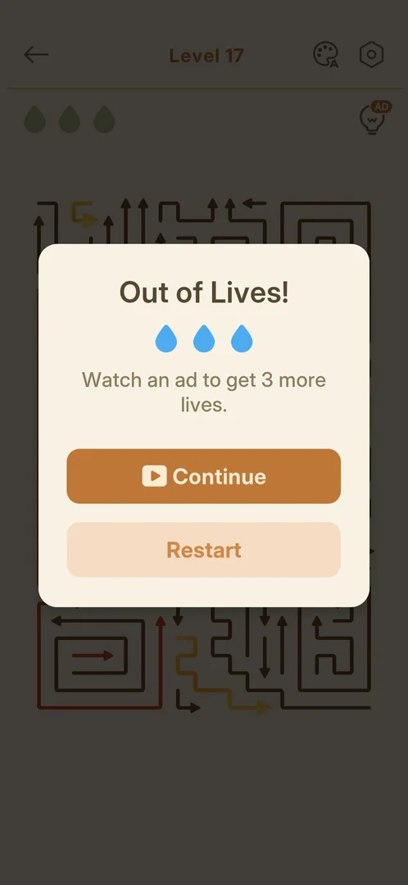
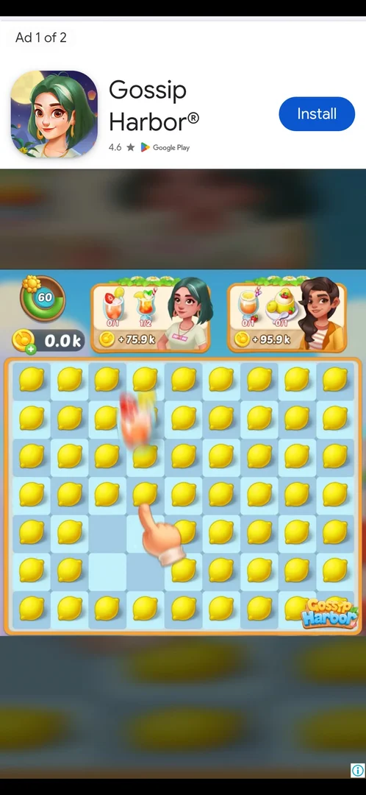
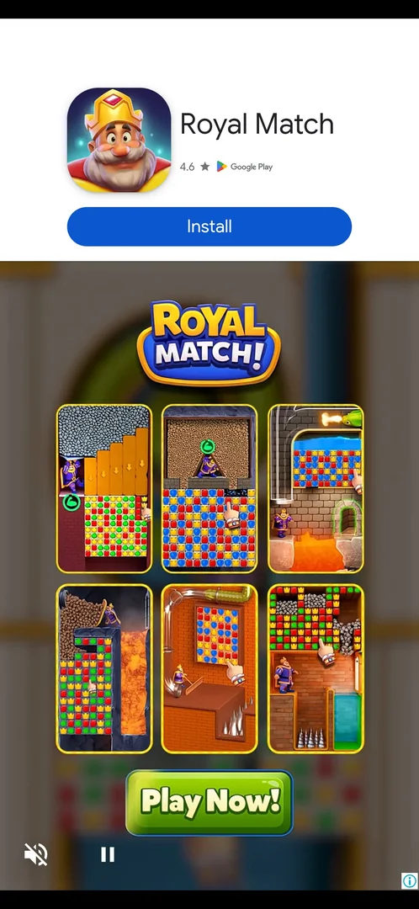
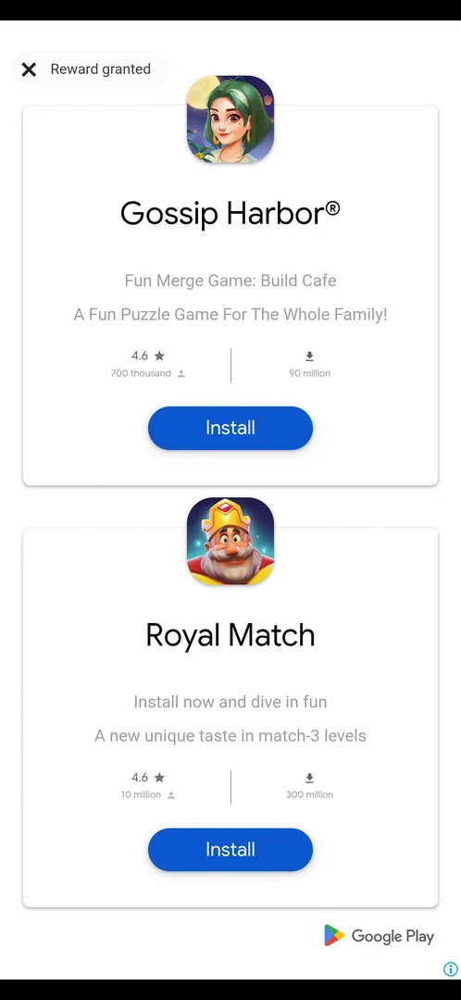
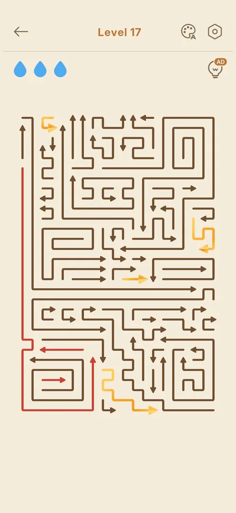

# Rewarded ad for Continue (Out of Lives)

An ad offered on the Out of Lives! popup in place of the free Continue: "Watch an ad to get 3 more
lives." Tapping Continue plays two video ads in a row (about 35 s in all) and ends on a card with
"Reward granted" and an X; the X returns to the level with three [drops](drops.md) and the board as it
was [^s5] [^s6] [^s7]. The free Continue was used once (level 14); every Out of Lives after it offered
the ad, also in the next session [^s2] [^s1] [^s5].

## Why it appeared

On the second Out of Lives of a session, on Normal level 16, after the free Continue had been used on
level 14 [^s1] [^s4]. In the next session the first Out of Lives (level 17) already offered the ad, so
the free Continue does not come back with a new session [^s5]. Hypothesis: the free Continue is given
once (per install or per day), then the ad, not verified (exp-continue-free-once).

## Where to find it

A level > three blocked taps spend the three [drops](drops.md) > the Out of Lives! popup > the orange
Continue button, which shows a video icon instead of the green "Free" badge [^s1] [^s5].

 [^s5]
*The Out of Lives! popup on level 17: the orange Continue with a video icon starts the ad; Restart below it*

The offer is the popup itself: the title, three blue drops, the line "Watch an ad to get 3 more lives.",
the orange Continue with a video icon and the pale Restart; there is no X [^s1] [^s5]. On the free
version the line reads "Continue for free with 3 more lives." and Continue carries a green "Free" badge
[^s2].

## What it looks like

A full-screen video ad for another game. A label "Ad 1 of 2" at the top left (the ad is a pod of two
videos); under it an app card with the game's icon, name, Google Play rating and a blue Install button;
the video below with an animated hand playing; an (i) at the bottom right; no close X and no timer
[^s6]. The ads are not part of the game; what they advertise changes.

 [^s6]
*The first video of the pod: "Ad 1 of 2" top left, the app card with Install, (i) bottom right; no X and no timer*

## What you can do

| Tab or button | What it shows |
|---|---|
| [Second ad](#second-ad) | The pod's second video, for another advertiser, with no "Ad x of 2" label [^s6] |
| [End card](#end-card) | Both advertised apps, and "X Reward granted" top left, the only way out [^s6] [^s7] |
| [Back in the level](#back-in-the-level) | Three drops and the board as it was [^s7] |

### Second ad

About 20 s after Continue the pod moved on to its second video, for a different game: the app card with
Install at the top, mute and pause icons at the bottom left, no "Ad x of 2" label and still no X [^s6].

 [^s6]
*The pod's second video: another game's app card with Install, mute and pause at the bottom left; no label and no X*

### End card

About 35 s after Continue a white end card listed both advertised games, each with its icon, rating,
download count and an Install button, and at the top left an X with "Reward granted" [^s6].

 [^s6]
*The end card: both advertised games with Install buttons; "X Reward granted" at the top left closes the ad*

### Back in the level

The X on "Reward granted" returned to level 17 with three blue drops; the board was as it had been, with
the three arrows tapped while blocked still drawn red [^s7]. The level was then won: Clutch Comeback!, 2
stars, 02:49 (the clock included the ads), score 1085, 3 mistakes [^s8].

 [^s7]
*Level 17 after the ad: three blue drops, the board kept, the arrows tapped while blocked still red*

## How it works

Version 1.33.0.

- The reward: three drops, the board kept, the level goes on (as the free Continue gives) [^s7] [^s4].
- Two videos in a row, about 35 s from Continue to the end card; no X before the end card [^s6].
- The free Continue was used three times in a row on Hard level 5 in an earlier session, and once on
  level 14; the ad came at the next Out of Lives (level 16) and at the first one of the next session
  (level 17) [^s1] [^s4] [^s5]. See [Level](level.md#continue).
- Restart, the other choice, puts the board back at its first layout with three drops, with no ad [^s3].
- The level 17 win, about 3 min after this ad, was not followed by an
  [interstitial](interstitial-ad.md) [^s8].

## Cases

| Case | What was done | Result | Source |
|---|---|---|---|
| Why it appeared <!-- case:chk-appeared --> | Ran out of drops on level 14, then on level 16 | ✅ Level 14: Continue Free; level 16: Continue for an ad | [^s1] [^s4] |
| Where to find it <!-- case:chk-entry --> | Spent all three drops on level 16 and on level 17 | ✅ The Continue button of the Out of Lives! popup, once the free Continue is used | [^s1] [^s5] |
| The kind <!-- case:chk-kind --> | Looked at the popup | ✅ A rewarded video for a revive: Continue shows a video icon | [^s1] |
| The offer and the reward <!-- case:chk-reward --> | Looked at the popup | ✅ "Watch an ad to get 3 more lives." with Continue (video) and Restart | [^s1] |
| Its screen <!-- case:chk-screen --> | Tapped Continue on level 17 | ✅ A pod of two videos: "Ad 1 of 2" top left, app card with Install, mute and pause, (i) bottom right; the second video has no label | [^s6] |
| How it closes <!-- case:chk-close --> | Waited through both videos, tapped the X | ✅ No X during the videos; about 35 s after Continue the end card shows "X Reward granted"; the X returns to the level | [^s6] [^s7] |
| How often <!-- case:chk-frequency --> | Ran out of drops on level 17, the first Out of Lives of a new session | ✅ The ad again: every Out of Lives after the one free Continue, which does not come back with a new session | [^s5] |
| Reward paid <!-- case:reward-paid --> | Closed the ad with the X | ✅ Three drops, the board unchanged (blocked arrows still red), the level goes on | [^s7] |

## Not verified

- What makes the free Continue come back: a day, or never (exp-continue-free-once)
- Whether closing the ad early (the phone's Back) still pays the reward

[^s1]: session 20261005-224323-chrono-2FYKPJ, step 53 — [video at 20:49](https://youtu.be/qnyS1lQt1kE?t=1249)
[^s2]: session 20261005-224323-chrono-2FYKPJ, step 28 — [video at 8:15](https://youtu.be/qnyS1lQt1kE?t=495)
[^s3]: session 20261005-224323-chrono-2FYKPJ, step 54 — [video at 21:09](https://youtu.be/qnyS1lQt1kE?t=1269)
[^s4]: session 20261005-224323-chrono-2FYKPJ, step 29 — [video at 8:24](https://youtu.be/qnyS1lQt1kE?t=504)
[^s5]: session 20261005-233140-chrono-2FYKPJ, step 27 — [video at 9:37](https://youtu.be/DgjM3dslI6E?t=577)
[^s6]: session 20261005-233140-chrono-2FYKPJ, step 28 — [video at 10:01](https://youtu.be/DgjM3dslI6E?t=601)
[^s7]: session 20261005-233140-chrono-2FYKPJ, step 29 — [video at 11:30](https://youtu.be/DgjM3dslI6E?t=690)
[^s8]: session 20261005-233140-chrono-2FYKPJ, step 49 — [video at 14:36](https://youtu.be/DgjM3dslI6E?t=876)
