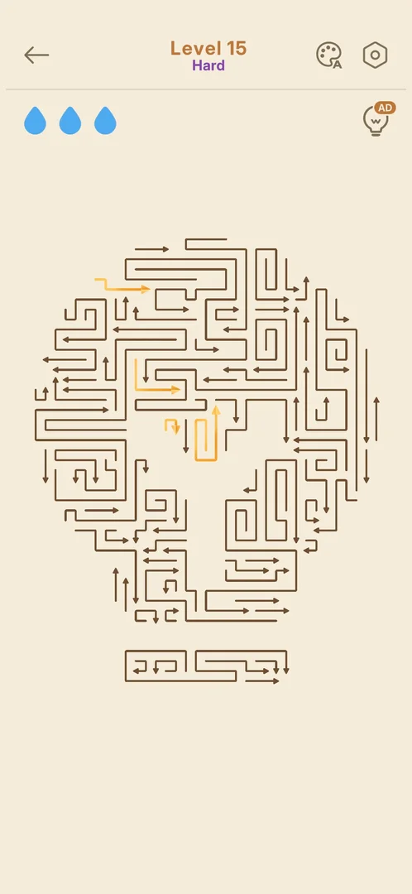
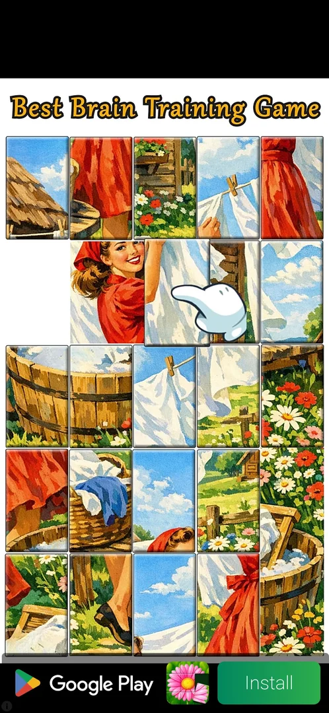
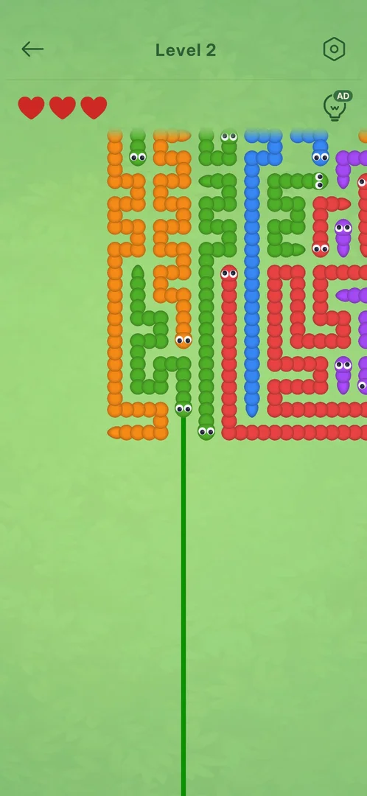

# Rewarded ad on the hint bulb (AD badge)

From level 15 on, the [hint](hint.md) bulb at the top right of a level carries an orange "AD" badge, and
each hint costs one rewarded video: a tap on the bulb starts the ad at once, and when it ends the board
shows one hint [^s2] [^s5] [^s6]. Seen on Hard level 15, levels 16 and 17, and the levels of the
[Countryside Capers](countryside-capers.md) event [^s2] [^s3] [^s5].

## Why it appeared

The badge was first seen on Hard level 15, right after level 14, whose bulb had no badge
[^s2] [^s4]. Hypothesis: the free hints ran
out (about 55 were used on Hard level 5 in an earlier session, see [Hint](hint.md)), or the ads switch on
at level 15 along with the [interstitial](interstitial-ad.md), not verified.

## Where to find it

In a level: the hint bulb at the top right, under the gear, with a small orange "AD" badge on its top
right corner [^s2].

 [^s2]
*Hard level 15: the hint bulb at the top right carries an orange "AD" badge*

## What it looks like

 [^s5]
*The rewarded video a tap on the AD bulb starts: no offer screen before it*

A tap on the badged bulb shows no offer or confirm screen: a black frame for about a second, then a
full-screen video ad with a Google Play / Install bar at the bottom. No close control showed in the first
10 s [^s5].

## What you can do

| Tab or button | What it does |
|---|---|
| [Hint after the ad](#hint-after-the-ad) | The board pans to a free piece and draws its exit line |
| [Second use](#second-use) | A second tap in the same level: another ad, another hint |

The ad has no skip; a single video ran about 45 s and then opened the Play Store by itself [^s6].

### Hint after the ad

 [^s6]
*The reward: one hint, the green exit line of a free worm; the bulb keeps its AD badge*

The first ad (event level 2) showed no close control in about 35 s; at about 45 s it opened the game's
Play Store listing by itself. Back in the game, the hint was already applied: the board had panned to a
free worm and drew a green line along the way it would leave. The bulb kept its AD badge [^s6]. A tap on
that worm cleared it [^s9].

### Second use

 [^s7]
*The second ad in the same level: a pod of two, "Reward granted" with an X at about 30 s. The ad's content (in a local language) is blacked out*

A second tap on the AD bulb in the same level, about 1.5 min after the first, started another ad: this
time a pod of two videos, "Ad 2 of 2", with "Reward granted" and an X at the top right at about 30 s. The
X closed it and the board showed the next hint [^s7] [^s8].

## How it works

Version 1.33.0.

- The badge is on the bulb from the first frame of every level from 15 on: Hard 15, 16, 17 and the event
  levels [^s2] [^s3] [^s5].
- One ad, one hint. Every hint needs its own ad; no free hint and no cooldown were seen between two uses
  about 1.5 min apart [^s8].
- No offer screen: the tap starts the ad [^s5].
- The ad's length and ending vary: one single video that ended by opening the Play Store at about 45 s;
  one pod of two with "Reward granted" and an X at about 30 s [^s6] [^s7].
- The reward is kept even when the ad leaves the game for the Play Store [^s6].

## Cases

| Case | What was done | Result | Source |
|---|---|---|---|
| Why it appeared <!-- case:chk-appeared --> | Opened levels 14, 15 and 16 | ✅ No badge on level 14; the badge on 15 and 16. Why is a hypothesis | [^s4] [^s2] |
| Where to find it <!-- case:chk-entry --> | Looked at the level HUD | ✅ The hint bulb at the top right, with an orange AD badge (levels 15 and 16) | [^s1] |
| Its screen <!-- case:chk-screen --> | Tapped the AD bulb on event level 2 | ✅ A black frame for about 1 s, then a full-screen video ad with a Google Play / Install bar | [^s5] |
| The kind <!-- case:chk-kind --> | Tapped the AD bulb | ✅ A rewarded video, on main levels from 15 and on the event levels | [^s5] |
| The offer and the reward <!-- case:chk-reward --> | Watched the ad to its end | ✅ No offer screen; one hint: the board pans to a free piece and draws its exit line; a tap clears it | [^s6] [^s9] |
| How it closes <!-- case:chk-close --> | Waited for a close control | ✅ First ad: none in about 35 s, the Play Store opened by itself at about 45 s, the hint kept; second ad: "Reward granted" X at about 30 s | [^s6] [^s7] |
| How often <!-- case:chk-frequency --> | Tapped the AD bulb twice in one level | ✅ Every hint needs its own ad; the badge stays; no cooldown seen | [^s8] |

## Not verified

- Whether the badge ever goes away (free hints coming back); why it starts at level 15

[^s1]: session 20261005-224323-chrono-2FYKPJ, step 42 — [video at 13:46](https://youtu.be/qnyS1lQt1kE?t=826)
[^s2]: session 20261005-224323-chrono-2FYKPJ, step 36 — [video at 10:17](https://youtu.be/qnyS1lQt1kE?t=617)
[^s3]: session 20261005-224323-chrono-2FYKPJ, step 53 — [video at 20:10](https://youtu.be/qnyS1lQt1kE?t=1210)
[^s4]: session 20261005-224323-chrono-2FYKPJ, step 29 — [video at 8:11](https://youtu.be/qnyS1lQt1kE?t=491)
[^s5]: session 20261006-013740-chrono-2FYKPJ, step 34 — [video at 10:16](https://youtu.be/O4n16Ei5uiU?t=616)
[^s6]: session 20261006-013740-chrono-2FYKPJ, step 35 — [video at 11:53](https://youtu.be/O4n16Ei5uiU?t=713)
[^s7]: session 20261006-013740-chrono-2FYKPJ, step 37 — [video at 12:29](https://youtu.be/O4n16Ei5uiU?t=749)
[^s8]: session 20261006-013740-chrono-2FYKPJ, step 38 — [video at 13:26](https://youtu.be/O4n16Ei5uiU?t=806)
[^s9]: session 20261006-013740-chrono-2FYKPJ, step 36 — [video at 12:02](https://youtu.be/O4n16Ei5uiU?t=722)
