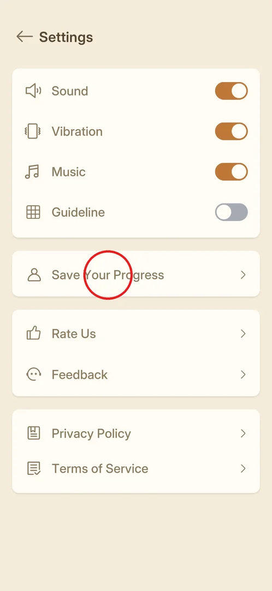

# Save Your Progress (cloud save)

A row in Settings, "Save Your Progress", with a person icon. From its name and icon it most likely links
the game to an account so that progress is kept across devices or a reinstall (inferred); it was not
opened in this session [^s1].

## Where to find it

From [Settings](settings.md) (the gear on the main menu): the "Save Your Progress" row, the only row of
the second block [^s1].

 [^s1]

## What it looks like

<!-- no-screen: the row was not opened in this session -->

Not seen yet: only the row in Settings, a person icon, the label "Save Your Progress" and an arrow
[^s1].

## How it works

Nothing is known yet beyond the row itself.

## Cases

| Case | What was done | Result | Source |
|---|---|---|---|
| Open Save Your Progress | <!-- --> | not verified |  |

## Not verified

- What the screen offers: which sign-in options (Google, Facebook, other), and whether there is a reward
  for linking.
- Whether progress is kept without signing in.

[^s1]: session 20261001-204000-chrono-2FYKPJ, step 14 — [video at 3:09](https://youtu.be/tbyupdD9iso?t=189)
