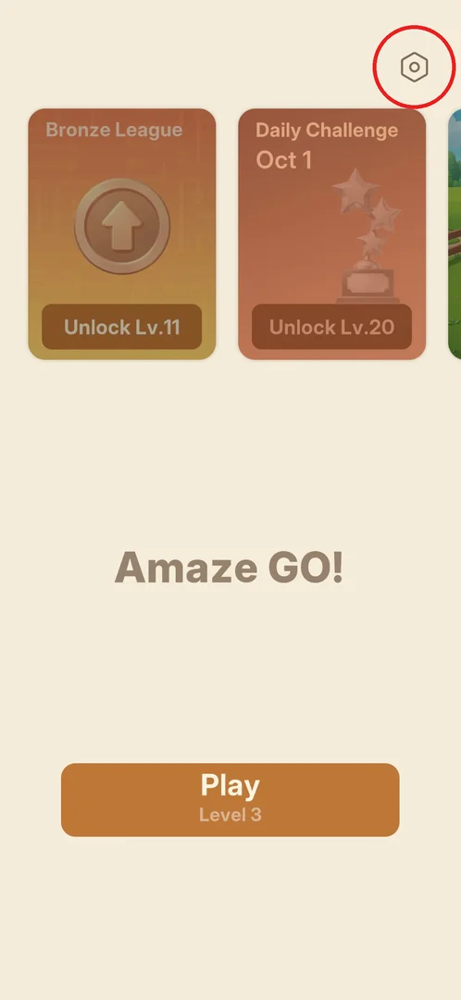
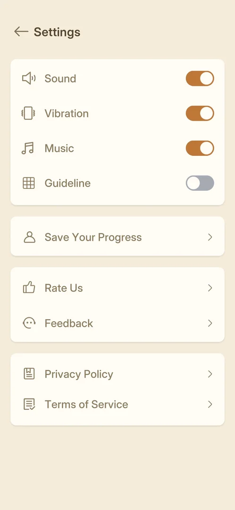
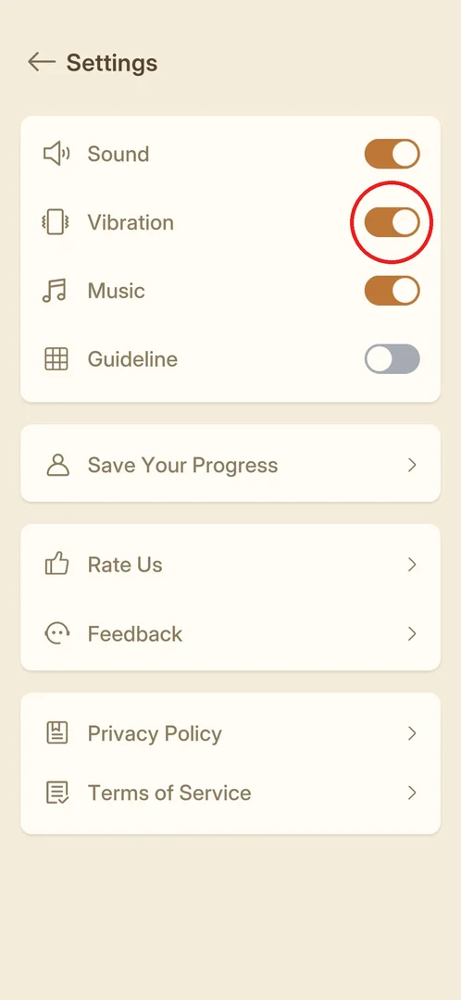
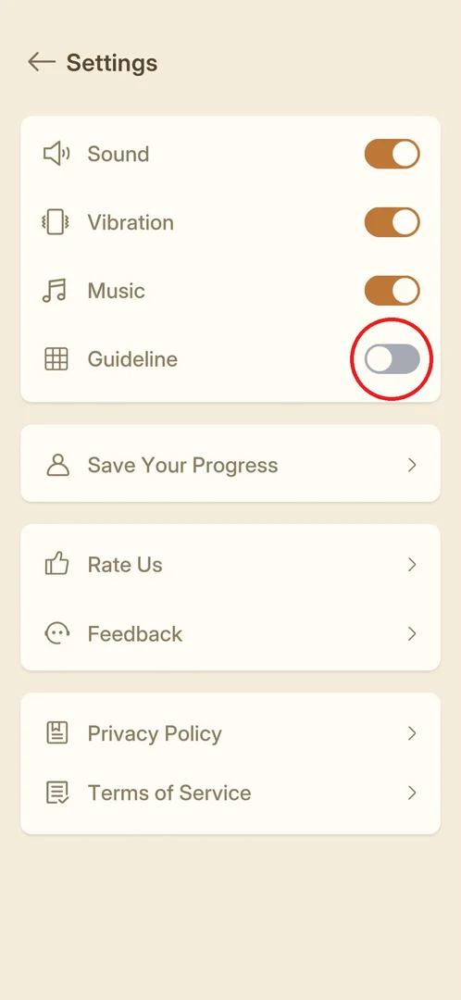
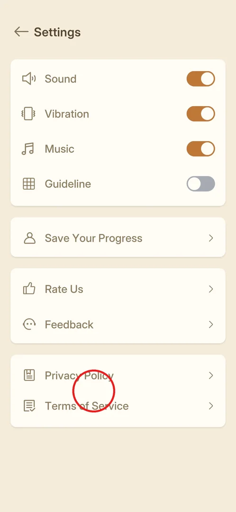

# Settings

A full screen with the game's switches (sound, vibration, music and a "Guideline" aid on the board) and
its links: saving progress to an account, rating the game, feedback, and the legal documents [^s2].

## Where to find it

From the [main menu](main-menu.md): the hexagon gear at the top right [^s1]. The level screen has the
same gear at the top right of its bar; it was not opened from there in this session
[^s3].

 [^s1]

## What it looks like

A beige screen titled "Settings" with a back arrow. Four white blocks: the toggles Sound, Vibration,
Music and Guideline; one row "Save Your Progress"; the rows "Rate Us" and "Feedback"; the rows
"Privacy Policy" and "Terms of Service". Every row has an icon on the left and an arrow on the right
[^s2].

 [^s2]

## What you can do

| Tab or button | What it does |
|---|---|
| [Sound, Vibration, Music](#sound-vibration-music) | Sound effects, vibration and music on or off |
| [Guideline](#guideline) | A board aid with a grid icon; off by default |
| [Save Your Progress](save-progress.md) | Account link to keep progress (not opened) |
| [Rate Us and Feedback](rate-feedback.md) | Rating and feedback links (not opened) |
| [Privacy Policy and Terms of Service](#privacy-policy-and-terms-of-service) | The legal documents |

### Sound, Vibration, Music

Three toggles at the top, all on (orange) after a fresh install [^s2]. None of them was switched in
this session.

 [^s2]

### Guideline

The fourth toggle, with a grid icon; off (grey) after a fresh install [^s2]. From the name and the
icon it likely draws grid lines or the arrows' paths on the board (inferred; not switched on in this
session).

 [^s2]

### Privacy Policy and Terms of Service

Two rows in the last block, the same documents the [consent screen](consent.md) asks to accept [^s2].
Neither was opened.

 [^s2]

## How it works

- Defaults on a fresh install, version 1.31.0: Sound on, Vibration on, Music on, Guideline off [^s2].
- The Android back key returns to the main menu [^s1].

## Cases

| Case | What was done | Result | Source |
|---|---|---|---|
| Open Settings from the main menu | Tapped the gear | ✅ The Settings screen opens | [^s2] |
| Leave Settings | Android back key | ✅ Back to the main menu | [^s1] |
| Switch on Guideline | <!-- --> | not verified |  |
| Switch Sound, Vibration, Music off | <!-- --> | not verified |  |

## Not verified

- What Guideline changes on the board.
- Whether the toggles take effect at once and are kept after a restart.
- What the gear opens from inside a level (the same screen or a popup).
- Where the Privacy Policy and Terms of Service rows lead (in the game or a browser).

[^s1]: session 20261001-204000-chrono-2FYKPJ, step 15 — [video at 3:24](https://youtu.be/tbyupdD9iso?t=204)
[^s2]: session 20261001-204000-chrono-2FYKPJ, step 14 — [video at 3:09](https://youtu.be/tbyupdD9iso?t=189)
[^s3]: session 20261001-204000-chrono-2FYKPJ, step 6 — [video at 1:31](https://youtu.be/tbyupdD9iso?t=91)
