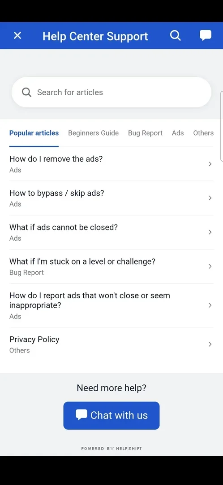

# Settings

A full-screen list of options opened from the home screen: five toggles (Sound, Vibration, Music,
Guideline, Zen Mode), an account entry (Save Your Progress), Rate Us and Feedback, and links to the
Privacy Policy and Terms of Service [^s1]. Every toggle switches with a tap and keeps its state after
Settings is closed; Feedback opens an in-game help centre, and the two documents open in the phone's
browser [^s2] [^s3] [^s4].

## Why it appeared

Open from the start: the gear icon is on the home screen on the first launch, with no lock [^s1] [^s5].

## Where to find it

Home screen > the gear icon in the top right corner [^s5]. The Back key, or the arrow left of the
"Settings" title, returns to Home [^s6] [^s7].

 [^s5]
*Home screen: the gear icon top right opens Settings*

## What it looks like

A light screen titled "Settings" with a back arrow, and four white blocks of rows [^s1]:

- toggles: Sound, Vibration, Music, Guideline, Zen Mode;
- Save Your Progress, with an arrow;
- Rate Us and Feedback, each with an arrow;
- Privacy Policy and Terms of Service, each with an arrow.

An on toggle is orange, an off toggle grey [^s8].

 [^s9]
*Settings at level 12: Guideline on, Zen Mode off*

On a fresh install Sound, Vibration and Music were on and Guideline and Zen Mode off [^s1]; at level
12 Guideline was on when Settings was opened [^s9].

 [^s1]
*The Settings screen on a fresh install, default values*

## What you can do

| Tab or button | Default | What it does |
|---|---|---|
| [Sound, Vibration and Music](#sound-vibration-and-music) | on | each switches off (grey) and on (orange) with a tap |
| [Guideline](guideline.md) | off | switches off and on; see its page |
| [Zen Mode](zen-mode.md) | off | switches; no visible effect in a level; see its page |
| [Save Your Progress](#save-your-progress) | — | opens the Save Progress popup; see [its page](cloud-save.md) |
| [Rate Us and Feedback](#rate-us-and-feedback) | — | Rate Us opens a rating popup, see [its page](rate-us.md); Feedback opens the Help Center |
| [Privacy Policy and Terms of Service](#privacy-policy-and-terms-of-service) | — | open the documents in the phone's browser |
| [In-level Settings popup](#in-level-settings-popup) | — | the gear inside a level: a shorter list with Restart |

All values are from the Settings frames above, version 1.33.0 [^s1] [^s9].

### Sound, Vibration and Music

<!-- no-frame: the three toggles are on the Settings frames above; the off state is a recolour of the switch -->
The first three rows, each with an icon and a switch; all three on by default [^s1]. One tap on each
turned all three grey (off), a second tap turned them orange again [^s8] [^s10]. The Guideline switch was
turned off and back on the same way [^s10] [^s2]. Whether the game's sound, vibration and
music actually stopped was not checked.

### Save Your Progress

<!-- no-frame: the row is on the Settings frames above; its popup is on its own page -->
A row with a person icon and an arrow, alone in the second block [^s1]. It opens the Save Progress popup
(sign in with Facebook or Google, Delete Account), described on the
[Save Your Progress](cloud-save.md) page; the restore seen on the first launch is on the
[Consent screen](consent.md) page.

### Rate Us and Feedback

 [^s11]
*Feedback opens the Help Center inside the game (Powered by Helpshift)*

Two rows with arrows in the third block: Rate Us (a thumbs-up icon) and Feedback (a speech-bubble icon)
[^s1]. Rate Us opens a popup over Settings with five empty stars, "Do you like Amaze GO?", a Rate button
and an X; X closes it with nothing changed [^s12] (see [Rate Us](rate-us.md)).

Feedback opens, after a short load, a blue "Help Center Support" screen inside the game: an X, a search icon
and a chat icon on the title bar; a "Search for articles" field; tabs Popular articles, Beginners Guide,
Bug Report, Ads and Others; a list of six popular articles, four of them about ads (removing, skipping,
ads that do not close, reporting ads), one about being stuck on a level, and the privacy policy; "Need
more help?" with a Chat with us button; "Powered by Helpshift" at the foot [^s11]. The X at the top left
returns to Settings [^s3]. No article and no chat were opened.

### Privacy Policy and Terms of Service

<!-- no-frame: both open Chrome, another app; its frames do not go on the page -->
Two rows with arrows in the last block [^s1]. Each opens the phone's browser (Chrome) on a page of
oakevergames.com: the privacy policy, dated 5 August 2026 on the page, and the terms of service
[^s4] [^s13]. Switching back to the game showed Settings again [^s14] [^s15]. The same two
documents are linked from the [Consent screen](consent.md).

### In-level Settings popup

The gear top right of a level opens a shorter Settings popup over the board: Sound, Vibration, Music and
Zen Mode switches and an orange Restart button, with an X to close; no Guideline and no Save Your Progress
[^s16].

 [^s16]
*The Settings popup inside a level: four switches and Restart*

## How it works

Version 1.33.0. A toggle changes with one tap, with no confirmation, and keeps its state when Settings is
left and opened again (seen with Zen Mode) [^s8] [^s17]. Nothing in Settings costs or pays anything.
Guideline and Save Your Progress are only in the home screen's Settings, not in the in-level popup
[^s16]. All toggles were left as found at the end of the session [^s18].

## Cases

| Case | What was done | Result | Source |
|---|---|---|---|
| Why it appeared <!-- case:chk-appeared --> | Fresh install, looked at Home | ✅ The gear is on Home from the first launch | [^s1] |
| Where to find it: the screen and the button that open it <!-- case:chk-entry --> | Tapped the gear top right of Home | ✅ Settings opened | [^s5] |
| What it looks like: its screen <!-- case:chk-screen --> | Opened Settings | ✅ Five toggles, Save Your Progress, Rate Us, Feedback, Privacy Policy, Terms of Service | [^s1] |
| Every option or button and what it changes <!-- case:chk-options --> | Switched Sound, Vibration, Music and Guideline off and back on | ✅ Each turns grey (off) and orange (on); Zen Mode on its own page | [^s2] |
| For a prompt: what each answer does and whether it comes back <!-- case:chk-answers --> | Looked for prompts in Settings | ✅ None in Settings itself; Rate Us and Save Your Progress are separate popups with their own pages | [^s2] |
| Gear in a level opens a short settings popup <!-- case:in-level-popup --> | Opened level 3 and tapped the gear top right | ✅ Sound, Vibration, Music, Zen Mode and Restart; no Guideline, no Save Progress | [^s16] |
| Links out (privacy, terms, help): where they lead <!-- case:chk-links --> | Opened Feedback, Privacy Policy and Terms of Service | ✅ Feedback: the in-game Helpshift Help Center, X returns; Privacy Policy and Terms: Chrome on oakevergames.com; back in the game, Settings | [^s13] |

## Not verified

- Whether Sound, Vibration and Music off actually stop the sound, the vibration and the music
- The Help Center's articles and Chat with us were not opened

[^s1]: session 20261003-200141-chrono-2FYKPJ, step 5 — [video at 1:32](https://youtu.be/l44HK-PZ5-o?t=92)
[^s2]: session 20261005-144428-chrono-2FYKPJ, step 18 — [video at 2:52](https://youtu.be/nK0PubVvnuA?t=172)
[^s3]: session 20261005-144428-chrono-2FYKPJ, step 20 — [video at 3:13](https://youtu.be/nK0PubVvnuA?t=193)
[^s4]: session 20261005-144428-chrono-2FYKPJ, step 21 — [video at 3:19](https://youtu.be/nK0PubVvnuA?t=199)
[^s5]: session 20261003-200141-chrono-2FYKPJ, step 2 — [video at 0:39](https://youtu.be/l44HK-PZ5-o?t=39)
[^s6]: session 20261003-200141-chrono-2FYKPJ, step 6 — [video at 1:48](https://youtu.be/l44HK-PZ5-o?t=108)
[^s7]: session 20261005-144428-chrono-2FYKPJ, step 27 — [video at 4:51](https://youtu.be/nK0PubVvnuA?t=291)
[^s8]: session 20261005-144428-chrono-2FYKPJ, step 16 — [video at 2:35](https://youtu.be/nK0PubVvnuA?t=155)
[^s9]: session 20261005-144428-chrono-2FYKPJ, step 15 — [video at 2:21](https://youtu.be/nK0PubVvnuA?t=141)
[^s10]: session 20261005-144428-chrono-2FYKPJ, step 17 — [video at 2:48](https://youtu.be/nK0PubVvnuA?t=168)
[^s11]: session 20261005-144428-chrono-2FYKPJ, step 19 — [video at 3:00](https://youtu.be/nK0PubVvnuA?t=180)
[^s12]: session 20261003-232357-chrono-2FYKPJ, step 4 — [video at 0:42](https://youtu.be/x9mSZuHgO_4?t=42)
[^s13]: session 20261005-144428-chrono-2FYKPJ, step 23 — [video at 3:57](https://youtu.be/nK0PubVvnuA?t=237)
[^s14]: session 20261005-144428-chrono-2FYKPJ, step 22 — [video at 3:40](https://youtu.be/nK0PubVvnuA?t=220)
[^s15]: session 20261005-144428-chrono-2FYKPJ, step 24 — [video at 4:19](https://youtu.be/nK0PubVvnuA?t=259)
[^s16]: session 20261003-232108-chrono-2FYKPJ, step 9 — [video at 1:26](https://youtu.be/KL7evNlX6oU?t=86)
[^s17]: session 20261005-144428-chrono-2FYKPJ, step 38 — [video at 8:02](https://youtu.be/nK0PubVvnuA?t=482)
[^s18]: session 20261005-144428-chrono-2FYKPJ, step 39 — [video at 8:14](https://youtu.be/nK0PubVvnuA?t=494)
