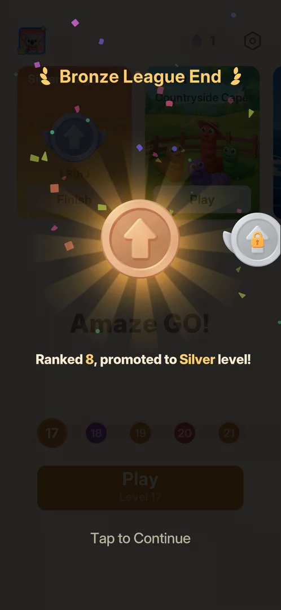
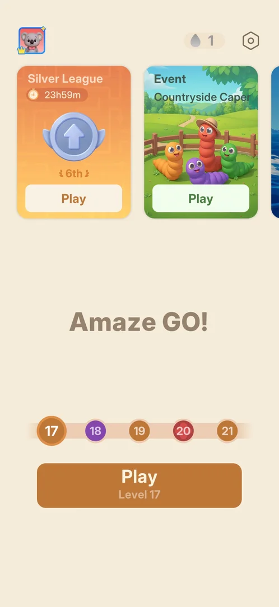
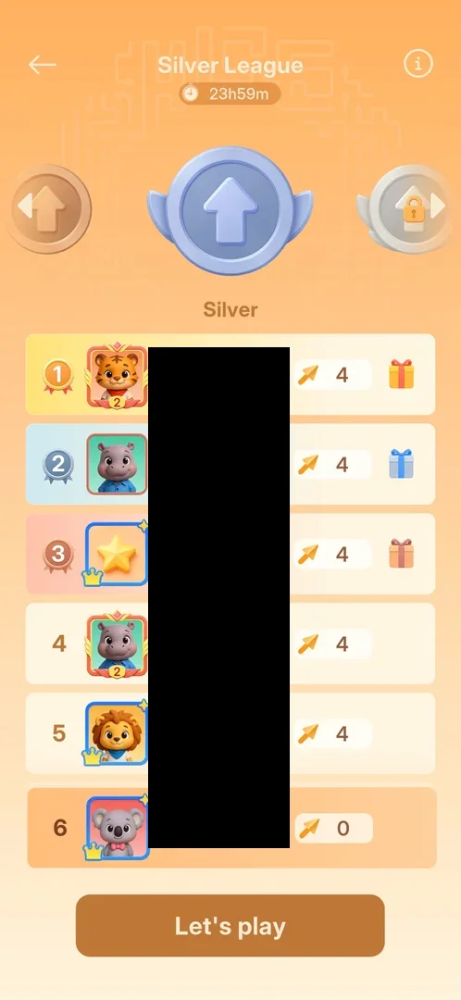
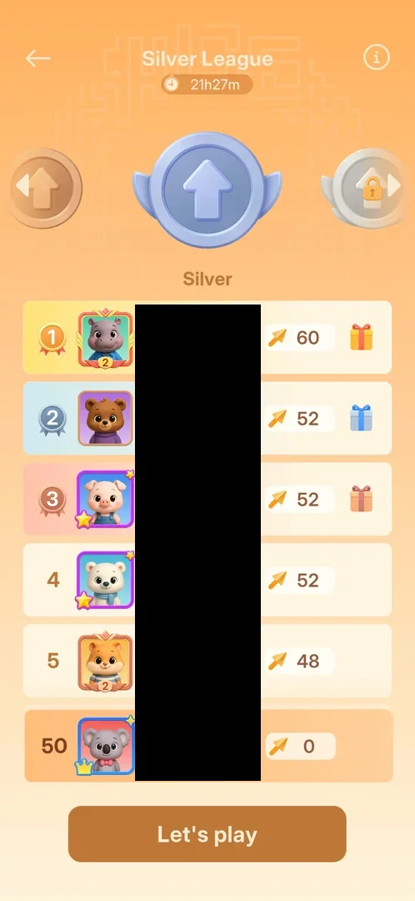
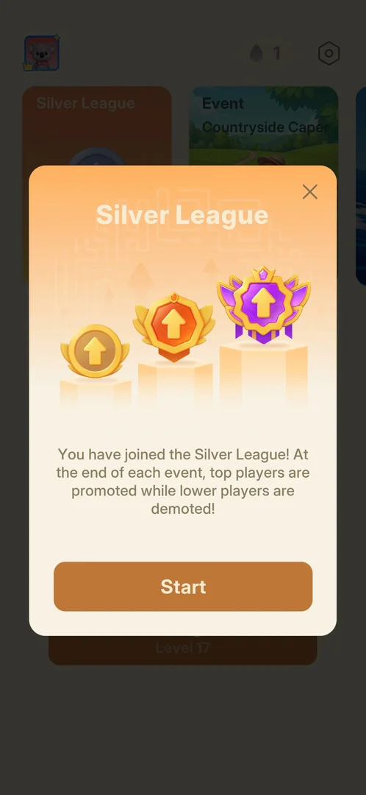
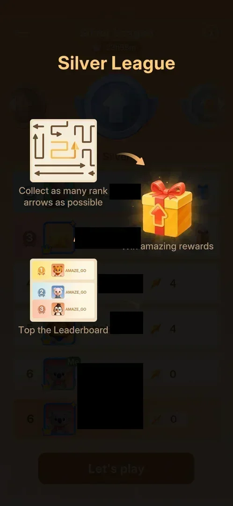
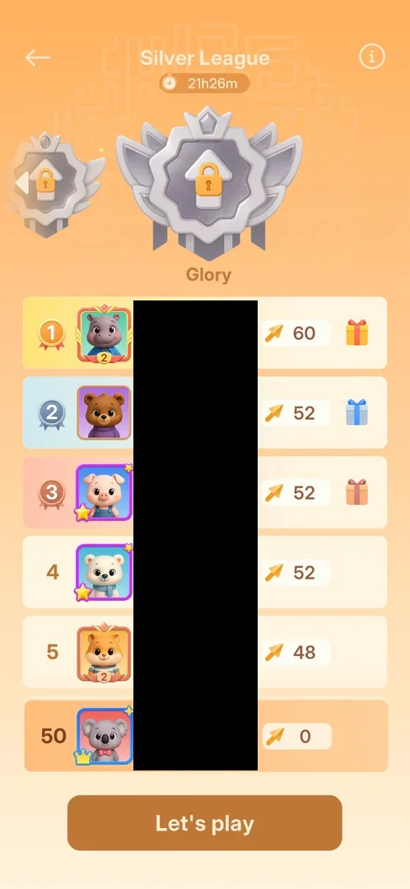
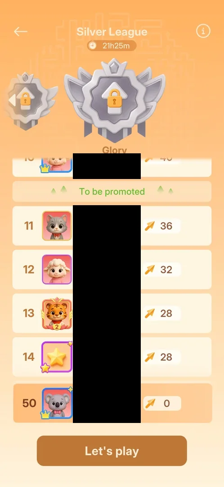
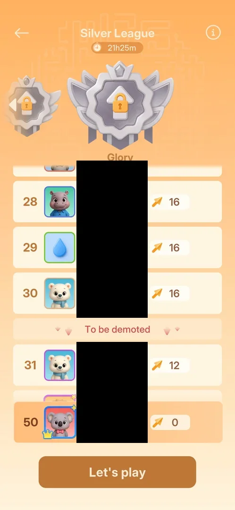
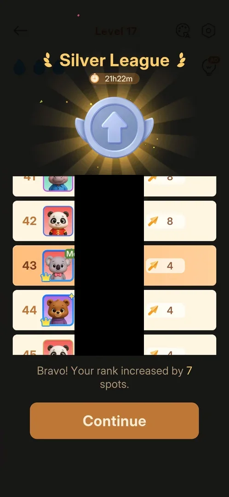

# Silver League

The second tier of the league leaderboard, after the [Bronze League](bronze-league.md). It takes the place
of the Bronze League card on Home once the player is promoted at the end of a Bronze period: the same
24-hour leaderboard of "rank arrows" (the [gold arrows](gold-arrows.md) cleared on won levels), with gifts
for ranks 1 to 3. At the end of the period the top 10 of 50 move up to Gold and ranks 31 to 50 drop back
to Bronze [^s1] [^s3] [^s12] [^s13].

## Why it appeared

The Bronze League period ended with the player at rank 8. On the next launch a "Bronze League End" card
said "Ranked 8, promoted to Silver level!"; Tap to Continue brought a "Silver League" popup, "You have
joined the Silver League!" [^s6] [^s1].

 [^s6]
*On launch after the Bronze period: the promotion card. No currency or item is given for rank 8*

## Where to find it

Home > the carousel at the top > the first card from the left, now titled "Silver League" (left of the Event
Countryside Capers card) > its medal or its Play button [^s2] [^s3].

 [^s2]
*Home after promotion: the silver medal on the Silver League card, first in the carousel, opens the league*

The card shows the time left in the period, the silver medal and the player's rank [^s2].

## What it looks like

 [^s3]
*The league screen one minute into the period. The players' names are blacked out on this page*

The same layout as the Bronze League screen, in the same orange [^s3]:

- a back arrow, the title "Silver League" with the period timer, and an (i) at the top right;
- the medal row: the silver medal (with wings) in the centre labelled "Silver", the bronze medal at the left
  edge, and the next tier's medal with a lock at the right edge;
- the leaderboard: rank, avatar, name and count of rank arrows; ranks 1 to 3 have medal badges, coloured
  rows and a gift box each (gold, blue, red);
- a "Let's play" button, which opens the next main level directly (Level 17) [^s14].

 [^s10]
*The same screen 2.5 hours into the period: 50 ranks. Names are blacked out on this page*

## What you can do

| Tab or button | What it does |
|---|---|
| [Joined popup](#joined-popup) | comes once after the Bronze League End card; Start opens the current level |
| [How to play](#how-to-play) | the overlay of three panels, on opening the league and on the (i) |
| [Leaderboard](#leaderboard) | ranks and rank-arrow counts; gifts for the top 3 (a tap does nothing) |
| [Tier carousel](#tier-carousel) | the medal row: arrows or a swipe step through the 7 tiers |
| [Promotion line](#promotion-line) | the green "To be promoted" divider under rank 10 |
| [Demotion line](#demotion-line) | the red "To be demoted" divider under rank 30 |
| [Rank jump card](#rank-jump-card) | after a won level: the new rank and the spots gained |
| [Let's play](#lets-play) | opens the next main level |

### Joined popup

 [^s1]
*After Tap to Continue on the Bronze League End card: the Silver League popup with Start and an X*

The same popup as when joining Bronze, with "Silver League" in the title and the text: at the end of each
event the top players are promoted and the lower players demoted. Start opened the current level's board
(level 17), not the league [^s1] [^s7]. The X was not tapped.

### How to play

 [^s4]
*The (i) overlay; names behind it are blacked out on this page*

The (i) opens the same three panels as in the Bronze League: collect rank arrows, win rewards, top the
leaderboard. No reward values are given [^s4].

### Leaderboard

<!-- no-frame: the leaderboard is on the league screen frame above -->
One minute into the period the list had only 6 rows: five other players already at 4 rank arrows each, and
the player 6th with 0. The player's row, marked "Me", sat in the list and again pinned at the bottom
[^s5]. The list fills up over the period: 2.5 hours later (21h27m left) it had 50 ranks, the leader at 60
rank arrows, and the player with 0 had dropped to 50th, the last rank [^s10]. A tap on the rank 1 gift
opens nothing, on both visits; the gift contents are shown neither on the board nor in the (i) overlay
[^s8] [^s9].

### Tier carousel

 [^s11]
*The last tier, Glory. The list below still shows the Silver ranks*

The medal row is a carousel: the arrows on the side medals or a swipe step through 7 tiers, Bronze,
Silver (current), Gold, Emerald, Epic, Diamond and Glory. Glory is the last (no right arrow); every tier
above Silver carries a padlock. The rank list below does not change with the carousel [^s11].

### Promotion line

 [^s12]
*The promotion line under rank 10 at 21h25m*

A green "To be promoted" divider sits under rank 10: the top 10 move up to Gold. At 21h25m rank 10 had 40
rank arrows and rank 11 had 36 [^s12] [^s13].

### Demotion line

 [^s13]
*The demotion line under rank 30 at 21h25m*

A red "To be demoted" divider sits under rank 30: ranks 31 to 50 drop back to Bronze, ranks 11 to 30 stay
in Silver. At 21h25m rank 30 had 16 rank arrows and rank 31 had 12 [^s13].

### Rank jump card

 [^s15]
*Right after a won level, before the win card: the player went from 50th to 43rd*

*The last arrow of level 17 leaves the board, the Silver League card opens over the level with confetti, the player's row (50th, 0) rises to 43rd with 4 rank arrows, then Continue appears* (clip dropped: per-dream clip limit) [^s15]
*Clip 7.9 s · [original on YouTube from 4:50](https://youtu.be/cXWwykdpuIE?t=290). Names, and a player's name on a reaction bubble over the board, are blacked out*

After a won level the Silver League card comes first, before the level's win card and the interstitial
ad: the list scrolled to the player's new rank and a line with the spots gained ("Bravo! Your rank
increased by 7 spots."), then Continue [^s15]. After the Hard level 18 win the line read "Excellent! You
climbed up 4 spots fast." [^s16] After the level 19 win: 8 to 12 rank arrows, 39th to 33rd [^s17].

### Let's play

<!-- no-frame: the button is at the bottom of the league screen frames above -->
The brown button at the bottom of the league screen. It opens the next main level's board directly
(Level 17), with no level-select step in between [^s14].

## How it works

Version 1.33.0.

- Opens on promotion from Bronze: rank 8 at the end of the Bronze period was enough [^s6].
- A period lasts 24 hours: Bronze was joined at about 01:35 on 2026-10-05, its end card came on the launch
  at 01:37 on 2026-10-06, and the Silver timer then read 23h59m [^s4].
- The board holds 50 players; it starts with a few rows and fills up during the period [^s5] [^s10].
- Points: rank arrows, as in Bronze (the how-to overlay is the same) [^s4]. A won main level gave +4
  (Level 17: 0 to 4, rank 50th to 43rd) [^s15], and a won Hard level also +4 (Level 18: 4 to 8, rank 43rd
  to 39th): the points do not depend on the level's difficulty [^s16]. Level 19 gave +4 too (8 to 12, 39th
  to 33rd) [^s17]. Bronze levels 11 and 12 also gave
  +4 each, so probably 4 per win (inferred).
- Promotion and demotion: top 10 up to Gold, ranks 31 to 50 down to Bronze, 11 to 30 stay [^s12] [^s13].
- Tiers: Bronze, Silver, Gold, Emerald, Epic, Diamond, Glory [^s11].
- Rewards: gift boxes for ranks 1 to 3; their contents were not seen [^s3] [^s8] [^s13].

## Cases

| Case | What was done | Result | Source |
|---|---|---|---|
| Why it appeared <!-- case:chk-appeared --> | Launched the game after the Bronze period ended at rank 8 | ✅ Bronze League End card "Ranked 8, promoted to Silver level!", then the Silver League joined popup | [^s6] [^s1] |
| Where to find it <!-- case:chk-entry --> | Quit level 17 to Home and tapped the league card's medal | ✅ The first carousel card, now Silver League, with timer, medal and rank; the medal opens the league | [^s2] [^s3] |
| Its screen <!-- case:chk-screen --> | Opened the league | ✅ Title with a 23h59m timer, medal row Bronze / Silver / locked tier, leaderboard with gifts on ranks 1-3, Let's play | [^s3] |
| The board <!-- case:chk-board --> | Scrolled the list at the period start | ✅ Only 6 rows: five players at 4 rank arrows, the player 6th with 0, the "Me" row also pinned at the bottom | [^s5] |
| The period <!-- case:chk-period --> | Read the timer right after the promotion | ✅ 23h59m: a 24 h period starting on the launch that ended Bronze | [^s4] |
| The list fills <!-- case:fill-over-time --> | Opened the league again 2.5 hours into the period | ✅ 50 ranks, the leader at 60 rank arrows; the player with 0 last (50th) | [^s10] |
| Tier ladder <!-- case:tier-ladder --> | Stepped the medal row with the arrows and a swipe | ✅ 7 tiers, Bronze, Silver, Gold, Emerald, Epic, Diamond, Glory; all above Silver padlocked; the list does not change | [^s11] |
| Promotion and demotion lines <!-- case:promotion-demotion --> | Scrolled the 50-rank list | ✅ "To be promoted" under rank 10, "To be demoted" under rank 30; at 21h25m 40 rank arrows for 10th, 16 for 30th | [^s12] [^s13] |
| The gift <!-- case:gift-tap --> | Tapped the rank 1 gift | ✅ Nothing opens; the contents are shown neither on the board nor in the (i) | [^s9] [^s4] |
| Let's play <!-- case:lets-play --> | Tapped Let's play | ✅ Level 17 opened directly | [^s14] |
| What earns points <!-- case:chk-points --> | Won level 17 (normal) | ✅ +4 rank arrows, 0 to 4, rank 50th to 43rd, on the jump card right after the win | [^s15] |
| Points on a Hard level <!-- case:points-hard --> | Won Hard level 18 | ✅ +4 as well (4 to 8, 43rd to 39th): the points do not depend on difficulty | [^s16] |
| Rewards per rank <!-- case:chk-rewards --> | Tapped the rank 1 gift; scrolled the list | partly: the promotion and demotion lines are known; the gift contents and any end reward not seen | [^s9] [^s12] [^s13] |
| The end of a period <!-- case:chk-end --> | — | not verified: a follow-up after the timer ends |  |

## Not verified

- Rewards per rank: what the gifts of ranks 1 to 3 hold, and whether promotion pays anything (task exp-league-top3-reward) <!-- case:chk-rewards -->
- The end of the Silver period: the results card, a promotion to Gold or a demotion to Bronze <!-- case:chk-end -->
- What the X on the joined popup does
- Whether a win always gives 4 rank arrows, or one per gold arrow on the board (level 17's start frame showed none, a toast covered the middle)

[^s1]: session 20261006-013740-chrono-2FYKPJ, step 1 — [video at 0:16](https://youtu.be/O4n16Ei5uiU?t=16)
[^s2]: session 20261006-013740-chrono-2FYKPJ, step 3 — [video at 0:49](https://youtu.be/O4n16Ei5uiU?t=49)
[^s3]: session 20261006-013740-chrono-2FYKPJ, step 4 — [video at 1:01](https://youtu.be/O4n16Ei5uiU?t=61)
[^s4]: session 20261006-013740-chrono-2FYKPJ, step 7 — [video at 1:40](https://youtu.be/O4n16Ei5uiU?t=100)
[^s5]: session 20261006-013740-chrono-2FYKPJ, step 6 — [video at 1:28](https://youtu.be/O4n16Ei5uiU?t=88)
[^s6]: session 20261006-013740-chrono-2FYKPJ, step 0 — [video at 0:00](https://youtu.be/O4n16Ei5uiU?t=0)
[^s7]: session 20261006-013740-chrono-2FYKPJ, step 2 — [video at 0:32](https://youtu.be/O4n16Ei5uiU?t=32)
[^s8]: session 20261006-013740-chrono-2FYKPJ, step 5 — [video at 1:17](https://youtu.be/O4n16Ei5uiU?t=77)
[^s10]: session 20261006-041006-chrono-2FYKPJ, step 1 — [video at 0:27](https://youtu.be/cXWwykdpuIE?t=27)
[^s11]: session 20261006-041006-chrono-2FYKPJ, step 9 — [video at 1:47](https://youtu.be/cXWwykdpuIE?t=107)
[^s12]: session 20261006-041006-chrono-2FYKPJ, step 10 — [video at 1:59](https://youtu.be/cXWwykdpuIE?t=119)
[^s13]: session 20261006-041006-chrono-2FYKPJ, step 13 — [video at 2:32](https://youtu.be/cXWwykdpuIE?t=152)
[^s14]: session 20261006-041006-chrono-2FYKPJ, step 14 — [video at 2:50](https://youtu.be/cXWwykdpuIE?t=170)
[^s15]: session 20261006-041006-chrono-2FYKPJ, step 35 — [video at 4:58](https://youtu.be/cXWwykdpuIE?t=298)
[^s16]: session 20261006-041006-chrono-2FYKPJ, step 91 — [video at 11:36](https://youtu.be/cXWwykdpuIE?t=696)
[^s9]: session 20261006-041006-chrono-2FYKPJ, step 2 — [video at 0:40](https://youtu.be/cXWwykdpuIE?t=40)
[^s10]: session 20261006-041006-chrono-2FYKPJ, step 1 — [video at 0:27](https://youtu.be/cXWwykdpuIE?t=27)
[^s11]: session 20261006-041006-chrono-2FYKPJ, step 9 — [video at 1:47](https://youtu.be/cXWwykdpuIE?t=107)
[^s12]: session 20261006-041006-chrono-2FYKPJ, step 10 — [video at 1:59](https://youtu.be/cXWwykdpuIE?t=119)
[^s13]: session 20261006-041006-chrono-2FYKPJ, step 13 — [video at 2:32](https://youtu.be/cXWwykdpuIE?t=152)
[^s14]: session 20261006-041006-chrono-2FYKPJ, step 14 — [video at 2:50](https://youtu.be/cXWwykdpuIE?t=170)
[^s15]: session 20261006-041006-chrono-2FYKPJ, step 35 — [video at 4:58](https://youtu.be/cXWwykdpuIE?t=298)
[^s16]: session 20261006-041006-chrono-2FYKPJ, step 91 — [video at 11:36](https://youtu.be/cXWwykdpuIE?t=696)
[^s17]: session 20261006-041006-chrono-2FYKPJ, step 123 — [video at 16:26](https://youtu.be/cXWwykdpuIE?t=986)
