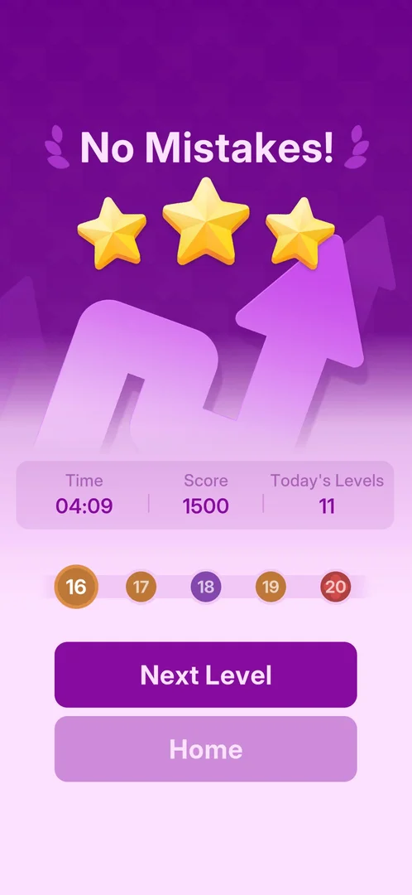
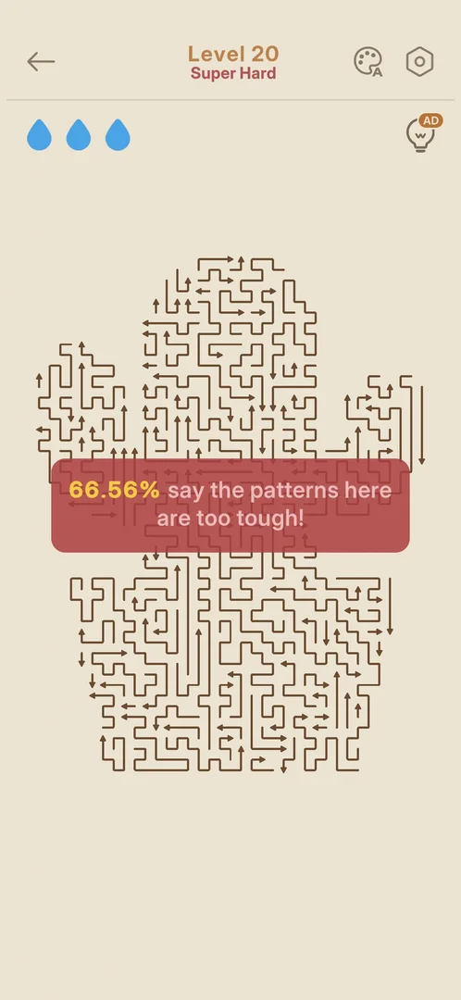
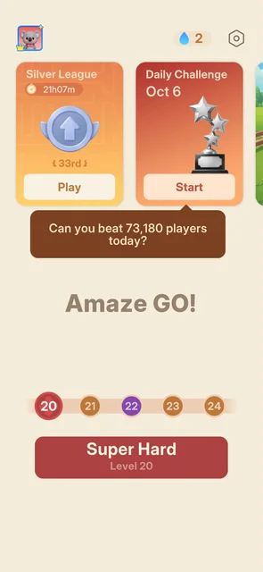

# Red level node (level 20)

A main level marked "Super Hard": red on the level path and on Home's Play button, where [Hard](hard-level.md)
levels are purple and normal levels orange. Level 20 is the first one seen. It opens as a normal level
with a red "Super Hard" subtitle, the same three drops and hint bulb, and a large shaped board [^s1] [^s3]
[^s4]. It was opened and left at once; it has not been played.

## Why it appeared

By the level number: level 20 is "Super Hard" (the subtitle in the level, the red Home Play button) [^s4]
[^s3]. Its red node turns up on the five-node level path as soon as level 20 enters it, after the level 15
win, the same way the purple Hard nodes do [^s1] [^s2].

 [^s1]
*The red node 20 first seen, at the right end of the path on the level 15 win card*

## Where to find it

Home > the Play button, when level 20 is the next level: the button is red and reads "Super Hard" over
"Level 20" (for Hard levels it is purple, "Hard"). Next Level on the level 19 win card also leads there
[^s3].

 [^s3]
*The red Super Hard Play button under the level path; the red node 20 is the current one*

## What it looks like

 [^s4]
*Level 20 on opening: the red subtitle and toast, and the shaped board*

- The header "Level 20" with a red "Super Hard" subtitle (Hard levels: a purple "Hard") [^s4].
- A red start toast across the board, "66.56% say the patterns here are too tough!" (Hard levels have a
  purple or brown one) [^s4].
- The same three drops at the top left and the hint bulb with its AD badge at the top right [^s4].
- The board is not a rectangle but a shaped outline (a paw or mitten), with a finer grid than Hard level 18
  and roughly 150 or more arrows. It fits the screen on opening; no Pinch-to-zoom tip came [^s4].

## How it works

Version 1.33.0.

- Level 20 is Super Hard. On the path 20-24 seen from Home, 22 is purple (Hard) and 21, 23 and 24 are
  orange: no other red node up to 24 [^s3].
- The level path shows five levels ahead, so a red node is announced five levels before it [^s1].
- Drops and the hint are as on other levels at the start: 3 drops, the AD hint bulb [^s4]. Whether a
  mistake costs more, and what the win pays, were not seen.

## Outcomes

| Outcome | As the base or what differs | Frame |
|---|---|---|
| quit <!-- case:under-quit --> | As the base: the back arrow left level 20 at once, with no confirmation (no move made, drops full); Home still shows the red "Super Hard / Level 20" Play [^s5] |  |
| win <!-- case:under-win --> | not verified: level 20 not played | — |
| out of lives <!-- case:under-out-of-lives --> | not verified | — |
| restart <!-- case:under-restart --> | not verified | — |
| exit app <!-- case:under-exit-app --> | not verified | — |
| restart from the gear popup <!-- case:under-restart-gear --> | not verified | — |

## Cases

| Case | What was done | Result | Source |
|---|---|---|---|
| Why it appeared <!-- case:chk-appeared --> | Opened level 20 from Home | ✅ A fixed tier by level number: the level shows "Super Hard"; its node is red on the path from the level 15 win on | [^s4] [^s1] |
| How it is announced <!-- case:chk-announce --> | Looked at the level path and Home with level 20 next | ✅ A red node on the path, five levels ahead; then a red Home Play button "Super Hard / Level 20" | [^s1] [^s3] |
| Where to find it <!-- case:chk-entry --> | Looked at Home after the level 19 win | ✅ The red Play button "Super Hard / Level 20"; also Next Level on the level 19 win card | [^s3] |
| Its screen <!-- case:chk-screen --> | Opened level 20 | ✅ A red "Super Hard" subtitle, a red start toast, 3 drops and the AD hint bulb | [^s4] |
| The board <!-- case:board-shape --> | Looked at the board on opening | ✅ A shaped (mitten) outline, a finer grid than Hard level 18, roughly 150+ arrows, fits the screen | [^s4] |
| Quit <!-- case:under-quit --> | Tapped the back arrow before any move | ✅ Back to Home at once, no confirmation; the red Play stays | [^s5] |
| What differs in play <!-- case:chk-differs --> | — | not verified: no move made | |
| Its win <!-- case:chk-win --> | — | not verified | |
| Each loss <!-- case:chk-loss --> | — | not verified | |
| After a loss <!-- case:chk-retry --> | — | not verified | |
| Where and how often <!-- case:chk-frequency --> | Looked at the paths up to level 24 | not verified: one red node, at 20; none from 21 to 24 | [^s3] |

## Not verified

- What differs in play from a normal and a Hard level: the cost of a mistake, a timer <!-- case:chk-differs -->
- Its win card and any reward <!-- case:chk-win -->
- Its losses and what they cost <!-- case:chk-loss -->
- Continue and Restart offers after a loss <!-- case:chk-retry -->
- Which later levels are red <!-- case:chk-frequency -->
- The win on level 20 <!-- case:under-win -->
- Out of Lives on level 20 <!-- case:under-out-of-lives -->
- Restart from the Out of Lives popup on level 20 <!-- case:under-restart -->
- Closing the app during level 20 <!-- case:under-exit-app -->
- Restart from the gear popup on level 20 (on Hard level 15 it brought a full-screen ad first) <!-- case:under-restart-gear -->

[^s1]: session 20261005-224323-chrono-2FYKPJ, step 50 — [video at 19:05](https://youtu.be/qnyS1lQt1kE?t=1145)
[^s2]: session 20261005-224323-chrono-2FYKPJ, step 34 — [video at 9:27](https://youtu.be/qnyS1lQt1kE?t=567)
[^s3]: session 20261006-041006-chrono-2FYKPJ, step 127 — [video at 18:46](https://youtu.be/cXWwykdpuIE?t=1126)
[^s4]: session 20261006-041006-chrono-2FYKPJ, step 128 — [video at 19:27](https://youtu.be/cXWwykdpuIE?t=1167)
[^s5]: session 20261006-041006-chrono-2FYKPJ, step 129 — [video at 20:00](https://youtu.be/cXWwykdpuIE?t=1200)
