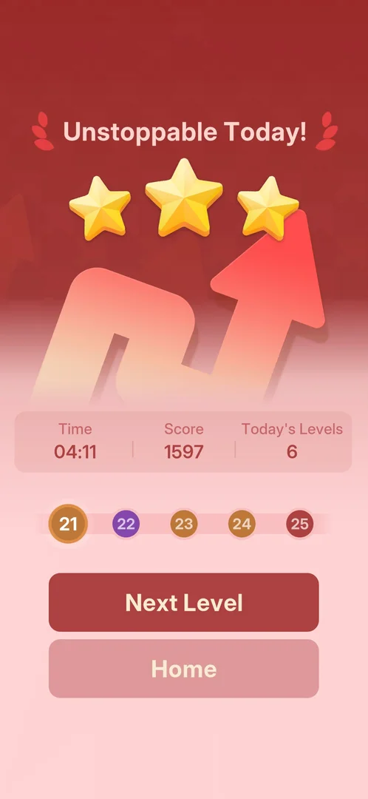
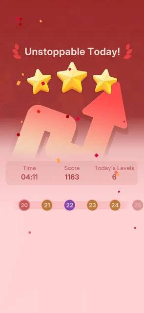

# Super Hard level (red, level 20)

A main level marked "Super Hard": red on the level path, on Home's Play button and on its win card, where
[Hard](hard-level.md) levels are purple and normal levels orange. Level 20 is the first one, and level 25
is red on the path too. It plays as any arrows level, with the same three drops and hint bulb, on a large
shaped board of 130 arrows; its win pays as any win and differs only in the red look of the card
[^s7] [^s2] [^s1] [^s6] [^s5] [^s3].

## Why it appeared

By the level number: level 20 is "Super Hard" (the subtitle in the level, the red Home Play button) [^s1]
[^s2]. Its red node turns up on the five-node level path as soon as level 20 enters it, after the level 15
win, the same way the purple Hard nodes do [^s7]
[^s8].

 [^s7]
*The red node 20 first seen, at the right end of the path on the level 15 win card*

## Where to find it

Home > the Play button, when level 20 is the next level: the button is red and reads "Super Hard" over
"Level 20" (for Hard levels it is purple, "Hard"). Next Level on the level 19 win card also leads there
[^s2].

 [^s2]
*The red Super Hard Play button under the level path; the red node 20 is the current one*

## What it looks like

 [^s1]
*Level 20 on opening: the red subtitle and toast, and the shaped board*

- The header "Level 20" with a red "Super Hard" subtitle (Hard levels: a purple "Hard") [^s1].
- A red start toast across the board, "66.56% say the patterns here are too tough!" (Hard levels have a
  purple or brown one) [^s1].
- The same three drops at the top left and the hint bulb with its AD badge at the top right [^s1].
- The board is not a rectangle but a shaped outline (a paw or mitten) of 130 arrows, with a finer grid
  than Hard level 18. It fits the screen on opening; no Pinch-to-zoom tip came [^s1] [^s6].

### Result

 [^s3]
*The level 20 win card after its score counted up; node 25 is red*

The win card is red: "Unstoppable Today!" with three stars over a red zig-zag arrow, Time, Score and
Today's Levels, the level path, a red Next Level and Home [^s3]. The normal win card is brown and orange
[^s5].

## How it works

Version 1.33.0.

- Super Hard is fixed by the level number: level 20, and on the path after its win level 25 is red too,
  with 22 purple (Hard) and 21, 23, 24 orange [^s2] [^s3]. Inferred: every fifth level from 20; levels
  after 25 not seen.
- The level path shows five levels ahead, so a red node is announced five levels before it
  [^s7].
- Play is that of any level: the same rules, 3 drops, the AD hint bulb, no timer and no stages [^s6].
- Level 20 won with 3 stars in 04:11, score 1597 (shown as 1163 while counting up), one mistake [^s5] [^s3].
- The win pays as any win: the Silver League rank jump card came first, 12 to 16 points (+4, as for a
  normal or Hard win), rank 34 to 30; no extra reward for Super Hard. An interstitial ad followed the
  win card by itself, as after other wins [^s6] [^s5].

## Outcomes

| Outcome | As the base or what differs | Frame |
|---|---|---|
| quit <!-- case:under-quit --> | As the base: the back arrow left level 20 at once, with no confirmation (no move made, drops full); Home still shows the red "Super Hard / Level 20" Play [^s4] |  |
| win <!-- case:under-win --> | Differs only in look: the win card is red with a red arrow, "Unstoppable Today!", 3 stars; the same +4 league points and the same interstitial after it as in the base [^s5] |  |
| out of lives <!-- case:under-out-of-lives --> | not verified: level 20 was won without losing all drops | — |
| restart <!-- case:under-restart --> | not verified | — |
| exit app <!-- case:under-exit-app --> | not verified | — |
| restart from the gear popup <!-- case:under-restart-gear --> | not verified | — |

## Cases

| Case | What was done | Result | Source |
|---|---|---|---|
| Why it appeared <!-- case:chk-appeared --> | Opened level 20 from Home | ✅ A fixed tier by level number: the level shows "Super Hard"; its node is red on the path from the level 15 win on | [^s1] |
| How it is announced <!-- case:chk-announce --> | Looked at the level path and Home with level 20 next | ✅ A red node on the path, five levels ahead; then a red Home Play button "Super Hard / Level 20" | [^s2] |
| Where to find it <!-- case:chk-entry --> | Looked at Home after the level 19 win | ✅ The red Play button "Super Hard / Level 20"; also Next Level on the level 19 win card | [^s2] |
| Its screen <!-- case:chk-screen --> | Opened level 20 | ✅ A red "Super Hard" subtitle, a red start toast, 3 drops and the AD hint bulb | [^s1] |
| The board <!-- case:board-shape --> | Looked at the board on opening | ✅ A shaped (mitten) outline, a finer grid than Hard level 18, fits the screen | [^s1] |
| Quit <!-- case:under-quit --> | Tapped the back arrow before any move | ✅ Back to Home at once, no confirmation; the red Play stays | [^s4] |
| What differs in play <!-- case:chk-differs --> | Played level 20 to the win | ✅ Nothing in the rules: 3 drops, the AD hint, no timer or stages; only the board differs (shaped, 130 arrows, a finer grid, fits the screen) | [^s6] |
| Its win <!-- case:chk-win --> | Won level 20 | ✅ The league jump card first (+4, as any win), then the red "Unstoppable Today!" card with 3 stars, 04:11; an interstitial after it; no extra reward | [^s5] |
| The win against the base <!-- case:under-win --> | Compared the cards | ✅ Only the look differs: red background and arrow art; the same +4, the same 3-star card, the same interstitial | [^s5] |
| The final score <!-- case:score-final --> | Waited for the count-up | ✅ 1163 early, 1597 final | [^s3] |
| Where and how often <!-- case:chk-frequency --> | Looked at the path after the level 20 win | ✅ Fixed level numbers: 20 and 25 are red, 22 is purple; levels after 25 not seen | [^s3] |
| Each loss <!-- case:chk-loss --> | — | not verified: no drop run out on level 20 | |
| After a loss <!-- case:chk-retry --> | — | not verified | |

## Not verified

- Its losses and what they cost <!-- case:chk-loss -->
- Continue and Restart offers after a loss <!-- case:chk-retry -->
- Out of Lives on a Super Hard level <!-- case:under-out-of-lives -->
- Restart from the Out of Lives popup on a Super Hard level <!-- case:under-restart -->
- Closing the app during a Super Hard level <!-- case:under-exit-app -->
- Restart from the gear popup on a Super Hard level (on Hard level 15 it brought a full-screen ad first) <!-- case:under-restart-gear -->
- Whether level 30 and every fifth level after it are Super Hard

[^s1]: session 20261006-041006-chrono-2FYKPJ, step 128 — [video at 20:05](https://youtu.be/cXWwykdpuIE?t=1205)
[^s2]: session 20261006-041006-chrono-2FYKPJ, step 127 — [video at 19:24](https://youtu.be/cXWwykdpuIE?t=1164)
[^s3]: session 20261006-064018-chrono-2FYKPJ, step 124 — [video at 18:59](https://youtu.be/W-r83CA_IdA?t=1139)
[^s4]: session 20261006-041006-chrono-2FYKPJ, step 129 — [video at 20:38](https://youtu.be/cXWwykdpuIE?t=1238)
[^s5]: session 20261006-064018-chrono-2FYKPJ, step 123 — [video at 18:21](https://youtu.be/W-r83CA_IdA?t=1101)
[^s6]: session 20261006-064018-chrono-2FYKPJ, step 122 — [video at 17:59](https://youtu.be/W-r83CA_IdA?t=1079)

[^s7]: session 20261005-224323-chrono-2FYKPJ, step 50 — [video at 19:44](https://youtu.be/qnyS1lQt1kE?t=1184)
[^s8]: session 20261005-224323-chrono-2FYKPJ, step 34 — [video at 9:47](https://youtu.be/qnyS1lQt1kE?t=587)
