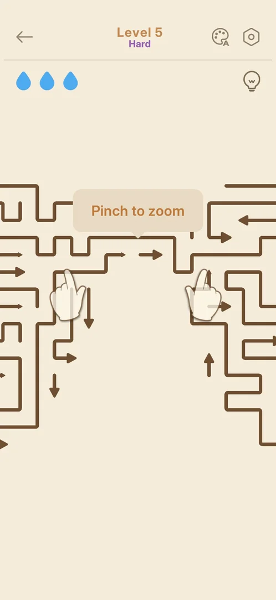
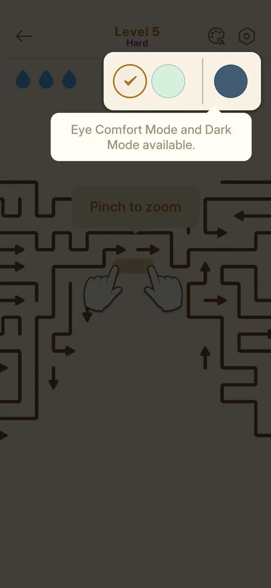
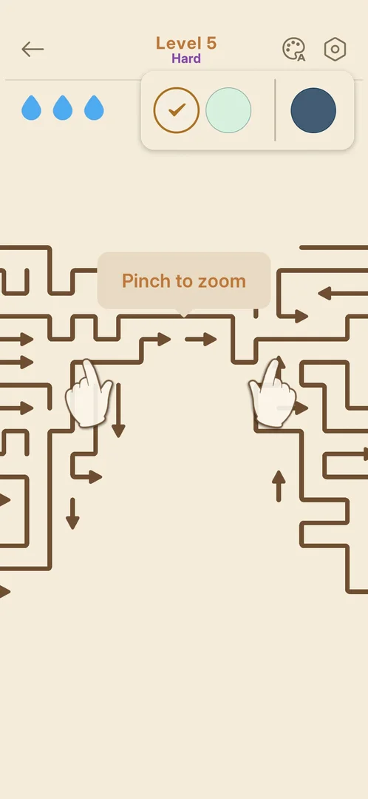
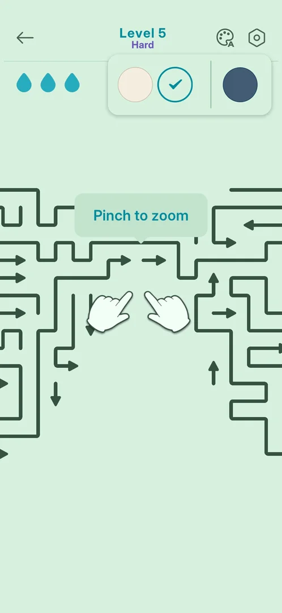
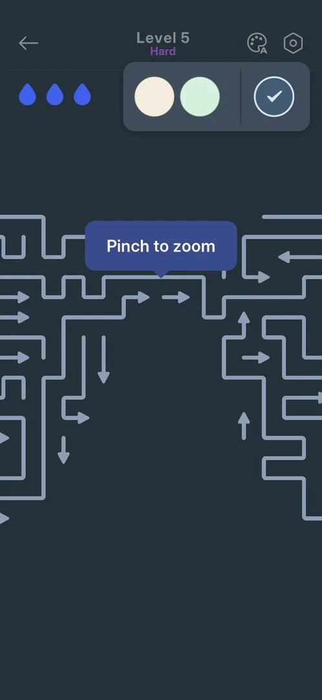

# Theme picker (palette icon in the level HUD)

A colour theme for the level screen. The palette icon in the level HUD opens a small popup with three
round swatches: the default cream theme, Eye Comfort Mode (pale green) and Dark Mode (dark blue). A tap
on a swatch recolours the board, the arrows, the HUD and the drops at once. All three themes were open,
with no lock and no price [^s3] [^s4] [^s5].

## Why it appeared

The palette icon is in the level HUD of level 3, the first level opened on this install [^s1]. It was
there on Hard level 5 too [^s2].

## Where to find it

In any level: the palette icon with a small "A", at the top right, left of the gear [^s2]. It was not
seen on Home.

 [^s2]
*Level 5 HUD: the palette icon with an "A", left of the gear at the top right*

## What it looks like

 [^s3]
*The theme popup on its first opening: three swatches, the current one checked, and a tip below*

A white popup drops down from the palette icon over the top of the board [^s3]:

- two light swatches, cream and pale green, then a thin divider, then a dark blue swatch;
- the current theme has a ring and a check mark (cream on the first opening);
- on the first opening, the rest of the screen is dimmed and a tip under the popup reads "Eye Comfort
  Mode and Dark Mode available." The tip and the dimming were gone after the first swatch tap [^s3]
  [^s4].

The popup stays open after a swatch is chosen. Taps on the drops row did not close it; the back arrow
still worked and led to Home [^s7] [^s8].

## What you can do

| Tab or button | What it does |
|---|---|
| [Default](#default) | Cream background, brown walls and arrows, light blue drops |
| [Eye Comfort Mode](#eye-comfort-mode) | Pale green background, dark green walls and arrows, teal drops |
| [Dark Mode](#dark-mode) | Dark blue-grey background, light grey-blue walls and arrows, bright blue drops |

### Default

 [^s6]
*The cream swatch (first) checked: the default look*

The theme the game starts with: cream background, brown walls and arrows, orange "Level 5", light blue
drops [^s2]. Tapping it again after Dark Mode restored this look [^s6].

### Eye Comfort Mode

 [^s4]
*The pale green swatch (second) checked: Eye Comfort Mode*

The background turns pale green, the walls and arrows dark green, "Level 5" and the drops teal, and the
"Pinch to zoom" tip green [^s4].

### Dark Mode

 [^s5]
*The dark blue swatch (third, after the divider) checked: Dark Mode*

The background turns dark blue-grey, the walls and arrows light grey-blue, "Level 5" grey, the drops
bright blue, and the "Pinch to zoom" tip a blue box with white text [^s5].

## How it works

Version 1.33.0.

- Three themes, all free and open at level 5: no lock, price or progress bar was shown [^s3].
- A tap on a swatch applies the theme at once, in the running level, without closing the popup [^s4]
  [^s5].
- Only the colours change: the board layout, the number of drops (three, all full) and the HUD buttons
  stayed the same in every theme [^s4] [^s5] [^s6].
- Not seen: whether the theme carries over to the next level, to Home or to the next launch. The session
  went back to the default before leaving the level [^s6].

## Cases

| Case | What was done | Result | Source |
|---|---|---|---|
| Why it appeared <!-- case:chk-appeared --> | Opened level 3 on a fresh install | ✅ The palette icon is in the level HUD from the first level opened | [^s1] |
| Where to find it <!-- case:chk-entry --> | Opened level 5, tapped the palette icon | ✅ Level HUD, top right, left of the gear; opens the theme popup | [^s2] [^s3] |
| Its screen <!-- case:chk-screen --> | Looked at the popup | ✅ Three swatches, the current one checked; a tip on the first opening; stays open after a choice | [^s3] [^s7] |
| The options <!-- case:chk-options --> | Tapped Eye Comfort Mode, Dark Mode, then the default | ✅ Three themes, none locked or priced; each applies at once to the board, arrows, HUD and drops; the default restores the start look | [^s4] [^s5] [^s6] |
| Answers <!-- case:chk-answers --> | — | ✅ Does not apply: not a prompt, a picker the player opens | [^s3] |
| Links out <!-- case:chk-links --> | — | ✅ Does not apply: the popup has no links | [^s3] |

## Not verified

- Whether the chosen theme stays for the next level, on Home and after an app restart (exp-theme-persist)
- Whether more themes come later in the game

[^s1]: session 20261003-232108-chrono-2FYKPJ, step 8 — [video at 1:09](https://youtu.be/KL7evNlX6oU?t=69)
[^s2]: session 20261003-233532-chrono-2FYKPJ, step 1 — [video at 0:17](https://youtu.be/RNRDUiKRry4?t=17)
[^s3]: session 20261003-233532-chrono-2FYKPJ, step 2 — [video at 0:25](https://youtu.be/RNRDUiKRry4?t=25)
[^s4]: session 20261003-233532-chrono-2FYKPJ, step 3 — [video at 0:34](https://youtu.be/RNRDUiKRry4?t=34)
[^s5]: session 20261003-233532-chrono-2FYKPJ, step 4 — [video at 0:41](https://youtu.be/RNRDUiKRry4?t=41)
[^s6]: session 20261003-233532-chrono-2FYKPJ, step 5 — [video at 0:49](https://youtu.be/RNRDUiKRry4?t=49)
[^s7]: session 20261003-233532-chrono-2FYKPJ, step 7 — [video at 1:03](https://youtu.be/RNRDUiKRry4?t=63)
[^s8]: session 20261003-233532-chrono-2FYKPJ, step 8 — [video at 1:16](https://youtu.be/RNRDUiKRry4?t=76)
