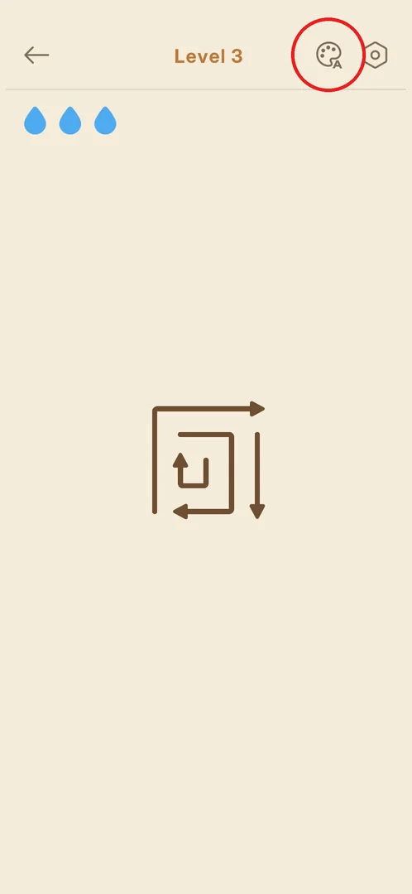
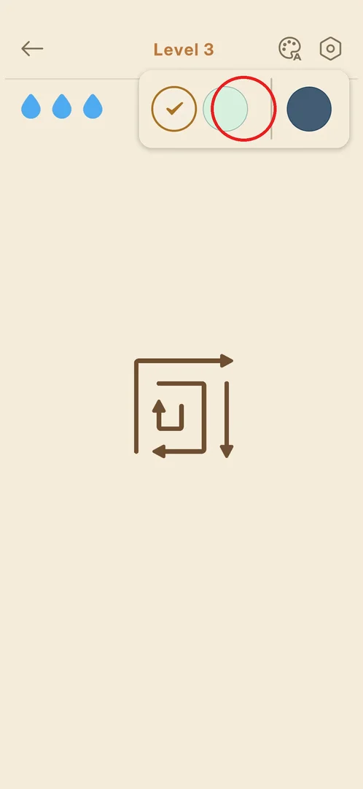
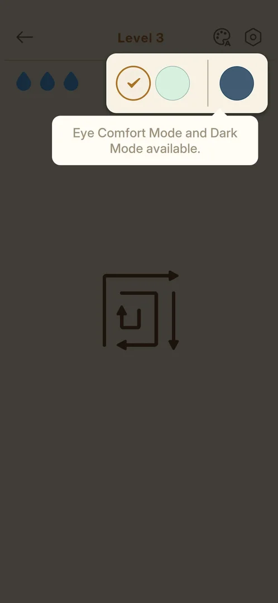

# Color themes (Eye Comfort / Dark Mode)

The player can change the colours of the level screen: besides the default beige there is a mint
"Eye Comfort Mode" and a dark-blue "Dark Mode". The choice is made in a small picker opened from the
level's top bar [^s3].

## Where to find it

From the [level screen](level-hud.md): the palette icon (with a small "A") at the top right, left of
the gear [^s1].

 [^s1]

## What it looks like

A small cream panel drops down under the palette icon with three round swatches: beige with a check
mark (the current theme), mint green, and, after a thin divider, dark blue. The board stays visible
under it [^s2].

 [^s2]

### Popup

The first time the picker opens, the rest of the screen is dimmed and a bubble under it says "Eye
Comfort Mode and Dark Mode available." [^s3].

 [^s3]

## How it works

- Three themes in version 1.31.0: the default beige, Eye Comfort (mint) and Dark Mode (dark blue)
  [^s3]. Which swatch is which mode is inferred from the bubble's order and the colours.
- A tap on the screen removed the bubble but left the picker open; tapping the palette icon again
  closed it [^s2] [^s1].

## Cases

| Case | What was done | Result | Source |
|---|---|---|---|
| Open the theme picker | Tapped the palette in level 3 | ✅ Three swatches and a bubble about the modes | [^s3] |
| Close the picker | Tapped the board, then the palette | ✅ The first tap removed the bubble, the second closed the picker | [^s1] |
| Switch to Eye Comfort or Dark Mode | <!-- --> | not verified |  |

## Not verified

- How the board looks in Eye Comfort Mode and in Dark Mode.
- Whether the theme also changes the main menu and the result screen.
- Whether the theme is kept after a restart.

[^s1]: session 20261001-204000-chrono-2FYKPJ, step 19 — [video at 4:03](https://youtu.be/tbyupdD9iso?t=243)
[^s2]: session 20261001-204000-chrono-2FYKPJ, step 18 — [video at 3:53](https://youtu.be/tbyupdD9iso?t=233)
[^s3]: session 20261001-204000-chrono-2FYKPJ, step 17 — [video at 3:41](https://youtu.be/tbyupdD9iso?t=221)
