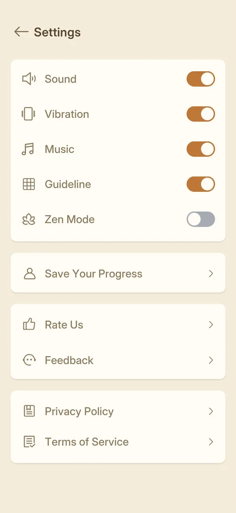
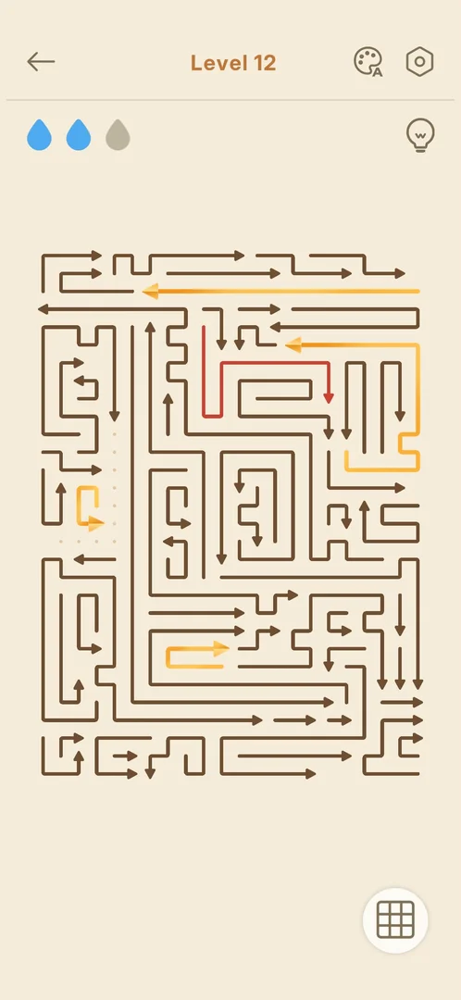
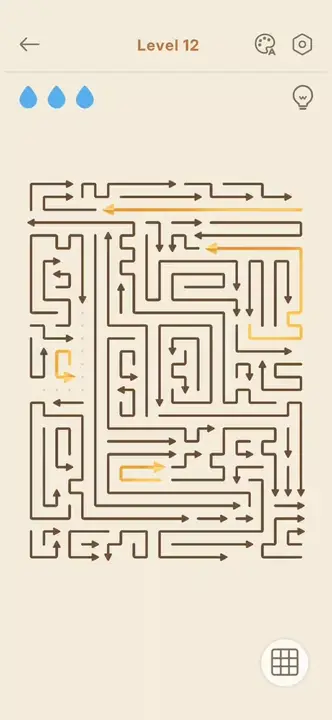
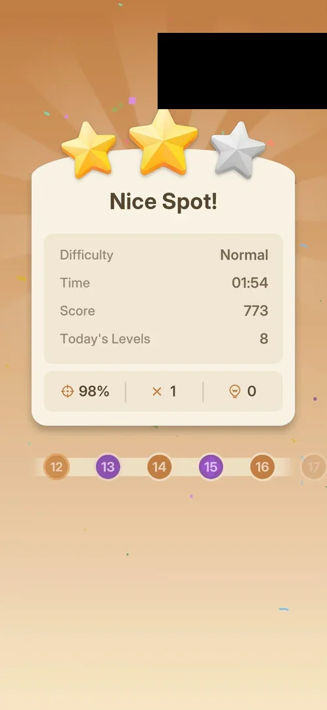

# Zen Mode toggle

A toggle in Settings named "Zen Mode", with a lotus icon, off by default [^s1]. It has no screen of its
own. Level 12 played with it on looked and played like a normal level: three drops, a blocked tap cost a
drop, and the win card was the usual one [^s2] [^s3]. What it changes was not found.

## Why it appeared

In Settings from the first launch, with no lock [^s1]. Hypothesis: it changes something not visible on a
Normal level (a Hard level's timer or score, sounds, or the ads), not verified: on Normal level 12 nothing
on the board, the drops or the win card differed [^s3].

## Where to find it

Home > the gear top right > Settings > the fifth row of the first block, "Zen Mode", with a lotus icon
[^s4]. The in-level gear popup has the same switch [^s5].

 [^s4]
*Settings: the Zen Mode switch, fifth row, off by default*

## What it looks like

<!-- no-screen: a toggle with no screen of its own; the level frame below is level 12 with it on -->
Only the switch: grey when off, orange when on [^s6]. A level with it on shows the same top bar (back
arrow, level number, palette, gear), three drops, the hint bulb and the guideline button as without it
[^s7] [^s2].

 [^s2]
*Level 12 with Zen Mode on, after a blocked tap: the arrow turns red and a drop goes grey, as without Zen Mode*

 [^s2]
*Clip 4 s · [original on YouTube from 5:43](https://youtu.be/nK0PubVvnuA?t=343)*

## How it works

Version 1.33.0. Free, with no lock or price [^s1]. One tap switches it; it stays on after Settings is
left, a level is played and Settings is opened again [^s6] [^s8]. With it on, on Normal level 12 (61
arrows) [^s9]:

- a free arrow slid out as usual [^s7];
- a tap on a blocked arrow drew it red and took a drop, 3 to 2, the same as without Zen Mode (see
  [Level](level.md)) [^s2];
- the win showed the league card first, then the usual win card [^s10] [^s3].

### Win with Zen Mode on

 [^s3]
*The level 12 win card with Zen Mode on: the normal card. Another player's banner is blacked out*

"Nice Spot!", 2 of 3 stars; Difficulty Normal, Time 01:54, Score 773, Today's Levels 8; 98%, 1 mistake,
0 hints. Nothing on it refers to Zen Mode [^s3].

## Cases

| Case | What was done | Result | Source |
|---|---|---|---|
| Why it appeared <!-- case:chk-appeared --> | Opened Settings | ✅ In Settings from the start, no lock; what it does is still a hypothesis | [^s1] |
| Where to find it: the screen and the button that open it <!-- case:chk-entry --> | Opened Settings from the Home gear | ✅ Fifth row, "Zen Mode", off | [^s4] |
| What it looks like: its screen <!-- case:chk-screen --> | Switched it on and played level 12 | ✅ No screen of its own; the level looks the same; the switch stays on | [^s8] |
| Rules: the goal and how it differs from the core game <!-- case:chk-rules --> | Tapped a free and a blocked arrow on level 12 with it on | ✅ No visible difference: the blocked tap still cost a drop (3 to 2); board and hint as usual | [^s2] |
| A win: its screen and what it pays <!-- case:chk-win --> | Won level 12 with it on | ✅ The league card, then the normal win card: Nice Spot!, 2 stars, 1 mistake | [^s3] |
| A loss: its screen, what it costs and the retry offers <!-- case:chk-loss --> | A blocked tap with it on | ✅ A drop is lost as usual, so the base loss (Out of Lives) applies; not played to zero drops | [^s2] |
| Progression inside the mode <!-- case:chk-progression --> | Looked at the toggle and the win | ✅ None of its own: no stages or stars; the level counted as usual (Today's Levels 8) | [^s3] |
| Limits <!-- case:chk-limits --> | Switched it on and off | ✅ Free, no limit; state kept after reopening Settings | [^s11] |
| Every option <!-- case:chk-options --> | Switched it on before level 12 and off again after, reopening Settings in between | ✅ One option, the switch: grey off, orange on; it stays as set when Settings is left and reopened | [^s11] |
| What each answer does <!-- case:chk-answers --> | Looked at the toggle | ✅ Does not apply: a toggle, not a prompt | [^s6] |
| Links out <!-- case:chk-links --> | Looked at the toggle | ✅ Does not apply: no links out | [^s6] |

## Not verified

- What Zen Mode changes at all: a Hard level with it on (timer, score, stars), sounds, ads (exp-zen-effect)
- A loss to zero drops with it on

[^s1]: session 20261003-200141-chrono-2FYKPJ, step 5 — [video at 1:32](https://youtu.be/l44HK-PZ5-o?t=92)
[^s2]: session 20261005-144428-chrono-2FYKPJ, step 30 — [video at 5:47](https://youtu.be/nK0PubVvnuA?t=347)
[^s3]: session 20261005-144428-chrono-2FYKPJ, step 36 — [video at 7:32](https://youtu.be/nK0PubVvnuA?t=452)
[^s4]: session 20261005-144428-chrono-2FYKPJ, step 25 — [video at 4:24](https://youtu.be/nK0PubVvnuA?t=264)
[^s5]: session 20261003-232108-chrono-2FYKPJ, step 9 — [video at 1:26](https://youtu.be/KL7evNlX6oU?t=86)
[^s6]: session 20261005-144428-chrono-2FYKPJ, step 26 — [video at 4:39](https://youtu.be/nK0PubVvnuA?t=279)
[^s7]: session 20261005-144428-chrono-2FYKPJ, step 29 — [video at 5:19](https://youtu.be/nK0PubVvnuA?t=319)
[^s8]: session 20261005-144428-chrono-2FYKPJ, step 38 — [video at 8:02](https://youtu.be/nK0PubVvnuA?t=482)
[^s9]: session 20261005-144428-chrono-2FYKPJ, step 31 — [video at 6:06](https://youtu.be/nK0PubVvnuA?t=366)
[^s10]: session 20261005-144428-chrono-2FYKPJ, step 35 — [video at 7:06](https://youtu.be/nK0PubVvnuA?t=426)
[^s11]: session 20261005-144428-chrono-2FYKPJ, step 39 — [video at 8:14](https://youtu.be/nK0PubVvnuA?t=494)
