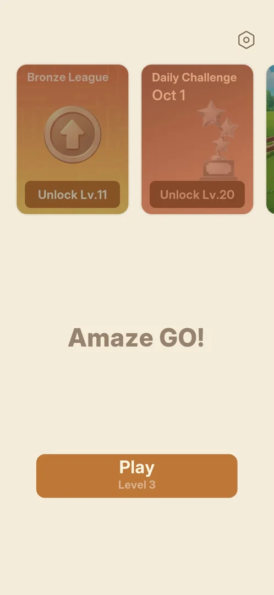

# Amaze GO!

[Google Play](https://play.google.com/store/apps/details?id=com.oakever.arrows) · analysed on version
1.31.0 (Google Play has 1.32.0: the recheck waits for the phone to be updated)

An arrow puzzle: tap an arrow and it slides off the board along its head direction if nothing stands
in its way; clear the board. Around the core: 3 blue drops as a mistake allowance, a result screen with
stars, time, score and accuracy, colour themes (Eye Comfort, Dark Mode), and a main menu with a
Bronze League (level 11), a Countryside Caper event (level 16) and a Daily Challenge (level 20). No
shop, ads or daily reward seen through level 3.

## Coverage
- 1 session: FTUE from a fresh install and levels 1-3, all won Flawless; map 1 (scout) done,
  discovery is open. Progress: level 4.
- Feature pages: [consent](features/consent.md), [level HUD](features/level-hud.md),
  [level result](features/level-result.md), [main menu](features/main-menu.md),
  [leagues](features/leagues.md), [event](features/event.md),
  [daily challenge](features/daily-challenge.md), [settings](features/settings.md),
  [save progress](features/save-progress.md), [rate us / feedback](features/rate-feedback.md),
  [themes](features/themes.md), [lives](features/lives.md), [hints](features/hints.md).
- Levels met: [levels.md](levels.md).
- All features and cases: [features.md](features.md); tasks: [tasks.md](tasks.md).

## For the agent
[How to play](agent/playbook.md) · [routes](agent/routes.md) · [tactics](agent/tactics.md) ·
[lessons](agent/lessons.md) · [metrics](agent/metrics.md)
