# Levels: Amaze GO!

Every level the agents met, as its board looked at the start (the ad strips cropped). The notes tell where a new element or rule appears.

| level 3 | level 4 | level 5 | level 6 | level 7 |
|---|---|---|---|---|
|  |  |  |  |  |

| level 8 hard | level 9 | level 10 hard | level 11 | level 12 |
|---|---|---|---|---|
|  |  |  | 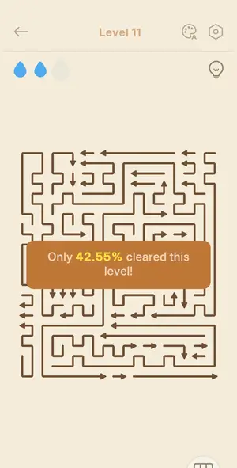 | 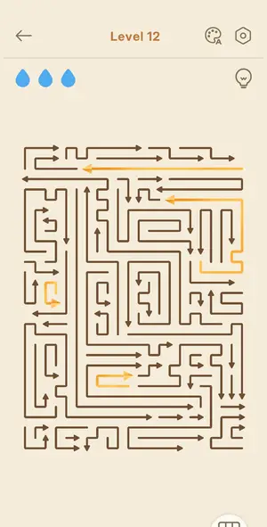 |

| level 13 hard | level 14 continue test | level 15 hard | level 16 | level 17 continue-ad test |
|---|---|---|---|---|
| 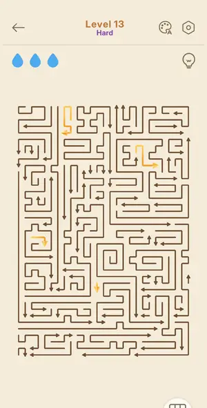 | 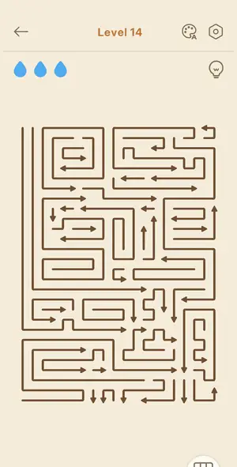 | 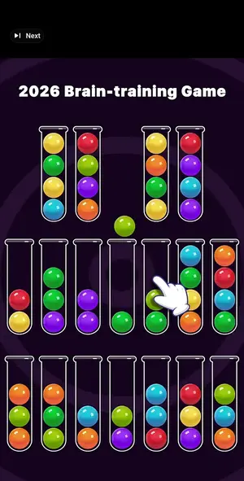 | 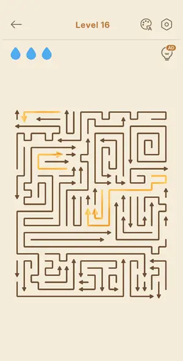 | 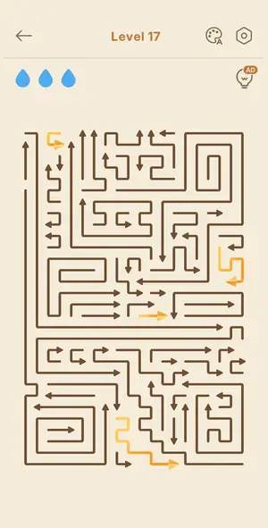 |

| level 18 hard | level 19 | event countryside L1 | event countryside L2 | event countryside L2 resume |
|---|---|---|---|---|
| 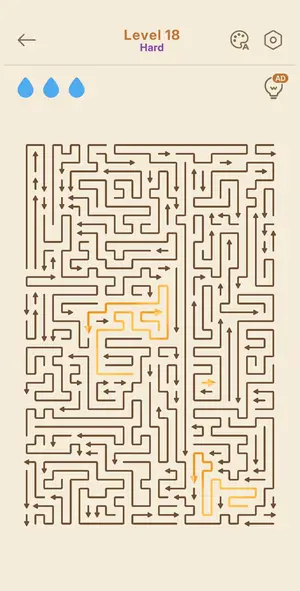 | 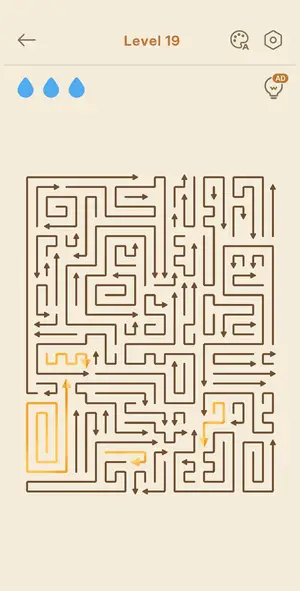 | 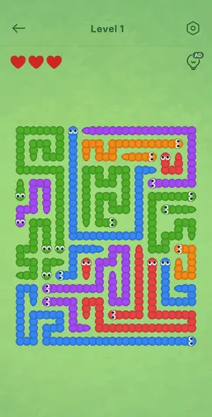 | 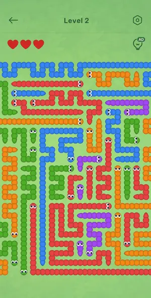 | 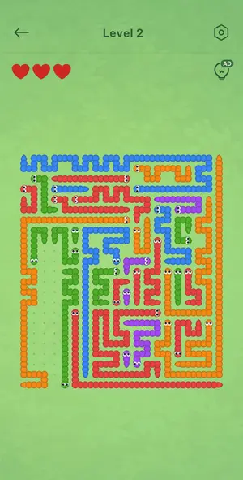 |

| level 3 guideline look |
|---|
| no frame |

## Tries

| Level | Mechanic | Result | Time | Note |
|---|---|---|---|---|
| level 3 | arrows-escape | 1 won | 35 s | 4 arrows, order outer->inner |
| level 4 | arrows-escape | 1 won | 105 s | L4 won Perfect (win screen seen, frame 25), 1 mistake: blocked tap = lost drop, arrow flashed red |
| level 5 | arrows-escape | 2 won, 2 quit | 863 s | Won via hint loop: hint highlights a free arrow green, panning the board; script taps green. 1 mistake (drop lost). |
| level 6 | arrows-escape | 1 won | 110 s | solver (fine pitch, button masked) cleared 28 arrows in 2 rounds of 14 taps, 3 stars, no drop lost; Rate Us popup over the win card |
| level 7 | arrows-escape | 1 won | 100 s | solver: 54 arrows on a ~45 px pitch board, 4 rounds, 51 taps (2 extra), 0 mistakes, 3 stars Arrow Pro!, in-game 00:55 |
| level 8 hard | arrows-escape | 1 won | 168 s | solver, no hints: board fit the screen at 35 px pitch (26x34 nodes), 78 arrows, 6 rounds of up to 14 taps, 0 mistakes; 3 stars Arrow Pro!, Time 01:30, Score 1700 |
| level 9 | arrows-escape | 1 won | 71 s | solver: 36 arrows, 3 rounds, 0 mistakes, 3 stars Unstoppable Today!, 00:37, score 1500 |
| level 10 hard | arrows-escape | 1 won | 268 s | solver: board fit at 23.6 px pitch (39x50 nodes), 99 arrows, 8 rounds, 0 mistakes; Untouchable! card behind the Bronze League popup |
| level 11 | arrows-escape | 1 won | 114 s | solver, 3 rounds, 1.6 min, 3 stars Untouchable, 4 gold arrows = 4 league points |
| level 12 | arrows-escape | 2 won | 157 s | solver; one blocked gold tap cost a drop; league +4 |
| level 13 hard | arrows-escape | 1 won | 160 s | Hard L13 solver 6 rounds, 3 stars |
| level 14 continue test | arrows-escape | 1 won | 132 s | after 3 deliberate blocked taps and free Continue: Comeback Win, 2 stars |
| level 15 hard | arrows-escape | 1 won, 2 quit | 455 s | Hard L15 after solver pitch fix; sparse board made pitch search double the pitch (26->52) so registration failed |
| level 16 | arrows-escape | 1 won, 2 lost | 272 s | Last Life Win! 1 star, 02:45, score 743, 96%, 2 mistakes, 0 hints. Round 4 lost 2 drops: the first tap (on a free arrow) was ignored, and the 2 taps chained on it (through a second chained arrow) hit  |
| level 17 continue-ad test | arrows-escape | 2 won | 168 s | Clutch Comeback! 2 stars, 02:49, score 1085, 95%, 3 mistakes (all 3 deliberate, for the rewarded Continue), 0 hints. Solver with chains off: 19 rounds, 0 drops lost by the solver. Level clock includes |
| level 18 hard | arrows-escape | 1 won | 328 s | Hard L18 fit the screen; solver 52 rounds, 0 mistakes; most rounds had 1 free arrow so 1 tap per round = slow (5 min); Arrow Master! 1232, 04:38; Silver jump card first (+4); interstitial after |
| level 19 | arrows-escape | 1 won | 186 s | solver 28 rounds, 0 mistakes, 2 stars Arrow Master 02:28; Silver +4 (8->12, 39th->33rd) |
| event countryside L1 | worms-escape | 1 won | 268 s | Event L1 (worm skin) won manually: 13 decisions, 0 mistakes, 0 hints, in-game 04:12, 2 stars (Well Done!), score 848. Re-read the board after each batch, tap only worms free on that frame; one tap oft |
| event countryside L2 | worms-escape | 1 quit | — | Quit on purpose after the two rewarded hints (event quit outcome); big board, not attempted in full |
| event countryside L2 resume | worms-escape | 1 quit | — | Opened only to verify the saved board after quit; left again |
| level 3 guideline look | arrows-escape | 1 quit | — | look only |
