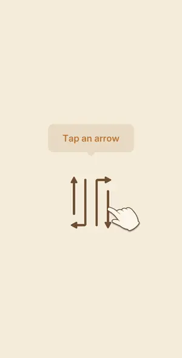
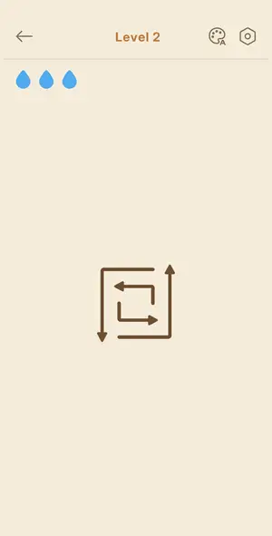

# Levels: Amaze GO!

Every level the agents met, as its board looked at the start (the ad strips cropped). The notes tell where a new element or rule appears.

| level 1 | level 2 | level 3 |
|---|---|---|
|  |  |  |

## Tries

| Level | Mechanic | Result | Time | Note |
|---|---|---|---|---|
| level 1 | arrows-escape | 1 won | 24 s | tutorial: 4 free arrows, 11 s |
| level 2 | arrows-escape | 1 won | 24 s | outer arrows first; one tap in a fast batch was ignored during the slide animation - retap |
| level 3 | arrows-escape | 1 won | 44 s | outer arrows first, 25 s; tap hit-box is generous: a tap near a neighbouring arrow moved the hook instead of the U |
